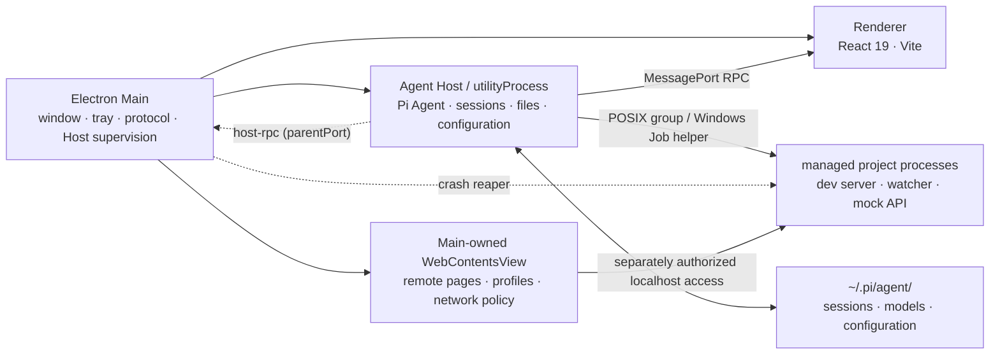

# Architecture Overview

Pi Agent Desktop is an Electron desktop workspace that embeds the Pi Coding Agent runtime. It uses a three-process architecture to isolate privileged desktop capabilities (Main), the Agent runtime (Agent Host), and the UI (Renderer), with a fourth Main-owned surface for remote web pages (Browser).

## Process ownership

- **Electron Main** (`src/main/main.ts`) owns everything desktop: the window, menu, tray and Dock/taskbar badges, custom `app://` protocol, deep links, software updates, the Browser service, the developer-toolchain manager, the credential vault, and supervision of the Agent Host. Its header comment states the boundary explicitly: "No business logic" (`src/main/main.ts:1-5`). Business behavior lives in the Host.
- **Agent Host** (`src/agent-host/index.ts`) is a `utilityProcess` forked by `HostManager` from the built `agent-host.mjs` entry with `serviceName: "pi-agent-host"` and an environment that sets `PI_AGENT_HOST=1`, `PI_DESKTOP_USER_DATA`, and `PI_DESKTOP_VERSION` (`src/main/host-manager.ts:230-236`). It runs the `@earendil-works/pi-coding-agent` runtime in-process and implements the desktop RPC contract (`registerHandlers`), file watching, session indexing, channels, and managed processes. It also installs a `toolchain-git` runner override and a session watcher before serving (`src/agent-host/index.ts:19-22`).
- **Renderer** (`src/renderer/main.tsx`, `src/renderer/App.tsx`) is a React 19 app built with Vite. It loads in a `BrowserWindow` with `sandbox: true`, `contextIsolation: true`, `nodeIntegration: false`, and `webSecurity: true`, plus a strict Content Security Policy served from the `app://` protocol (`src/main/window.ts:48-54`, `src/main/protocol.ts:11-25`). It communicates only through the preload `piBridge` and the transferred Host `MessagePort`.
- **Browser** is a set of `WebContentsView` instances created by Main. Remote pages load in sandboxed sessions without the app preload, Node.js, or the main Renderer bridge (`src/main/browser/browser-service.ts`, `browser-tab-manager.ts`).
- **Managed project processes** are children spawned by the Agent Host (POSIX process groups or, on Windows x64, a Job Object via the Rust helper), reaped by a Main-process crash reaper (`src/main/managed-process/reaper.ts`).

## Startup sequence

`startMainProcess` (`src/main/main.ts:283`) registers the `app://` protocol before `ready`, acquires the single-instance lock (second instances forward a deep link instead), and then runs the `whenReady` pipeline:

1. Optional packaged validation probes (`--validate-packaged-startup` / `--validate-packaged-cleanup-fault`) exit early with a JSON report.
2. On Windows x64 the integrity-verified managed-process helper is resolved.
3. The managed-process reaper is initialized from its journal.
4. The credential vault, `BrowserService`, update manager, and `ToolchainManager` are constructed; toolchain state subscriptions broadcast `toolchains:state` to every window and push snapshots to the Host (`src/main/main.ts:484-544`).
5. Desktop IPC is installed, the menu and tray are created, and the persisted theme is applied.
6. `HostManager` spawns the Agent Host, the main window is created, the toolchain scan starts, and automatic update checks begin (`src/main/main.ts:751-755`).

## Host supervision lifecycle

`HostManager` (`src/main/host-manager.ts`) is the supervisor. It exposes a status machine `starting | ready | crashed | stopped` (`src/main/host-manager.ts:22`) and drives restart policy:

- On `ready`, it delivers the current **toolchain snapshot** and **browser capability snapshot** to the Host (`toolchain:init` / `browser:init`) and the managed-process owner identity (`managed-process-owner:init`); the Host acknowledges each with a revision (`src/main/host-manager.ts:265-297`).
- Liveness is a 15 s ping / 10 s timeout heartbeat; a missed heartbeat kills the child, which triggers the crash path (`src/main/host-manager.ts:386-416`).
- Restarts are budgeted: at most `MAX_RESTARTS = 2` within a `CRASH_WINDOW_MS = 30_000` window, then the status becomes `crashed` (`src/main/host-manager.ts:368-384`). Before restart, the `beforeRestartHandler` reaps managed processes and blocks restart if cleanup is not confirmed (`src/main/main.ts:579-587`).
- Every `ready` Host must acknowledge both policy snapshots and the owner identity itself; acknowledgements from a previous Host are not transferable (`src/main/host-manager.ts:209-216`).
- On exit, the Host posts `shutdown` and the manager force-kills after 10 s if it does not exit (`src/main/host-manager.ts:112-137`).

The Host treats uncaught exceptions and unhandled rejections as fatal: it logs and `process.exit(1)` so the supervisor restarts it (`src/agent-host/index.ts:113-122`).

## Data and control flows

- **Renderer → Host**: the sandboxed renderer receives a transferred `MessagePort` (`pi-desktop-host-port`) and issues typed `Api` calls and `Streams` subscriptions over the RPC protocol (`src/renderer/lib/api-client.ts:43-72`; protocol in `src/contract/rpc.ts`).
- **Renderer → Main**: `piBridge` invoke/send channels cover desktop-only operations (updates, file dialogs, browser control, UI state) (`src/preload/preload.ts:55-185`).
- **Host → Main**: one-shot reverse RPC over `process.parentPort` (`callMain`, `src/agent-host/parent-rpc.ts:55-68`) reaches Main for channel secrets, toolchain resolution, managed-process registration, and browser host requests (`src/main/main.ts:590-685`).
- **Host → Renderer**: server-push `Streams` events (agent progress, session changes, files, channels, processes) delivered over the same MessagePort; Main also pushes `host:status`, `toolchains:state`, `update:state`, and `browser:event` via `webContents.send`.
- **Persistence**: the Host reads and writes session and configuration data under the Pi agent directory (`~/.pi/agent/` by default via `getAgentDir`), sharing it with the Pi CLI without migration (`src/agent-host/handlers.ts:1512-1513`, `README.en.md`).

## Security posture (summary)

The renderer runs fully sandboxed with a strict CSP; the preload exposes only `piBridge`; every desktop IPC handler validates the sender; and the Host's file access is constrained by an allowed-roots policy. Details are covered in [Security and Trust Model](/openwiki/security/security-model.md). Notably, the app does not open a TCP port for its UI or control plane; only user-started managed project services may listen on loopback.

## Related pages

- [IPC and Type Contracts](/openwiki/architecture/ipc-and-contracts.md)
- [Agent Host: Runtime, Sessions, Models, Extensions](/openwiki/systems/agent-host.md)
- [Security and Trust Model](/openwiki/security/security-model.md)
- [Desktop Lifecycle](/openwiki/operations/desktop-lifecycle.md)
- [Quickstart](/openwiki/quickstart.md)