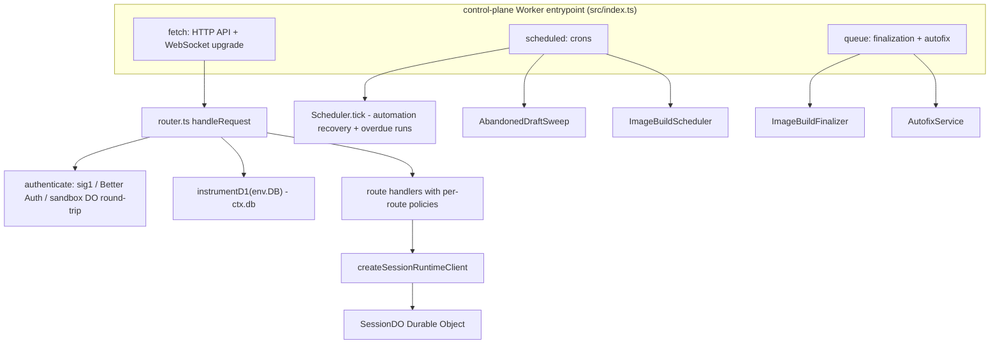
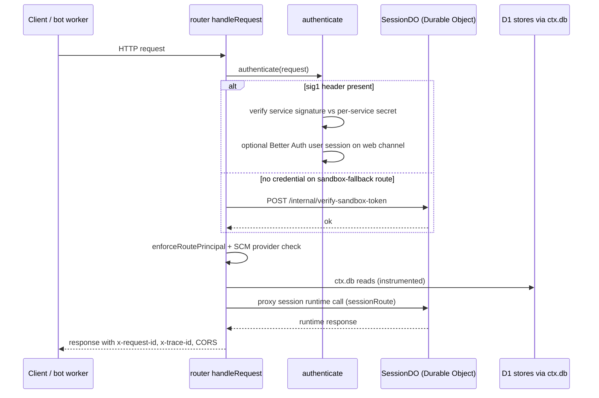

# Control Plane (Cloudflare Workers)

The control plane (`packages/control-plane`) is the Open-Inspect API surface: a single Cloudflare Worker whose `fetch` handler serves the HTTP API, `scheduled` handler drives background automation and maintenance crons, and `queue` handler consumes image-build finalization and GitHub Autofix work. It owns the platform bindings (D1, KV, R2, queues, Durable Objects, service bindings, secrets) and composes them into request-scoped dependencies that route handlers and session runtimes consume through narrow ports. All application wiring lives under `packages/control-plane/src`; the Worker name is `open-inspect-control-plane-<suffix>` in production (Terraform) and `open-inspect-control-plane-test` in the test-only `wrangler.jsonc`.

## Entrypoints

**`fetch`** (`src/index.ts`) dispatches by the `Upgrade` header. A WebSocket upgrade on `/sessions/:id/ws` is checked against the D1 session index (404 when unknown) and then forwarded to the `SessionDO` instance named by the session id; the 101 response carries `Access-Control-Allow-Origin: *`. Every other request goes through `handleRequest` in `router.ts`, which is where the per-request correlation context and the instrumented database handle are constructed.

**`scheduled`** handles three cron schedules, matched by exact cron expression (an unknown expression is logged and dropped):

- `"* * * * *"` — `checkAutofixQueueHealth` runs in `waitUntil` (read-only queue metrics against `AUTOFIX_QUEUE`/`AUTOFIX_DLQ`), then `Scheduler.tick()` executes: a recovery sweep for orphaned "starting" runs and timed-out runs, plus processing overdue automations. The tick caps work at `MAX_PER_TICK = 25` automations and `TICK_CHILD_LAUNCH_BUDGET = 50` child launches because each launch costs roughly eight subrequests.
- `"7,37 * * * *"` — `IMAGE_BUILD_SCHEDULER_CRON`; runs the image-build scheduler: republishing recoverable finalizations, marking stale builds failed, provider session cleanup, scope reconciliation against the SCM, and artifact reaping.
- `"23 * * * *"` — `ABANDONED_DRAFT_SWEEP_CRON`; `AbandonedDraftSweep` archives sessions that stayed in `created` longer than `ABANDONED_DRAFT_TTL_MS = 8 * 60 * 60 * 1000` (8 hours) by asking each session DO to retire itself (outcomes validated against a zod schema), capped at 50 candidates with a 10 s per-request timeout. The sweep is a separate cron rather than part of the per-minute tick so it does not share the tick's subrequest budget; the two maintenance crons are offset so they never fire together.

**`queue`** routes by queue name prefix: `open-inspect-github-autofix-*` queues are the GitHub Autofix consumer (`handleAutofixQueue` with the health/feedback stores built over the one injected D1 handle); everything else is the image-build finalization consumer, which validates each job against `imageBuildFinalizationJobSchema`, acking invalid commands, acking completed work, and retrying busy or failed work with `IMAGE_BUILD_FINALIZATION_RETRY_DELAY_SECONDS`.

## The composable router

`router.ts` assembles a single `routes` array from modular route groups (`browserAuthRoutes`, `sessionRoutes`, `reposRoutes`, `secretsRoutes`, `environmentRoutes`, `imageBuildRoutes`, `automationRoutes`, `mcpServerRoutes`, `analyticsRoutes`, `autofixRoutes`, `skillRoutes`, `webhookRoutes`, and more) plus `GET /health`. `shared.ts` defines the building blocks:

- `parsePattern` converts `:param` segments into named regex groups (`(?<name>[^/]+)`) — session id and repository owner/name arrive as `match.groups`, and the SCM credential authority is derived from those groups.
- `Route = RouteDefinition & RoutePolicy`; `defineRoute`/`defineRoutes` stitch a policy (auth kind + supported SCM providers) onto a handler so that both are declared at the route site.
- `RouteAuthentication` kinds: `public`, `handler-authenticated`, `web-service`, `user`, `user-or-service`, `sandbox` (with a session-id binding), and `user-or-service-with-sandbox-fallback` (also with the binding). Prebuilt policy constants (`GITHUB_USER_OR_SERVICE_ROUTE`, `SCM_AGNOSTIC_*`, `GITHUB_SANDBOX_FALLBACK_ROUTE`, `SCM_CREDENTIALS_ROUTE`) carry `supportedScmProviders` so a route declares which source-control providers the deployment may use.

Request flow in `handleRequest`:

1. A missing `env.DB` binding is rejected once with a 503 — the single honest boundary that makes `ctx.db` genuinely always present in handlers.
2. A `RequestContext` is built with `trace_id` (from `x-trace-id`, else a fresh UUID), an 8-char `request_id`, per-request `RequestMetrics`, `db: instrumentD1(env.DB, metrics)`, and lazy Better Auth runtime getters keyed on the stable `env.DB` object.
3. `OPTIONS` preflights short-circuit with CORS headers (`Access-Control-Allow-Origin: *`, `Access-Control-Max-Age: 86400`).
4. The first route matching method and path regex is selected — route order is significant: session runtime proxy paths and fallback routes depend on earlier, more specific matches winning.
5. Unless the route is `public`/`handler-authenticated`, authentication resolves a `Principal` (see below). Sandbox-auth routes derive the session id from the match and verify the bearer token with the session's DO over `/internal/verify-sandbox-token`; a DO outage maps to 503 "Sandbox authentication unavailable". Other routes call `authenticate()`; when the attempt fails with no recognized credential (`failedScheme === "none"`) and the route allows the sandbox fallback, the bearer token is tried as a sandbox token instead.
6. `enforceRoutePrincipal` double-checks the route kind against the principal (web-service routes require `service === "web"`; user routes require a user principal, 403 otherwise).
7. `enforceImplementedScmProvider` resolves the deployment's SCM provider once (memoized) and rejects routes whose `supportedScmProviders` exclude it with 501; a permanently broken provider config surfaces as 500.
8. Handlers run inside a try/catch that maps `HttpError` to `error(message, status)` and anything else to a logged 500.
9. Every response gets `x-request-id` and `x-trace-id` plus CORS; `cacheControl` policies (`no-store` / `private, no-store`) are applied last.

Logging is structured JSON (`createLogger` pre-binds the `control-plane` service name): every request emits `auth.principal` (who is acting — never token material) and `http.request` (method, path, status, `duration_ms`, outcome, plus the D1 metrics summary). Uncaught handler failures are the only 500 path that also logs inside the router.

## Authentication model

`authenticate.ts` resolves every non-public, non-sandbox request to a typed `Principal` before any handler runs. There are exactly three principal kinds (`auth/principal.ts`):

- **user** — a Better Auth browser session arrived over the `sig1` web channel (or directly on `user` routes); carries `userId` resolved through identity enforcement.
- **service** — a `sig1` service signature verified with the service's own secret from `SERVICE_AUTH_SECRET_*`; carries an optional asserted actor (`ResolvedIdentity`) restricted by `ASSERTION_RIGHTS` (web asserts none, slack-bot asserts `slack`, github-bot asserts `github`, linear-bot asserts `linear`).
- **sandbox** — verified by the router through a DO round-trip; carries only `sessionId`.

Service verification (`auth/service/request-authenticator.ts`) buffers and hashes the body up to `SERVICE_REQUEST_MAX_BODY_BYTES = 16 MiB`, validates the sig1 header before buffering, checks nonce freshness with a best-effort in-isolate reuse log, and rejects unknown services or missing secrets (500 "not configured"). All signed bodies are rehashed from the buffer, so a streamed body is impossible by construction. User authentication goes through the Better Auth runtime keyed on `env.DB` (composition-root cache identity), and `SessionIntegrityError` failures are logged with `failure: "integrity"`.

The web-service principal can optionally resolve to a user: when a `service: web` request carries a Better Auth session cookie and the route requires `webService: "user"`, `authenticate` exchanges the verified service identity for the user session's identity. Route handlers must never trust caller-asserted identity: `applyIdentityEnforcement` (session-create, ws-token, prompt, etc.) fails closed when the verified principal and the body disagree, and SCM credentials only ever flow from the server-side token store.

Sandbox auth is deliberately separate: sandbox tokens need the session id from the path plus a DO round-trip, so they are verified by the router (`verifySandboxAuth`) against `/internal/verify-sandbox-token`, not by `authenticate`. `SCM_CREDENTIALS_ROUTE` and `SCM_AGNOSTIC_SANDBOX_ROUTE` expose sandbox-only endpoints (scm credentials, token refresh, sandbox events) to the sandbox data plane.

## D1-backed stores and the ctx.db rule

All global state lives in a single D1 database (`DB` binding). Stores under `src/db` — `SessionIndexStore` (session listing, inbox, read state), `AutomationStore`, `IntegrationSettingsStore`, `UserStore`, `ImageBuildStore`, `AnalyticsStore`, `SessionPullRequestStore`, the secrets/environment/commit-signing/keyboard-shortcut/skill stores, and ~35 others — consume the narrow `SqlDatabase` port defined in `sql-database.ts`. That port drives correctness-critical contracts: `batch()` must be atomic with positional 1:1 results, and `meta.changes` is required because roughly 38 store call sites gate on it (CAS conflict detection, guarded lifecycle transitions, upsert detection).

The port is satisfied structurally by `D1Database` (compile-time asserted with `_AssertExtends`), so no runtime wrapper exists. An ESLint rule (`no-restricted-syntax` banning `MemberExpression[property.name="DB"]`) enforces that only composition roots — `router.ts`, `index.ts` crons, the queue consumers, and the `SessionDO` constructor — read `env.DB`; route handlers must use `ctx.db` so every query is timed.

**Instrumentation**: `instrumentD1` wraps each statement's terminal methods (`run`/`first`/`all`) and `batch`, recording wall-clock `query_ms`, `d1_server_ms` (from `meta.duration`), and rows read/written into the per-request `RequestMetrics` collector; `batch` unwraps instrumented statements (via the `ORIGINAL_STMT` symbol) because a database can only execute its own prepared statements. Stored `prepare()` chains through `bind()` so chained statements stay instrumented. `RequestMetrics.time(name, fn)` adds named spans surfaced as `<name>_ms` fields. The summary spreads into the `http.request` wide event as `d1_query_count`, `d1_total_ms`, `d1_server_total_ms`, `d1_rows_read`, `d1_rows_written`.

A second SQLite engine sits inside each session Durable Object: the DO's synchronous `SqlStorage` (`ctx.storage.sql`) is deliberately *not* covered by the `SqlDatabase` port — it has a load-bearing sync contract and belongs to the session runtime, seeded by `initSchema` on each activation.

Environment validation is eager (`env-validation.ts`): `TOKEN_ENCRYPTION_KEY` and `REPO_SECRETS_ENCRYPTION_KEY` (and the provider-accounts key) must be strict base64 decoding to exactly 32 bytes for AES-256 — a malformed or short key fails at first touch instead of silently downgrading cipher strength; Terraform requires these keys, so their absence means a broken deployment, never plaintext fallback.

## Session Durable Object and runtime proxy

`SessionDO` is the one re-exported Durable Object class (Cloudflare discovers it via the export from `src/index.ts`). Each session id maps to exactly one DO instance (`SESSION.idFromName(sessionId)`). The class itself is a thin platform adapter: construction reads `env.DB` once (nullable for defensive guards), the runtime is built lazily on first touch (`ensureInitialized`: run `initSchema(this.sql)`, then build the whole collaborator graph via `createSessionRuntime`, publish only after construction succeeds so a throw leaves the activation uninitialized for the next event to retry), and `fetch`/`webSocketMessage`/`webSocketClose`/`webSocketError`/`alarm` forward to the platform-neutral `SessionServer`. Alarm delivery initializes without re-arming the alarm (`ensureInitialized(false)`) because that delivery is the alarm itself.

The Durable Object's HTTP surface uses shared constants from `session/contracts.ts` (`SessionInternalPaths` — `init`, `prompt`, `stop`, `messages`, `events`, `artifacts`, `verify-sandbox-token`, `ws-token`, `expire-draft`, `scm-credentials`, `tunnel-urls`, and more) so the router and the DO cannot drift on paths. `createSessionRuntimeClient` builds a `Fetcher`-based client that resolves `SESSION.idFromName(sessionId)` and forwards correlation headers. Route handlers reach the runtime through `sessionRoute()` wrappers, which inject `ctx.sessionRuntime`; most session routes are thin proxies that perform D1-side enforcement (identity, ownership, index lookups) and forward to the DO.

Session creation (`POST /sessions`, `session-create.ts`) is the canonical two-step flow and shows the D1/DO ownership split: the handler resolves and validates everything in D1 — identity enforcement from the principal, repository access via SCM (`resolveRepoOrError`), model and reasoning-effort validation, session-scoped integration settings, managed skills, and the model-provider auth snapshot — then `initializeSession` writes the `created` row to the D1 index first and only then POSTs `/internal/init` to the DO with the full `SessionInitInput`. If the DO init fails (transport or non-2xx), a best-effort compensation marks the D1 row `failed` so no phantom `created` session appears in listings. The same `SessionIndexStore` lookup gates WebSocket upgrades, and the D1 index is the authority that the abandoned-draft sweep reads.

WebSocket connections upgrade at the Worker, then the 101 with the DO's socket is returned to the client with `Access-Control-Allow-Origin: *` (line 136-145); the session runtime's own websocket manager drives clients, authenticated per-socket by the ws-token issued from `/internal/ws-token`.

## Background tasks

`platform-ports.ts` defines the `BackgroundTasks` capability (a `submit(task, metadata)` for deferring work) and `AlarmScheduler`; the Cloudflare adapter (`cloudflare/background-tasks.ts`) calls `ctx.waitUntil(pending.catch(logFailure))` and absorbs synchronous throws from the task factory exactly like rejections, so building a task can never fail its caller. The GitHub webhook's PR-lifecycle tracking is the representative consumer: `handleGitHubAutomationEvent` submits `trackPullRequestLifecycle` to run off the request path — additive work whose failure never affects automation matching — then forwards the normalized event to the scheduler. The `Scheduler` (D1-backed, described in `/openwiki/concepts/automations.md`) is invoked from the per-minute tick, automation routes, webhook routes, and session completion callbacks.

## Platform bindings

`types.ts` (Env) declares the full binding surface; `wrangler.jsonc` is **test-only config** and production is Terraform (`terraform/environments/production/workers-control-plane.tf` + `terraform/modules/cloudflare-worker`). There is no checked-in production `wrangler.toml` — the worker config is generated by Terraform, which also builds the bundle via `npm run build` in a `null_resource`. Key bindings:

- **Durable Objects**: `SESSION` binding to `SessionDO`, deployed with `new_sqlite_classes` migrations. DO class creation needs a two-phase Terraform deploy: `enable_durable_object_bindings = false` first (bindings disabled so the class can be created), then `true`. Class deletion has a plan-time precondition demanding bindings still enabled, otherwise the same version would drop every surviving DO binding.
- **D1**: `DB` (the single global database, managed with the `d1_migrations` null_resource).
- **KV**: `REPOS_CACHE` (short-lived cache for repository listings), namespace from `module.session_index_kv`.
- **R2**: `MEDIA_BUCKET`.
- **Queues**: `IMAGE_BUILD_FINALIZATION_QUEUE` producer binding plus the queue consumer with batch_size 1, max_retries 12, retry_delay 15 s, and a dead-letter queue; `AUTOFIX_QUEUE`/`AUTOFIX_DLQ` producer bindings for read-only health metrics when the GitHub bot is enabled (Autofix production is owned by the GitHub bot worker).
- **Service bindings**: `SLACK_BOT` and `LINEAR_BOT` fetchers, gated by `enable_durable_object_bindings`'s sibling flag `enable_service_bindings` (a two-phase deploy also applies here: the target workers must exist before the bindings can be enabled).
- **Cron triggers**: `["* * * * *", "7,37 * * * *", "23 * * * *"]`, which must stay in sync with the constants in the scheduler and abandoned-draft-sweep sources.
- **Secrets**: `TOKEN_ENCRYPTION_KEY`, `REPO_SECRETS_ENCRYPTION_KEY`, `PROVIDER_ACCOUNTS_ENCRYPTION_KEY`, `IMAGE_CALLBACK_TOKEN_PEPPER`, per-service `SERVICE_AUTH_SECRET_*` (web, slack-bot, github-bot, linear-bot), GitHub App credentials (`GITHUB_APP_ID`, `GITHUB_APP_INSTALLATION_ID`, and **`GITHUB_APP_PRIVATE_KEY`, which must be PKCS#8 format for Cloudflare Workers** — a certificate in `BEGIN RSA PRIVATE KEY` form fails Web Crypto import), plus OAuth client secrets, sandbox-provider credentials (Modal, Daytona, Vercel, E2B, OpenComputer), and `SLACK_BOT_TOKEN`.
- **Environment variables**: `DEPLOYMENT_NAME`, `APP_NAME`, `GITHUB_BOT_USERNAME`, `SCM_PROVIDER` (deployment-wide source control provider, resolved once and memoized), `WORKER_URL`/`WEB_APP_URL` for callbacks, access-control lists (`ALLOWED_USERS`, `ALLOWED_EMAIL_DOMAINS`, `ALLOWED_EMAILS`, `ALLOWED_GITHUB_ORGS`, `UNSAFE_ALLOW_ALL_USERS`), and the sandbox lifecycle knobs (`SANDBOX_INACTIVITY_TIMEOUT_MS` default 600000, `EXECUTION_TIMEOUT_MS` default 5400000, `SECRETS_CAP_ENFORCEMENT`). Durations are milliseconds with `_MS` suffixes.
- The worker is deployed via the 3-resource pattern (`cloudflare_worker` + `cloudflare_worker_version` + `cloudflare_workers_deployment` at 100%) with observability enabled (head sampling rate 1).

## Failure semantics and invariants

- **D1 is authoritative for global state; DOs own live session state.** Session create writes the D1 index before DO init and compensates to `failed` on DO failure; the draft sweep repairs stale index rows (a DO answering 404 retires the row). `changes`-gated CAS writes make lost-update conflicts explicit.
- **Route handlers can never see a missing DB** — the router rejects it once at the boundary, so no per-route degraded-mode guards exist.
- **Auth fails closed**: service requests with a missing per-service secret return 500 (not downgrade), sandbox verification unavailability returns 503, route/principal kind mismatches return 401/403, and body-asserted identities conflict with the verified principal under `applyIdentityEnforcement`.
- **Signed bodies are bounded**: 16 MiB cap for service-signed requests, 64 KiB for automation webhooks, 256 KiB for Sentry hooks, 2 KiB for sandbox error reports.
- **Background work is isolated**: `waitUntil` failures are logged and swallowed (PR lifecycle), the scheduler's phases each catch and log independently (finalization republish, stale marking, session cleanup, reconciliation, reaping), and the autofix consumer retries per-message without aborting the rest of the batch.
- **Per-invocation budgets are explicit**: `MAX_PER_TICK`, `TICK_CHILD_LAUNCH_BUDGET`, `RECOVERY_SWEEP_LIMIT`, `ABANDONED_DRAFT_SWEEP_LIMIT` (each expiry costs one subrequest to its DO), and the queue consumer's batch_size 1 all bound subrequest usage; overdue work is simply picked up next tick.
- **Composition boundaries are lint-enforced**: only `durable-object.ts` may import the session composition root (`components.ts`), only `index.ts` may import the DO adapter, and no non-composition-root code reads `env.DB`.

## Focused tests

Router-level tests drive `handleRequest` with a minimal in-memory D1 adapter: `router.auth.test.ts` (auth scheme selection, sandbox fallback), `router.policy.test.ts` (route/principal enforcement, SCM provider gating), `router.create-session.test.ts` (two-step create, compensation on DO failure), `router.spawn-child.test.ts`, `router.session-prompt.test.ts`, `router.scm-credentials.test.ts`. The `sessionDO` behavior is covered by `session/durable-object`-adjacent tests and `session/initialize.test.ts` (D1-first ordering). `db/instrumented-d1.test.ts` verifies query timing and the `batch` unwrap contract. Queue routing is pinned by `queue-routing.test.ts`; the image-build scheduler cron constants are asserted against `IMAGE_BUILD_SCHEDULER_CRON`, and webhook handlers have their own suites (`automation-webhook.test.ts`, `automation-event.test.ts`, `pull-request-lifecycle.test.ts`) verifying signature verification, idempotency keys, and fail-closed behavior.
