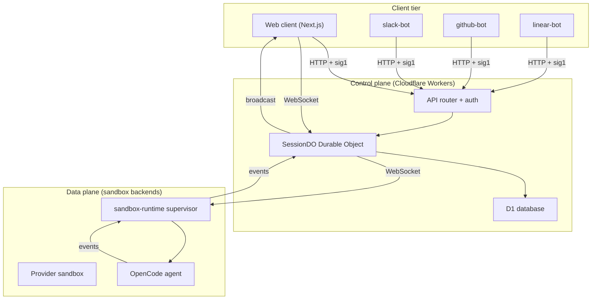
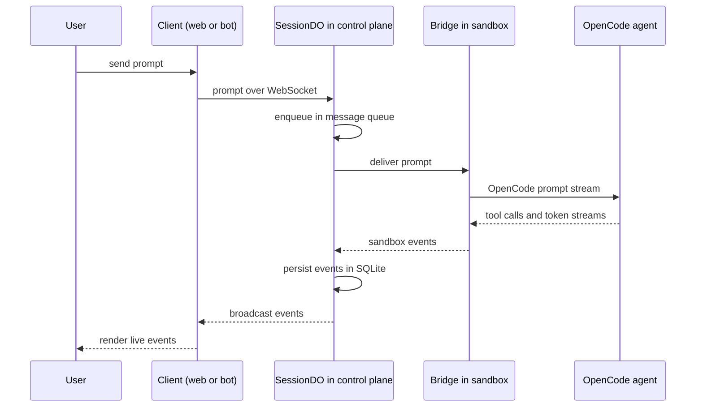
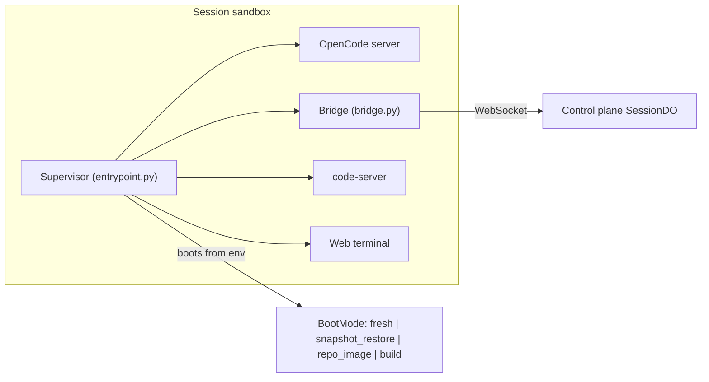
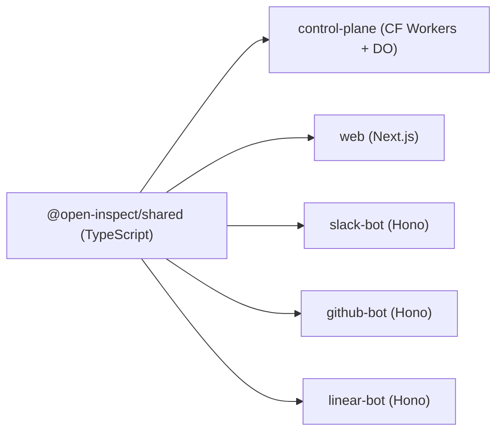

# System Architecture Overview

Open-Inspect is an open-source background coding agent system inspired by [Ramp's Inspect](https://builders.ramp.com/post/why-we-built-our-background-agent). Unlike interactive assistants, sessions run in the cloud independently of the user's connection: you send a prompt, optionally close the laptop, and check results later. The system is **single-tenant by design** — all users are trusted members of one organization and share the same repository-access scope.

The whole system is a three-tier topology connected by WebSockets, with a small set of event-driven bot workers on the client edge. This page is the map: it describes the tiers, the canonical prompt/data flow, the package dependency graph, and the invariants that let a change be traced across service boundaries. Deep-dives live on the related pages.

## Three-Tier Topology



*Topology and the WebSocket edges between the client tier, the session Durable Object, and the in-sandbox runtime.*

1. **Web client** — a Next.js app (`packages/web`) served from Vercel or Cloudflare Workers via OpenNext (`web_platform = "vercel"` | `"cloudflare"`). It provides GitHub/Google OAuth sign-in (proxied through the control plane), the session dashboard, and real-time streaming.
2. **Control plane** — `packages/control-plane`, a Cloudflare Workers service. It manages sessions, owns WebSocket connections, orchestrates the sandbox lifecycle, integrates with GitHub/SCM, and enforces authentication. **Each session is a Durable Object (`SessionDO`) with its own SQLite database**; a shared D1 database holds the session index, repository metadata, environments, automations, image builds, and encrypted secrets.
3. **Data plane** — sandboxed development environments where code actually runs. Each sandbox contains a full dev environment (Debian Linux, Node.js 22, Python 3.12, git, package managers, agent-browser, OpenCode) and runs the Python `sandbox-runtime`: a supervisor that starts the OpenCode server and a bridge process that maintains the WebSocket back to the control plane. Backends plug in behind the `SandboxProvider` interface: Modal, Daytona, Vercel Sandboxes, OpenComputer, and E2B.

The control plane is the coordinator — it does not execute user code; it manages state and routes messages. The data plane holds no shared state; it is disposable and restored from snapshots or prebuilt images.

## The Canonical Prompt/Data Flow

> **Data flow: user prompt → web client → control plane session DO (WebSocket) → sandbox → streaming events back through the same WebSocket chain.** Assess every change against this canonical path.



*The canonical prompt and event loop: one WebSocket chain carries the prompt down and the events back up.*

Step by step:

1. **You send a prompt** via web, Slack, GitHub, or Linear. The client opens a WebSocket (or the bot calls the control plane API) to the session's Durable Object.
2. **The control plane queues it**: the prompt is added to the session's durable message queue. If a sandbox isn't running, one is spawned or restored from a snapshot/prebuilt image. Prompts are processed in order — follow-ups sent while the agent works are enqueued behind the active prompt, and the current execution can be stopped.
3. **The sandbox receives the prompt** via the bridge WebSocket, along with author information for commit attribution.
4. **OpenCode processes it** — reading files, editing, running commands. Each action generates events.
5. **Events stream back** through the same WebSocket chain to the control plane.
6. **The control plane broadcasts**: events are stored in the session's SQLite database and broadcast to all connected clients in real time (multiplayer: everyone sees the same session state because state lives in the control plane, not the client).
7. **Artifacts are created**: if the agent opens a PR or captures a screenshot, these become artifacts announced to clients.

Sandbox lifecycle state is authoritative across WebSocket reconnects: losing the sandbox WebSocket does not stop the sandbox — the bridge reconnects while the control plane schedules a heartbeat check in case the process is actually gone. Explicit lifecycle paths (inactivity, stale heartbeat) persist `stopped`/`stale` before closing the connection, which prevents reconnection.

## Control Plane (Cloudflare Workers)

`packages/control-plane` is a single Cloudflare Worker with three platform entrypoints:

- **`fetch`** — the HTTP API plus WebSocket upgrades. A WebSocket upgrade on `/sessions/:id/ws` is validated against the D1 session index (404 for unknown sessions) and forwarded to the `SessionDO` named by the session id; all other requests go through a composable router with per-route authentication policies (user, service sig1, sandbox token).
- **`scheduled`** — a per-minute tick (automation recovery + overdue runs), the image-build scheduler, and the abandoned-draft sweep.
- **`queue`** — Cloudflare Queue consumers for image-build finalization and GitHub Autofix jobs.

The one re-exported Durable Object, `SessionDO`, maps each session id to exactly one DO instance. The class is a thin platform adapter: on first activation it applies the SQLite schema and eagerly builds the whole session runtime (`createSessionRuntime`); it forwards `fetch`/`webSocketMessage`/`webSocketClose`/`webSocketError`/`alarm` to that runtime. The DO's embedded SQLite holds `session`, `participants`, `messages`, `events`, `artifacts`, `sandbox`, and `ws_client_mapping` (WebSocket id → participant mapping for hibernation recovery), giving each session an isolated database that handles hundreds of events per second without impacting other sessions. The WebSocket Hub uses the Hibernation API so idle connections cost no compute.

Global, cross-session state lives in D1: session index/inbox records, repository metadata, environments, environment secrets, encrypted repo/global secrets, automations and their runs, image builds, integration settings, skills, users, and pull-request records. The control plane is also the browser-authentication authority (pinned Better Auth) and the credential authority for SCM and model providers; route handlers must use the instrumented `ctx.db` handle rather than `env.DB` (enforced by ESLint) so every query is timed. See [Control Plane](/openwiki/architecture/control-plane.md) and [Persistence](/openwiki/architecture/persistence.md) for details.

## Data Plane (Sandbox Backends)

The data plane is where user code executes. Each session gets an isolated sandbox; sandboxes are fast to start because of filesystem snapshots, prebuilt images, and proactive warming (the control plane begins warming a sandbox as soon as the user starts typing).



*Inside one sandbox: the supervisor composes the OpenCode server, the bridge, code-server, and the web terminal; the bridge is the sandbox's WebSocket link back to the control plane.*

The in-sandbox Python package `packages/sandbox-runtime` holds the shared runtime: `entrypoint.py` (CLI/composition root), `supervisor.py` (lifecycle ordering, restart policy with max 5 restarts and backoff, coordinated shutdown), `bridge.py` (bidirectional WebSocket to the session DO, heartbeat loop, event forwarding, command handling, per-prompt git identity), `opencode_server.py`, repository sync/clone with brokered SCM credentials, git signing, diff capture, managed-skills materialization, and agent tools. Boot mode — `fresh`, `snapshot_restore`, `repo_image`, or `build` — is derived from process environment (`RESTORED_FROM_SNAPSHOT`, `FROM_REPO_IMAGE`, `IMAGE_BUILD_MODE`) and drives how the workspace is prepared.

Sandbox backends plug in behind the `SandboxProvider` interface (`packages/control-plane/src/sandbox/provider.ts`), which declares capabilities: `supportsSandboxTimeout`, `supportsSnapshots`, `supportsRestore`, `supportsPersistentResume`, `supportsExplicitStop`. Supported backends:

| Backend | Model |
| --- | --- |
| Modal | near-instant startup + filesystem snapshot restore; prebuilt-image builds |
| Daytona | persistent stop/start sandboxes via direct REST API calls |
| Vercel Sandboxes | filesystem snapshot restore + prebuilt-image builds via the Vercel Sandbox API |
| OpenComputer | template-based sandboxes with checkpoint-backed prebuilt images via REST |
| E2B | template-based sandboxes with persistent pause/resume via REST |

Prebuilt-image builds are supported on Modal, Vercel, and OpenComputer; saved filesystem state restores on those same providers for session resumes. Daytona and E2B instead stop/pause the same sandbox on inactivity or stale heartbeat and resume it later. Provider factories are constructed eagerly in the session runtime and throw on misconfigured deployments (missing credentials), so a broken deployment fails at session init rather than running degraded. See [Sandbox Provider Abstraction](/openwiki/architecture/sandbox-providers.md) and [Sandbox Runtime](/openwiki/architecture/sandbox-runtime.md).

## Clients and Bot Workers

Every client sees the same session state — a prompt sent from Slack or GitHub can be watched on web — because state lives in the control plane, not the client. The current clients are:

| Client | Package | Role |
| --- | --- | --- |
| Web | `web` | Next.js app: session dashboard, real-time streaming, settings, environments, secrets |
| Slack | `slack-bot` | Responds to @mentions/DMs, forwards image attachments, classifies repos, posts results; completion replies delivered asynchronously through a Cloudflare Queue |
| GitHub | `github-bot` | Auto-reviews newly opened PRs, responds to PR @mentions; webhook-to-session translator with KV delivery dedupe |
| Linear | `linear-bot` | Linear Agent: `AgentSessionEvent` webhooks create sessions from issue activity; follow-ups continue the same session; opt-in issue state transition |

All three bots are **stateless Cloudflare Workers built on Hono**. They verify inbound platform signatures, deduplicate deliveries, and translate events into control-plane API calls (create session, send prompt, stop). There is a unidirectional relationship: bots call the control plane; the control plane never calls them back except through signed callbacks they host.

The web app is a framework-free BFF: it signs all control-plane API requests with its `sig1` service credential, forwards only Better Auth's opaque session cookie, and never holds provider secrets or admission policy. Browser resource requests require both the signed `service: web` channel and the session cookie; the control plane is the sole sign-in-provider and credential authority. `NEXT_PUBLIC_WS_URL` must be available at build time because Next.js inlines `NEXT_PUBLIC_*` variables into the client bundle.

## Package Dependency Graph



*TypeScript dependency graph: every consumer imports @open-inspect/shared at build time, so shared is always built first.*

```
@open-inspect/shared  ←  control-plane, web, slack-bot, github-bot, linear-bot
```

**Always build `@open-inspect/shared` first** whenever shared types change; the other packages import from it at build time, and the root scripts (`npm run build`, `npm run typecheck`) enforce that order. `@open-inspect/shared` is the boundary contract crossing every service: model catalog, session/event/websocket types, sig1 service auth, trigger schemas, Slack payloads, image-build contracts, and completion extractors. Its `test-fixtures/service-auth-vectors.json` pins the immutable sig1 canonical request layout — any layout change requires a new format tag (`sig2`), never an in-place edit.

On the Python side, `packages/modal-infra` (the Modal app: web API endpoints, sandbox manager, image builds) depends on `packages/sandbox-runtime` and bundles it into the Modal function image; the Daytona/E2B/OpenComputer infra packages likewise stage `sandbox-runtime` into their snapshots/templates. The sandbox provider *clients* live in the TypeScript control plane (`src/sandbox/`), which talks to each backend's REST API directly.

## Sessions: the Core Unit of Work

A **session** is the core unit of work. It is:

- **Tied to a workspace target**: a single repository, an ad-hoc ordered set of up to 10 repositories, a saved [environment](#environments), or no repository (scratch work). In multi-repository sessions every repository is cloned into its own directory under `/workspace` and the **first repository is the primary** — it drives defaults such as which settings apply; pushes and PRs are per-repository, so one session can produce PRs in several repositories.
- **Persistent**: state survives across connections — close the browser and come back later.
- **Multiplayer**: multiple users can join, send prompts, and see events in real time (presence indicators, attributed prompts, shared stream).
- **Stateful**: stores messages, prompt attachments, events, artifacts (PRs, screenshots), participants, and a reference to the current sandbox and its snapshot.

Lifecycle: `Created → Active → Archived`, with restore from archive. Each session gets its own SQLite database in its Durable Object, ensuring isolation even with hundreds of concurrent sessions. The web picker chooses the target; GitHub-bot, Slack, and Linear resolve their own targets (including environments via repo metadata, channel associations, team/project mappings, or LLM classification). See [Sessions](/openwiki/concepts/sessions.md) and [Session Lifecycle](/openwiki/workflows/session-lifecycle.md).

**Child sessions**: an agent that created a child with `spawn-child` can continue that same child session with `send-child-prompt`; the follow-up enters the child's normal durable queue without interrupting active work. The parent token is never exchanged for the child's sandbox token — the control plane authenticates the parent, verifies the direct parent-child relationship in D1 and again in the child DO, and attributes the queued prompt to the child owner with source `agent`. The spawning depth is capped (`MAX_SPAWN_DEPTH = 2`), children inherit parent provider-auth rows and sandbox settings, and admission uses lease tokens against a recursive descendant CTE capped at `MAX_DESCENDANT_DEPTH = 10`. See [Child Sessions](/openwiki/workflows/child-sessions.md).

### Environments

An **environment** is a named, reusable ordered repository set (1–10 repos, first = primary) with environment-scoped secrets and optional prebuilt images — the thing you reach for when the same multi-repository workspace recurs. Sessions snapshot the environment at creation time: editing or deleting an environment never changes what an existing session works on. Environment sessions receive global + environment secrets only; repository secrets never flow into environment launches. See [Environments](/openwiki/concepts/environments.md) and [Pre-Built Images](/openwiki/concepts/prebuilt-images.md).

## Security Model (Single-Tenant Only)

> **Single-tenant only**: the control plane is designed for deployments where all users are trusted members of the same organization.

- **Shared GitHub App installation**: one `GITHUB_APP_INSTALLATION_ID` serves all users; the App's installation scope defines what the system can access. There is **no per-user repository access validation** at session creation — the trust boundary is the organization. Deploy behind SSO/VPN and install the App only on intended repositories ("Only select repositories").
- **Brokered git credentials**: fresh and prebuilt-image sandboxes do not receive a long-lived `GITHUB_TOKEN`. Git invokes an in-sandbox credential helper that calls the sandbox-authenticated `POST /sessions/:id/scm-credentials` endpoint and receives short-lived credentials on demand. This avoids stale embedded credentials in long-running sessions and Daytona persistent resumes.
- **PR attribution**: the control plane creates PRs using the prompting user's GitHub OAuth token when available (so the PR appears created by the user); users without an SCM token (Slack-created or Google sign-in sessions) have the branch pushed with shared GitHub App credentials and receive a manual `pull/new` URL.
- **Token types**: GitHub App token (brokered git auth), user OAuth token (PR creation, server-only), sandbox auth token (sandbox → control plane, single session), WebSocket token (client → session), and managed LLM tokens (short-lived OpenAI/xAI model access pinned to a session's provider account).
- **Encryption at rest**: secrets are AES-256-GCM encrypted in D1; three independent key domains (`TOKEN_ENCRYPTION_KEY`, `BROWSER_AUTH_SECRET`, `PROVIDER_ACCOUNTS_ENCRYPTION_KEY`) protect different credential classes and have different rotation guidance.

One repository-identity invariant spans all layers: a `repo_owner` may contain `/` (GitLab subgroups nest), so only `repo_name` is a single path segment (the checkout directory under `/workspace`). Never split owners on the first `/`; use the shared repository identity helpers in TypeScript, and in Python `repo_config.parse_repositories` accepts `/`-joined owners.

## Deployment and CI

Deployment is Terraform-driven across providers (Cloudflare Workers/D1/KV/R2/Queues, Vercel or OpenNext, and the sandbox provider infrastructure), with configuration in `terraform/environments/production/terraform.tfvars` — there is no checked-in `wrangler.toml` for the control plane (config is generated by Terraform). Key operational rules:

- Pushing to `main` auto-deploys changed services: Terraform → control plane + D1 migrations (+ web when `web_platform = "cloudflare"`); Vercel → web when `web_platform = "vercel"`; Modal → data plane; CI runs lint, typecheck, and tests on every push/PR.
- New Durable Object bindings require a **two-phase Terraform deploy**: first with `enable_durable_object_bindings = false`, then `true`.
- GitHub App private keys must be **PKCS#8 format** for Cloudflare Workers.
- Modal deployment: from `packages/modal-infra`, run `uv run python deploy.py --build-sandbox-image` before `uv run modal deploy deploy.py` (or `deploy -m src`); never deploy `src/app.py` directly, and bump `CACHE_BUSTER` in `src/images/base.py` to force an image rebuild.
- Durations: milliseconds in TypeScript (`_MS` suffix), seconds in Python (`_seconds` suffix); define each default exactly once and import it.

See [Deployment, Terraform, and CI/CD](/openwiki/operations/deployment.md) and [Getting Started](/openwiki/quickstart.md).

## Tracing Changes Across Service Boundaries

Because the canonical path is one WebSocket chain, a change almost always touches several packages. Quick map:

- **Shared protocol change** (event shapes, prompt contract, websocket messages, trigger types): edit `packages/shared`, **build it first**, then update consumers — `control-plane`, `web`, and the bots. Mirror the change in `packages/sandbox-runtime` (Python) when the wire format crosses the sandbox boundary (e.g. `SESSION_DIFF_VERSION` is mirrored between Python and shared TS).
- **Control-plane behavior change** (session state, prompt queue, sandbox lifecycle, auth): `packages/control-plane`, supported by unit tests co-located as `src/**/*.test.ts` and workerd integration tests in `test/integration/*.test.ts` (Miniflare + real D1; migrations applied via `test/integration/apply-migrations.ts`; clean D1 tables in `beforeEach`/`afterEach` — integration tests share one D1 instance).
- **Sandbox behavior change** (agent loop, git auth, snapshots, tools): `packages/sandbox-runtime` (pytest + pytest-asyncio) and the provider infra packages (`modal-infra`, `daytona-infra`, `e2b-infra`, `opencomputer-infra`); provider REST clients and lifecycle decisions live in `packages/control-plane/src/sandbox/`.
- **Client change** (UI, OAuth flow, streaming): `packages/web` plus the relevant bot worker; the control plane remains the authority for auth and credentials.

## Related Pages

- [Control Plane (Cloudflare Workers)](/openwiki/architecture/control-plane.md)
- [Sandbox Runtime (in-sandbox Python agent)](/openwiki/architecture/sandbox-runtime.md)
- [Sandbox Provider Abstraction and Infra Packages](/openwiki/architecture/sandbox-providers.md)
- [Session Durable Object Runtime](/openwiki/architecture/session-do.md)
- [Web Client (Next.js)](/openwiki/architecture/web-client.md)
- [Persistence: D1, DO SQLite, R2, KV](/openwiki/architecture/persistence.md)
- [Sessions: Targets, State, and Lifecycle Model](/openwiki/concepts/sessions.md)
- [Session Lifecycle: Create, Spawn, Prompt, Stream, Stop](/openwiki/workflows/session-lifecycle.md)
- [Automations](/openwiki/concepts/automations.md), [Environments](/openwiki/concepts/environments.md), [Secrets](/openwiki/concepts/secrets.md), [Pre-Built Images](/openwiki/concepts/prebuilt-images.md)
- [GitHub Integration](/openwiki/integrations/github.md), [Slack Integration](/openwiki/integrations/slack.md), [Linear Integration](/openwiki/integrations/linear.md), [Trigger System](/openwiki/integrations/triggers.md)
- [Deployment, Terraform, and CI/CD](/openwiki/operations/deployment.md)
- [Testing Conventions](/openwiki/testing/overview.md)
