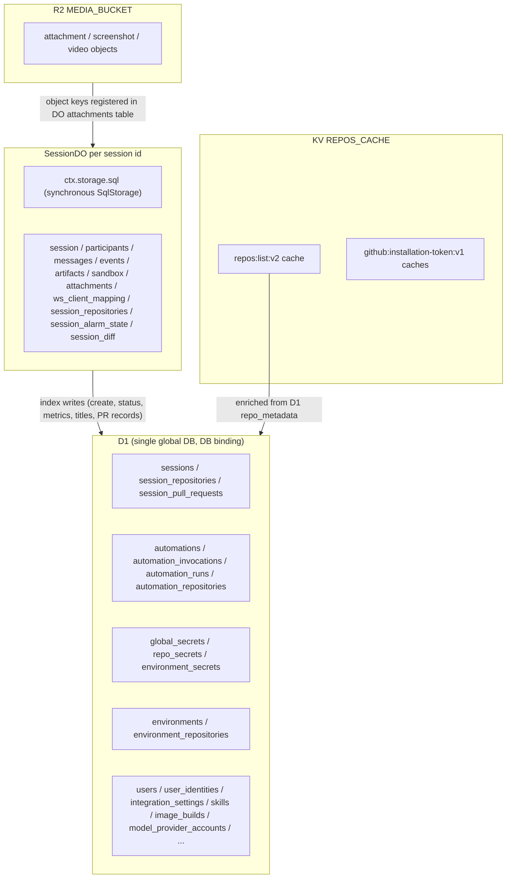

# Persistence: D1, DO SQLite, R2, KV

Open-Inspect splits durable state across four Cloudflare primitives with distinct ownership and consistency contracts. **D1** (`DB` binding) is the single global relational database and the authority for every cross-session fact: session listing/interaction state, automations and their runs, secrets at all scopes, environments, image builds, managed skills, users and identities, integration settings, and pull-request records. **Per-session SQLite** (`ctx.storage.sql` inside each `SessionDO` Durable Object) is synchronous local storage for everything that is only meaningful inside one session's runtime. **R2** (`MEDIA_BUCKET`) holds attachment, screenshot, and video objects. **KV** (`REPOS_CACHE`) holds short-lived caches — repository listings and GitHub App installation tokens — and is never a source of truth.

## Ownership split: D1 vs the session Durable Object

The load-bearing invariant is that **D1 is authoritative for global state; the Durable Object owns live session state**. Session creation is the canonical demonstration of ordering (`session/initialize.ts`): the D1 `sessions` row (plus repository snapshot, managed-skill manifest, and model-provider auth snapshot) is written in one atomic `db.batch` **before** the DO is asked to `POST /internal/init`; if DO init fails, a best-effort compensation marks the D1 row `failed` so no phantom `created` session appears in listings. The abandoned-draft sweep repairs the reverse drift: a D1 row still `created` whose DO answers 404 is archived by `archiveOrphanedDraft`, and `repairStatus` corrects status projection drift without touching `updated_at` (the monotonic `updateStatus` guard would silently drop such a repair).

The D1 index is the read authority for everything the UI and webhooks query — the sidebar list, the inbox, read state, analytics, PR summaries — while the DO's SQLite holds the full message/event/artifact/sandbox state that powers a single session's runtime. The DO mirrors select facts back into D1 (titles via `updateTitleIfNewer`, terminal-message projections in `sessions.latest_terminal_message_*`, metrics, status transitions) using guards that reject out-of-order writes: `UPDATE ... WHERE id = ? AND updated_at <= ?` is the standard pattern, and `SessionPullRequestStore.upsert` additionally gates on a **SQL-side monotonic `provider_updated_at` guard** so an out-of-order webhook cannot regress PR state (the DO `pr` artifact is a live-view mirror of the D1 `session_pull_requests` record, never the authority).

## The SqlDatabase port and D1 stores

Every D1 store under `packages/control-plane/src/db` — `SessionIndexStore`, `SessionInboxStore`, `AutomationStore`, `IntegrationSettingsStore`, `UserStore`, `EnvironmentStore`, `ImageBuildStore`, `AnalyticsStore`, `SessionPullRequestStore`, the scoped-secrets stores, `SkillStore`, `ModelProviderAccountStore`, and about forty more — consumes the narrow `SqlDatabase` port (`db/sql-database.ts`). The port is a compile-time-only surface erased at build time: `D1Database` satisfies it structurally, proven by `_AssertExtends<D1Database, SqlDatabase>` in the same file, so no wrapper object exists in production.

Three correctness contracts are load-bearing on this port:

- **`batch()` executes its statements atomically as one transaction with positional 1:1 results.** Consumers rely on all three properties: delete-then-insert replacement writes, positional result destructuring, and multi-query analytics reads. The contract is documented as unenforceable in the type system and is why `instrumentD1` must unwrap wrapped statements before calling the real `batch` (a database can only execute its own prepared statements — see `ORIGINAL_STMT`).
- **`meta.changes` is required** — roughly 38 store call sites gate correctness on it: CAS conflict detection, guarded lifecycle transitions, and upsert/insert detection. Engines must return real affected-row counts (0 for reads).
- **`prepare` + `bind` + terminal methods (`first`/`run`/`all`)** with method syntax; arrow-function property signatures would break bivariant parameter checking that lets `D1PreparedStatement` satisfy the port.

Stores keep a consistent shape: snake_case rows in the database, camelCase types at the API boundary, constructor takes `SqlDatabase`. Multi-row writes use `bulkInsertStatements` (row-keyed packed `INSERT`s chunked so per-statement bound parameters stay under `MAX_D1_QUERY_PARAMETERS = 100`, D1's documented ceiling); `IN (...)`-list reads chunk by the same constant (`session-list-metadata.ts`, `skills.ts`), and `repo-metadata.ts` chunks `batch()` itself at 100 statements per call.

## Instrumentation: every query is timed per request

The router wraps `env.DB` once per request as `ctx.db = instrumentD1(env.DB, metrics)` (`db/instrumented-d1.ts`). The wrapper records each statement's wall-clock `query_ms` plus engine-reported `d1_server_ms`, `rows_read`, and `rows_written` into the per-request `RequestMetrics` collector; `batch` records one aggregate entry after unwrapping instrumented statements via the `ORIGINAL_STMT` symbol. `RequestMetrics.time(name, fn)` adds named non-D1 spans. The summary spreads into the `http.request` wide event as `d1_query_count`, `d1_total_ms`, `d1_server_total_ms`, `d1_rows_read`, `d1_rows_written`. An ESLint rule forbidding `MemberExpression[property.name="DB"]` outside composition roots (router, cron entrypoints, queue consumers, `SessionDO` constructor) exists precisely so every query is instrumented. The DO's synchronous `SqlStorage` is intentionally *not* covered by this port — it has a load-bearing sync contract.

## What lives in D1

The D1 schema is the cumulative product of 70 ordered migrations (`terraform/d1/migrations/0001_create_repo_secrets.sql` through `0070_pr_autofix_feedback.sql`). Major records:

- **Session index** — `sessions` (id, title, repo scalars, model, reasoning_effort, status, parent/root lineage, spawn source/depth, automation linkage, user linkage, environment provenance, analytics columns, read-state projection, created/updated timestamps) plus `session_repositories` (ordered member set, position 0 = primary; pre-feature sessions have no rows and readers synthesize from the scalar columns), `session_pull_requests` (per-PR lifecycle record, keyed by the DO artifact id, with canonical `(repository_external_id, pr_number)` and legacy `(repo_owner, repo_name, pr_number)` unique identity indexes), `session_read_states`, `child_admission_leases` (spawn-time lease tokens with `CHILD_ADMISSION_LEASE_TTL_MS`), and `session_skill_manifests`/`session_skill_revisions` (per-session pinned skill snapshots). Root-session lineage is maintained by migration 0063's recursive backfill plus the `sessions_root_after_insert` trigger that resolves `root_session_id` from the parent (cycle-safe; the inbox CTEs additionally re-root filtered subtrees).
- **Automations** — `automations` (definition + `trigger_config` JSON + `trigger_auth_data` which is a SHA-256 hash for webhook automations and AES-GCM ciphertext for sentry automations), `automation_repositories` (single source of truth for target repos), `automation_environments`, `automation_invocations` (one per firing; schedule/event dedup enforced by partial unique indexes on `(automation_id, scheduled_at)` and `(automation_id, trigger_key)`), and `automation_runs` (per-repository/per-target children with firing-time repo/environment snapshots; every run requires `invocation_id` since migration 0059). Invocation status is **never stored** — it is derived in SQL (`DERIVED_INVOCATION_STATUS_SQL`) from child runs, with a TS twin (`deriveInvocationStatus`) that integration tests assert agrees.
- **Secrets** — `global_secrets`, `repo_secrets`, `environment_secrets`; all encrypted at rest (below).
- **Environments** — `environments` (case-insensitive unique name, prebuild flag), `environment_repositories`, `environment_secrets` — all with `ON DELETE CASCADE`; sessions reference environments by a deliberately FK-less `environment_id` so deletion leaves a benign dangling provenance.
- **Image builds** — `image_builds` (scope-kind + scope-id registry of prebuilt images; FK-less on purpose so the cleanup reaper can still find and delete provider-side artifacts after the owning entity is gone) plus finalization columns (`completion_hash`, `finalization_lease_token/expires_at`, `provider_session_cleanup_pending`).
- **Users and identity** — `users` (canonical, partial unique email), `user_identities` (provider subject → user links, issuer/subject uniqueness), `verified_email_claims`-era tables dropped by migration 0051, and Better Auth's `auth_users`/`auth_sessions`/`auth_accounts`/`auth_verifications` (0048) which migration 0057 folds into the canonical registry with a hard cutover; `CanonicalSqlAdapter` (`db/better-auth-adapter.ts`) then implements Better Auth's `CustomAdapter` directly over canonical tables through the `SqlDatabase` seam, with epoch-ms timestamps, INTEGER booleans, caller-generated ids, and `transactions: false` (D1 has no interactive transactions — register self-heals via implicit linking).
- **Settings and preferences** — `integration_settings` (global), `integration_repo_settings` (per-repo overrides), `integration_environment_settings` (environment overrides, allowlisted to session-scoped integrations), `model_preferences` (singleton enabled-model list), `keyboard_shortcut_preferences`, `scm` settings stored under the fixed key `scm` in the same integration tables.
- **Skills** — `skills` (catalog), `skill_revisions` (immutable content-addressed revisions), `skill_revision_files`, `skill_assignments` (global/repo/environment scopes with shape CHECKs), `skill_profiles`, `skills_catalog_state` (generation counter), `skill_import_sources` (provenance for repo-imported revisions).
- **Model provider accounts** — `model_provider_accounts` (status, external identity uniqueness), `model_provider_account_credentials` (encrypted payload + CAS columns `credential_version`, `exchange_generation`, `exchange_state`), `model_provider_account_defaults`, and `model_provider_account_authorizations` (device-flow operation ledger with state/lifecycle CHECKs and encrypted provider data).
- **Other** — `mcp_servers` (typed local/remote configs, `env` JSON, revision counter), `repo_metadata` (descriptions/aliases/channel associations/keywords/default environment/image-build enablement), `commit_signing_configuration` (singleton, encrypted private key), `api_tokens` (retired by 0050/0051), `pr_autofix_feedback` (durable recipient/decision ledger for GitHub Autofix), `user_scm_tokens` (per-provider-user SCM credentials).

## Per-session SQLite inside the Session Durable Object

Each session id maps to exactly one `SessionDO` instance (`SESSION.idFromName(sessionId)`), and each instance owns one SQLite database at `ctx.storage.sql`, exposed through the minimal sync port (`session/sql-storage.ts`: `exec(query, ...params)` returning `toArray()/one()` plus `rowsRead`/`rowsWritten`). The schema lives in `session/schema.ts`:

- `SCHEMA_SQL` — fresh-DO base tables: `session` (scalar identity + git state + status + lineage + sandbox settings + environment provenance, with a CHECK constraining repo/no-repo shapes), `participants` (SCM identity, AES-GCM-encrypted token columns, `ws_auth_token` SHA-256 hash), `messages` (queue + history with client/request idempotency keys and autofix admission keys), `events` (agent event log with unique `timeline_sequence`), `artifacts` (PRs/screenshots/video/preview/branch), `attachments` (R2 object registry with `cleanup_claimed_at`), `sandbox` (provider id, snapshot, auth token/hash, heartbeat, tunnel URLs, circuit-breaker counters), `session_repositories` (member set with per-repo git state), `session_diff` (durable checkout diff bundle singleton), `session_alarm_state` (alarm recovery singleton), `ws_client_mapping` (WebSocket clients for hibernation recovery).
- `MIGRATIONS` — a numbered list (45 entries) of ALTER statements (string runs via `runMigration`, which swallows only "duplicate column"/"already exists" errors) and idempotent function runs (data transforms, e.g. migration 42's one-processing-message cleanup), recorded in `_schema_migrations` by `applyMigrations`; `initSchema` runs `SCHEMA_SQL` + `applyMigrations` + `INDEXES_SQL` on every DO activation (`ensureInitialized`).
- `INDEXES_SQL` — includes the partial unique index `idx_messages_one_processing` that makes "at most one processing message per session" an engine-enforced invariant, plus `idx_messages_client_request_id` for web-prompt idempotency.

Repositories over this store use `ctx.storage.transactionSync` for multi-table atomicity (`MessageRepository`, `EventRepository`, `SessionCoreRepository`) and `RETURNING` clauses for compare-and-set claims (e.g. `startMessageProcessing` claims a pending message with `UPDATE ... WHERE status = 'pending' AND NOT EXISTS (processing) RETURNING id` inside a transaction). Attachment records register in the DO table and the bytes live in R2; unreferenced records are pruned (with their R2 objects) after `SESSION_ATTACHMENT_UNREFERENCED_TTL_MS` via a claim/acknowledge protocol that tolerates failed object deletion without losing ownership.

## R2: media objects

`MEDIA_BUCKET` backs the `ObjectStorage` port (`storage/object-storage.ts`: `put`/`delete`/`head`/`get` with range support, wrapped over `R2Bucket`). It stores chat-composer attachments (images), screenshots (`SCREENSHOT_MAX_BYTES = 10 MiB`, 100 per session), and videos (`VIDEO_MAX_BYTES = 100 MiB`, 20 per session). Attachment persistence is coordinated by `SessionAttachmentStorageService` (`session/services/session-attachment-storage.ts`): register the record in the DO first, then put the object, so every failed or ambiguous storage outcome remains discoverable through the stale-attachment cleanup protocol (register → claim stale → delete objects → acknowledge/release, converging in ≤ 3 attempts).

## KV: caches only

Two KV uses, both explicitly non-authoritative and failure-tolerant:

- **`REPOS_CACHE`** (`routes/repos.ts`) — `repos:list:v2` enriched repository listing with stale-while-revalidate: fresh (< 5 min) serves immediately; stale (5 min–1 h, KV TTL 3600 s) serves immediately and refreshes in the background via `executionCtx.submit`; a cache miss fetches synchronously and registers the same refresh with `waitUntil` so the KV write outlives the response (otherwise a client abort would leave an empty cache that can never self-heal). Metadata updates delete the key best-effort.
- **GitHub App installation tokens** (`auth/github-app.ts`) — in-memory + KV cache (`github:installation-token:v1:<appId>:<installationId>`) with `INSTALLATION_TOKEN_CACHE_MAX_AGE_MS = 50 min`, bounded TTL by remaining token lifetime, in-flight refresh dedup, and non-fatal cache failures. The same `REPOS_CACHE` namespace is passed as the cache store to the SCM provider (`source-control/provider-from-env.ts`).

## Secrets at rest: AES-256-GCM, fail-closed

All stored credentials are encrypted with Web Crypto AES-256-GCM (`auth/crypto.ts`: `encryptToken`/`decryptToken`, random 96-bit IV prepended to ciphertext, base64 combined). Distinct keys:

- `TOKEN_ENCRYPTION_KEY` — SCM OAuth tokens: DO `participants.scm_*_encrypted`, `user_scm_tokens`, and the D1-side token stores.
- `REPO_SECRETS_ENCRYPTION_KEY` — the scoped-secrets stores (`global_secrets`, `repo_secrets`, `environment_secrets`) via `scoped-secrets.ts`, and the session sandbox secret packaging. Migration 0016's `trigger_auth_data` also carries AES-GCM ciphertext for sentry automations.
- `PROVIDER_ACCOUNTS_ENCRYPTION_KEY` — `model_provider_account_credentials.encrypted_payload` and `model_provider_account_authorizations.encrypted_provider_data`, using associated data binding (`provider-account-crypto.ts`) so ciphertext cannot be replayed across accounts/providers.

`env-validation.ts` is the fail-closed gate: `requireTokenEncryptionKey`/`requireRepoSecretsEncryptionKey` validate **strict base64 decoding to exactly 32 bytes** (AES-256, not a silent AES-128/192 downgrade) and throw at first touch when absent; the session runtime enforces both keys at graph build (`session/components.ts`) so no path can persist a secret in plaintext. The scoped-secrets stores share validation (`secrets-validation.ts`: key pattern/length, `MAX_VALUE_SIZE` 16 KiB, `MAX_TOTAL_VALUE_SIZE` 64 KiB per scope, `MAX_SECRETS_PER_SCOPE` 50, reserved keys) and a plaintext-free copy path: environment-secret import copies ciphertext verbatim from a member repo because both scopes share one key. `UserScmTokenStore` uses the raw ciphertext as the CAS comparand when rotating, and `SecretDecryptionError` carries the failing key but never plaintext.

## Migrations: one ledger, two engines

D1 migrations are plain SQL files in `terraform/d1/migrations`, named `NNNN_description.sql`, applied by `scripts/d1-migrate.sh` (or the Terraform-managed equivalent). The script validates numeric prefixes and rejects duplicates (a duplicate prefix means one migration is silently skipped forever), creates `_schema_migrations (version, name, applied_at)`, and appends each migration plus its ledger `INSERT` into a single SQL file executed with `--remote` — D1 executes the file atomically, so a committed migration always has its ledger row and a lost client response is safe to retry. The script refuses to apply a version already recorded under a different filename.

Integration tests apply the exact production migration files through `applyD1Migrations(env.DB, env.TEST_MIGRATIONS)` (`test/integration/apply-migrations.ts`, wired as the setup file in `vitest.integration.config.ts`, which reads the migrations directory at config time with `readD1Migrations`). The pool isolates D1 storage per test **file**; within a file, tests share one D1 instance and must call `cleanD1Tables()` (test/integration/cleanup.ts — a single multi-table `DELETE` covering every app table plus resetting `skills_catalog_state`) in `beforeEach`/`afterEach`. The DO schema has its own separate numbered migration list in code (`session/schema.ts`) because each DO instance migrates itself at activation; freshness and legacy-DO convergence are pinned by keeping `SCHEMA_SQL` and the newest migrations in lockstep (shared table-SQL constants such as `SESSION_REPOSITORIES_TABLE_SQL`).

Migration style reflects hard-won D1 constraints, visible in the files: large data transforms are written idempotent for guarded backfills (0030, 0057), table rebuilds are staged because SQLite cannot drop CHECK-referenced columns under enforced FKs (0029, 0031 — children are staged and dropped to release FK claims before the parent rebuild), and partial indexes are matched exactly to sweep queries (`status = 'starting'` bare equality; a `status IN (...)` predicate silently full-scans — see 0024/0025).

## Concurrency, CAS, and failure semantics

D1 has no interactive transactions, so ordering safety is achieved with single-statement guards, unique indexes, and `batch()` atomicity:

- **Compare-and-set with `changes`** — guarded `UPDATE ... WHERE` returning `(result.meta?.changes ?? 0) > 0` is the standard CAS idiom: `softDelete`/`pause`/`resume` on automations, `advanceNextRunAt` (strictly forward, so duplicate cron firings can never rewind the schedule), `updateStatus`/`updateTitleIfNewer` (monotonic timestamps), `archiveOrphanedDraft` (guarded on `created`), and the child-admission lease insert.
- **Self-guarded `batch`** — `AutomationStore.insertInvocationGuarded` builds one batch whose statements are individually suppressed by `INSERT ... SELECT ... WHERE NOT EXISTS (overlap)`/`WHERE EXISTS (parent)` because D1 `batch()` rolls back only on statement *error*, not on a 0-row success. The schedule advance is a CAS on the exact claimed `next_run_at` slot ("only the transaction that observes S may move it"), and a UNIQUE violation (cron double-fire, event dedup) rolls back the whole batch including the advance; callers classify via `isDuplicateKeyError`/`isUniqueConstraintError` (`db/errors.ts`, the single engine-error interpretation point).
- **Monotonic upserts** — `SessionPullRequestStore.upsert` rejects writes whose `provider_updated_at` is strictly older than the stored value (SQL-side monotonic guard) and treats missing timestamps as authoritative so a gap cannot wedge the record.
- **Leases and claims** — image-build finalization consumes callback tokens atomically (`callback_token_hash` + expiry + `used_at IS NULL` in one UPDATE, distinguishing accepted/replayed/rejected) and finalization is lease-guarded (`finalization_lease_token`/`expires_at`); attachment cleanup claims rows before fallible R2 deletes and releases them if deletion fails; `child_admission_leases` give spawn-time idempotency with expiry.

Engine limits are explicit constants: `MAX_D1_QUERY_PARAMETERS = 100` (bound-parameter ceiling, `query-limits.ts`), `D1_BATCH_LIMIT = 100` (statements per `batch`, repo-metadata), and the per-invocation query budget that `bulkInsertStatements` reduces but cannot eliminate.

## Focused tests

- `db/instrumented-d1.test.ts` — fake D1 adapter verifying per-query timing records and the `batch` statement-unwrap contract.
- `db/session-index.test.ts`, `test/integration/d1-session-index.test.ts`, `test/integration/session-inbox.test.ts`, `test/integration/session-repositories.test.ts` — index CRUD, guarded updates, inbox CTEs, read state.
- `db/automation-store.test.ts` + `test/integration/automation-invocations.test.ts` — overlap predicates, self-guarded batches, derived invocation status, schedule-advance CAS, dedup rollback.
- `db/*-secrets.test.ts`, `secrets-validation.test.ts`, `environment-secrets.test.ts` — caps, normalization, ciphertext-verbatim import, fail-closed keys.
- `test/integration/apply-migrations.ts` + per-migration suites (`migration-0057-consolidation.test.ts`, `migration-0059-automation-run-invocation.test.ts`, `migration-0066-...`, `migration-0068-...`) — production migration files applied to a test D1.
- `session/schema.test.ts` — asserts `SCHEMA_SQL` ⊇ newest DO migrations, partial-index invariants (`idx_messages_one_processing`), and that fresh and migrated DOs converge.
- `test/integration/image-builds.test.ts`, `image-build-finalization-store.test.ts`, `image-build-stale-recovery.test.ts` — callback-token consumption, lease recovery, scheduler indexes.
- `test/integration/session-pull-requests.test.ts`, `pull-request-analytics.test.ts`, `webhooks-github-pr-lifecycle.test.ts` — monotonic upsert and webhook provenance.
