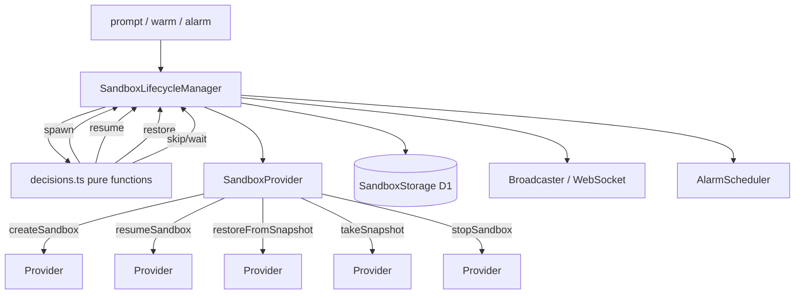

# Sandbox Provider Abstraction and Infra Packages

## Overview

The control plane runs every user session in a provider-managed sandbox. Providers are interchangeable behind the `SandboxProvider` interface (`packages/control-plane/src/sandbox/provider.ts`): Modal (the default), Daytona, E2B, OpenComputer, and Vercel. `SandboxLifecycleManager` (`packages/control-plane/src/sandbox/lifecycle/manager.ts`) is the single orchestrator that turns pure decision functions into provider calls plus storage/broadcast side effects. The infra packages (`packages/modal-infra`, `packages/daytona-infra`, `packages/e2b-infra`, `packages/opencomputer-infra`) build the provider base images/templates that sandboxes boot from, while the control plane drives all runtime operations over each provider's REST API.

The contract is deliberately narrow: a provider implements `createSandbox` plus the optional `restoreFromSnapshot` / `resumeSandbox` / `takeSnapshot` / `stopSandbox` operations and declares its capabilities so the lifecycle manager never calls a method the provider cannot honor.

## The SandboxProvider Interface

`SandboxProvider` (`provider.ts`) exposes `name`, `capabilities`, and typed lifecycle methods. Every method throws `SandboxProviderError` with an `errorType` of `"transient"` or `"permanent"` so the circuit breaker can classify failures.

### Capabilities

Each provider declares a `SandboxProviderCapabilities` record (`provider.ts`):

| Capability | Meaning |
| --- | --- |
| `supportsSandboxTimeout` | Provider enforces an explicit per-sandbox lifetime (seconds) |
| `supportsSnapshots` | Provider can take a filesystem snapshot of a running sandbox |
| `supportsRestore` | Provider can boot a new sandbox from a snapshot image |
| `supportsPersistentResume` | Provider can resume a previously stopped sandbox in place, preserving its identity/state |
| `supportsExplicitStop` | Provider can stop/delete a sandbox via API rather than only WebSocket shutdown |

Lifecycle decisions gate on these flags: `evaluateSpawnDecision` consults `supportsPersistentResume` before `snapshotImageId`; `resolveSandboxTimeoutSeconds` throws a permanent `SandboxProviderError` when a user configures a sandbox timeout on a provider with `supportsSandboxTimeout: false`; the manager's `canStopProviderSandbox()`/`usesProviderManagedStop()` select stop vs. snapshot-and-shutdown paths from `supportsExplicitStop` + `supportsPersistentResume`.

### Capabilities per provider

- **Modal** (`providers/modal-provider.ts`): `supportsSandboxTimeout: true`, `supportsSnapshots: true`, `supportsRestore: true`, `supportsPersistentResume: false`, `supportsExplicitStop: false`. Sessions persist via Modal filesystem snapshots; there is no in-place resume and no API stop, so teardown goes through `triggerSnapshot` + a `{type:"shutdown"}` WebSocket message.
- **Daytona** (`providers/daytona-provider.ts`): `supportsSandboxTimeout: false`, `supportsSnapshots: false`, `supportsRestore: false`, `supportsPersistentResume: true`, `supportsExplicitStop: true`. Session continuity is entirely provider-managed (auto-stop/auto-archive intervals); resume maps to start/recover.
- **E2B** (`providers/e2b-provider.ts`): `supportsSandboxTimeout: true`, `supportsSnapshots: false`, `supportsRestore: false`, `supportsPersistentResume: true`, `supportsExplicitStop: true`. Stop is a resumable pause; adding a session snapshot/restore pair would be a second, losing mechanism (every E2B snapshot is a durable templated image with no TTL, so per-execution snapshots would leak one template per turn). Prebuilt repo images exist via `takePrebuiltImageSnapshot`, separate from the session path.
- **OpenComputer** (`providers/opencomputer-provider.ts`): full capability set — timeouts, snapshots (checkpoints), restore (fork from checkpoint), persistent resume (wake), explicit stop (hibernate/delete).
- **Vercel** (`providers/vercel/provider.ts`): `supportsSandboxTimeout: true`, `supportsSnapshots: true`, `supportsRestore: true`, `supportsPersistentResume: false`, `supportsExplicitStop: true`. Timeouts are capped at `VERCEL_MAX_SANDBOX_TIMEOUT_MS` (45 min) — `resolveVercelTimeoutMs` clamps the requested lifetime; snapshots carry a configurable expiration (`VERCEL_SNAPSHOT_EXPIRATION_MS`).

### The create–bind–launch contract for image builds

`ImageBuildProviderTriggerConfig` (`provider.ts`) documents the contract every provider follows to run an environment/repo image build: **create** the build sandbox, **bind** its provider session id via `onProviderSessionCreated`, **then launch** the build runtime. Binding before launch matters because the runtime's build-complete callback is rejected until the provider session is bound. Providers that need extra fields extend the base type (e.g. `ModalImageBuildTriggerConfig` adds `cloneHost`/`cloneUsername`).

All four image-build providers implement `triggerImageBuild` with the same ordering, verified by unit tests asserting `onProviderSessionCreated` precedes the entrypoint start:

- **Modal**: `createImageBuildSandbox` → `onProviderSessionCreated(providerSessionId)` → `startImageBuildSandbox` (`modal-provider.ts`); on the Modal side, `api_start_build_sandbox` explicitly only starts a build after its provider session is bound in D1.
- **E2B**: create (no auto-pause, `secure: true`) → `assertSafeProviderSessionId` before binding → `onProviderSessionCreated` → `startEntrypoint` with the provider session id on the exec command (it cannot ride create-time env because the id does not exist yet). Kill on bind/exec failure.
- **OpenComputer**: create with a secret store → `onProviderSessionCreated` → `startRuntime` with `OI_REPO_IMAGE_PROVIDER_SESSION_ID`.
- **Vercel**: create from the resolved base snapshot → `onProviderSessionCreated` → `launchEntrypoint` with the callback env (Vercel delivers callback env at entrypoint launch, not at create).

`ImageBuildProviderTriggerConfig.providerSessionTimeoutSeconds` is always resolved by the adapter layer — `resolveImageBuildProviderSessionTimeoutSeconds` (`image-builds/timeouts.ts`) adds a 10-minute finalization grace (`IMAGE_BUILD_FINALIZATION_GRACE_MS`) to the user's build-execution budget — and providers apply it verbatim rather than choosing their own default. Modal timeouts are in seconds throughout (the control plane passes seconds; `web_api.py` clamps with `_validated_timeout_seconds`).

### Error classification and circuit breaker

`SandboxProviderError` (`provider.ts`) classifies failures as `"transient"` (network errors, HTTP 502/503/504, `RequestDeadlineError`) or `"permanent"` (HTTP 400/401/403/422, config errors, quota). Only permanent errors count toward the circuit breaker; transient ones are logged but don't trip the breaker. `fromFetchError` classifies by HTTP status when available, else by error message heuristics.

## Provider Wiring and REST Clients

### Provider factory

`createSandboxProviderFromEnv(env, backend)` (`provider-factory.ts`) builds the active provider from env configuration and throws at construction on missing credentials (`MODAL_API_SECRET`+`MODAL_WORKSPACE`, `VERCEL_TOKEN`+`VERCEL_PROJECT_ID`, `OPENCOMPUTER_API_URL`+`OPENCOMPUTER_API_KEY`, `DAYTONA_API_URL`+`DAYTONA_API_KEY`+`DAYTONA_BASE_SNAPSHOT`, `E2B_API_KEY`+`E2B_TEMPLATE_ID`). `resolveSandboxBackendName` (`provider-name.ts`) maps `SANDBOX_PROVIDER`, defaulting to `modal`; unset is Modal, unknown values throw. The image-build factory (`image-builds/provider-factory.ts`) reuses the same builder to construct the per-provider `ImageBuildAdapter` (the OpenComputer adapter only requires the template when starting a build, not when finalizing an existing session).

`SessionDO` wiring in `session/components.ts` constructs the manager per Durable Object: provider + D1-backed storage/messenger/WebSocket adapters + an `ImageBuildLookup` (bound when D1 exists and the provider supports prebuilt images), plus a Modal-only `sandboxDashboardUrlBuilder`. Both the provider factory and the backend resolver throw on misconfiguration deliberately at graph construction so every session request fails at initialization, not at first spawn.

### REST clients

Daytona, E2B, and OpenComputer talk to their provider REST APIs directly from Cloudflare Workers with native `fetch` (replacing the old Python shim); Modal and Vercel do the same over Modal's FastAPI deployment and Vercel's documented Sandbox API (the npm SDK is Node-only, so it's fetch directly).

- `daytona-rest-client.ts`: Bearer auth, per-operation timeouts (`TIMEOUT_CREATE_MS=90s`, start/recover 60s, stop/delete 30s, get/preview 15s), zod-validated responses, `DaytonaNotFoundError` (404 → idempotent success on stop / `shouldSpawnFresh` on resume).
- `e2b-rest-client.ts`: per-operation timeouts (create 90s, connect 60s, snapshot 180s), a hand-rolled Connect-protocol envelope decoder for `connectSandbox`, `E2BNotFoundError`/`E2BConflictError`/`E2BApiError`, and `secure` envd access tokens.
- `opencomputer-rest-client.ts`: configurable route paths, zod schemas that normalize tunnel responses (a tunnel must carry a reachable `url` or `hostname`), checkpoint kind `disk_only` with `delete_oldest`/maxCount retention, and a typed secret-store API.
- `client.ts` (Modal): HMAC internal-token auth, `MODAL_SANDBOX_START_REQUEST_DEADLINE_MS=60_000`, `MODAL_SNAPSHOT_REQUEST_DEADLINE_MS=310_000`, and dashboard-URL construction.
- `providers/vercel/client.ts`: deadline-based requests (`VERCEL_SANDBOX_START_REQUEST_DEADLINE_MS=60_000`, snapshot 310_000), zod validation of sandbox/session/snapshot metadata.

All client errors surface through provider `classifyError` into `SandboxProviderError` with status-aware transient/permanent classification.

## SandboxLifecycleManager Decision Engine

`SandboxLifecycleManager` (`lifecycle/manager.ts`) is the orchestrator. It depends on injected ports — `SandboxStorage`, `SessionContextReader`, `SandboxBroadcaster`, `WebSocketManager`, `AlarmScheduler`, `IdGenerator` — plus the active `SandboxProvider` and a config of thresholds. Pure decisions live in `lifecycle/decisions.ts`; the manager executes the chosen action with side effects (provider calls, row writes, broadcasts, alarm scheduling).

### Spawn decision

`spawnSandbox()` first evaluates the circuit breaker (`evaluateCircuitBreaker`, default threshold 3 failures / 5-minute window), then `evaluateSpawnDecision` with default config: 30s cooldown, 60s ready-wait, 120s spawning timeout. The decision order:

1. In-memory `isSpawningSandbox` flag → `skip` (prevents duplicate sandboxes from concurrent prompts in one request).
2. `supportsPersistentResume` + persisted `providerObjectId` + status `stopped`/`stale` → `resume`.
3. `snapshotImageId` + status `stopped`/`stale`/`failed` + compatible runtime → `restore`.
4. Status `spawning`/`connecting` younger than `spawningTimeoutMs` → `skip` (a stale spawn past the window is treated as dead so a fresh spawn can recover).
5. `ready` + active WebSocket → `skip`; `ready` recently spawned without WebSocket → `wait`.
6. Freshly spawned non-failed/stopped → `wait` during cooldown.
7. Otherwise → `spawn`.

`isSnapshotRuntimeCompatible` (`decisions.ts`) fails closed: a snapshot whose `SANDBOX_VERSION` was never recorded or doesn't parse is treated as below the `MIN_COMPATIBLE_RUNTIME_VERSION` floor, so restore silently resurrects the runtime that took the snapshot. Bumping `MIN_COMPATIBLE_RUNTIME_VERSION` retires old snapshots the same way it retires prebuilt images; the cost is one fresh spawn.

### Two-phase spawn identity write

`doSpawn()` reserves a replacement sandbox identity with the two-phase write from #1589 through `reserveSpawnIdentity`:

- Phase 1 (`updateSandboxForSpawn`): persist status `spawning`, fresh `created_at`, new expected sandbox id, clearing every field from the previous instance and invalidating stored credentials — no token can match the row until the new hash is published.
- Phase 2 (`updateSandboxAuthTokenHash`): publish the auth-token hash scoped to that reserved identity; if a newer reservation replaced it, the manager abandons the attempt via `SpawnSupersededError` without failure writes (the row and circuit breaker now describe the newer attempt).

Before invoking the provider, `doSpawn` also calls `stopPriorProviderSandbox()` — the prior provider object is stopped/deleted (for resumable providers) or the stored object id is cleared, with a 10s `PROVIDER_REPLACEMENT_STOP_TIMEOUT_MS` budget.

### Prebuilt-image selection at spawn

`lookupImageBuildForSpawn` + `evaluateImageBuildForSpawn` (`lifecycle/image-selection.ts`): an environment session matches its environment's image build; a single-repo ad-hoc session matches its repo scope's image; environment sessions never fall back to a repo image and multi-repo sessions never use prebuilt images (a repo image bakes a single checkout). Selection requires the latest ready image to pass the runtime floor and its `repositories_fingerprint` to equal the fingerprint of the session's **own** repository snapshot (not the scope's current repositories, so an entity edited after session creation can't hand the session a mismatched image). Any miss falls back to the base image; sessions are never blocked on builds. If a selected prebuilt image fails to spawn, the manager `markImageBuildRestoreFailed`s it and retries from base with a fresh spawn identity (the failed attempt may have created a provider-side sandbox, so rotating the token locks the orphan out).

### Restore, resume, snapshot, stop

- `restoreFromSnapshot` re-reserves identity, seeds `snapshot_runtime_version` (the restored sandbox runs the snapshot's binaries), stops the prior provider sandbox, calls `restoreFromSnapshot`, and on success broadcasts `sandbox_restored`. Falls back to `doSpawn()` when the provider lacks `restoreFromSnapshot`.
- `resumeSandbox` uses `updateSandboxForResume` (no identity/token rotation — in-place), transitions to `connecting`, and on `shouldSpawnFresh` falls back to a fresh spawn. A changed `providerObjectId` is persisted.
- `triggerSnapshot(reason)` gates on the status not already `snapshotting`, moves non-terminal sandboxes to `snapshotting` (broadcast), calls `takeSnapshot`, stamps `snapshot_image_id` **and** the sandbox's current `runtime_version` (the image carries that runtime's binaries; a later restore is gated on it, not on whatever the session runs next), then restores the previous status unless the reason is `heartbeat_timeout`.
- `handleAlarm` evaluates connecting timeout (120s), heartbeat staleness (90s = 3× 30s interval), and inactivity (10 min default, +5 min extension with connected clients; `SANDBOX_INACTIVITY_TIMEOUT_MS` env overrides the default). Inactivity timeout sets status `stopped` **first** to block reconnection, then either provider-managed stop (resumable providers) or snapshot-then-shutdown; `warmSandbox()` proactively spawns when a user starts typing.

### Provider stop semantics

`stopProviderSandbox` passes the manager's reason verbatim, and providers interpret it:

- **Daytona**: `respawn` → DELETE; any other reason → stop.
- **E2B**: terminal reasons (`connecting_timeout`, `respawn`) → KILL; everything else → PAUSE (resumable). `TERMINAL_STOP_REASONS` is the provider's own invariant: a session marked `failed` won't be resumed, so pausing would orphan a sandbox E2B retains indefinitely.
- **OpenComputer**: `respawn` → DELETE (also deleting the secret store); otherwise → hibernate.
- **Vercel**: `stopSession` with 404 treated as already-stopped.
- **Modal**: no `stopSandbox` — `supportsExplicitStop: false`; the manager sends a `shutdown` WebSocket message instead.

404/not-found results are treated as success everywhere (idempotent cleanup). Where the provider cannot stop via API, the manager falls back to `sendToSandbox({type:"shutdown"})` before detaching the WebSocket.

### Timeout resolution

`resolveSandboxTimeoutSeconds` (`manager.ts`): when the provider advertises `supportsSandboxTimeout: false` and the session has a configured `sandboxTimeoutMs`, the manager throws a permanent `SandboxProviderError` (`<provider> does not support configurable sandbox timeouts`). Otherwise the setting (ms) is converted to seconds and passed as `timeoutSeconds` in the create/restore/resume config; absent it stays undefined and providers apply their own default (`DEFAULT_SANDBOX_TIMEOUT_SECONDS = 7200`).

## Sandbox Environment Contract

`sandbox-env.ts` is the single source of truth for the sandbox environment contract shared by every provider:

- `SESSION_CONFIG` carries the canonical snake_case payload (`buildSessionConfig`/`toRepositoryConfigPayload`) that the runtime's Python `SessionConfig` decodes — the Daytona provider dropping `mcp_servers` in its own hand-rolled copy was the failure mode this module exists to prevent.
- Boot-mode markers (`IMAGE_BUILD_MODE`, `RESTORED_FROM_SNAPSHOT`, `FROM_REPO_IMAGE`, `REPO_IMAGE_SHA`) — the runtime's `BootMode.from_env` reads exactly these; providers set them when the mode applies and strip them from the user layer.
- The repo-image callback env contract (`REPO_IMAGE_CALLBACK_ENV`: `OI_REPO_IMAGE_BUILD_ID`, `OI_REPO_IMAGE_CALLBACK_URL`, `OI_REPO_IMAGE_FAILURE_CALLBACK_URL`, `OI_REPO_IMAGE_CALLBACK_TOKEN`, `OI_REPO_IMAGE_PROVIDER_SESSION_ID`) is pinned by value to the shared manifest; `RESERVED_REPO_IMAGE_CALLBACK_ENV_KEYS` scrubs these plus the legacy `OI_REPO_IMAGE_CALLBACK_SECRET` from user env so a user secret can never hijack the callback contract.
- Code-server/VNC passwords are derived, not random, via `deriveCodeServerPassword`/`deriveVncPassword` over the control-plane `sandboxAccessPasswordSecret` — domain-separated per sandbox id so a persistent resume re-derives the same credentials.

Providers layer their own platform env on top: E2B pins `HOME=/home/user` (non-root runtime), `PYTHONPATH=/app`, `NODE_PATH`, an SCM credential cache dir, and `SANDBOX_VERSION` (E2B does not propagate Dockerfile ENV); Vercel pins `HOME=/root`, `SANDBOX_VERSION` (= `SANDBOX_RUNTIME_VERSION`), PATH for its runtime, `PYTHONPATH=/app`. The E2B entrypoint is a single detached exec (`nohup python -m sandbox_runtime.entrypoint >/tmp/oi-supervisor.log 2>&1 &`) so the supervisor outlives the envd RPC; on image builds the provider session id rides the command line as the one value allowed there (it's public, and everything else must avoid E2B's platform logging).

Shared port resolution (`providers/port-resolution.ts`) applies service-port defaults and validates/caps user tunnel ports (`MAX_TUNNEL_PORTS`, raw VNC port reserved) so every provider shares one defaulting/validation rule. Modal's Python `SandboxManager` mirrors the same logic internally.

## Infra Packages: Base Images and Templates

The infra packages are **build-time only**: they produce the provider base artifact (Modal image, Daytona snapshot, E2B template, OpenComputer snapshot, Vercel base snapshot). All runtime operations go through the control plane's REST clients. Every package pins the same toolchain — OpenCode `1.18.18` (never below `1.18.15`, the OpenCode message-ID wraparound fix), code-server `4.109.5`, agent-browser `0.21.2`, ttyd `1.7.7` — and bakes `packages/sandbox-runtime` into the image so the supervisor (`python -m sandbox_runtime.entrypoint`) and bridge are provider-agnostic.

- **`packages/modal-infra`**: `src/images/base.py` builds `base_image` (Debian slim + Node 22 + Python 3.12 + OpenCode/plugin + code-server + ttyd + agent-browser + VNC stack + git credential-helper shim). `CACHE_BUSTER = RUNTIME_VERSION` is embedded in a no-op `echo` so bumping it force-rebuilds the image layer; it's one generation sequence shared by every image-build provider, and `MIN_REBUILD_RUNTIME_VERSION` gates which prebuilt images get rebuilt onto it. `sandbox/manager.py` is the Modal-side lifecycle (`_launch_sandbox` boots from base image, repo image (`modal.Image.from_id` + `FROM_REPO_IMAGE=true`), or snapshot image (`RESTORED_FROM_SNAPSHOT=true`); `take_snapshot` uses `snapshot_filesystem` with a 300s timeout; snapshots persist indefinitely). `sandbox/build_session.py` is the Modal image-build sandbox lifecycle — env with `IMAGE_BUILD_MODE=true`, the callback env, a launch-protocol tag — and `web_api.py` exposes the FastAPI endpoints the control-plane client calls, all HMAC-authenticated (`require_auth` over verify_internal_token) and callback-URL-host-validated. **Deploying**: run `uv run python deploy.py --build-sandbox-image` before `uv run modal deploy deploy.py`; never deploy `src/app.py` directly.
- **`packages/daytona-infra`**: `src/toolchain.py` builds the base image (same toolchain pins; `SANDBOX_VERSION = "daytona-v6-vnc-opencode-1-18-18"`, bumped manually to invalidate the snapshot) and `src/bootstrap.py` (`python -m src.bootstrap --force`) seeds/rebuilds the named `DAYTONA_BASE_SNAPSHOT`, polling (up to 300s) after delete because Daytona's delete returns before the backend finishes. Auth via `DAYTONA_API_KEY` with Snapshots: Read/Write/Delete. The Terraform `daytona-infra` module rebuilds whenever sources change.
- **`packages/e2b-infra`**: `e2b.Dockerfile` + `build-template.py` build the E2B template programmatically via the Template SDK (`Template().from_dockerfile(...).copy(...).set_start_cmd(...)`), authenticated with the same `E2B_API_KEY` the runtime uses. The template's start command is an inert `sleep infinity` — kept only so the ready command gates the build on the baked toolchain — and the control plane execs the supervisor on every create. `build-template.py` pre-warms the template (spawn one sandbox and kill it) to work around a vendor bug where the first spawn of a fresh template build is much slower.
- **`packages/opencomputer-infra`**: `src/build-template.ts` builds the OpenComputer runtime snapshot (`openinspect-runtime` by default, driven by `OPENCOMPUTER_TEMPLATE`) via the `@opencomputer/sdk` `Snapshots` API with a deterministic `image.cacheKey()`, `--dry-run` to print the manifest, and `OPENCOMPUTER_API_URL` / `OPENCOMPUTER_API_KEY` / `OPENCOMPUTER_BUILDER_MEMORY_MB` env. The image includes the runtime, VNC/desktop stack, CA/proxy bootstrap for the sandbox network, and version = the shared `runtime_manifest.json` (`OPENCOMPUTER_TEMPLATE_RUNTIME_VERSION`).
- **Vercel base snapshot** (`providers/vercel/base-snapshot.ts` + `bootstrap.ts`): `buildVercelBaseSnapshot` creates a temporary sandbox, uploads the bootstrap script and runtime archive, runs it (20-min budget), snapshots the filesystem, and stops the session in a finally — the runtime is actually **built at build time in a Vercel sandbox**, since Vercel gives no image/Dockerfile surface. `VERCEL_SANDBOX_VERSION = SANDBOX_RUNTIME_VERSION` is injected at spawn (the base snapshot bakes no `SANDBOX_VERSION`, without which every sandbox would report an unknown runtime and its snapshots would be unrestorable).

## Configuration and Operations

| Env | Used for |
| --- | --- |
| `SANDBOX_PROVIDER` | Backend selection: `modal` (default) \| `daytona` \| `vercel` \| `opencomputer` \| `e2b` |
| `MODAL_API_SECRET`, `MODAL_WORKSPACE`, `MODAL_ENVIRONMENT_WEB_SUFFIX` | Modal client + dashboard URLs |
| `VERCEL_TOKEN`, `VERCEL_PROJECT_ID`, `VERCEL_TEAM_ID`, `VERCEL_SANDBOX_API_BASE_URL`, `VERCEL_BASE_SNAPSHOT_ID`/`_NAME`, `VERCEL_RUNTIME`, `VERCEL_SNAPSHOT_EXPIRATION_MS` | Vercel client, base-snapshot resolution, snapshot expiry |
| `OPENCOMPUTER_API_URL`, `OPENCOMPUTER_API_KEY`, `OPENCOMPUTER_TEMPLATE` | OpenComputer client; template required to *start* sandboxes |
| `DAYTONA_API_URL`, `DAYTONA_API_KEY`, `DAYTONA_BASE_SNAPSHOT`, `DAYTONA_TARGET`, `DAYTONA_AUTO_STOP_INTERVAL_MINUTES` (default 120), `DAYTONA_AUTO_ARCHIVE_INTERVAL_MINUTES` (default 10080) | Daytona client and sandbox auto-stop/archive policy |
| `E2B_API_KEY`, `E2B_TEMPLATE_ID`, `E2B_API_URL`, `E2B_SANDBOX_TIMEOUT_SECONDS` (default 7200), `E2B_AUTO_PAUSE` (default true) | E2B client, sandbox TTL, pause-on-TTL |
| `SANDBOX_INACTIVITY_TIMEOUT_MS` (default 600000) | Inactivity alarm override wired in `session/components.ts` |
| `SCM_PROVIDER`, `GITLAB_ACCESS_TOKEN` | Clone credential type for sandbox SCM operations |

Numeric/boolean envs are validated by `parseNumericEnv`/`parseBooleanEnv` in the factory — a malformed value throws at construction (covered by `provider-factory.test.ts`).

## Invariants and Failure Semantics

- **Deny-list dead statuses**: `DEAD_SANDBOX_STATUSES = {stopped, stale, failed}`; an unknown future status is treated as live so callers fall through to their own checks. `isSandboxReconnectBlockedStatus` allows reconnects for `failed` (a slow boot can outlive the connecting watchdog and self-heal), blocks `stopped`/`stale`.
- **`failed` is reconnectable; `stopped`/`stale` are not** — the distinction drives reconnect gating in the bridge.
- **Circuit breaker counts only permanent errors**; unknown error types are conservatively treated as permanent. A successful spawn initiation resets the breaker.
- **Snapshot runtime floor fails closed**: a snapshot whose runtime version is missing/unparseable/below `MIN_COMPATIBLE_RUNTIME_VERSION` is never restored; the session gets a fresh spawn, and the next snapshot records its version.
- **Prebuilt-image misses never block sessions**: every miss (`no_ready_image`, `missing_artifact`, `runtime_below_floor`, `fingerprint_mismatch`, lookup failure) falls back to the base image, with miss reasons logged (the numbers that justify or kill prebuild fast-follows).
- **Provider stop timeouts don't block replacement**: `stopPriorProviderSandbox` races provider stop against a 10s abort and continues to spawn on timeout.
- **Secrets never ride provider-logged surfaces**: E2B platform-logs Process/Start requests, so session env (secrets included) rides create-time `envVars`; only the provider session id is allowed on the exec command. The E2B image bake pauses, reconnects, deletes the supervisor log, then snapshots — so the durable template contains neither build-process memory nor build credentials on disk.
- **`spawned` superseded attempts abandon silently**: `SpawnSupersededError` (hash publication discovered a newer reservation) returns without marking the row or breaker, which now describe the newer attempt.

## Testing

- `lifecycle/decisions.test.ts` covers the pure functions exhaustively (circuit breaker thresholds/window/reset, spawn order incl. resume-vs-restore precedence, snapshot runtime compatibility, heartbeat/inactivity/connecting/execution timeouts, dead/reconnect statuses).
- `lifecycle/manager.test.ts` exercises the manager end-to-end with mocked providers/storage — spawn from base vs. prebuilt image, prebuilt-image restore-failure fallback with identity rotation, two-phase spawn supersede, restore/resume/fallback-to-fresh, circuit-breaker increment on permanent vs. transient, provider-stop paths (respawn delete vs. stop), inactivity timeout ordering, and access-state clearing rules.
- `provider.test.ts`, `provider-factory.test.ts`, and per-provider tests (`daytona-provider.test.ts`, `e2b-provider.test.ts`, `modal-provider.test.ts`, `opencomputer-provider.test.ts`, `vercel/provider.test.ts`) pin capability tables, REST payload shapes, error classification, tunnel handling, and the create-bind-launch ordering (`onProviderSessionCreated` before entrypoint start, kill-on-bind-failure for E2B).
- Cross-package contract tests pin the env-var names between TS and Python (`sandbox-env.test.ts` vs. `packages/modal-infra/tests/test_build_sandbox_lifecycle.py`), and the image-build adapters' tests assert `triggerImageBuild` receives adapter-resolved timeouts and the bound `onProviderSessionCreated` callback.
