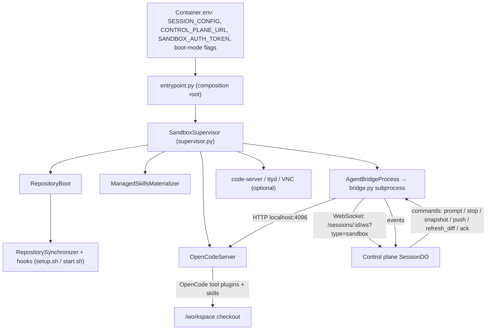

# Sandbox Runtime (in-sandbox Python agent)

## Overview

`packages/sandbox-runtime` is the Python 3.12 package that boots inside every provider sandbox (Modal, Daytona, E2B, OpenComputer, Vercel). It is the data-plane half of the [session lifecycle](/openwiki/workflows/session-lifecycle.md): the supervisor composes the OpenCode agent server and the bridge process, repository booting is done from process environment, and every session-bound side effect (git identity, commit signing, SCM credentials, diff capture, managed skills) is brokered through the control plane. The sandbox holds no shared state — it is disposable and restored from snapshots or prebuilt images.

The package is a single composition root plus four responsibilities:

- **`entrypoint.py` / `supervisor.py`** — process lifecycle: boot-mode derivation, service start ordering, restart policy, coordinated shutdown.
- **`bridge.py` (subprocess `agent_bridge_process.py`)** — the bidirectional WebSocket to the session Durable Object: heartbeats, command handling (prompt/stop/snapshot/shutdown/push/refresh_diff/ack), event forwarding, per-prompt git identity.
- **`opencode_server.py` + `opencode_client.py` `prompt_stream.py`** — OpenCode server management and prompt/SSE translation.
- **Repository work** — `repository_boot.py`, `repository_sync.py`, `git_signing.py`/`git_signer.py`, `credentials/git_credential_helper.py`, `diff_collector.py`/`diff_capture.py`, `managed_skills.py`, plus optional aux services (`code_server.py`, `web_terminal.py`, `browser_desktop.py`).

## Boot Modes and the composition root

`BootMode` (`runtime_config.py`) is derived from process env: `IMAGE_BUILD_MODE=true` → `build`, `RESTORED_FROM_SNAPSHOT=true` → `snapshot_restore`, `FROM_REPO_IMAGE=true` → `repo_image`, otherwise `fresh`. The supervisor stamps `OPENINSPECT_BOOT_MODE` into the environment so hooks and child processes can branch on it. Repo-level behavior differs per mode:

- **fresh / build** — synchronizers clone or hard-reset to the configured branch, then `setup.sh` runs (a setup failure is fatal only in `build` and a warning otherwise).
- **snapshot_restore** — sync preserves the checked-out working tree (only ensures a plain `origin` URL and fetches the branch); the session continues from the snapshot filesystem. Diff baselines are *not* rediscovered (`discover_missing=False`), keeping the immutable baseline from the original session.
- **repo_image** — like fresh, but the checkout is the baked repo-image tree; git sync fetches the branch, then `start.sh` runs (primary-repo start failure aborts the boot; member-repo start failure is a warning).

`entrypoint.py` parses the CLI (only one flag: `--await-modal-image-build-token-stdin-v1` for the Modal launch protocol), consumes secrets from the environment, and calls `build_supervisor()` to compose `RepositoryBoot`, `ManagedSkillsMaterializer`, `OpenCodeServer`, `AgentBridgeProcess`, `CodeServer`, `WebTerminal`, and `BrowserDesktop` into one `SandboxSupervisor`. `SIGTERM`/`SIGINT` are routed into a supervisor-owned `asyncio.Event`.

## Supervisor lifecycle and restart policy

`SandboxSupervisor.run()` implements lifecycle ordering with explicit restart policies per process:

1. Boot mode is derived and tunnel environment state is prepared (`prepare_tunnel_environment` clears stale `.tunnels.env` files that do not carry this sandbox's id).
2. In `build` mode the supervisor runs the repository boot under `OI_IMAGE_BUILD_EXECUTION_TIMEOUT_SECONDS` (via `ModalImageBuildStart`/`RepoImageBuildCallback` protocol for the post-binding launch callback), reports success/failure to the control plane, and then waits for shutdown.
3. Otherwise: start the VNC desktop (best-effort), run `RepositoryBoot.boot()` (manifest write → credentials config → git sync → setup/start hooks → workspace manifest), materialize managed skills, then start code-server, the web terminal, OpenCode, and finally the bridge subprocess.
4. `monitor_processes()` polls each owner; explicit policy per component:

| Component | Policy |
| --- | --- |
| OpenCode, bridge, code-server | restart with backoff `2^n` capped at 60 s, max 5 restarts; exceeding the cap for OpenCode/bridge reports a fatal sandbox error |
| web terminal, VNC desktop | crash detected via `crash()`; restart up to 5 times with the same backoff, then give up silently (non-fatal) |
| bridge exit code 0 | treated as graceful — the supervisor shuts the whole sandbox down |

Fatal errors are POSTed to `/sessions/:id/sandbox-error` with the sandbox token (`_report_fatal_error`, retried 3 times with exponential backoff). Shutdown stops in the reverse order: bridge → terminal → code-server → desktop → OpenCode.

## The bridge: WebSocket to the control plane

The bridge runs as its own subprocess (`python -m sandbox_runtime.bridge`) spawned by `AgentBridgeProcess`; it is intentionally separate so a bridge crash cannot take down OpenCode and an OpenCode crash does not kill the WebSocket. It connects to `wss://{control_plane}/sessions/{session_id}/ws?type=sandbox` with `Authorization: Bearer {sandbox_token}` and `X-Sandbox-ID` headers.

### Connection lifecycle

- Heartbeat every 30 s (`heartbeat` event with `status: ready`); reconnect with exponential backoff (base 2 s, cap 60 s).
- Terminal errors are not retried: HTTP 401/403/404/410 raise `SessionTerminatedError` (410 = session terminated; the bridge exits gracefully so the control plane can restore the session from a snapshot on the next prompt).
- On connect the bridge sends a `ready` event carrying `sandboxId`, the persisted `opencodeSessionId`, the image-baked `SANDBOX_VERSION` (stamped onto snapshots), and the repo manifest positions (`repoOwner`/`repoName`/`baseSha`), then drains boot warnings from `/tmp/oi-boot-warnings.jsonl` (recording scope/message lines queued by the supervisor, which has no event channel, and consuming the file exactly once so reconnects do not replay).
- Prompt tasks are deliberately **not** tracked in the per-connection background-task set: they survive WebSocket disconnects while the bridge reconnects.

### Commands

| Command | Behavior |
| --- | --- |
| `prompt` | runs as a background task (keeps the listener responsive to `push`/`stop`); parses the author's explicit git identity, creates the OpenCode session on first use, hydrates attachments, streams translated events, and finally emits `execution_complete`; a prompt with no emitted output is an error |
| `stop` | cancels the current prompt task and best-effort aborts the OpenCode session (saves LLM compute) |
| `snapshot` | replies `snapshot_ready` with the current OpenCode session id |
| `shutdown` | cancels the prompt and sets the shutdown event (graceful exit code 0, which the supervisor treats as teardown) |
| `git_sync_complete` | unblocks the git sync gate event |
| `push` | executes a provider-generated push spec (see below) |
| `refresh_diff` | requests an idle diff refresh |
| `ack` | drops the acknowledged critical event from the forwarder's pending set |

Prompt duration is budgeted to leave snapshot headroom: `prompt_max_duration_seconds = SANDBOX_TIMEOUT_SECONDS − min(900 s, 25% of the timeout)`; the SSE inactivity timeout is `BRIDGE_SSE_INACTIVITY_TIMEOUT` clamped to [5, 3600] with a 120 s default.

### Reconnect-safe event delivery

`BufferedEventForwarder` owns the delivery state machine. While no connection is bound, events land in a bounded buffer (max 1000; eviction prefers non-critical events). Critical events (`execution_complete`, `error`, `snapshot_ready`, `push_complete`, `push_error`) carry a deterministic `ackId` (`{type}:{messageId}` or `{type}:{random}`) and stay pending until the control plane sends an `ack` command, so they are re-sent on reconnect. `bind` is the single reconnect operation: it attaches the new connection and recovers the backlog (buffered events first, then still-pending criticals from a pre-flush snapshot) under one lock — a stale-send drain and a concurrent bind can never both walk the buffer.

### Push execution

The `push` command normalizes the provider's `pushSpec` into a `PushRequest` (missing fields become `""`/`False`; validation decides which are fatal). Git is invoked as an argument array — no shell interpolation — with the push URL and refspec, capped at 300 s and terminated (escalating to kill after 5 s) on timeout. The checkout is resolved through the supervisor-written repo manifest:

- a spec that names `repoOwner`/`repoName` is matched against the manifest and the matched entry's path is used verbatim (crafted names can never select a checkout outside the session);
- a spec without identity targets the sole clone under `/workspace`;
- all failures funnel into one `push_error` emitter carrying `branchName` even when empty so the control plane can resolve its pending push.

Git stderr is redacted (URL-embedded credentials replaced) before it reaches the control plane.

## Repository boot, sync, and the manifest

`repo_config.py` is the single authority over the workspace checkout layout. `RepositoryBoot` derives the ordered `RepoEntry` list once from `SESSION_CONFIG` (validating owner/name as safe namespace/path segments and rejecting duplicates case-insensitively), then writes `REPO_MANIFEST_FILE_PATH` (`/tmp/oi-repo-manifest.json`) before any child starts. Every other consumer — bridge push targeting, the JS `create-pull-request` tool, and the diff refresh worker — reads that manifest instead of re-deriving the `/workspace/<repo_name>` convention.

`RepositorySynchronizer` clones (`--depth 100 --branch <branch>`), resets `origin` to a plain `https://{vcs_host}/{owner}/{name}.git` URL, fetches the branch, and checks out `origin/<branch>` with `-B`; subprocesses run in their own session (`start_new_session=True`) and are killed by process group on timeout (clone 300 s, fetch 120 s). Sync failures are fatal for fresh/build boots, degraded to boot warnings for snapshot_restore/repo_image boots. `resolve_session_diff_baselines` keeps supplied `base_sha`s immutable and discovers the HEAD baseline only on non-restore boots.

Before sync, `ensure_credentials_configured` installs the git credential helper shim (`/usr/local/bin/oi-git-credentials`) and sets `credential.helper` + `credential.useHttpPath=true` globally, and installs a `gh` CLI wrapper. Per-repo hooks run from `.openinspect/setup.sh` (fresh/build only, timeout env `SETUP_TIMEOUT_SECONDS` default 300) and `.openinspect/start.sh` (all non-build modes, `START_TIMEOUT_SECONDS` default 120), each with `OPENINSPECT_BOOT_MODE` in the environment and a 50-line output tail on failure. The supervisor records boot warnings through `BootWarningSink` into the JSONL file the bridge drains.

Multi-repo sessions also get a generated `/workspace/AGENTS.md` describing the members, the shared working branch, and the `create-pull-request` tool contract.

## Git credentials and signing

### Credential helper

`credentials/git_credential_helper.py` implements git's `credential` protocol so every git operation (fetch, push, ls-remote, submodule update) mints a fresh short-lived SCM credential on demand rather than using a token captured at sandbox creation. A successful response is cached to `/run/oi/scm-creds.json` (mode 0600, with an advisory `flock` serializing concurrent first-boot calls). The cache is reused only while more than `CACHE_REFRESH_BUFFER_SECONDS` (5 min) remain. **The cache is never a fallback for a failed refresh** — a control-plane rejection exits non-zero because stale tokens silently authenticating are worse than visible failures. The helper refuses to serve credentials to any host but the configured `VCS_HOST` over plaintext `http` (protocol must be `https`), so a malicious submodule URL or `git ls-remote https://attacker.example/...` cannot exfiltrate the installation token. Image-build sandboxes (no control plane) fall back to the injected `VCS_CLONE_TOKEN` env with a 1-hour TTL only when no control-plane context exists at all. A `gh-token` action prints a fresh token for the gh wrapper, but only when the environment has no genuine user token (user-provided `GH_TOKEN`/`GITHUB_TOKEN` always wins; a failed mint prints nothing and exits 0 so gh falls through to its env).

### Commit signing

`git_signing.py` fetches the session's commit-signing configuration from `/sessions/:id/commit-signing` (GET) and applies it per repository with local git config: signing enabled → `gpg.format=ssh`, `gpg.ssh.program=<oi-git-sign>`, `user.signingkey=key::<ed25519 public key>`, `commit.gpgsign=true`, plus author/committer identity; disabled → signing keys unset and identity defaulted to `OpenInspect <open-inspect@noreply.github.com>` unless the prompt supplied an attributed user. `GitSigningRuntime.refresh()` runs before the first connection and per prompt (prompt-supplied `gitIdentity` with mode `agent-only` → no user identity; `attributed-user` → that user). Signing configuration fetch errors are retryable for 408/429/5xx, fatal otherwise — a non-retryable `GitSigningError` stops the bridge loop.

`git_signer.py` (installed as `oi-git-sign` in the bin dir) is the stateless `gpg.ssh.program`: it intercepts git's `-Y sign -n git -f` invocation, hashes/reads the bounded payload, POSTs it to `/sessions/:id/commit-signing` with `X-Open-Inspect-Signing-Fingerprint: SHA256:<blob fingerprint>`, validates the armored `SSH SIGNATURE` response, and atomically writes it. Any other ssh-keygen invocation is exec'd through to the stock `/usr/bin/ssh-keygen` so the wrapper is transparent.

## OpenCode server management and the prompt stream

`OpenCodeServer.start()` prepares the filesystem before launching, then spawns `opencode serve --port 4096 --hostname 0.0.0.0 --print-logs` with `OPENCODE_CONFIG_CONTENT` (model/permission/MCP config), `OPENCODE_CLIENT=serve` (disables OpenCode's blocking question tool, which would hang the headless run until the SSE inactivity timeout), and the working directory set to the repo for single-repo sessions or `/workspace` otherwise. Startup waits for `/global/health` (30 s health-check timeout; a process exit or shutdown during startup fails fast). Logs are forwarded to the supervisor stdout with a 1 MiB per-stream limit.

Preparation steps:

- **Workspace assembly** (multi-repo only): member `.opencode/` trees are merged into `/workspace/.opencode` in position order, last-write-wins with a warning naming both members; `node_modules` and `__pycache__` are skipped; the merged tree is rebuilt from scratch on every boot (so removed members do not survive snapshot restores) except that `node_modules` is preserved as image-managed state.
- **Agent tools**: bundled `.js` plugins from `/app/sandbox_runtime/tools` (and the legacy `inspect-plugin.js` → `create-pull-request.js`) are copied into `.opencode/tool/`; tools gated on env (`slack-notify.js` requires `AGENT_SLACK_NOTIFY_ENABLED=true`) and tools requiring a repository are skipped when inappropriate. Pre-staged plugin dependencies (`package.json`, `package-lock.json`, `node_modules` from `/app/opencode-deps`) are copied in so OpenCode's `Npm.install()` finds `@opencode-ai/plugin` in sync and skips the blocking arborist reify; the global-config fallback seed only touches a pristine dir.
- **Bundled skills**: `/app/sandbox_runtime/skills` → `.opencode/skills` (symlinks preserved).
- **Bin scripts**: standalone CLIs from `/app/sandbox_runtime/bin` land in `${OPENINSPECT_BIN_INSTALL_DIR}` (default `/usr/local/bin`) and are chmod 0755 — deliberately **not** `.opencode/tool/` because OpenCode would `import()` them during tool discovery.
- **Managed OAuth sentinels**: when `OPENAI_OAUTH_MANAGED`/`XAI_OAUTH_MANAGED` are set, `auth.json` in the OpenCode auth dir receives `refresh: "managed-by-control-plane"` placeholder entries (written via temp file + atomic rename at mode 0600).
- **Auth proxy plugins**: `codex-auth-plugin.js` / `xai-auth-plugin.js` plus the shared `provider-token-broker.js` are deployed into `.opencode/plugins/` when the matching managed markers are set.
- **Runtime git excludes**: every installed runtime path is recorded in a managed `info/exclude` block (markers `# BEGIN/END Open-Inspect runtime assets`) so diff capture and git status ignore runtime-owned files; reconcile is atomic and leaves user entries untouched.

`OpenCodeClient` is the HTTP/SSE transport (session create/lookup, `/event` SSE with inactivity deadline, async prompt POST, abort, message fetch), and `OpenCodePromptStream` translates one prompt's OpenCode SSE events into bridge events. The stream supplies its own OpenCode message ID (`msg_...`, generated via `OpenCodeIdentifier.ascending`) so assistant messages carry a `parentID` pointing at this prompt's user message; `MessageAttribution` uses that parent chain (plus a creation-time-boundary fallback after compaction — OpenCode IDs encode a 48-bit timestamp and stop sorting monotonically every ~795 days, so ordering must use `time.created`) to filter out other sessions' noise. Child sessions (task sub-tasks) are correlated via `ChildActivityCorrelator`, their non-text events forwarded with `isSubtask: true` and text tokens suppressed. Reasoning effort is translated per provider: Anthropic adaptive models get `thinking: {type: adaptive}` + `outputConfig.effort`, others a fixed `budgetTokens` (16 000 for `high`, 31 999 for `max`), OpenAI `reasoningEffort`/`reasoningSummary`, xAI a `variant`. Timeouts surface as errors: SSE inactivity, max-duration (emits a final message-state fetch then raises), and stream disconnect (preserves partial output when available).

## Diff capture and refresh

Session diffs show the checkout's changes relative to an **immutable** baseline (`base_sha` per repo, resolved at first boot and never re-discovered on restore). `diff_collector.py` runs git with argument arrays (never shell interpolation, `GIT_LITERAL_PATHSPECS=1`, `GIT_TERMINAL_PROMPT=0`, bounded stdout, 20 s command timeout) and produces one `SessionDiffBundle` (`version: 1`) for all session repositories:

- `--raw -z` for tracked changes (+ metadata: modes/shas), `--numstat` for line counts, `--name-only --diff-filter=U` for unmerged paths, `ls-files --others --exclude-standard` for untracked files (runtime-owned paths filtered via the git-excludes block).
- Per-file patches are bounded (max 512 KiB/file, 1 MiB total capture, 1000 files, command stdout ceilings) with a render state per file: `renderable` / `metadata_only` / `too_large` / `binary`. Binary files carry `additions/deletions: null` (git numstat `-`), submodule entries carry old/new SHAs (dirty pointer placeholders resolved to the checked-out HEAD), renames/copies are normalized to `RENAMED`, and a staged-deletion + untracked-file overlay at one path collapses to a single `MODIFIED` record.
- The encoded bundle is bounded to the wire limit (1.5 MiB): patches are shed largest-first (state → `too_large`), then trailing metadata records, and a capture that still exceeds the limit raises.
- A repository that cannot produce a trustworthy capture becomes an `unavailable` upload entry with a bounded error string, so the bundle still uploads atomically.

`SessionDiffRefreshWorker` (`diff_capture.py`) coalesces terminal executions into one eventual idle-time refresh: `prompt_started()` increments an activity generation and holds the idle gate; a refresh is requested at `execution_complete` and settles only when the worker is idle and no newer request/activity superseded the attempt (stale attempts are discarded and retried against the current checkout). Failure reports go to `POST /sessions/:id/diff/failure`; a 404 from either diff endpoint marks the feature unsupported for the rest of the sandbox's life. The bridge drains the worker with a 5 s bound at shutdown.

## Managed skills materialization

`ManagedSkillsMaterializer` fetches the session-bound skills installation from `/sessions/:id/sandbox-skills` (paginated at 50 skills/page with a `nextCursor`), validates every byte locally, and installs into the platform-owned global skills dir (OpenCode's global config dir `/skills`, resolved via `resolve_opencode_global_config_dir`). Validation runs independently of the control plane: schema version, safe paths (no `..`, absolute, backslash, control chars; max depth 10, 240 bytes), SHA-256 per file, `sizeBytes` must equal the UTF-8 content length, `SKILL.md` required with a frontmatter `name` matching the skill name, executable files only under `scripts/`, and a 5 MiB aggregate session cap. Deployment is crash-recoverable: skills are staged into `.managed-skills-staging`, swapped via a journaled rename (`destination → backup → staging → destination`) with fsync discipline, and an interrupted swap is repaired on the next boot. Managed names shadowed by an existing discovered skill (bundled, workspace, member-repo, or `~/.claude/skills` / `~/.agents/skills` / user `.opencode/skills`) are dropped with a warning rather than overriding the user's copy. Materialization runs once at boot before OpenCode starts; OpenCode restarts reuse the tree, which is why the materializer must never depend on control-plane availability after boot.

## Auxiliary services

- **code-server** (`code_server.py`) — starts `code-server` on port 8080 (env-overridable via `CODE_SERVER_PORT`) when `CODE_SERVER_PASSWORD` is set; password auth, telemetry disabled.
- **Web terminal** (`web_terminal.py`) — `ttyd` on localhost:7681 plus a Bun proxy on `TTYD_PROXY_PORT` (default 7680), gated on `TERMINAL_ENABLED`; workdir is the boot workdir.
- **Browser desktop** (`browser_desktop.py`) — Xvfb + fluxbox + x11vnc (localhost:5900) + websockify noVNC (`NOVNC_PORT`, default 6080), when `VNC_PASSWORD` is set. The password is stored in `/tmp/oi-vnc-password` in VNC's fixed-key TripleDES format, created 0600 with `O_NOFOLLOW`; display artifacts are cleared before start.
- **Tunnel environment** (`tunnel_environment.py`) — reads `EXPECTED_TUNNEL_PORTS`, clears stale `/workspace/.tunnels.env` files whose `TUNNEL_SANDBOX_ID` does not match, and waits up to `TUNNEL_WAIT_TIMEOUT_SECONDS` (default 30) for fresh URLs before `start.sh`.

All of these are best-effort: supervisor treats their start/restart failures as warnings (VNC/terminal/code-server), while OpenCode and the bridge are load-bearing.

## Provider auth plugins

`auth/internal.py` verifies service-to-service `Bearer timestamp.signature` tokens (HMAC-SHA256 of the Unix-ms timestamp, 5-minute validity window) for in-sandbox web endpoints, mirroring `packages/shared/src/auth.ts`. `auth/github_app.py` generates GitHub App JWTs and exchanges them for installation access tokens (used for private-repo clones during image builds, git sync, and push). Image builds additionally implement the provider launch protocol: `modal_image_build_start.py` reads a callback token on stdin after provider binding (Modal-specific), and `repo_image_callback.py` reports success/failure to the control-plane callback URLs with retries — a partially configured callback environment aborts the build rather than running with completion reporting silently disabled.

## Configuration and operations

All configuration is process environment (with `SESSION_CONFIG` the JSON session contract whose unknown keys are dropped by pydantic when round-tripped):

| Env var | Meaning |
| --- | --- |
| `SESSION_CONFIG` | JSON session contract: session_id, repo owner/name/branch/base_sha, provider/model, mcp_servers, repositories (multi-repo), working_branch_name |
| `CONTROL_PLANE_URL` / `SANDBOX_AUTH_TOKEN` / `SANDBOX_ID` | bridge, signing, credentials, skills, diff, callback endpoints |
| `IMAGE_BUILD_MODE` / `RESTORED_FROM_SNAPSHOT` / `FROM_REPO_IMAGE` | boot mode |
| `SANDBOX_TIMEOUT_SECONDS` | prompt budget derivation (default 7200 s) |
| `BRIDGE_SSE_INACTIVITY_TIMEOUT` | SSE inactivity clamp [5, 3600], default 120 s |
| `SANDBOX_VERSION` | image-baked runtime version stamped into the `ready` event and snapshot compatibility |
| `VCS_HOST` / `VCS_CLONE_TOKEN` / `VCS_CLONE_USERNAME` | credential helper scope and image-build fallback |
| `OI_SCM_CRED_CACHE_DIR` | credential cache location (default `/run/oi`) |
| `OPENAI_OAUTH_MANAGED` / `XAI_OAUTH_MANAGED` | managed-provider auth plugin deployment |
| `AGENT_SLACK_NOTIFY_ENABLED` | gates the `slack-notify.js` tool |
| `CODE_SERVER_PASSWORD` / `TERMINAL_ENABLED` / `VNC_PASSWORD` | aux service gates |
| `EXPECTED_TUNNEL_PORTS` / `CODE_SERVER_PORT` / `TTYD_PROXY_PORT` / `NOVNC_PORT` | tunnel/port overrides |
| `OI_IMAGE_BUILD_EXECUTION_TIMEOUT_SECONDS` | build-mode execution budget |
| `SETUP_TIMEOUT_SECONDS` / `START_TIMEOUT_SECONDS` | hook budgets |
| `OI_REPO_IMAGE_BUILD_ID` / `OI_REPO_IMAGE_CALLBACK_URL` / `OI_REPO_IMAGE_FAILURE_CALLBACK_URL` / `OI_REPO_IMAGE_CALLBACK_TOKEN` / `OI_REPO_IMAGE_PROVIDER_SESSION_ID` | build callback context |

Logging is single-line JSON to stdout (`log_config.py`: level/service/component/event/ts + extra fields, exception type/message/stack truncated to 2000 chars); both the supervisor and bridge processes call `configure_logging()`.

## Invariants and failure semantics

- **The bridge is reconnection-safe and the prompt is not**: prompt tasks outlive WebSocket disconnects; critical events are buffered + ack-tracked so a disconnect cannot lose an `execution_complete`/`push_complete`/`push_error`. A wedged `push` is terminated (5 s grace) and surfaced as `push_error` — no silent hang.
- **Stale credentials fail visibly**: the credential cache is never a fallback for a failed refresh, and signing/config failures with non-retryable statuses stop the bridge rather than degrade silently.
- **Git is always invoked with argument arrays**; repository paths and filenames are never interpolated into shell commands (diff collection, push, sync, credential helper shim, hooks all follow this).
- **The workspace layout has one authority**: `repo_config.parse_repositories` validates config, `RepositoryBoot` writes the manifest, and every consumer reads it — crafted push-spec names cannot target checkouts outside the session.
- **Diff baselines are immutable**: `base_sha` is pinned at first boot, and a diff capture that cannot be trusted is reported as `unavailable` rather than silently uploaded wrong.
- **Runtime-owned files never pollute the diff**: installed tools/skills/plugins are recorded in a managed `info/exclude` block and filtered from untracked captures.
- **OpenCode crashes are survivable**: up to 5 restarts across the sandbox life with backoff; the managed-skills tree must be materialized once at boot precisely so restarts do not need the control plane (materialization is followed by `start.sh`-order dependency for `code-server`/ttyd workdirs).

## Focused tests

- `tests/test_supervisor_lifecycle.py`, `test_supervisor_monitor.py`, `test_code_server_supervisor.py` — boot ordering, restart policy counts/backoff, shutdown order.
- `tests/test_bridge_*.py` (ack, reconnection, event buffer, git identity, push, diff capture, stop, boot warnings, SSE, message tracking) — bridge state machine and command handling.
- `tests/test_git_credential_helper.py`, `test_git_signer.py`, `test_git_signing.py`, `test_gh_wrapper.py` — credential scoping/caching/failure, signer arg parsing and armor validation, per-prompt git identity.
- `tests/test_diff_collector.py`, `test_bridge_diff_capture.py` — raw/numstat parsing, overlay/unmerged normalization, limits and bundle bounding; `test_repository_sync.py` and `test_repository_target.py` — clone/fetch/checkout and identity resolution.
- `tests/test_managed_skills.py` — validation rejection paths, collision drops, journaled swap recovery; `tests/test_restore_integrity.py` covers snapshot-restore boot invariants.
- `tests/test_entrypoint_*.py`, `test_runtime_config.py`, `test_repo_config.py`, `test_multi_repo_workspace.py`, `test_setup_script.py`, `test_start_script.py` — mode derivation, config safety, hooks.
