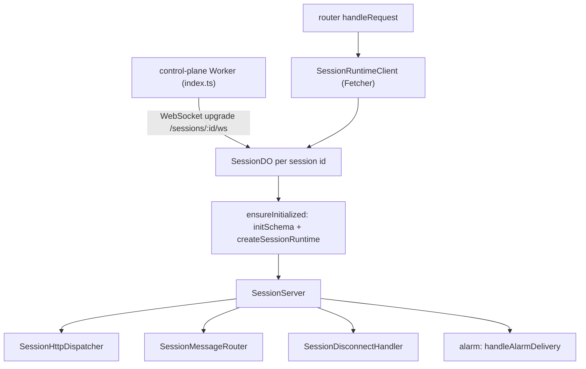
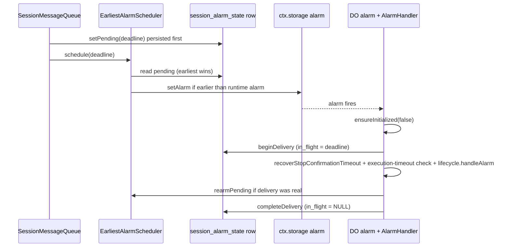

# Session Durable Object Runtime

Each Open-Inspect session id maps to exactly one `SessionDO` instance (`env.SESSION.idFromName(sessionId)`), and each instance owns the full runtime for that one session. The class itself is deliberately a thin Cloudflare adapter: it captures the platform handles (`ctx.storage.sql`, nullable `env.DB`), lazily builds the entire application graph once per activation, and forwards the five platform entry points — `fetch`, `webSocketMessage`, `webSocketClose`, `webSocketError`, `alarm` — to a platform-neutral `SessionServer`. All application wiring lives in `createSessionRuntime` (`session/components.ts`), which returns only the narrow surface the adapter needs: the server entry points, the session-scoped logger, alarm rehydration, and an `internals` record reserved for integration tests.

*Figure: the three paths into one session runtime — HTTP via the router-proxy, WebSocket upgrades forwarded from the Worker entrypoint, and the Durable Object alarm.*

## The adapter contract: lazy initialization with retry

`SessionDO`'s constructor is a composition-root input boundary: it reads `env.DB` once into a nullable field (defensive guards for a missing binding) and keeps `this.sql = ctx.storage.sql` — the DO-embedded SQLite that is deliberately separate from the global D1 database. The runtime is built lazily on first touch through a `runtime` getter that calls `ensureInitialized(rehydrateAlarm = true)`:

1. `initSchema(this.sql)` applies `SCHEMA_SQL`, pending `MIGRATIONS`, and `INDEXES_SQL`.
2. `createSessionRuntime({ ctx, sql, db }, env)` eagerly constructs the whole collaborator graph.
3. Only after the graph is fully built is `_runtime` published; the `do.init` log line is emitted, then `runtime.alarms.rehydrate()` re-arms any persisted alarm deadline on a background task.

The deliberate failure mode: if any step throws, `_runtime` stays null, so the activation is left uninitialized and the **next** event retries initialization. Misconfigured deployments fail every session request at this point — `createSessionRuntime` eagerly constructs both provider factories, and `createSandboxProviderFromEnv` (missing provider credentials) or `createSourceControlProviderFromEnv` (invalid `SCM_PROVIDER`, GitLab without a token, Bitbucket) throw on purpose, before any session state is written, instead of running degraded until the first spawn or PR operation. `alarm()` calls `ensureInitialized(false)` because that delivery *is* the alarm — re-arming it would be re-scheduling the same wake-up; `webSocketMessage`/`webSocketClose` callbacks delivered to a hibernation-restored instance reconstruct the runtime on first touch the same way.

## The composition root (`components.ts`)

`createSessionRuntime` builds the graph topologically in tiers, with exactly one session-scoped logger created before anything can capture one:

- **Logger identity is latched, not snapshotted.** The DO id does not become the public session id until `/internal/init` writes the row, so `createSessionScopedLogger` injects `session_id` per emit through `createLatchedPublicSessionIdResolver`: before init it resolves to the DO id; the moment the row exists it latches to `session_name || id` for the whole graph. One logger object serves every component; request-scoped children (from `SessionHttpDispatcher.requestLogger`) carry `trace_id`/`request_id` correlation without mutating the session logger.
- **Tier 1 repositories** over `SqlStorage` + `ctx.storage.transactionSync`: `SessionCoreRepository`, `MessageRepository` (which also owns `EventRepository` and `SessionAttachmentRepository` as collaborators), `ParticipantRepository`, `SandboxRepository` (warns on unmodelled statuses and owns encrypt-at-rest for access secrets), `ArtifactRepository`, `WsClientMappingRepository`, `EventRepository`, `SessionDiffStore`, and the `PersistedAlarmDeadlineStore`. Both encryption keys — `requireRepoSecretsEncryptionKey(env)` and `requireTokenEncryptionKey(env)` — are validated here so no path can persist a secret in plaintext.
- **Tier 2 sockets and alarms**: `SessionWebSocketManagerImpl` (the single owner of the Cloudflare WebSocket API), `createEarliestAlarmScheduler` over `ctx.storage`, and `ctx.setWebSocketAutoResponse` so the runtime answers `{"type":"ping"}` keepalives without waking the DO.
- **Tier 3+ services**: `SessionMessengerImpl` (broadcast fan-out plus sandbox command delivery), `UserEnvResolver`, `ParticipantService`, `CallbackNotificationService`, `SessionStatusService`, `SessionTitleService`, `SessionDiffService`, `SessionEventStream`, the `SandboxLifecycleManager` (built with the per-use-until-row-exists latched session id and `resolveExecutionTimeoutMs`), `SessionMessageQueue`, `PresenceService`, `MessageService`, the four sandbox-event family handlers behind `SessionSandboxEventProcessor`, `SandboxPushService`, `SessionSnapshotReader`, `SessionAccessReader`, `SessionConnectionAuthenticator`, and `createAlarmHandler`.
- **Tier 8 the internal HTTP handlers** are wired into `createSessionInternalRoutes` (transport wiring only); **Tier 9** assembles the `SessionServer` over `SessionHttpDispatcher`, `SessionMessageRouter`, and `SessionDisconnectHandler`.
- `SessionRuntime.internals` exposes a small `SessionComponents` record (sandbox repository, swappable `sourceControlProvider` cell, `userEnvResolver`, lifecycle manager, message queue, presence, sandbox event processor, push service, lifecycle handler) that only live-DO integration tests may reach; production code never reads it. The SCM provider is a local `let` read through a closure per call, so tests can substitute a stub after the init request has already built the graph — stubs must model the configured provider family because the provider *name* was captured at construction and passed by value to consumers.

## Platform entry points and the server stack

`SessionServer` (`session/server.ts`) is platform-neutral over generic `Connection`/`Client` types (its unit tests drive it with plain strings). It delegates:

| DO callback | Server method | Implementation |
|---|---|---|
| `fetch` | `onRequest` | `SessionHttpDispatcher.dispatch` |
| `webSocketMessage` | `onMessage` | `SessionMessageRouter.route` |
| `webSocketClose` | `onClose` | `SessionDisconnectHandler.handleClose` |
| `webSocketError` | `onError` | `SessionDisconnectHandler.handleError` |
| `alarm` | `onScheduledDeadline` | `handleAlarmDelivery(...)` |

### Internal HTTP dispatch

`SessionHttpDispatcher.dispatch` logs every request as `do.request` with method, path, status, `duration_ms`, `handler_ms`, and outcome. A request with an `Upgrade: websocket` header is routed to `handleWebSocketUpgrade` (the connection authenticator) and never counted as a route metric; every other request is matched against the exact `(method, path)` route table — internal paths are constants, matching is exact string equality, so the artifact-id query parameter rides in the URL search rather than the path. Matched handlers run with a request-scoped logger child that carries `x-trace-id`/`x-request-id` correlation headers forwarded by the router's `SessionRuntimeClient`. Unmatched routes return `404 Not Found`; a handler throw is rethrown (the platform surfaces a 500) but the metric is still recorded with `outcome: "error"`.

### The shared path constants

`SessionInternalPaths` in `session/contracts.ts` (init, state, snapshot, sandboxAccess, prompt, autofix, stop, sandboxEvent, sandboxError, createMediaArtifact, attachments, participants, events, artifacts, messages, createPr, pullRequestArtifactSnapshot, pullRequestsRefresh, wsToken, archive, unarchive, expireDraft, verifySandboxToken, openaiTokenRefresh, xaiTokenRefresh, scmCredentials, tunnelUrls, spawnContext, activePromptAuthor, childSummary, parentPrompt, updateTitle, cancel, childSessionUpdate, diffState, diffStore, diffFailure, diffResolveFile, diffRetry) is imported by both the control-plane router side and the DO route table — no caller hardcodes a path string, so the two sides cannot drift. `buildSessionInternalUrl` composes these constants onto the synthetic `http://internal` origin used for intra-worker fetches to the DO (e.g. status rollups to a parent session via `childSessionUpdate`, or the abandoned-draft sweep's `expireDraft`).

## WebSocket hub and hibernation

All Cloudflare WebSocket usage is centralized in `SessionWebSocketManagerImpl` (`session/websocket-manager.ts`). It is a registry, not a factory: the DO's connection authenticator builds `ClientInfo` and stores it here via `setClient`/`getClient`. Key mechanics:

- **Classification by tags**: client sockets are accepted with a `wsid:<id>` tag, sandbox sockets with `sandbox` plus `sid:<sandboxId>`. `classify(ws)` reads `ctx.getTags(ws)`, so post-hibernation the runtime can tell the two kinds apart without in-memory state.
- **Client auth timeout**: a client socket is closed with code `4008` if it has not sent a valid `subscribe` message within `WS_AUTH_TIMEOUT_MS = 30000` — unless it is synchronizing, holds an in-memory `ClientInfo`, or has a persisted `ws_client_mapping` row (`hasPersistedMapping`), which is what makes recovery after hibernation exempt.
- **Sandbox socket recovery**: `getSandboxSocket()` validates the persisted `sandbox.modal_sandbox_id` against the `sid:` tag while scanning `ctx.getWebSockets()`, closes sockets whose identity changed (1000, "Sandbox identity changed"), and refuses to re-adopt WebSockets when the sandbox row is in a terminal status (`stopped`, `failed`, `stale`) because a zombie socket can still report `OPEN` after hibernation while the DO was asleep mid-close-handshake.
- **Persisted client identity**: `completeClientSubscription` saves the `wsid` → participant/client mapping (`ws_client_mapping` table) once the snapshot handoff succeeds, so `getClientInfo` rebuilds `ClientInfo` from that row after hibernation; a lost mapping closes the socket with `4002` "Session expired, please reconnect".
- **Hibernation-level keepalive**: `ctx.setWebSocketAutoResponse` pairs `{"type":"ping"}` with `{"type":"pong"}` so the runtime answers pings without waking the DO.

### Connection admission (`connection-authenticator.ts`)

Sandbox upgrades are authenticated by `Authorization: Bearer <token>` plus `X-Sandbox-ID`, validated against the DO's `sandbox` row: wrong id → 403, invalid token → 401, token hashing is a non-storage await so a cancel/archive can land while the request is suspended and the session-status gate is deliberately re-read *after* authentication; a terminal session rejects with 410 "Session is terminal", and reconnect-blocked sandbox statuses reject with 410 "Sandbox is stopped". A successful sandbox connect resets the spawning flag (`lifecycleManager.onSandboxConnected`), marks the sandbox `ready`, broadcasts `sandbox_status`, schedules the inactivity check, and kicks `processMessageQueue` in the background so pending prompts dispatch immediately.

Client subscription (`handleSubscribe`) validates the ws-token hash against `participants.ws_auth_token` (already-hashed at issuance), rejects tokens older than `WS_TOKEN_TTL_MS` (24 h) with close code 4001, and completes the **snapshot-to-stream handoff** in a deliberately non-async method: read the snapshot, send `subscribed`, register the client, and persist the ws mapping all happen with no await between them, so no concurrent event can interleave. Presence is participant-scoped: `projectConnectedParticipants` dedupes multiple tabs into one participant record per identity, taking any `active` status and the most recent `lastSeen`.

### Message routing (`message-router.ts`)

`sandboxEventSchema`-validated sandbox frames go to `processSandboxEvent`; `clientMessageSchema` frames go through the client command facade. Binary frames are ignored (the wire protocol is JSON text). Before authentication only `ping` and `subscribe` are valid. `fetch_history` is rate-limited to one page per 200 ms per connection and returns `history_page` slices from the event stream. The router's `satisfies never` default arm makes the shared `ClientMessage` union exhaustive: adding a variant without a handler here is a compile error. Invalid prompts are answered with a correlated `INVALID_PROMPT` error carrying the parsed `clientRequestId`; other invalid frames get `INVALID_MESSAGE`.

### Sandbox event processing

`SessionSandboxEventProcessor.processSandboxEvent` builds one per-event context (one clock reading, one message attribution: the event's own `messageId`, else the current processing message) and dispatches to family handlers: streaming (`token`, `tool_call`, `step_start`/`step_finish`, `context_compacted`, timeline-observer events), artifacts (`artifact`), execution (`execution_complete`), runtime (`heartbeat`, `ready`, `git_sync`, `session_title`), and push (`push_complete`/`push_error` also settle the `SandboxPushService` promise). The five critical types (`execution_complete`, `error`, `snapshot_ready`, `push_complete`, `push_error`) get an `ack` back to the sandbox **after** their handler finishes; family handlers never see `ackId`.

### Disconnect policy (`disconnect-handler.ts`)

A sandbox close schedules a reconnect check through the lifecycle manager unless a newer sandbox socket already replaced this one (the close is then ignored) or the sandbox status blocks reconnection. Client closes remove the `ClientInfo` and broadcast `presence_leave` only when no other socket of that participant remains (presence is participant-scoped). The peer close is always reciprocated, including when the reconnect scheduling fails.

## Message queue and the sandbox data plane

`SessionMessageQueue` is the session's execution engine: it owns prompt admission, the one-processing invariant, dispatch to the sandbox, stop/cancel semantics, and deadline re-arming. Control flow for a web prompt:

1. `handlePromptMessage` validates the session is promptable, resolves/creates the participant, and calls `enqueuePromptCore`: the idempotency lookup, capacity check, and insert run in **one synchronous turn** so concurrent WebSocket requests cannot race between them. `client_request_id` deduplication compares both the author and `request_fingerprint` (a hash of participant + content + model + reasoning effort + attachment ids); a stale id with different content is a `PROMPT_REQUEST_CONFLICT`. `MAX_UNFINISHED_PROMPTS` caps the pending + processing count (`PROMPT_QUEUE_FULL`).
2. `processMessageQueue` first checks for a message awaiting stop confirmation (recovering it when the deadline passed, else re-arming the alarm), then bails if anything is already processing, then resolves the next pending message. With no sandbox socket, the message stays `pending` and the sandbox spawns in the background (`backgroundTasks.submit`), because a snapshot restore can take tens of seconds and awaiting it would hold the prompt HTTP response past bot callers' timeouts.
3. With a live socket, `startMessageProcessing` claims the message with a compare-and-set `UPDATE ... WHERE status = 'pending' AND NOT EXISTS (SELECT 1 WHERE status = 'processing') RETURNING id` inside a transaction, inserts the canonical `user_message` timeline event, sends the `SandboxCommand` (model, reasoning effort, author git identity), and arms the execution-timeout deadline through `alarmScheduler.schedule`.
4. A send failure reverts the claim (`updateMessageToPending`), terminates the unresponsive sandbox, and resumes the queue. After `execution_complete`, the execution handler reconciles status (`active` if more prompts are queued, else `completed`/`failed`), terminates the sandbox and resumes the queue when the sandbox was terminated, broadcasts `processing_status`, and projects terminal messages.

Stop flows: `stopExecution` marks the processing message failed, upserts a synthetic `execution_complete` broadcast so clients flush buffered tokens, sets `stop_confirmation_deadline = now + STOP_CONFIRMATION_TIMEOUT_MS (15 s)` and arms it, then forwards `{"type":"stop"}` to the sandbox; a sandbox that does not confirm within the deadline is terminated. `cancelExecution` (session life-cycle cancel) fails every unfinished message synchronously under the status transition. `failStuckProcessingMessage` deliberately does **not** stop the sandbox or re-dispatch, to avoid races where a new prompt reaches a sandbox being shut down. Autofix admission (`enqueueAutofix`/`lookupAutofix`) rides the same queue as a `github`-source message with the `autofix_feedback_key`/`autofix_pr_key` idempotency and 24 h attempt window.

## Event stream and read models

`SessionEventStream` serves the timeline: `getReplay` returns the latest 500 events (excluding `heartbeat`) for the `subscribed` snapshot, `getHistoryPage` pages backwards from a cursor, and `listEvents` serves the HTTP `GET /internal/events` API with `{type, messageId, limit}` filters. Events carry a monotonic `timeline_sequence` (assigned by the repository as `MAX + 1`); `token` and `execution_complete` events **upsert** on the deterministic id `token:<messageId>` / `execution_complete:<messageId>` while keeping a fresh `timeline_sequence`, so streams are idempotent. Malformed persisted events are skipped rather than breaking the timeline.

`SessionSnapshotReader.readSessionSnapshot` runs inside `ctx.storage.transactionSync` so one snapshot is a consistent cut: session row, sandbox row, artifact list, timeline replay, prompt queue, and last spawn error. `SessionStatusService.transition` fans every status change out to three places — connected clients (`session_status` broadcast), the D1 session index (`updateStatus` with a monotonic `updated_at + 1` guard, plus child-admission finalization when active, plus terminal metrics), and the parent session's DO via a backgrounded `POST /internal/child-session-update`. `reconcileAfterExecution` settles status from queue depth and terminal-message outcome; the idle status with no messages at all deliberately falls back to `created` so the abandoned-draft sweep can reclaim an empty session.

## Alarm scheduling: one slot, double persistence

Every session runtime shares the Durable Object's **single alarm slot** for every deadline — execution timeouts, stop-confirmation deadlines, lifecycle inactivity checks, disconnect checks — so `createEarliestAlarmScheduler` coordinates callers over two stores:

- `PersistedAlarmDeadlineStore` (a singleton row in `session_alarm_state`): the authoritative `pending_deadline` survives hibernation/eviction, and `in_flight_deadline` tracks the deadline currently being delivered so a retried delivery cannot acknowledge a replacement deadline.
- `AlarmScheduleStore` (`ctx.storage`): the platform alarm itself.

All mutations are serialized through one promise chain; the pending deadline is persisted **before** the runtime alarm is touched, so a failed runtime update can be repaired on rehydration. `schedule` keeps the earliest deadline (`next === persisted || next < runtime`), `cancel` clears both stores, `rehydrate` reasserts the earliest persisted deadline after a cold start, and `rearmPending` reasserts after an in-flight delivery. `handleAlarmDelivery` marks the in-flight deadline, runs the handler, re-arms only if the delivery was real (not cancelled), then completes delivery — retries therefore re-run the same deadline, and a cancel racing a delivery short-circuits it.

*Figure: persisted-deadline-first scheduling shares one alarm slot without losing deadlines across hibernation.*

The alarm handler itself (`createAlarmHandler`) orders three responsibilities: recover an expired stop confirmation, enforce the execution time-out (fail a message stuck in `processing` past `getExecutionTimeoutMs`; when not yet timed out, **reassert** that message's deadline before lifecycle handling schedules its next check, because an earlier lifecycle alarm may have consumed the slot), then delegate to `lifecycleManager.handleAlarm` — `sandbox_terminated` results resume the message queue, and any non-`no_action` lifecycle outcome also fails a stuck processing message as defense-in-depth.

## Focused tests

- `session/server.test.ts` — platform-neutral server stack driven with plain string connections: dispatcher routing, message classification, disconnect policy, alarming.
- `session/alarm/scheduler.test.ts` — persisted-deadline-first ordering, earliest-wins arbitration against the runtime alarm, cancellation vs delivery races; `session/alarm/handler.test.ts` — execution-timeout and lifecycle ordering.
- `session/websocket-manager.test.ts` — classification tags, sandbox identity validation during hibernation recovery, terminal-status socket refusal, auth timeout exemptions.
- `session/message-queue.test.ts` (58 KB) — the queue contract end to end: idempotency conflicts, capacity, dispatch with/without sandbox, stop confirmation, autofix admission, stuck processing.
- `session/sandbox-events/processor.test.ts` — family dispatch, per-event context, ack-before-next-event ordering for critical events.
- `session/schema.test.ts` — SCHEMA_SQL/MIGRATIONS convergence (the shared table constants), `idx_messages_one_processing` enforcement.
- `session/http/routes.test.ts` — the exact `(method, path)` table matches `SessionInternalPaths` 1:1.
- `session/initialize.test.ts` — the D1-first two-step create and compensation before `/internal/init` reaches the DO.
