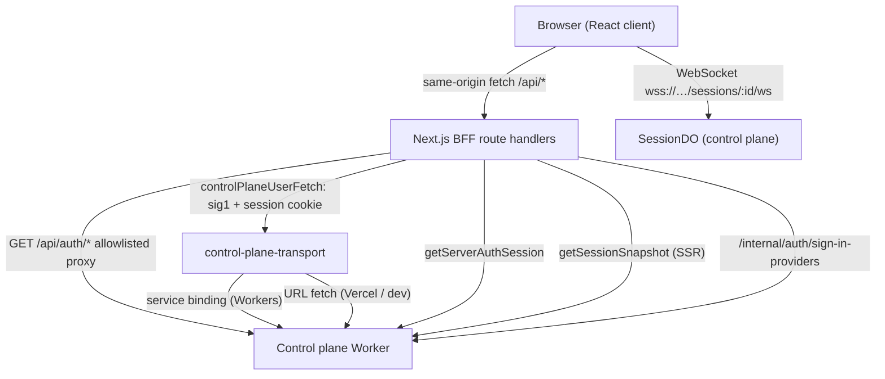

# Web Client (Next.js)

The web client (`packages/web`) is the browser-facing half of Open-Inspect: a Next.js 16 App Router application that serves the session dashboard, the live session view, the settings surfaces, and a thin server-side BFF (backend-for-frontend) that stands between the browser and the control plane. It is deliberately **framework-free at the trust boundary**: it does not hold OAuth provider credentials, repository credentials, or admission policy — the control plane is the sole sign-in-provider authority, holds the GitHub App / SCM credentials, and enforces access. The web service authenticates itself to the control plane with a per-service `sig1` signature (`SERVICE_AUTH_SECRET`), carries the browser's opaque Better Auth session cookie, and proxies almost all API traffic to `/openwiki/architecture/control-plane.md`.

It can be deployed to Vercel (`next start`) or to Cloudflare Workers via OpenNext (`opennextjs-cloudflare build && deploy`); the deployment target changes only the transport used to reach the control plane, never the proxy or auth protocol.

## Responsibilities

- **Session dashboard and session view** — list/inbox rendering (sidebar, command menu, home page) and the full session workspace: timeline, prompt composer, sandbox terminal, artifacts (PRs, screenshots, video), participant presence, diffs/changes panel, read state, and archive/rename actions.
- **Live streaming** — a WebSocket connection per open session, driven by `useSessionSocket` and its four layers (transport, event-log buffering, view-state reducer, SWR revalidation).
- **Settings surfaces** — a category-paged `/settings` surface (appearance, keyboard shortcuts, models, provider accounts, skills, environments, secrets, SCM, sandbox, images, integrations, MCP servers, data controls), where almost every panel reads and mutates control-plane resources through a generic JSON proxy.
- **API proxy routes** (`/api/*`) — the BFF: authenticate the browser session against the control plane, sign each upstream request with the web `sig1` secret, forward a narrowed request/response surface, and return a private, no-store response.
- **Browser auth proxy** — an exact allowlist of Better Auth routes (`/api/auth/...`) forwarded transparently so OAuth flows terminate on the control plane while the browser only ever talks to the web origin.
- **Correlation middleware** — every `/api/*` request gets `x-trace-id`/`x-request-id` (and an internal `x-open-inspect-request-id`) so a browser action can be traced across the web and control-plane logs.

## Entrypoints

### Pages

| Route | Implementation | Role |
|---|---|---|
| `/` | `app/(app)/(sidebar)/page.tsx` | New-session launch page: target picker (single repo, environment, ad-hoc multi-repo, or none), model/reasoning-effort selection, provider-account routing selections, skill selection with resolution preview, attachment staging, and a warm-draft session that is created asynchronously while the user is still typing |
| `/session/[id]` | `app/(app)/(sidebar)/session/[id]/layout.tsx` + `page.tsx` | Live session view |
| `/settings` | `app/(app)/settings/page.tsx` | Category-paged settings (tab-driven, mobile list/detail with history-state sync) |
| `/settings/integrations/[id]` | `app/(app)/settings/integrations/[id]/page.tsx` | Third-party integration settings |
| `/analytics` | `app/(app)/(sidebar)/analytics/page.tsx` | Team analytics (sessions, PR funnel, cost) fed by `/api/analytics/*` |
| `/automations` (+ `new`, `[id]`, `[id]/edit`, `templates`) | `app/(app)/(sidebar)/automations/*` | Scheduled/triggered automation management |
| `/login` | `app/login/page.tsx` | Resolves the enabled sign-in provider set from the control plane at request time (`/internal/auth/sign-in-providers`), then renders provider buttons; redirects if already authenticated |
| `/access-denied` | `app/access-denied/page.tsx` | Render for the Better Auth `AccessDenied`/`access_denied` error query |

The `/session/[id]` layout is the server-rendered entry point: `getSessionSnapshot(id)` (a server-only `controlPlaneUserFetch` to `/sessions/:id` parsed with `sessionSnapshotSchema`) runs in a `Suspense` boundary, redirects to `/login` on 401, `notFound()` on 404, and seeds the client `SessionSnapshotProvider`. The page hydrates that snapshot into `useSessionSocket`, which then switches to live WebSocket state.

### BFF route surface

All application `/api/*` routes live under `app/api` and share the same spine: `getServerAuthSession()` (or `controlPlaneUserFetch`'s own cookie check), an optional explicit field-pick of the request body, a signed forward to the control plane, and `Cache-Control: private, no-store` on the way back. Representative groups:

- `/api/sessions` (GET list with allow-listed query params `status`/`limit`/`offset`; POST create with an explicitly picked body — repo/environment/repositories target fields, model, reasoning effort, skill and provider selections), `/api/sessions/inbox` (category/cursor/mine), `/api/sessions/[id]/*`: `prompt`, `archive`, `unarchive`, `title`, `read-state`, `sandbox-access`, `ws-token`, `attachments`, `media/[artifactId]`, `diff` (+ `diff/retry`, `diff/[revisionId]/files/[fileId]`), `pull-requests/refresh`, `children`, `participant-profiles`, `skills`.
- `/api/repos` (+ `/repos/[owner]/[name]/branches`, `/repos/[owner]/[name]/secrets`), `/api/secrets` (global secrets), repo-scoped secrets under `/api/repos/.../secrets/[key]` and `/api/secrets/[key]`.
- `/api/auth/[...auth]` — the single catch-all route whose handlers are `proxyBrowserAuthRequest` (see [Browser auth proxy](#browser-auth-proxy)).
- Settings resources — `/api/skills`, `/api/skill-profiles`, `/api/keyboard-shortcuts`, `/api/model-preferences`, `/api/model-provider-accounts` (+ device-authorizations, verify/enable/disable/reconnect), `/api/model-provider-account-defaults`, `/api/scm-settings`, `/api/integration-settings`, `/api/integrations/slack/channels`, `/api/environments`, `/api/image-builds`, `/api/mcp-servers`, `/api/automations`, `/api/commit-signing`, `/api/analytics/*` — almost all generated by the two generic proxies described below.
- `/api/sessions/[id]/prompt` is notable: the interactive session view sends its prompts **over the WebSocket**, and this HTTP route exists for the pre-session composer on the home page, which fires a prompt at a warm session before navigating.

Three generic helpers generate most routes:

- `settingsProxy
` (`lib/settings-proxy.ts`) — creates GET/POST/PATCH/PUT/DELETE handlers for an authenticated control-plane resource: reads the browser session cookie, caps JSON bodies at `SETTINGS_PROXY_MAX_BODY_BYTES` (4 MiB), forwards `If-Match` (the revision CAS token) unchanged, and relays JSON with `etag`/`retry-after`/`x-request-id` preserved.
- `controlPlaneJsonGetProxy` (`lib/control-plane-json-proxy.ts`) — GET-only variant for analytics endpoints with explicit query-param allow lists.
- `providerAccountSettingsProxy` (`lib/provider-account-proxy.ts`) — wraps `settingsProxy` with pattern validation on provider-account ids (rejects unsafe segment values before they reach the control plane).

## The BFF trust boundary

The web app is a **framework-free BFF**: it signs requests with its own `sig1` secret, forwards only Better Auth's opaque session cookie, and does not hold OAuth provider credentials or admission policy.

- `controlPlaneUserFetch(path, options)` (`lib/control-plane.ts`) is the primary server→control-plane call. It serializes **only** the browser session cookie (see below), attaches the request correlation (trace/request id), and delegates to `dispatchWebServiceRequest` — missing session cookie yields a fast 401 without any upstream call.
- `dispatchWebServiceRequest` (`lib/control-plane-service.ts`) is the signing boundary: it computes the body hash, **strips caller-supplied `Authorization`, actor/service/signature headers** (credentials may only be minted at this boundary), builds fresh sig1 headers over `service: "web"` + `SERVICE_AUTH_SECRET` + method + URL + body hash (plus trace id), and dispatches through `dispatchControlPlaneFetch`.
- `dispatchControlPlaneFetch` (`lib/control-plane-transport.ts`) resolves `CONTROL_PLANE_URL` (throws if unset) and routes the fully-built request through the Cloudflare **service binding** `CONTROL_PLANE_WORKER` on Workers (avoiding worker-to-worker fetch restriction 1042) or plain `fetch` on Vercel / local dev. In development it always uses URL fetch to avoid a stub binding. **The URL used for dispatch is always the URL that was signed** because the caller builds the URL exactly once. Every fetch is bounded by a 15 s timeout.
- `serializeBrowserSessionCookies` (`lib/browser-session-cookie.ts`) picks only cookies matching `(?:__Secure-openinspect|openinspect).session_token(?:.[0-9]+)?` — OAuth transaction cookies and unrelated browser state must not become credentials on control-plane resource requests; duplicate or malformed values throw.
- `getServerAuthSession()` (`lib/server-auth-session.ts`) is the server-side auth seam used by route handlers: it forwards the session cookie to the control plane's `/api/auth/get-session` through `dispatchBrowserAuthRequest`, validates the response with `browserAuthSessionResponseSchema` (canonical user id, session.userId === user.id), and returns `null` on 401. Failures that are not a clean 401 throw `AuthenticationUnavailableError`, which the `/login` page and `AppAuthBoundary` render as "sign-in temporarily unavailable" instead of a redirect loop.
- The client side (`lib/auth-session.tsx`, `useAuthSession`) mirrors the same contract over SWR: fetches `/api/auth/get-session` through `browserApiFetch`, validates with the same schema, and distinguishes `authenticated` / `loading` / `unauthenticated` / `unavailable`. `signIn(provider)` POSTs `/api/auth/sign-in/social` with `disableRedirect: true`, requires an `https:` redirect URL, and `location.assign`s to it; `signOut()` POSTs `/api/auth/sign-out` and nulls the SWR cache.
- `browserApiFetch` (`lib/browser-api-fetch.ts`) is the client-side boundary: a typed `BrowserApiPath` (`/api/${string}`) with `mode: "same-origin"` + `credentials: "same-origin"` so the browser can never dispatch a cross-origin application call.
- `AppAuthBoundary` (`components/app-auth-boundary.tsx`) wraps the whole `/app` layout group: loading spinner while the session resolves, a sign-in gate when unauthenticated, and an "authentication unavailable" screen when the boundary itself fails.

### Browser auth proxy

`lib/browser-auth-proxy.ts` implements the OAuth/Better Auth forwarding surface. The route set is **shared with the control plane** (`packages/shared/src/browser-auth-routes.ts` declares `BROWSER_AUTH_PROXY_ROUTES` and `isBrowserAuthProxyRoute`) so neither side can silently widen or narrow the contract — exactly six routes: `POST /api/auth/sign-in/social`, `GET /api/auth/callback/github`, `GET /api/auth/callback/google`, `GET /api/auth/get-session`, `POST /api/auth/sign-out`, `GET /api/auth/error`.

- `proxyBrowserAuthRequest(request)` (the `/api/auth/[...auth]` handler) forwards only an explicit request-header allow list (`Accept`, `Accept-Language`, `Content-Type`, `Cookie`, `Origin`, `User-Agent`), adds the trusted client IP as `X-OpenInspect-Client-IP` (`X-Vercel-Forwarded-For` on Vercel, `CF-Connecting-IP` on Cloudflare), signs with `service: "web"`, and relays with `redirect: "manual"` / `cache: "no-store"`.
- `dispatchBrowserAuthRequest` is the same proxy for server-side callers that have no incoming URL (e.g. `getServerAuthSession`); both reject anything outside the allowlist with 404.
- Response headers are copied minus hop-by-hop headers and `content-encoding`/`content-length` (the body is decoded by the platform), **Set-Cookie is preserved** so OAuth session cookies flow back to the browser, and `Cache-Control: no-store` + `Pragma: no-cache` are forced.

Origin-bound rule: a production control plane cannot authenticate a localhost web process — `WEB_APP_URL` (the control plane's configured callback origin) must match the web origin that browsers actually use, because OAuth callbacks and cookie scoping are origin-bound. Local development runs both sides on localhost.

## Middleware correlation

`middleware.ts` is a Next.js Edge middleware matching `/api/:path*`. For each API request it resolves the trace id (preserving a valid inbound `x-trace-id`, minting a UUID otherwise), creates a fresh 8-character request id (`x-request-id`), stamps `x-open-inspect-request-id` (the internal id read back by `getRequestCorrelation` in `lib/request-context.ts`), and applies `x-trace-id`/`x-request-id` to both the request headers forwarded to route handlers and the response headers. Route handlers then pass `traceId`/`correlationFields` into each signed control-plane call, so one browser action carries a single trace across web + control-plane + session-DO logs.

## The WebSocket session channel

The control plane is the WebSocket authority: the client never opens a raw socket with the user cookie. Instead:

1. `useSessionTransport` POSTs `/api/sessions/${id}/ws-token` (BFF checks the browser session, control plane mints a short-lived ws-token) and opens `wss://<NEXT_PUBLIC_WS_URL>/sessions/${id}/ws`.
2. On open it sends `{ type: "subscribe", token, clientId }`; the control-plane Worker upgrades the request and forwards the socket to the session's `SessionDO`, which authenticates the token per-socket (`/openwiki/architecture/session-do.md`).
3. Every server frame is validated against `serverMessageSchema` (shared zod union in `packages/shared`); an unparseable frame closes the socket with close code 4004.

`NEXT_PUBLIC_WS_URL` is a build-time inline: the module reads `process.env.NEXT_PUBLIC_WS_URL || "ws://localhost:8787"` at module scope, so the production value must be present during `next build`.

### Transport layer (`hooks/use-session-transport.ts`)

Owns the socket lifecycle: token fetch (cached in a ref, refetched on 401-close or manual reconnect), the subscribe handshake, a 30 s `{ type: "ping" }` keepalive (the DO answers via `setWebSocketAutoResponse` without waking), and close-code policy:

- `4001` auth required → `authError`, token cleared so the next connect fetches a fresh one.
- `4002` session expired (e.g. after server hibernation) → `connectionError`, user must reconnect.
- `4004` invalid message, or any unclean close → exponential backoff (`1000ms * 2^n`, capped 30 s) for up to `MAX_RECONNECT_ATTEMPTS = 5`, then give up.
- A clean close (`wasClean`) with no special code → no retry.

Reconnection is race-safe via connect epochs: `reconnect()`/unmount bump `connectEpochRef` so a `connect()` suspended on its token fetch abandons instead of opening a second socket, and stale socket close events are ignored by an identity guard (`wsRef.current !== ws`). `markHealthy()` (called once the subscription is ready) resets the attempt counter so steady-state network blips start from a fresh budget.

### Protocol layer (`hooks/use-session-socket.ts` + `lib/session-socket/*`)

`useSessionSocket(sessionId, initialSnapshot)` composes four layers:

- **Reducer** (`lib/session-socket/reducer.ts`) — a pure `sessionSocketReducer` seeded from the snapshot via `createSessionSocketState`. `subscribed` (the first server frame) replaces all local artifacts/events with the replay snapshot — reconnect resyncs instead of merging stale state — and clears `loadingHistory` so a dropped `fetch_history` can never block `loadOlderEvents`. Server messages project onto view state: artifacts upsert by id, `session_branch` keeps `repositories[].branchName` and the scalar `branchName` in sync (multi-repo updates must name their member; unscoped updates are ignored), sandbox lifecycle messages clear runtime access URLs, and `sandbox_error`/spawn error populate `sandboxError`. `socket_closed` drops `ready`/presence/participants.
- **Event log** (`lib/session-socket/event-log.ts`) — streaming token events arrive with the **full accumulated text** for a segment, so live ingestion buffers the latest token in `pendingTextRef` (avoiding per-token re-renders) and emits the final text once on `execution_complete`/`context_compacted`; replay collapses token events per compaction-delimited segment.
- **Correlated request promises** — `sendPrompt`/`cancelPrompt` register a `clientRequestId` and await the matching `prompt_queued`/`prompt_cancelled`/`error` frame (15 s ack timeout, 5 s subscription wait), settling `rejected`/`disconnected`/`timeout` failures. Only one prompt may await acknowledgement at a time. The home page also uses `promptRequestSignature` (`lib/prompt-request-id.ts`) so a retry after a timeout reuses the same client request id rather than double-queuing.
- **SWR revalidation** (`lib/session-socket/swr-revalidation.ts`) — the only place the hook touches the SWR cache: per message it decides which caches must refetch (sidebar session list + inbox for status/title/PR artifacts, children list and diff on their messages, inbox on execution completion). PR artifacts are the only artifact kind that revalidates the session list; media artifacts arrive at high frequency and cannot change the list.

Rendering layers above the hook: `SessionTimeline` (virtualized timeline built by `lib/timeline-items.ts` with tool-call grouping, task/work grouping, dedupe, and replay-correct rendering of pending messages), `SessionPromptComposer` + `usePromptInput` (submission, typing indicator with 300 ms debounce, retry identity, stop execution preserving partial text), `QueuedPromptStack`, `SessionRightSidebar` and mobile overlay (presence, artifacts, terminal), `SessionChangesPanel` (diff manifest + per-file patch streaming from `lib/session-diffs.ts`), `MediaLightbox` (screenshots/video), read-state marking (`lib/session-read-state.ts` patches `/read-state` and reconciles the session-list cache). Sandbox access URLs are not part of the session snapshot (passwords/tokens are strip-secreted); `useSandboxAccess` fetches `/api/sessions/[id]/sandbox-access` only when `sandboxStatus === "ready"` and clears it as soon as spawning/error/stopped/stale is observed.

## State and lifecycle

- **Server state is the authority.** The session snapshot and every `subscribed` replay come from the control plane; the client is a projection. Multiplayer drops out of the architecture: everyone sees the same events because the DO broadcasts and reconnects resync.
- **The hook rehydration contract**: `SessionLayout` (RSC) fetches the snapshot server-side and allows redirect/notFound to resolve against an authenticated session before any client state exists; the client page then hydrates `useSessionSocket` with the same snapshot.
- **Warm-draft sessions** (`hooks/use-warm-draft-session.ts` + `lib/warm-session.ts`): the home page creates the session via `POST /api/sessions` as soon as a launchable target + non-empty prompt/attachment is present, keys the creation on a canonicalized request identity (aborting/retiring superseded drafts through `/archive`), and routes the first prompt to it before navigation.
- **Read state** is optimistic and reconciled: `markMessageRead`/`markLatestMessageRead` PATCH `/read-state`; `reconcileSessionReadState` mutates the session-list cache in place; permanent failures (4xx) stop retrying, transient failures retry.
- **Rename** (`hooks/use-session-rename.ts`) serializes optimistic updates per session, publishes optimistic titles to all mounted consumers (module-level per-session owner map), and on settle updates both the session-list and inbox cache families atomically.

## Configuration and operations

Environment (`packages/web/.env.example`, Terraform-generated in production):

| Variable | Purpose |
|---|---|
| `CONTROL_PLANE_URL` | Control-plane base URL for BFF fetches (used by `getControlPlaneUrl`, throws if unset) |
| `NEXT_PUBLIC_WS_URL` | WebSocket origin; **build-time inlined** into the client bundle |
| `SERVICE_AUTH_SECRET` | The web service's `sig1` signing secret; must match the control plane's `SERVICE_AUTH_SECRET_WEB` binding (Terraform generates it — do not mint your own against an existing backend) |
| `NEXT_PUBLIC_APP_NAME`, `NEXT_PUBLIC_APP_ICON_URL` | Branding (inlined at build) |
| `NEXT_PUBLIC_SANDBOX_PROVIDER` / `SANDBOX_PROVIDER` | Which sandbox backend the UI renders/expects; gates repo-image features via `supportsRepoImages()` |
| `LOG_LEVEL` | Structured logger level (`lib/logger.ts`, service name `web`) |

Deployment: `web_platform = "vercel"` (plain Next) or `"cloudflare"` (OpenNext; `wrangler.toml` declares the `CONTROL_PLANE_WORKER` service binding, `compatibility_flags = ["nodejs_compat", "global_fetch_strictly_public"]`). The control-plane callback URLs must point at the web origin (`/api/auth/callback/github`, `/api/auth/callback/google`), and the GitHub App must allow installation on any account ("Only on this account" causes redirect loops for users outside that account).

Failure semantics worth knowing:

- Missing `SERVICE_AUTH_SECRET` throws (`"SERVICE_AUTH_SECRET not configured"`) rather than sending unsigned requests.
- Missing browser session cookie short-circuits with 401 before any upstream call, and logs `auth.user_session_missing`.
- `AuthenticationUnavailableError` renders a degraded "try again" page instead of looping redirects.
- Control-plane fetch failure is logged (`control_plane.fetch_failed`) and rethrown; most route handlers convert it to a 500 JSON body.
- `WS_URL` falls back to `ws://localhost:8787` for local dev; a stale/mismatched production `NEXT_PUBLIC_WS_URL` produces a browser-side connection failure with no server error.

## Focused tests

The suite (Vitest, co-located `*.test.ts(x)`, jsdom where hooks render) pins the trust boundary and the streaming contract:

- `lib/control-plane.test.ts` — `controlPlaneUserFetch` drops caller-controlled identity headers, forwards only the session cookie, signs with `service: web`, preserves correlation, and 401s without a session cookie.
- `lib/browser-auth-proxy.test.ts` — allowlist enforcement, header narrowing, sig1 verification over the exact dispatched URL/body, Set-Cookie preservation, trusted client-IP selection per platform.
- `middleware.test.ts` — inbound trace preservation/validation, fresh 8-char request ids.
- `hooks/use-session-transport.test.tsx` and `hooks/use-session-socket.test.tsx` — FakeWebSocket-driven: subscribe handshake, close-code policy, backoff caps, epoch invalidation, prompt ack correlation, token-event buffering, snapshot-replacement on `subscribed`, SWR revalidation keys.
- `lib/session-socket/reducer.test.ts`, `event-log.test.ts`, `swr-revalidation.test.ts` — pure projection/policy tests including multi-repo branch updates and PR-only list revalidation.
- Route tests: `app/api/sessions/route.test.ts`, `attachments/route.test.ts`, `read-state/route.test.ts`, `sandbox-access/route.test.ts`, `provider-account-routes.test.ts`, `settings-proxy.test.ts`, and page tests (`page.test.tsx`, `settings/page.test.tsx`) for render/auth-gating behavior.
- `lib/session-list.test.ts`, `session-inbox-api.test.ts`, `session-diffs.test.ts`, `timeline-items.test.ts` — cache-shape transforms and timeline construction are extracted into pure functions precisely so they can be tested without rendering.

## Related pages

- [Control Plane (Cloudflare Workers)](/openwiki/architecture/control-plane.md) — the authority the BFF proxies to; sig1 verification, route policies, ws-token issuance.
- [Session Durable Object Runtime](/openwiki/architecture/session-do.md) — the WebSocket hub and `subscribed`/`sandbox_event`/`presence_*` producer.
- [System Architecture Overview](/openwiki/architecture/overview.md) — three-tier topology and the canonical prompt/event flow.
- [Persistence: D1, DO SQLite, R2, KV](/openwiki/architecture/persistence.md) — where sessions, secrets, and media live upstream.
