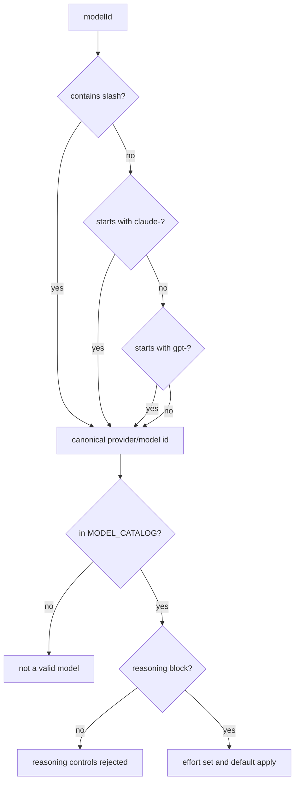
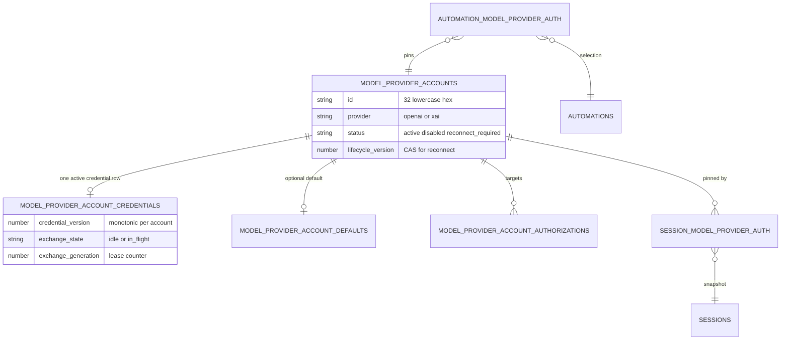
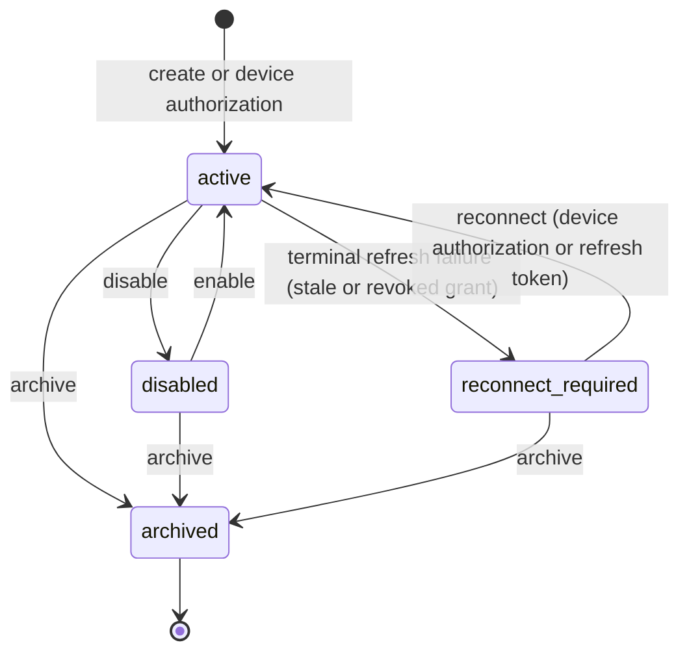
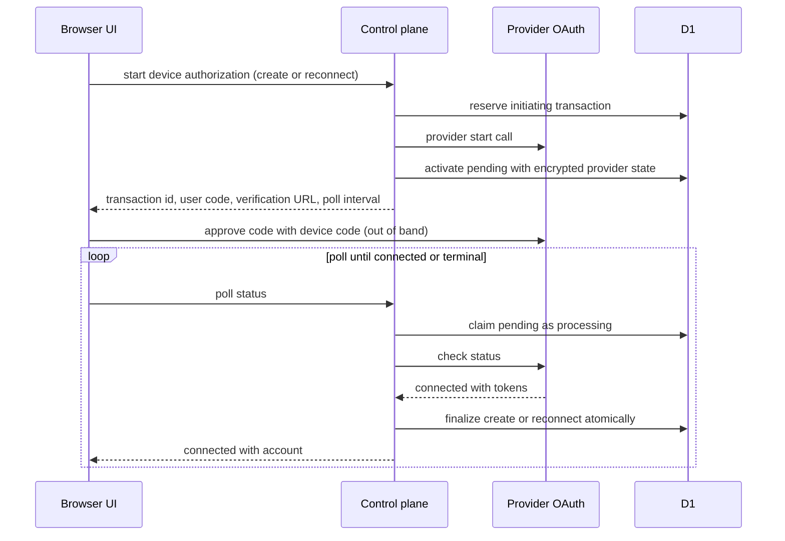
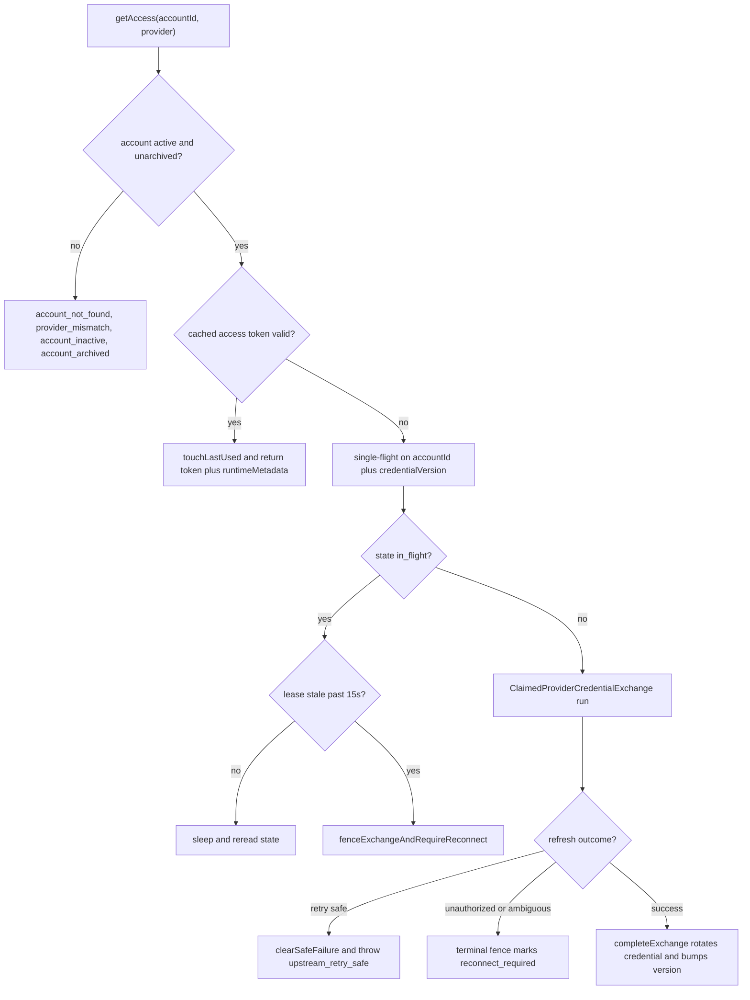
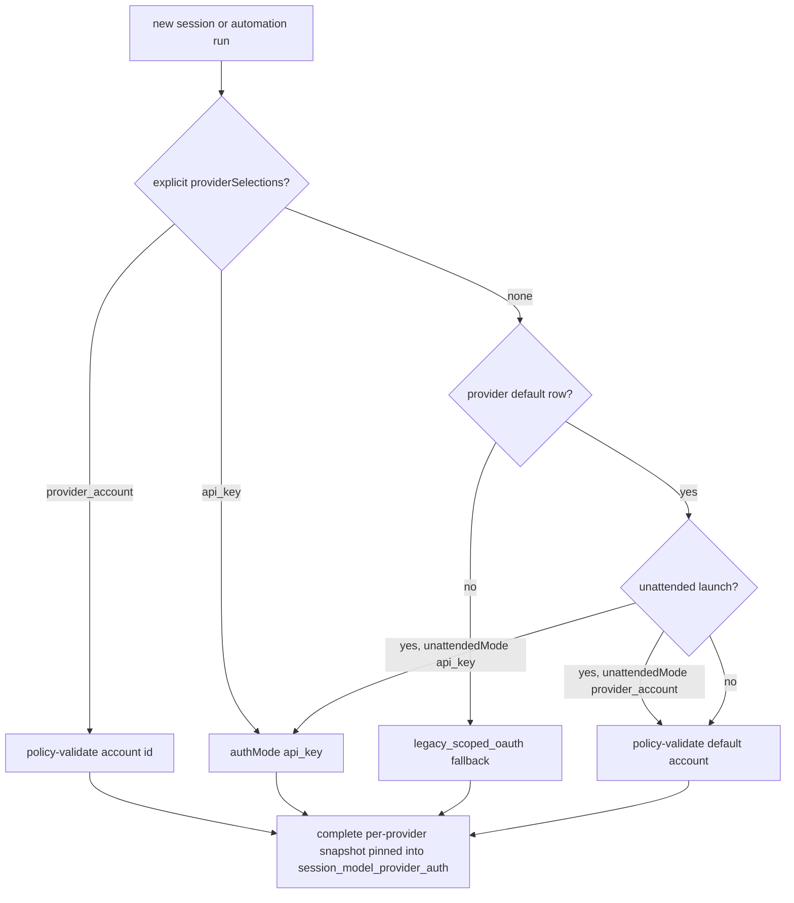
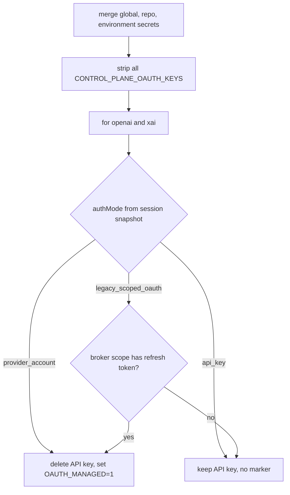
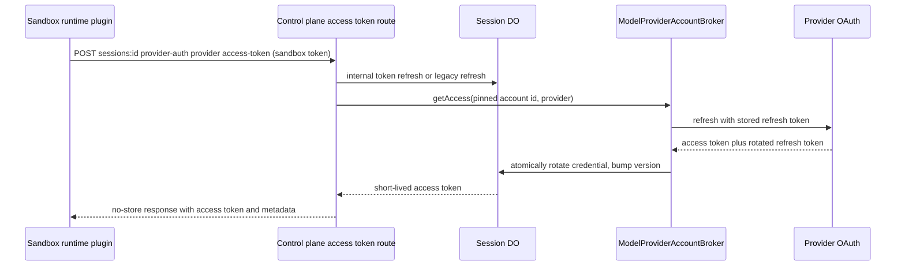

# Models and Provider Accounts

Open-Inspect exposes a small shared model catalog and two kinds of authentication: ordinary API-key
models (Anthropic, OpenCode Zen, Z.AI, DeepSeek) and subscription-backed "provider accounts" for
OpenAI ChatGPT and xAI SuperGrok. Provider accounts are installation-wide, single-tenant resources
whose durable OAuth refresh tokens never leave the control plane. Sessions pin a concrete provider
auth mode at creation, and sandboxes authenticate through short-lived access tokens brokered by the
control plane rather than embedded credentials.

## Model catalog

The authoritative catalog lives in `packages/shared/src/models.ts` and is consumed by the control
plane, web UI, and Slack bot. Each entry carries an id in `provider/model` form, a display name and
description, and an optional reasoning configuration. Grouped in UI display order:

| Group | enabledByDefault | Models | Authentication |
| ----- | ---------------- | ------ | -------------- |
| Anthropic | yes | Claude Haiku 4.5 … Claude Fable 5 | `ANTHROPIC_API_KEY` |
| OpenAI | yes | GPT 5.4 … GPT 5.3 Codex Spark | provider account or `OPENAI_API_KEY` |
| OpenCode Zen | no | Kimi K2.5 … GLM 5.2 | secrets |
| xAI / SuperGrok | no | Grok 4.5, Grok 4.6, Grok Build 0.1 | provider account or `XAI_API_KEY` |
| Z.AI Coding Plan | no | GLM 5.2, GLM 5.3 | `ZHIPU_API_KEY` |
| DeepSeek | no | DeepSeek V4 Flash, DeepSeek V4 Pro | `DEEPSEEK_API_KEY` |

Exactly one catalog entry may declare `default: true`; the module throws at load time otherwise, and
`DEFAULT_MODEL` is that id (`anthropic/claude-sonnet-4-6`). `normalizeModelId` accepts bare
`claude-*` and `gpt-*` names for backward compatibility with existing D1, SQLite, and Slack KV data,
and `resolveEnabledModel` applies the canonical fallback: desired model, then fallback model, then
the first enabled model, then the fallback global default.

Reasoning effort is a closed union `"none" | "low" | "medium" | "high" | "xhigh" | "max"`, and each
model that supports reasoning declares its own accepted effort set plus a default effort. Models
without a reasoning block (`grok-build-0.1`, Zen/Z.AI/DeepSeek models) never accept reasoning
controls. OpenAI flagship models default to no effort, while GPT 5.6 variants default to `medium`.

Caption: Model ID normalization and reasoning validation, from `packages/shared/src/models.ts`.

## Provider accounts and adapters

Only `openai` and `xAI` (`SUBSCRIPTION_PROVIDER_IDS`) participate in provider-account routing.
A single `ModelProviderAccountAdapter` per provider (`OpenAIModelProviderAccountAdapter`,
`XaiModelProviderAccountAdapter`) owns every provider-specific concern: parsing connect input,
refreshing tokens, validating external account identity, deriving cached access, and describing
device authorization. The registry rejects duplicate adapters at construction and the default
registry (`modelProviderAccountAdapterRegistry`) wires both.

The adapter contract (`ModelProviderAccountAdapter`) is the extension point for a new subscription
provider: add the provider id to `SUBSCRIPTION_PROVIDER_IDS`, implement the adapter plus its
`ProviderDeviceAuthorizationCapability`, register it, and the broker, selection policy, session
snapshot, and sandbox env machinery all follow the same paths.

Credentials are `{ refreshToken, accessToken?, accessTokenExpiresAt?, accountId? }` in schema
version 1. Refresh failures are classified: `unauthorized` (grant revoked or rotated — terminal for
the account), `ambiguous` (network/5xx — cannot safely conclude), and `retry_safe` (a transient
upstream error that must not mark the account broken). OpenAI refreshes require a replacement
refresh token; xAI keeps the existing refresh token when the provider does not return a new one.

Caption: Persistence model behind provider accounts, per `db/model-provider-accounts.ts`,
`db/provider-account-credentials.ts`, `db/provider-account-defaults.ts`, and the auth snapshot rows.

An account row carries its `externalAccountId` (the provider-side identity — OpenAI returns it in
every token response; xAI only after device authorization). `modelProviderAccountReconnectMethod`
encodes the compatibility rule: an xAI account created before device authorization has no bound
external identity and reconnects by one-time refresh token, while every other account reconnects
through device authorization. Reconnect must authenticate the same provider identity for
identity-bound accounts (`validateReconnectInputIdentity` throws for xAI identity-bound accounts).

## Account lifecycle

Lifecycle policy is a single function, `providerAccountIneligibility(account, operation)`:
`active_use` (runtime access, selection, defaults, verification) requires status `active` and
non-archived; `reconnect` accepts any non-archived account because it installs a fresh credential
and returns the account to active. The service, selection policy, and broker all consult this one
definition, so nobody re-implements eligibility.

Caption: Account status transitions. `reconnect_required` is set by
`fenceExchangeAndRequireReconnect` when an in-flight exchange goes stale or terminal; `active_use`
rejects everything but `active`.

Account records (create, rename, verify, disable/enable, reconnect, archive) go through
`ModelProviderAccountService`; device authorization flows go through
`ProviderDeviceAuthorizationService` + `ProviderDeviceAuthorizationFinalizer`. Both write through
`D1ModelProviderAccountAtomicWriter`, which batches account, credential, authorization, and
first-account-default statements so partial failure cannot leave the account row and its credential
row divergent. The writer is also where the default is auto-set on the first active account of a
provider (`bindSetForFirstActiveAccount` installs `unattended_mode = 'provider_account'` only when
no default exists and no other active account exists).

## Device authorization

Device authorization is the first-party connect path (create or reconnect). The service bounds
polling to `[1s, 60s]`, gives each transaction a 10-minute lifetime (min of that and provider
expiry), caps live transactions at 5 per user per provider (with a 5-attempt/min rate budget),
supersedes older live transactions for the same target, and expires rows lazily on poll.
`PROCESSING_CLAIM_TIMEOUT_MS` (30 s) forces a poll that claims a stale `processing` row to fail it.

Caption: Device authorization flow from `ProviderDeviceAuthorizationService.start`/`poll` and the
atomic finalizer. Provider state is only ever persisted encrypted.

The finalizer rejects identity mismatch during reconnect, converges create-on-existing-identity to
the existing account (unless disabled), and maps writer outcomes (`created`, `identity_conflict`,
`claim_lost`) into explicit errors so a concurrent create cannot silently overwrite a winner.

## Credential exchanges and the broker

The generic access path is `ModelProviderAccountBroker.getAccess(accountId, provider)`. It
validates the account is usable, reads the encrypted credential state, and returns a cached access
token when it is more than `refreshBufferMs` (5 min) from expiry. Otherwise it runs a
`ClaimedProviderCredentialExchange`:

1. `tryBeginExchange` flips the credential row `idle → in_flight`, bumps `exchange_generation`,
   and stamp-matches the account status.
2. The adapter parses and refreshes the credential.
3. `completeExchange` writes the rotated credential only if version, generation, owner, and status
   still match and the row is still `in_flight`; the version increments on every successful write.
4. Failures classify: `retry_safe` clears the lease and surfaces `upstream_retry_safe`; everything
   else invokes `fenceExchangeAndRequireReconnect`, which marks the account `reconnect_required`
   and releases the lease in one batch.

Coalescing happens at two levels: per-isolate single-flight on `credentialVersion` in the broker,
and the durable lease itself, so concurrent sandboxes never double-refresh the same version. A
stale `in_flight` row (owner died mid-refresh past `exchangeTimeoutMs`, 15 s) is fenced by a waiter,
which either returns the terminal fence error or reconciles against the current account/credential
state. `touchLastUsed` is throttled to one write per 15 minutes and failures never invalidate
already-persisted auth state.

Caption: Token-refresh flow in `ModelProviderAccountBroker` plus `ClaimedProviderCredentialExchange`
and `fenceExchangeAndRequireReconnect`.

Legacy scoped OAuth uses a separate, older path: `OpenAITokenBroker` / `XaiTokenRefreshService`
read and rotate `OPENAI_OAUTH_*` / `XAI_OAUTH_*` secrets in their original scope
(environment/repo/global), with cached-access short-circuiting and 401-concurrent-rotation polls for
OpenAI. Both brokers hold rotated tokens away from sandboxes — the sandbox-facing legacy handler
proxies through the session DO and returns only access material with `Cache-Control: no-store`.

## Selection and session snapshots

`ModelProviderSelections` is a closed map: at most one explicit choice per subscription provider,
each `provider_account` (with an account id) or `api_key`. `ProviderAccountSelectionPolicy`
validates explicit and default selections against the account store, returning 400/404/409 on
invalid ids, unknown accounts, provider mismatch, or ineligible accounts; session-create and the
settings default PUT both call it.

Resolution (`resolveProviderAccountSelections`) is a strict precedence ladder per provider:

1. Explicit `api_key` → `api_key`, source `explicit`.
2. Explicit account → policy-validated `provider_account`, source `explicit`.
3. No explicit choice → configured default account.
4. Unattended launches respect the default's `unattendedMode`: `api_key` forces API-key mode
   (source `unattended_policy`).
5. Otherwise default account (source `installation_default`, or `unattended_policy` when
   unattended).
6. No default at all → `legacy_scoped_oauth` fallback (source `legacy_fallback`) preserving the old
   scoped-OAuth behavior.

Resolution happens at creation time only. The resulting `SessionModelProviderAuthInput[]` — one row
per subscription provider — is written to `session_model_provider_auth` in the same D1 batch as the
session row (`SessionIndexStore.create` validates completeness and uniqueness, and fails the create
if the snapshot does not cover every subscription provider). `getCompleteProviderAuth` fails closed
with "Session provider auth snapshot is incomplete" if rows are missing, and
`UserEnvResolver.loadUserEnvContext` surfaces that same failure to `getUserEnvVars`, so a sandbox
never silently loses its pinned routing.

Sessions therefore **never consult moving defaults after creation**: changing the default account,
disabling, or archiving an account does not move an existing session. New sessions see the new
policy; a disabled account blocks the broker at runtime, but an access token already issued to a
running sandbox remains usable until it expires.

Children spawned by agents cannot override the parent's routing: `session-child-spawn` reads the
parent's complete snapshot and copies it with `inheritedFromSessionId` set; `SessionIndexStore.create`
validates the same completeness invariant for children.

Automations persist their own `automation_model_provider_auth` selection. At fire time
(`resolveAutomationProviderAuth`) the scheduler resolves pins with `unattended: true`, then records
the resolved provider rows on every admitted child session via `createSessionForAutomationRun`; the
invocation snapshot is taken after admission, so edits made after the guarded insert cannot change
which account an admitted child uses. Pins that resolved as explicit are relabeled
`automation_pin`.

Caption: Provider auth resolution precedence from `session/provider-account-resolution.ts`, applied
once at session creation and at automation fire time.

## Sandbox environment

The session's pinned modes are the authority for what the sandbox sees (`prepareManagedProviderEnv`
in `sandbox/managed-provider-env.ts`):

- All control-plane-owned OAuth keys (`OPENAI_OAUTH_*`, `XAI_OAUTH_*` — refresh token, access
  token, expiry, account id, and the managed markers) are stripped from the exposed environment.
- `provider_account` mode deletes the canonical API key (e.g. `OPENAI_API_KEY`) and injects only the
  non-secret marker `OPENAI_OAUTH_MANAGED=1` / `XAI_OAUTH_MANAGED=1`.
- `api_key` mode retains the canonical `OPENAI_API_KEY` / `XAI_API_KEY` and never emits a marker.
- `legacy_scoped_oauth` emits the marker only when the broker scope actually contains a refresh
  token (`brokerSecrets`, restricted to global plus primary repo); otherwise the canonical API key
  remains as the compatibility fallback.

The "broker secrets" set is deliberately narrower than the full merge for multi-repo sessions:
without an environment, only global and primary-repo secrets count toward managed OAuth, so a
legacy refresh token in a secondary repo cannot hijack the session's routing. Image builds predating
session routing snapshots use `prepareLegacyManagedProviderEnv`, which infers
`legacy_scoped_oauth` vs `api_key` from the build-scope secrets alone.

Caption: Managed provider environment construction (`prepareManagedProviderEnv`), the single
function behind both live sessions and legacy image builds.

`UserEnvResolver.getProviderAuthenticationError(model)` then answers whether the model's provider
has usable authentication in that exact environment: provider-account mode requires the marker,
API-key mode requires the key, and legacy mode accepts either. `SessionMessageQueue` calls this
before dispatching every prompt and fails the message with a user-facing "No … authentication is
configured for this session" error when nothing is available — so a Grok session whose legacy
fallback holds no xAI credential cannot silently run unauthenticated.

Caption: Runtime access flow. The durable refresh token stays in the encrypted credential store;
the sandbox gets only short-lived access material.

The broker is also the sandbox-facing API-key/legacy discriminator: `handleProviderAccess` routes
`legacy_scoped_oauth` bindings to the internal legacy refresh handlers, returns 409 for `api_key`
bindings (the sandbox must use the key it already has), and brokers provider-account bindings. The
route requires the session's sandbox credential (SCM-agnostic sandbox route) and never accepts user
or service credentials.

## Operations

- `PROVIDER_ACCOUNTS_ENCRYPTION_KEY` is a required 32-byte AES-GCM key (v1 format). Credential and
  authorization payloads are encrypted/decrypted with per-row authenticated data binding the
  account/transaction id, provider, and schema version, so ciphertext cannot be replayed against
  another row. `REPO_SECRETS_ENCRYPTION_KEY` covers scoped OAuth secrets and generic secrets.
- The settings UI surfaces remaining legacy key locations via
  `GET /model-provider-accounts/legacy-credentials` (global/repository/environment inventory of the
  `OPENAI_OAUTH_*` / `XAI_OAUTH_*` keys) so operators can remove them once legacy-bound sessions are
  gone. Do not copy the same rotating refresh token into both credential systems.
- Disabling an account that is the configured default fails (the default must remain active); the
  first active account of a provider is auto-promoted to default, so the install never has a
  default pointing at an account that is not selectable.
- Route errors map broker failures to HTTP statuses: `account_not_found` 404, `upstream_retry_safe`
  502, everything else 409; refresh-time 401/invalid_grant surfaces as `reconnect_required` and the
  operator completes device authorization again.

## Relationship to other pages

- [Control Plane](/openwiki/architecture/control-plane.md) hosts the route wiring, Durable Objects,
  and D1 stores described here.
- [Sessions](/openwiki/concepts/sessions.md) covers how sessions pin `providerAuth` at creation and
  how children inherit it.
- [Automations](/openwiki/concepts/automations.md) covers how automation fire time resolves pins
  with `unattended: true` into per-run snapshots.
