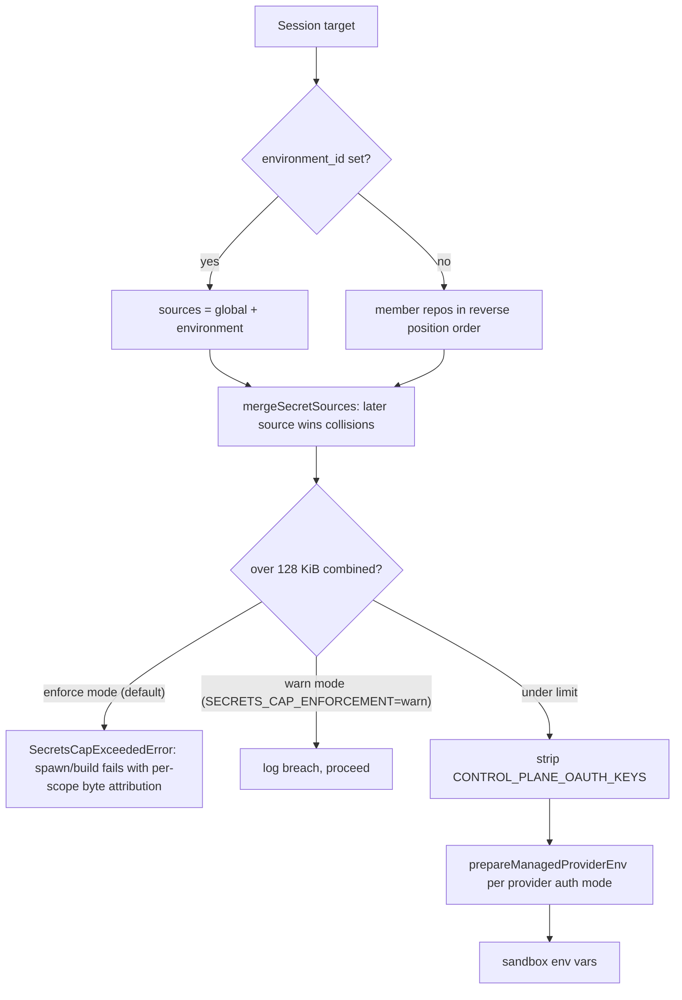

# Secrets: Scopes, Encryption, and Injection

Secrets are user-defined environment variables — API keys, database URLs,
credentials — that Open-Inspect makes available to sandbox sessions
automatically. They are **encrypted at rest** in D1, values are **never
returned by the API** after saving (only key names are visible), and they are
decrypted at sandbox creation time and injected as environment variables.
Managed provider-account OAuth refresh tokens are a separate credential class:
they are brokered by the control plane and **never injected into sandboxes** —
only short-lived access material is delivered over
`POST /sessions/:id/provider-auth/:provider/access-token`.

## Scopes and precedence

| Scope | Applies to | Managed under |
| --- | --- | --- |
| **Global** | All sessions, every target | Settings > Secrets, "All Repositories (Global)" |
| **Repository** | Sessions launched from that repo | Settings > Secrets, a specific repository |
| **Environment** | Sessions launched from that environment (member repos never contribute) | Settings > Environments, the environment's Secrets tab |

**Precedence rule:** repository (or environment) secrets override global secrets
with the same key, case-insensitively. When viewing a repository's secrets,
inherited global keys appear in a read-only section with a "Global" badge; the
global entry shows which scope overrode it.

### Which secrets a session receives — the session-target fold

A session receives **global secrets plus its session target's secrets**:

- **Single repository**: global + that repository's secrets.
- **Environment**: global + that environment's secrets **only**. Member
  repository secrets never flow in — environments are curated, so a key added
  to a repository never silently lands in every environment containing it
  (design §7.4). To reuse a repository secret, import it into the environment
  or move it to global scope.
- **Ad-hoc multi-repository session**: global + each selected repository's
  secrets; on key collisions the **primary repository** (first in the list)
  wins.

`buildSessionTargetSecretSources` (session-target-secrets.ts) owns this
sourcing policy: global is always the base source; when
`session.environment_id` is set the source list is exactly `[global,
environment]` and returns immediately; otherwise member repos are folded in
reverse position order so the primary (position 0) merges **last** and wins
collisions. The fold merges case-insensitively with `mergeSecretSources` —
`[global, repoB, repoA]` lets repoA win, which is how the primary wins. The
new-session picker states this disclosure for environment and multi-repo
selections.

Caption: the session-target secret fold — sources are ordered lowest-precedence
first, merged later-wins, capped, then pruned of control-plane OAuth keys
before injection.

### Importing repository secrets into an environment

On an environment's Secrets tab you can import secrets from any repository that
**currently belongs to the environment** (the source repo is verified a member,
rejected 403 otherwise): pick the source repository, select the keys, and the
values are **copied control-plane-side, ciphertext-verbatim** — because both
scopes share one encryption key (`REPO_SECRETS_ENCRYPTION_KEY`), no
decrypt/re-encrypt round-trip is needed and plaintext never transits the plane.
The response carries key names only — never plaintext or ciphertext values.
Imports are copies: rotating the value on the repository does not update the
environment; re-import or edit the environment secret directly.

## Encryption at rest and the key contract

All three scoped-secrets stores (`GlobalSecretsStore`, `RepoSecretsStore`,
`EnvironmentSecretsStore`) encrypt values with **AES-256-GCM** via Web Crypto
(`auth/crypto.ts`: random 96-bit IV prepended to the ciphertext, base64
combined). The shared plumbing in `db/scoped-secrets.ts` owns only the
scope-independent pieces — write validation, the per-scope key cap, encryption
bookkeeping, and row codecs — while each store keeps its own table-specific SQL
and public API. All scopes encrypt with `REPO_SECRETS_ENCRYPTION_KEY`.

`REPO_SECRETS_ENCRYPTION_KEY` and `TOKEN_ENCRYPTION_KEY` are **required
gates**: `env-validation.ts` (`requireRepoSecretsEncryptionKey`,
`requireTokenEncryptionKey`) validates strict base64 decoding to **exactly 32
bytes** (AES-256 — a short key would otherwise silently downgrade to
AES-128/192) and throws when absent. The session runtime enforces both keys at
graph build (`session/components.ts`), so a misconfigured deployment fails at
session init — at first touch — not at the first spawn, and no path can persist
a secret in plaintext. Terraform requires the keys, so their absence always
means a broken deployment.

## Validation, reserved keys, and limits

Shared validation lives in `db/secrets-validation.ts`; stores wrap it so the
same rules apply identically to every scope:

| Constraint | Limit |
| --- | --- |
| Max secrets per scope | 50 (`MAX_SECRETS_PER_SCOPE`) |
| Max key length | 256 characters |
| Max value size | 16 KiB (`MAX_VALUE_SIZE`) |
| Max total value size per scope | 64 KiB (`MAX_TOTAL_VALUE_SIZE`) |
| Max combined size per session | 128 KiB (`MAX_COMBINED_SECRETS_BYTES`) |
| Key format | `[A-Za-z_][A-Za-z0-9_]*` |

Keys are uppercased on save (`normalizeKey`), and a write that would leave two
raw keys normalizing to the same key (e.g. `foo` and `FOO`) is rejected rather
than letting the last one silently win. Reserved system keys cannot be set as
secrets: `PYTHONUNBUFFERED`, `SANDBOX_ID`, `CONTROL_PLANE_URL`,
`SANDBOX_AUTH_TOKEN`, `REPO_OWNER`, `REPO_NAME`, `GITHUB_APP_TOKEN`,
`SESSION_CONFIG`, `RESTORED_FROM_SNAPSHOT`, `OPENCODE_CONFIG_CONTENT`, `PATH`,
`HOME`, `USER`, `SHELL`, `TERM`, `PWD`, `LANG`.

### The combined-size cap

The per-scope caps apply at write time, but the **combined** cap is only
measurable after the session-target fold merges sources, so it is enforced at
spawn/build time: `mergeSecretSources` reports per-source byte attribution and
cross-source collisions, and `auditSecretsMerge` logs collisions, then — in
`enforce` mode (the default; `SECRETS_CAP_ENFORCEMENT=warn` opts out, fail
closed) — throws `SecretsCapExceededError` when the merged payload exceeds 128
KiB. The error attributes bytes per contributing scope so the operator knows
what to trim. This mostly matters for multi-repository sessions, where several
repositories' secrets fold into one sandbox. The same merge/audit pair is
shared by the spawn path (`UserEnvResolver`) and the image-build planner
(`loadScopeBuildSecrets`) so both apply the cap identically.

## Persistence

D1 tables (migrations 0001, 0004, 0033):

- `repo_secrets` — PK `(repo_id, key)`, plus mirrored `repo_owner`/`repo_name`
  columns for the listing index.
- `global_secrets` — PK `key`.
- `environment_secrets` — PK `(environment_id, key)`,
  `ON DELETE CASCADE` from `environments`.

Writes are batched upserts (`INSERT ... ON CONFLICT DO UPDATE`); reads of
values exist only as `getDecryptedSecrets`, which returns a `key → plaintext`
record and is the only path that ever sees plaintext. `SecretDecryptionError`
carries the failing key — never plaintext or ciphertext — and each store logs
with its own logger and scope fields before surfacing a user-facing error.
Deleting an environment cascades its secret rows in the same batch that
supersedes its live images (environments.ts).

## Routes

`routes/secrets.ts` (global + repo, `GITHUB_USER_OR_SERVICE_ROUTE`) and
`routes/environment-secrets.ts` (environment CRUD plus import, internal-HMAC
authenticated — the web BFF proxies these):

- `PUT /secrets`, `GET /secrets`, `DELETE /secrets/:key` — global.
- `PUT /repos/:owner/:name/secrets`, `GET /repos/:owner/:name/secrets`,
  `DELETE /repos/:owner/:name/secrets/:key` — repository.
- `GET|PUT /environments/:id/secrets`, `DELETE /environments/:id/secrets/:key`,
  `POST /environments/:id/secrets/import` — environment.

All handlers require `REPO_SECRETS_ENCRYPTION_KEY` (500 when missing), validate
the request body against `secretsRequestBodySchema` (a string-valued record;
zod's record parser preserves `__proto__`-style keys that a plain
`Object.fromEntries` would drop), translate `SecretsValidationError` to 400,
and map store failures to 503. List endpoints return metadata only —
`listSecretKeys` selects `key, created_at, updated_at`, never
`encrypted_value`; the repo/environment list handlers pair the scope's keys
with a best-effort global-keys fetch so the UI can show inherited global keys
read-only.

## Injection: from D1 to the sandbox env

`UserEnvResolver` (session/user-env-resolver.ts) is the session-side resolver,
constructed in the SessionDO composition root with the validated
`repoSecretsEncryptionKey` and injected capabilities (D1 handle, session core
repository, and `resolveRepoId` for legacy rows that predate `repo_id`).
`getUserEnvVars()`:

1. Loads the session and its provider-auth modes from the D1 session index.
2. Decrypts global secrets, then sources and decrypts the target's secrets via
   `buildSessionTargetSecretSources` — repo-launched sessions never touch the
   environment store, and environment-launched sessions never read
   `repo_secrets` (the test suite pins this). A member without a resolvable
   repo id contributes nothing.
3. Merges sources and audits the cap (enforce default). Secret-loading failures
   fail hard — sandboxes must not silently lose secrets.
4. Splits the merged payload: all merged secrets are "exposed" to the sandbox,
   but the **broker** set fed to `prepareManagedProviderEnv` is narrower for
   multi-repo sessions — only global + primary-repo secrets — so a secondary
   repo's legacy OAuth token cannot mark a provider "managed".
5. `prepareManagedProviderEnv` strips `CONTROL_PLANE_OAUTH_KEYS`
   (`OPENAI_OAUTH_*`, `XAI_OAUTH_*` — IAM-style managed markers) from the
   exposed set, then for each provider in `provider_account` or
   `legacy_scoped_oauth` mode deletes the canonical `OPENAI_API_KEY` /
   `XAI_API_KEY` and sets `OPENAI_OAUTH_MANAGED` / `XAI_OAUTH_MANAGED` to `1`.

The sandbox lifecycle manager calls `getUserEnvVars()` on every spawn and every
snapshot restore and passes the result as `userEnvVars` in the provider create
config. The canonical env assembly (`buildSandboxEnvVars` in
sandbox/sandbox-env.ts) starts from the user layer
(`baseEnvVars ?? config.userEnvVars`), deletes boot-mode markers and
`VNC_PASSWORD`/`NOVNC_PORT` so a user secret cannot spoof boot provenance, then
overlays **system vars** (`SANDBOX_ID`, `CONTROL_PLANE_URL`,
`SANDBOX_AUTH_TOKEN`, `REPO_OWNER`, `REPO_NAME`, the serialized
`SESSION_CONFIG`, `PYTHONUNBUFFERED`, …) so user-defined secrets can never
shadow control-plane values. OAuth `/access-token` handling never injects the
refresh token: `api_key` bindings get 409 (the key the sandbox already has),
`legacy_scoped_oauth` routes to the DO's legacy refresh handler, and
provider-account bindings broker short-lived access through the
`ModelProviderAccountBroker`.

### Legacy managed OAuth

Legacy scoped OpenAI/xAI OAuth remains supported for sessions pinned to it.
The keys live in ordinary secret scopes — `OPENAI_OAUTH_REFRESH_TOKEN`,
`OPENAI_OAUTH_ACCESS_TOKEN`, `OPENAI_OAUTH_ACCESS_TOKEN_EXPIRES_AT`,
`OPENAI_OAUTH_ACCOUNT_ID`, `XAI_OAUTH_REFRESH_TOKEN`,
`XAI_OAUTH_ACCESS_TOKEN`, `XAI_OAUTH_ACCESS_TOKEN_EXPIRES_AT` — and are read
and rotated **in their original scope** by `ScopedOAuthSecretsStore`, addressed
per session through `resolveSessionOAuthSecretScope` (environment session →
environment scope, repo session → repo scope, else global). The refresh
services (`OpenAITokenRefreshService`, `XaiTokenRefreshService`) fall back to
the global scope when the session scope has no token, cache access tokens back
into the same scope, and rotate refresh tokens in place with a single-flight
coordinator. `Settings > Provider Accounts` lists legacy key locations across
global, repository, and environment scopes so operators can remove them once
the legacy-bound sessions that depend on them are gone. Do not reuse the same
rotating refresh token in both the legacy and provider-account systems.

## Prebuilt images and secrets

Image builds (repo and environment scopes) run `.openinspect/setup.sh` with
**the same secrets the scope's sessions would get**: `loadScopeBuildSecrets`
(image-builds/scope.ts) folds global + environment for environment scopes and
global + that repository for repo scopes — labels identical to the session
fold, so collision and cap logs attribute identically at build and session
time — applies the same merge/audit/cap, and the planner passes the pruned env
through `prepareLegacyManagedProviderEnv` (the image-build path predates
session provider-routing snapshots). Anything the script **persists to disk** —
an `.npmrc`, a `.env`, a downloaded credential — is captured in the image and
re-served to every session that boots from it, even after you rotate the
secret. Two consequences:

- **Avoid writing long-lived secrets to disk in `setup.sh`**; read them from
  the environment at runtime (they are re-injected fresh on every session).
- **Environment-secret changes invalidate prebuilt images automatically**:
  saving an environment's secrets synchronously supersedes every live
  environment image (`supersedeImageBuildsForSecretsChange`, fail-visible —
  the secrets are already stored, so a supersede failure returns a distinct
  error telling the caller to retry) and kicks a detached rebuild for
  prebuild-enabled environments. Spawn matching sees fingerprints, not
  secrets, so without write-side invalidation a revoked value could keep
  serving from a still-selectable image. Rotating **repository or global**
  secrets does not invalidate images, which is another reason to keep secrets
  out of the image filesystem.

## Lifecycle and operations notes

- New secrets apply only to **new** sandboxes — restart the session to pick up
  changes; the env set is resolved fresh at each spawn/restore.
- Secret decryption failures at spawn time are fail-hard: `getUserEnvVars`
  rejects, and the lifecycle manager propagates the failure (its test suite
  pins that a rejecting `getUserEnvVars` fails the spawn).
- E2B image builds scrub the supervisor log before snapshotting because build
  scripts may print secrets (see [Pre-Built Images](/openwiki/concepts/prebuilt-images.md)).
- `SECRETS_CAP_ENFORCEMENT` defaults to `enforce` and is fail-closed: only the
  literal value `warn` opts out of the combined cap.
- OpenAI/xAI subscription credentials belong in Settings > Provider Accounts,
  encrypted with `PROVIDER_ACCOUNTS_ENCRYPTION_KEY`, control-plane-only, never
  returned to the browser and never injected into sandboxes. Provider-account
  mode removes that provider's canonical API key from the sandbox environment
  (`prepareManagedProviderEnv` deletes it) so the runtime cannot bypass the
  selected subscription; API-key mode continues to use ordinary global,
  repository, or environment secrets.

## Focused tests

- `db/global-secrets.test.ts`, `db/repo-secrets.test.ts` — real AES-GCM
  round-trips over a fake D1, normalization/upsert (`created` vs `updated`),
  duplicate-after-normalization rejection, reserved keys, invalid patterns,
  value/total/key-count caps, metadata listing, delete semantics.
- `db/secrets-validation.test.ts` — `mergeSecretSources` precedence (later
  source wins, case-insensitive), per-source byte attribution, collision
  reporting, cap boundary (`totalBytes > max`), warn vs enforce auditing.
- `db/environment-secrets.test.ts` — ciphertext-verbatim import parity and
  scope caps.
- `session/session-target-secrets.test.ts` — `resolveSessionOAuthSecretScope`
  target resolution (environment precedence over repo context; incomplete
  context rejection) and the sourcing policy (primary folded last;
  environment sessions never call the member loader).
- `session/user-env-resolver.test.ts` — the observable resolver surface over a
  real `SessionCoreRepository` and real secret stores: secondary repos
  excluded from the broker env, managed markers from primary-only legacy
  tokens, environment sessions never reading `repo_secrets`, lazy repo-id
  resolution for legacy rows, id-less secondaries contributing nothing, and
  `SecretsCapExceededError` in enforce vs oversized-success in warn.
- `env-validation.test.ts` — fail-closed key validation: absent, non-base64,
  and short (AES-128-length) keys all throw.
- `routes/environment-secrets.test.ts` — route-level CRUD/import contracts and
  the image-invalidation post-mutation hook.

## Relationships

- [Control Plane](/openwiki/architecture/control-plane.md) hosts the routes,
  the Durable Object wiring, and the D1 stores described here.
- [Persistence](/openwiki/architecture/persistence.md) covers the at-rest
  encryption key domains and migration ledger.
- [Environments](/openwiki/concepts/environments.md) details environment
  sessions, the curated-scope rule, and secret imports.
- [Pre-Built Images](/openwiki/concepts/prebuilt-images.md) covers build-time
  secrets, fingerprint matching, and supersede-on-secret-change.
- [Models & Providers](/openwiki/concepts/models-providers.md) covers the
  provider-account credential system and the `/access-token` broker.
