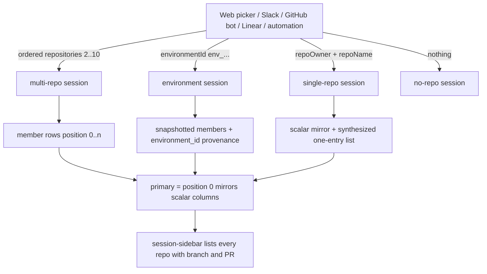
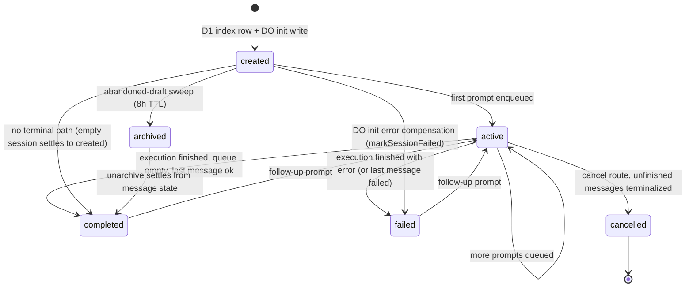
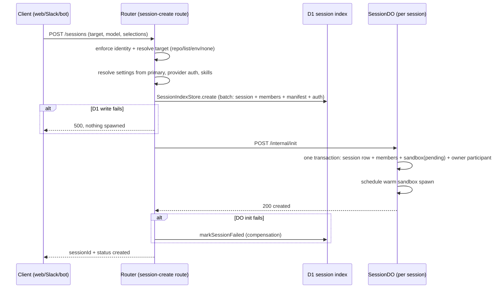

# Sessions (Targets, State, and Lifecycle Model)

A **session** is the core unit of background work in Open-Inspect: a durable,
multiplayer, stateful workspace that runs independently of any client
connection. The web picker, Slack, GitHub bot, Linear, and automations all
produce sessions; every session id maps 1:1 to a `SessionDO` Durable Object
(`env.SESSION.idFromName(sessionId)`), and each DO owns its own embedded SQLite
database (`ctx.storage.sql`) in which the session's full aggregate state lives.

Session state is split across two stores by design:

- **The DO-embedded SQLite** (`session/schema.ts` `SCHEMA_SQL`) is the
  session's authoritative aggregate: the `session` row, member repositories,
  participants, messages, events, artifacts, sandbox row, diff bundle, alarm
  state, and WebSocket client mappings. This is what makes hundreds of
  concurrent sessions performant — each session is an isolated database.
- **The global D1 index** (`SessionIndexStore`, `sessions` +
  `session_repositories` + `session_skill_manifests` +
  `session_model_provider_auth` tables) is the listing/query mirror: status,
  metrics, lineage, and repository membership for the session list, inbox, and
  router lookups. It is a projection, refreshed by the DO on transitions.

## Session targets

When creating a session you choose what the sandbox works on. There are
exactly four target modes, mutually exclusive by schema
(`createSessionRequestSchema`'s `hasExclusiveSessionTarget`):

| Target | Shape | What you get |
| --- | --- | --- |
| **Single repository** | scalar `repoOwner` + `repoName` (+ optional `branch`) | one clone, one branch selector |
| **Multiple repositories** | ordered `repositories` array, 2..10 entries | an ad-hoc set cloned side by side, one sandbox |
| **An environment** | `environmentId` (`env_…`) | the environment's snapshotted member set plus its secrets/prebuilds; `sessions.environment_id` records provenance |
| **No repository** | neither owner/name, list, nor environment id | an empty sandbox for scratch work |

`MAX_TARGET_REPOSITORIES = 10` bounds both session and environment member
lists. The `repositories` list is validated by
`sessionRepositoriesInputSchema`: at least one entry, deduplicated by
owner/name, and additionally rejecting duplicate `repoName` across owners —
checkout paths are `/workspace/{repoName}`, so a clear 400 beats path
disambiguation.

**The first repository in the list is the primary.** It drives defaults:
session-scoped integration settings (`codeServerEnabled`, `vncEnabled`,
`sandboxSettings`) resolve from position 0 (`resolveSessionScopedSettings`),
secret collision precedence gives it the last merge, and legacy scalar
consumers read the primary through the mirror columns. The primary is mirrored
into the scalar `repo_owner`/`repo_name` columns in both stores — the
"row-0-mirrors-scalars invariant" — so pre-list filters and consumers keep
working unchanged. `initializeSession` and `/internal/init` both enforce that
`repositories[0]` identity- and branch-equals the scalar mirror.

Each repository is cloned into its own directory under `/workspace`; pushes and
pull requests are **per-repository** — a multi-repo session can produce PRs in
several repositories, and the session sidebar lists every member with its
branch and any PR created for it. The agent sees all clones side by side and
can make coordinated cross-repository changes. Repo-identity is compared
case-insensitively (`repoIdentityEquals` / `normalizeOptionalRepositoryPair`),
and a `repo_owner` may contain `/` (GitLab subgroups) — only `repo_name` is a
single path segment; the shared `parseRepositoryFullName` helper splits on the
**last** `/`, never the first. Do not split owners on the first `/` anywhere.

Whether a session has repository context is a **triple invariant**: repo owner,
repo name, and repo id must be present together, or all absent. The DO session
table's CHECK constraint enforces it in SQLite, `upsertSession` and
`initializeSession` enforce it in TypeScript, and no-repo sessions must not
carry `repo_id`, `base_branch`, or any branch context. Environment-launched
sessions snapshot the environment at creation time: editing or deleting the
environment never changes what an existing session works on (the UI shows
"Environment deleted" when the source is gone).

## The session aggregate (DO SQLite state)

Each session DO applies `SCHEMA_SQL` (plus tracked `MIGRATIONS` and
`INDEXES_SQL`) on first activation and stores these tables:

| Table | Contents |
| --- | --- |
| `session` | **singleton row**: id (= DO id), `session_name` (external routing name), title, scalar repo mirror (+ `repo_id`, `base_branch`, `branch_name`, `base_sha`, `current_sha`), `opencode_session_id`, model, reasoning_effort, status, parent_session_id, spawn_source, spawn_depth, feature flags (`code_server_enabled`, `vnc_enabled`), `total_cost`, `sandbox_settings` JSON, `environment_id` provenance, timestamps |
| `session_repositories` | ordered member set: `position` (0 = primary), owner/name/id, `base_branch`, and per-repo git state (`branch_name`, `base_sha`, `current_sha`) written by push handling; PK `(repo_owner, repo_name)` |
| `participants` | users who joined: identity fields (user_id, canonical_user_id, SCM login/email/name), role (`owner`/`member`), AES-GCM-encrypted SCM tokens, and the SHA-256 hash of the WebSocket auth token |
| `messages` | prompt queue + history: author, content, source (`web`, `slack`, `linear`, `extension`, `github`, `automation`, `agent`), per-message model/reasoning overrides, attachments JSON, callback context, idempotency keys (`client_request_id`, `request_fingerprint`, autofix keys), status (`pending`/`processing`/`completed`/`failed`), stop-confirmation deadline, timestamps |
| `events` | the agent event log (tool calls, tokens, errors, git sync) — append-only with a monotonically assigned `timeline_sequence`; token and `execution_complete` events upsert by composite id |
| `artifacts` | PRs, screenshots, video recordings, preview URLs, branch links — `type` ∈ `pr`/`screenshot`/`video`/`preview`/`branch`, `url`, typed JSON `metadata`, `created_at`/`updated_at` (updated_at advances only on content change) |
| `attachments` | media-bucket chat-composer uploads: mime, size, object key, `message_id` once referenced, cleanup-claim timestamp |
| `sandbox` | the current sandbox incarnation (`SandboxStatus`, `git_sync_status`, snapshot ids, auth token/hash, heartbeat/last_activity, spawn-error circuit breaker, tunnel URLs) |
| `session_diff` | singleton durable checkout-diff bundle (revision id, trigger message, captured-at, error) |
| `session_alarm_state` | persisted double-alarm deadlines for hibernation recovery |
| `ws_client_mapping` | wsid → participant/client mapping so `ClientInfo` survives hibernation |

The `session` row is a singleton (`SELECT * FROM session LIMIT 1`); all
repositories share `exec` updates keyed on that one row. The DO schema has a
CHECK: `(repo_owner IS NULL) = (repo_name IS NULL)` and no-repo rows must have
null `repo_id` and `base_branch`.

### Session vs sandbox status: two different levels

`SessionStatus` (`created`, `active`, `completed`, `failed`, `archived`,
`cancelled`) describes the durable conversation lifecycle and is independent
of compute. `SandboxStatus` (`pending`, `spawning`, `connecting`, `warming`,
`ready`, `stale`, `snapshotting`, `stopped`, `failed`) describes only the
**current** sandbox incarnation — a session has many incarnations over its
lifetime. A session may be `completed` with a live sandbox attached, or
`active` with none at all. Rendering one as the other is what let the sidebar
and header disagree about the same session, so the two never share vocabulary.
`warming` is never persisted (the web client sets it optimistically).

## The participants model

The session creator becomes the **owner** participant (role `owner`); later
joiners are `member`. `/internal/init` creates the owner inside the same
transaction as the session row. Participants are the security boundary for
session access: SCM credentials are stored AES-GCM-encrypted per participant,
the WebSocket auth token is stored as a SHA-256 hash (`ws_auth_token`) and
validated by the connection authenticator, and archive/unarchive routes
require the caller to be a participant. Presence is participant-scoped —
multiple tabs dedupe into one participant record per identity.

## Messages, events, artifacts

- **Messages** are the prompt queue and history. Enqueueing a prompt inserts a
  `pending` message and transitions the session to `active` in the same DO
  turn. Exactly one message may be `processing` at a time (unique partial
  index), and there is a bound on unfinished prompts (`MAX_UNFINISHED_PROMPTS`
  — queue full rejects new prompts). Messages carry idempotency keys:
  `client_request_id` (web) and `request_fingerprint` (participant-scoped
  canonical request hash), plus autofix feedback/PR keys.
- **Events** are the append-only timeline streamed to clients: tool calls,
  token deltas, errors, git-sync updates, execution completions. Each gets a
  unique `timeline_sequence`; `fetch_history` pages through them. Token and
  `execution_complete` events use stable composite ids so re-delivery upserts
  rather than duplicating.
- **Artifacts** are the durable outputs: PR artifacts carry
  `PullRequestArtifactMetadata` (number, lifecycle state, draft flag, head/base
  branches, repo identity) and are a live view of the D1
  `session_pull_requests` record; screenshots/videos reference R2 object keys;
  branch artifacts appear when PR creation falls back to a manual flow. PR
  artifacts written before multi-repo support carry no repo identity and by
  construction belong to the session's primary (`prArtifactBelongsToRepo`).

Message completion feeds the D1 index: the DO records the latest terminal
message (`recordLatestTerminalMessage`) and per-user read state is derived
from `session_read_states` against the `latest_terminal_message_id` column, so
the unread badge works off the mirror rather than the DO.

## Statuses, transitions, and ordering invariants

Status is projected from the DO to three places on every transition: connected
clients (broadcast), the D1 index (status + terminal metrics), and the parent
session's DO (child rollup) — `SessionStatusService` is the single place those
projections stay consistent.

Key transitions and their invariants:

- **Create = D1 index first, then DO init — an invariant.** `initializeSession`
  writes the D1 `sessions` row (plus repository rows, pinned skill manifest,
  and provider-auth snapshot in one batch) **before** calling the DO's
  `/internal/init`, so any D1 failure is caught before a sandbox is spawned.
  If the DO init then fails or times out, compensation marks the D1 row
  `failed` so it never shows as a phantom `created` session. The DO-side init
  handler writes the whole initial aggregate — session row, member set,
  pending sandbox row, owner participant — in one `transactionSync`, then
  schedules the warm sandbox spawn.
- **`created` → `active` happens on prompt enqueue** (`message-queue.ts`
  transitions to `active` when a prompt is dispatched), never on creation —
  a session can sit in `created` with only a warm sandbox.
- **After an execution**, status settles to `active` if prompts remain
  queued, else `completed`/`failed` by outcome (`reconcileAfterExecution`);
  `settleFromMessageState` derives the idle status from the latest terminal
  message, falling back to `created` for a session with no messages at all —
  deliberately, so the abandoned-draft sweep can reclaim it.
- **Cancellation atomically terminalizes** unfinished messages before
  publishing `cancelled`: no request may observe cancelled status with
  unfinished messages, or accept work between the two mutations.
- **Archive** rejects sessions with queued work (409), cannot archive a
  `cancelled` session, and requires the caller to be a participant.
  **Unarchive** is restoring not starting: it settles the status from what the
  messages already imply rather than asserting `active`.
- **Expired drafts**: sessions never prompted are retired by the
  abandoned-draft sweep (`ABANDONED_DRAFT_TTL_MS = 8h`, cron `23 * * * *`),
  which asks the DO via `/internal/expire-draft`; a 404 (no DO behind the row)
  lets the index retire the orphan (`archiveOrphanedDraft`).
- Status updates in the D1 index are **monotonic**: `updateStatus` only
  applies `updated_at` values ≥ the stored one, protecting against
  out-of-order async writes; `repairIndexStatus` re-projects a stale mirror
  without claiming new activity.
- `isSessionPromptable` is true for `created`/`active`/`completed`/`failed`
  and false for `archived`/`cancelled`; `isTurnSettled`
  (`completed`/`failed`/`cancelled`) governs metric sync — archiving is a
  filing action, deliberately excluded. Child-still-running accounting uses
  `isSessionInactive` (`completed`/`failed`/`archived`/`cancelled`).

## Parent/child lineage

`parent_session_id`, `spawn_source`, and `spawn_depth` record lineage. Every
session row also gets a `root_session_id` at insert: the D1 insert computes it
as the parent's root when a `parent_session_id` is present, else the session
itself. Spawn sources: `user`, `agent`, `automation`, `github-bot`,
`linear-bot`, `slack-bot` (DO default `user`, spawn_depth 0).

Children are spawned only by an active prompt: `/internal/spawn-context`
requires a `processing` message to resolve the prompt author, and is
deliberately scalar in v1 — children inherit (and are restricted to) the
parent's **primary** repository, even for multi-repo parents. Spawn rules in
`session-child-spawn.ts`: `MAX_SPAWN_DEPTH = 2` (the `MAX_DESCENDANT_DEPTH =
10` CTE guard is insurance against corrupt cycles), plus per-parent caps
(`maxConcurrentChildSessions`, `maxTotalChildSessions` from resolved sandbox
settings). Children inherit their parent's settings scope (primary repo +
environment overrides) and pin/copy the parent's managed-skill manifest
(`skillManifestSourceSessionId`). Child status/title changes notify the
parent's DO (`/internal/child-session-update`) so its clients refresh live;
`ChildSessionFinalResponse`/`ChildSessionTrajectory` summarize the child run
for the parent UI.

## The D1 session index and read models

`SessionIndexStore` owns the global mirror. `create` batches the session row,
member rows, pinned skill manifest (or a copy of the parent's), and the
immutable model-provider-auth snapshot — a partially initialized session can
never appear. Listing pages order by `updated_at DESC`; repository filters
match through the membership table so a session is found through **any**
member, with the scalar arm as the pre-feature fallback. `list` attaches
ordered member lists, per-status PR counts (`pull_request_summaries` from
`session_pull_requests`), and viewer read state in one pass
(`attachSessionListMetadata`, chunked below D1's parameter limit).
`excludeAutomationLineage` backs the "Mine" view, excluding automation runs
and bot-initiated GitHub reviews.

The **session inbox** (`SessionInboxStore`) is a lineage-aware read model:
categories `needs_attention`/`in_progress`/`finished`, with a recursive CTE
that groups each root session with its descendants (`SessionInboxItem.root
Session` + `descendantSessions`), ranked by the lineage's latest activity.
Cursors are `(latest_updated_at, root_session_id)` tuples. `getVisibleForUser`
is the current single-tenant visibility boundary — future grants belong there.

The wire `Session` type (shared) carries id, title, scalar repo mirror,
status, lineage, timestamps, optional ordered `repositories`
(`SessionListRepository`), `environmentId` provenance, `pullRequestSummary`,
and viewer `readState`.

## Creation flow and provenance

`POST /sessions` (`session-create.ts`) parses the body, applies identity
enforcement (caller-asserted identity/SCM fields are rejected), resolves the
target: an `environmentId` is snapshot through `resolveEnvironmentTarget`,
ad-hoc lists and environments are resolved all-or-nothing through
`resolveSessionRepositories` (one unresolvable member fails the whole create —
a session boots one sandbox for the whole set). Scalar mode resolves a single
repo. GitHub deployments enrich SCM credentials server-side from the token
store. Then session-scoped settings resolve from the primary member (+
environment overrides), the provider-auth routing snapshot is resolved, managed
skills are pinned, and `initializeSession` runs the D1-first/DO-second
sequence.

The rest of the lifecycle routes (`/internal/prompt`, `/internal/stop`,
`/internal/snapshot`, `/internal/archive`, `/internal/cancel`,
`/internal/state`, etc.) are constants in `SessionInternalPaths`
(`session/contracts.ts`), imported by both the router-side `SessionRuntimeClient`
and the DO route table so the two sides cannot drift.

## Configuration and operations

- **Feature flags** are persisted per session: `code_server_enabled`,
  `vnc_enabled` (opt-in booleans), and `sandbox_settings` (JSON blob of
  `SandboxSettings`, normalized at the use-site boundary and resolved at
  creation from the primary member plus environment overrides).
- **Cost/usage**: `session.total_cost` accumulates step-finish costs;
  D1 mirrors `total_cost`, `active_duration_ms` (sum of
  `completed_at - started_at` over messages), `message_count`, and `pr_count`
  via `updateMetrics`.
- **Secrets** never flow into the session body: SCM tokens are
  server-side-enriched and stored encrypted; sandbox access secrets
  (code-server/VNC passwords, ttyd JWTs) are encrypted at rest by
  `SandboxRepository`; env-secret resolution follows the session-target
  scoping rules (environment sessions: global + environment only; repo/ad-hoc:
  global + member repos with the primary merged last).
- **The abandoned-draft sweep** and image-build scheduler are separate crons;
  both are capped in subrequests per tick.

## Focused tests that matter

- `session/initialize.test.ts` — D1-before-DO ordering, D1 failure ⇒ no DO
  call, invalid repository tuples and branch-on-no-repo rejected before any
  write, primary-matches-scalar enforcement.
- `session/schema.test.ts` — schema/migration invariants (the session-row
  CHECK, singleton tables, unique partial indexes).
- `db/session-index.test.ts` — create batch atomicity, status monotonicity,
  repository membership filtering, read-state derivation.
- `session/session-status-service.test.ts` — every transition fans out to
  clients/index/parent; same-status transitions still refresh projections.
- `session/repository-target.test.ts` — member resolution, ambiguity,
  non-membership as a security boundary (403).
- `session/session-init.handler.test.ts` — the DO-side init transaction:
  session + members + sandbox + owner written atomically.
- `session/abandoned-draft-sweep.test.ts` — draft expiry outcomes
  (`archived`/`not_draft`/`has_work`/`missing`) and index repair.
- `db/session-inbox-cursor.test.ts` — lineage grouping and cursor paging.
