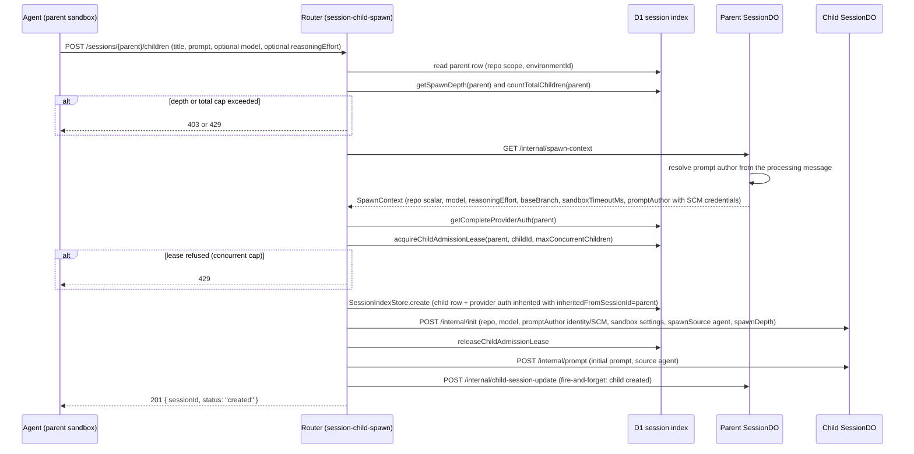

# Child Sessions (Parallel Sub-Tasks)

A **child session** is an independent session spawned by an agent acting inside
another session (its **parent**). The child inherits the parent's repository and
identity but not its conversation history, runs on its own sandbox, and keeps
running after the parent responds. The parent agent observes children only
through explicit status reads, while the UI and control plane track the whole
tree through D1 lineage rows.

Children are the durable, parallel-work counterpart to the in-process Task tool:
`spawn-child` creates a full session with its own sandbox and prompt queue, so
the work survives parent turns, can be resumed with `send-child-prompt`, and
shows up in the session index like any other session.

## Responsibilities and entry points

The child-session feature spans four layers:

| Layer | Component | Responsibility |
| --- | --- | --- |
| Agent tooling | `spawn-child`, `send-child-prompt`, `get-child-status`, `cancel-child` (sandbox-runtime tools) | The only surface an agent has for creating and driving children; each maps to a control-plane HTTP route through the bridge client |
| Router | `POST /sessions/:id/children` (`session-child-spawn.ts`), `GET /sessions/:id/children`, `GET /sessions/:id/children/:childId`, `POST /sessions/:id/children/:childId/prompt`, `POST /sessions/:id/children/:childId/cancel` (`session-children.ts`) | Validation, capacity/depth admission, lineage checks, and dispatch to the Session Durable Objects |
| Session DO | `/internal/spawn-context`, `/internal/active-prompt-author`, `/internal/child-summary`, `/internal/parent-prompt`, `/internal/child-session-update` (handlers in `child-sessions.handler.ts`, `child-summary.handler.ts`) | The child-owned read model and the parent-owned context/authority sources |
| D1 index | `SessionIndexStore` (`session-index.ts`) | Lineage columns (`parent_session_id`, `spawn_depth`, `root_session_id`), child admission leases, total/concurrent caps, descendant queries |

## Control flow: spawning a child

The spawn route (`handleSpawnChild`) is the single choke point for agent
spawning. Its checks, in order:

1. **Body validation** against `spawnChildSessionRequestSchema` — `title` and
   `prompt` are required; `repoOwner`/`repoName`, `model`, and
   `reasoningEffort` are optional.
2. **Parent depth** — `getSpawnDepth(parentId) >= MAX_SPAWN_DEPTH (2)` →
   `403 Maximum spawn depth (2) exceeded`.
3. **Total cap** — `countTotalChildren(parentId)` counts all rows with
   `parent_session_id = ?` (this is a lifetime count, not a live count) against
   `maxTotalChildSessions` (default 15) → `429`.
4. **Spawn context** — `GET /internal/spawn-context` on the parent DO. Failure
   returns the DO's error body or a generic fallback with the DO status.
5. **Repository pinning** — children are single-repo by design. The child inherits
   the parent's scalar repository (the primary member for multi-repo parents);
   an explicit `repoOwner`/`repoName` must match exactly or the spawn fails with
   `403`. A repo-less parent cannot gain repository context.
6. **Model and reasoning** — the child model defaults to the parent's model;
   an explicit model must be a valid model and in the org's enabled set;
   reasoning effort defaults to the parent's and must be valid for the model.
7. **Provider auth** — the parent's complete provider-auth snapshot
   (`getCompleteProviderAuth`) is copied onto the child with
   `inheritedFromSessionId: parentId`. Children cannot override auth; a missing
   or incomplete snapshot fails closed with `503 Parent provider auth unavailable`.
8. **Concurrent capacity** — `acquireChildAdmissionLease(parent, childId,
   maxConcurrentChildren)`; refusal → `429 Maximum concurrent children (...)
   reached`.
9. **D1-first init** — `initializeSession` writes the child's D1 index row
   (lineage, provider auth, managed-skill manifest copy) **before** the child
   DO's `/internal/init`, preserving the create invariant: any D1 failure is
   caught before a sandbox spawns. If init throws, the admission lease is
   released and the spawn fails with 500.
10. **Initial prompt enqueue** — `POST /internal/prompt` with `source: "agent"`.
    If the enqueue fails the child row is marked `failed` immediately.
11. **Parent notification** — fire-and-forget `POST
    /internal/child-session-update` (name `session.notify_parent_spawn`) so the
    parent's connected clients refresh their child list.

The response is `201 { sessionId, status: "created" }` — the route returns
before the child does any work.

### Spawn context is deliberately scalar and prompt-author-bound

`getSpawnContext` requires a **processing prompt**: `resolvePromptAuthorParticipant`
reads `messageRepository.getProcessingMessageAuthor()` and returns `400 No
active prompt found. Child operations must be triggered by an active prompt.` if
there is none. This is the guard that only a running agent can spawn children —
not a client, not an idle session. The prompt author (not the session owner)
becomes the child's owner participant and SCM identity, and the spawn context
carries that participant's encrypted SCM access/refresh tokens so the child can
push and open PRs as the same user.

`spawnContextSchema` is deliberately scalar in v1: there is no `repositories`
array. The comment in the schema records the design decision — children inherit
and are restricted to the parent's **primary** repository; letting children
target another repository requires `spawnContext.repositories`, a named
fast-follow (design §13.13).

## Capacities: depth, total, concurrent, and the lease protocol

Three independent limits bound the child tree:

| Limit | Default | Enforcement point |
| --- | --- | --- |
| Spawn depth | `MAX_SPAWN_DEPTH = 2` (constant in `session-child-spawn.ts`) | `getSpawnDepth(parent) >= 2` → 403 before any allocation |
| Total children per parent | `DEFAULT_MAX_TOTAL_CHILD_SESSIONS = 15` | `countTotalChildren(parent) >= maxTotal` → 429; counts every row ever spawned under the parent |
| Concurrent live children per parent | `DEFAULT_MAX_CONCURRENT_CHILD_SESSIONS = 5` | admission lease → 429 |

`maxConcurrentChildSessions` and `maxTotalChildSessions` come from the parent's
**resolved sandbox settings** — global defaults layered with per-repo and
per-environment overrides, resolved against the parent's repository scope
(`resolveSandboxSettings` with the parent's `environmentId`). The settings
schema enforces `maxConcurrentChildSessions <= maxTotalChildSessions`.

### Admission leases

`child_admission_leases` (migration 0058) is the concurrency gate. The table
stores `lease_token` (PK), `parent_session_id`, `child_session_id` (UNIQUE), and
`expires_at` (FK to `sessions(id)` ON DELETE CASCADE).

`acquireChildAdmissionLease(parent, childId, maxConcurrent)` runs one atomic
statement: it first deletes expired leases, then inserts a lease for the child
only if the count of (live children in `sessions` + unexpired leases) is below
`maxConcurrentChildren`. The `ON CONFLICT(child_session_id) DO UPDATE` branch
re-arms the lease when a **terminal child is resumed** (see below) and the old
lease has expired. `CHILD_ADMISSION_LEASE_TTL_MS = 5 * 60 * 1000` — a lease that
is never finalized expires in five minutes, so capacity self-heals.

Lease lifecycle:

- **Spawn**: lease acquired just before `initializeSession`, released
  immediately after `initializeSession` succeeds. The lease covers the D1→DO
  init window so a burst of concurrent spawns cannot over-admit while children
  are still `created`.
- **Resume of a terminal child**: `handlePromptChild` acquires a lease *before*
  dispatch when the child's status is `completed` or `failed` (a resume is a new
  admission — the child leaves the inactive set). The lease is released if the
  child **definitively rejects** the prompt (non-2xx response). If dispatch
  fails with a transport error, the lease is deliberately **kept**: the child
  may have accepted the prompt before the response was lost, so releasing would
  undercount. The lease then expires (5 min) or is finalized when the child
  projects `active`.
- **Finalization**: `finalizeChildAdmission(childId)` deletes the lease when the
  child's status projects to `active` — `SessionStatusService` does this in
  `syncSessionIndexStatusAndAdmission` (and in `repairIndexStatus` for a stale
  mirror). From that point the child itself occupies its concurrent slot via the
  live-session count, not via the lease.

The lease is an admission token, not a lock: `releaseChildAdmissionLease` deletes
only the row matching `(child_session_id, lease_token)` so a stale caller cannot
release someone else's re-armed lease.

### The spawn depth representation

`getSpawnDepth` is a single indexed read of the parent's `spawn_depth` column
(no chain walking). The child's depth is `parentDepth + 1`, persisted on both
the D1 row and the DO session row via `spawnDepth` in `SessionInitInput` /
`/internal/init`. The recursive descendant CTE in `listActiveDescendantIds`
(cancellation) is additionally capped at `MAX_DESCENDANT_DEPTH = 10` as
"insurance against a corrupt `parent_session_id` cycle making the recursive
descendant CTE run away; spawn-time depth caps keep real trees far below it."
Cancellation cascades use that CTE to cancel descendants **bottom-up** (`ORDER BY
depth DESC`), and only non-inactive descendants (`status NOT IN
(completed, failed, archived, cancelled)` — the shared
`INACTIVE_SESSION_STATUS_SQL`) are targeted.

## What children inherit

The spawn route constructs every child field explicitly from the parent's
spawn context, resolved settings, lineage, and auth — the child is a fresh
session, not a clone of the parent's aggregate:

| Dimension | Inheritance rule |
| --- | --- |
| Repository | Parent's scalar repo (primary member of a multi-repo parent), pinned — cannot be changed |
| Branch | Parent's `baseBranch` (or `DEFAULT_BASE_BRANCH`) — the child starts from the base branch, not the parent's working branch |
| Sandbox settings | Parent's resolved settings scope (repo + environment overrides), except `sandboxTimeoutMs` which is taken from the spawn context (the parent's live sandbox timeout) |
| Model / reasoning effort | Default to the parent's; overridable per spawn request within valid/enabled sets |
| Identity | The **processing prompt author**: becomes child's owner participant (`participantUserId`, `platformUserId`, SCM login/name/email/userId), with the author's encrypted SCM tokens so the child can authenticate to GitHub |
| Provider auth | Copy of the parent's `session_model_provider_auth` snapshot, each row stamped `inheritedFromSessionId = parentId`; the child cannot override |
| Environment provenance | Parent's `environmentId` (overrides still applied), parent's `automationId`/`automationRunId` if any |
| Managed skills | Copy of the parent's pinned skill manifest via `managedSkillsSourceSessionId = parentId` (`bindManifestCopy` in the D1 batch) |
| Lineage | `parentSessionId`, `spawnSource: "agent"`, `spawnDepth`, and a D1-computed `root_session_id` (the parent's root, or the session itself) |

The child does **not** inherit the parent's conversation context — the
`spawn-child` tool description tells agents to put everything the child needs in
the prompt: "the child has no context beyond what you provide here."

## The parent → child prompt path (send-child-prompt)

`sandbox-runtime/tools/send-child-prompt.js` → `executeSendChildPrompt` →
`POST /sessions/{parent}/children/{childId}/prompt` → `handlePromptChild`:

1. The route verifies the request body against
   `childFollowUpPromptRequestSchema` (non-blank, bounded to
   `MAX_CHILD_FOLLOW_UP_PROMPT_CHARS`).
2. The **router** verifies direct lineage in D1: `sessionStore.get(childId)` must
   exist with `parentSessionId === parentId`, else 404.
3. The route fetches the parent DO's `/internal/active-prompt-author` — the
   non-secret identity of the parent's currently processing prompt author
   (`userId`, canonical id, SCM fields only; **no** encrypted tokens). If the
   parent has no active prompt, `resolvePromptAuthorParticipant` returns 400.
4. If the child is `completed` or `failed` (terminal but resumable), the route
   acquires a lease against the parent's concurrent cap (see above), restoring
   the child's slot before dispatch.
5. The child DO's `/internal/parent-prompt` (`ChildSessionsHandler.parentPrompt`)
   re-verifies that the child's stored `parent_session_id` equals the presented
   parent (404 otherwise — the child DO is authoritative, not the router), checks
   `isSessionPromptable(status)` (409 for `cancelled`/`archived`), and enqueues
   the prompt with `source: "agent"`, author identity from the parent, and SCM
   enrichment **without tokens** (the child's own stored SCM credentials are
   used for git operations). Queue-full maps to 429, promptability races to 409.
6. On success the router background-touches the child's `updated_at` in D1.

The tool contract notes that the follow-up "runs after any current or queued
child work; it does not interrupt the active turn", and that "completed and
failed children can resume, while cancelled and archived children cannot".

## The child → parent read path (get-child-status)

`get-child-status` without a `childId` lists the parent's children:
`GET /sessions/{parent}/children` → `handleListChildren` → `listByParent` (newest
first). With a `childId`, the router first verifies the direct lineage
(`isChildOf`), then forwards the query string to the **child's** DO:

`GET /sessions/{parent}/children/{childId}?include=result,trajectory&...` →
`GET /internal/child-summary` → `ChildSummaryHandler.getChildSummary`.

The summary assembles, in pure builders (`child-session-summary.ts`):

- **Base detail**: scalar session mirror (public id, title, status, repo,
  branch, model, timestamps), sandbox status, artifacts (metadata parsed;
  screenshot/video artifacts are excluded from the final-response artifact
  list), the 5 most recent non-noisy events (`token`, `heartbeat`,
  `step_start`, `step_finish` are filtered; the fetch is bounded by
  `RECENT_EVENT_FETCH_LIMIT = 50`), and `hasUnfinishedPrompt` (derived from
  `getPendingOrProcessingCount()`).
- **Final response** (`include=result`): the child's `getLatestTerminalMessage()`
  is projected through `buildAgentResponseFromEvents` over the message's event
  pages, with artifacts that fall in the message's time window. Events are
  collected (pages of `FINAL_RESPONSE_EVENT_PAGE_LIMIT = 200`, hard ceiling
  `FINAL_RESPONSE_MAX_EVENTS = 1000`); `eventLimitReached` is surfaced. `success`
  defaults to `message.status === "completed"`. Returns null while the child has
  no terminal message.
- **Trajectory** (`include=trajectory`): a paginated slice of the persisted
  event timeline (`getEventTimelinePage`, `trajectoryLimit` default 200, max
  1000, `trajectoryCursor` round-trips through `encodeEventTimelineCursor` /
  `parseEventTimelineCursor`).

`include` values are validated against `{ result, trajectory }` (comma-separated
values accepted); invalid values and malformed limits/cursors return 400.

The sandbox tool formats this into a human-readable report
(`get-child-status-format.js`): counts per status in list mode; details with
artifacts, final response text and tool summary, trajectory lines (optionally
raw event JSON via `includeEventData`), and recent events. The tool contract
insists the agent "check status only when its result is needed; do not poll
repeatedly".

## Cancellation cascade

`cancel-child` → `POST /sessions/{parent}/children/{childId}/cancel` →
`handleCancelChild`:

1. Direct-lineage check in D1 (`isChildOf`) — 404 otherwise.
2. Cancel the child itself via `POST /internal/cancel` on the child DO. A 409
   (child reached terminal state) is tolerated.
3. Unless `cancelNested: false`, list live descendants with the recursive CTE
   (depth-capped at 10, bottom-up order, inactive statuses excluded) and cancel
   each. Failures (non-OK, non-409) aggregate into a 502 listing the children
   that could not be cancelled, alongside the successes.
4. Cancelling descendants of an already-terminal child is still reported as
   success (`{ status: "cancelled", cancelledDescendantIds }`), because the
   cascade itself was useful work.

The child's sandbox is stopped and the child status becomes `cancelled`; the
`/internal/cancel` handler on the child DO atomically terminalizes unfinished
messages before publishing (the `SessionStatusService.cancel` invariant).

## How the parent learns about children (child-session-update)

The parent's DO is the fan-out point for real-time UI updates. Every time a
child's status or title changes, `SessionStatusService.projectTransition` /
`SessionTitleService` call `notifyParentOfChildUpdate`, which background-fetches
the parent DO's `POST /internal/child-session-update` with
`{ childSessionId, status, title }`. The parent's `ChildSessionsHandler
.childSessionUpdate` validates the shape and broadcasts a
`child_session_update` event to the parent's connected WebSocket clients.
Initial spawn also fires this (from the router, `session.notify_parent_spawn`) so
the parent UI learns about brand-new children even though no status projection
happened for them.

## Authentication model

All `children` routes sit on `GITHUB_SANDBOX_FALLBACK_ROUTE` (list, get, cancel,
spawn) or `SCM_AGNOSTIC_SANDBOX_ROUTE` (prompt) policies:

- `user-or-service-with-sandbox-fallback`: normal user/service auth is tried
  first; when the request carries no recognizable credential, the router falls
  back to verifying the bearer token against the **parent session's** sandbox
  (`verifySandboxAuth` → the parent DO's `/internal/verify-sandbox-token`, which
  compares against the stored sandbox token hash). The binding maps `:id` to the
  parent session id.
- `SCM_AGNOSTIC_SANDBOX_ROUTE` requires the sandbox bearer token directly.

The control plane therefore authenticates the **parent's sandbox token**, never
the child's — the parent token is never exchanged for the child's token.
Authorization for follow-up prompts is enforced by the router (D1 lineage) *and*
by the child DO (`parent_session_id` match against the presented parent, plus
promptability). This two-layer check is what keeps a parent from prompting or
cancelling a session that is not its child, even if it possesses another
session's token.

## Failure semantics

- **Spawn enqueue failure**: child row marked `failed`; the parent gets 500.
- **DO init failure**: lease released, 500, nothing spawned (D1-first ordering).
- **Provider auth unavailable**: 503, fail closed.
- **Model preferences unavailable**: 503 (spawn refuses rather than guessing).
- **Lease rejection**: 429; the parent can retry after the child projects
  `active` (finalization) or the lease expires.
- **Ambiguous prompt-dispatch transport error**: lease retained (under-counting
  is worse than a 5-minute over-count).
- **Stale leases**: expire after `CHILD_ADMISSION_LEASE_TTL_MS`; the INSERT
  reclaims capacity by deleting expired rows first.
- **Corrupt lineage cycles**: the descendant CTE is bounded by
  `MAX_DESCENDANT_DEPTH = 10`.

## Tests that matter

- `router.spawn-child.test.ts` — end-to-end spawn via `handleRequest`: provider
  auth copy with `inheritedFromSessionId`, reasoning-effort inheritance, fail-
  closed on missing auth, lease release on init failure, prompt-enqueue failure
  marking the child failed.
- `session-children.test.ts` — prompt capacity: terminal-child resume acquires a
  lease, definitive rejection releases it, transport failure retains it; cancel
  aggregates descendant failures and tolerates 409s.
- `child-sessions.handler.test.ts` — parentPrompt author attribution and
  rejection mapping (404 mismatched parent, 409 non-promptable/race, 429 queue
  full); spawn context attribution from the processing prompt author (not the
  owner) and the token-free active-prompt-author shape.
- `child-summary.handler.test.ts` — summary assembly: noisy-event filtering,
  `include` result/trajectory gates, final-response event pagination and its
  ceiling.
- `spawn-context.test.ts` — schema: nullable repo fields, repo-less context, and
  invalid `sandboxTimeoutMs` rejection.
- `session-index.test.ts` — `getSpawnDepth`, admission lease acquire/release/
  finalize, `countTotalChildren` (lifetime), descendant CTE behavior including
  the cycle guard.

## Extension points

- **Cross-repository children** are the named v1 non-feature: adding
  `spawnContext.repositories` (design §13.13) is a schema change plus removing
  the pinning 403s in the spawn route.
- **Capacity tuning** is configuration, not code: the defaults live in
  `@open-inspect/shared/types/integrations.ts` (`DEFAULT_MAX_CONCURRENT_CHILD_SESSIONS
  = 5`, `DEFAULT_MAX_TOTAL_CHILD_SESSIONS = 15`) and are overridable through
  sandbox integration settings (global, per-repo, per-environment).
- **Depth policy** is a constant (`MAX_SPAWN_DEPTH = 2` in
  `session-child-spawn.ts`); raising it requires re-checking the descendant CTE
  cap (10) and inbox reachability behavior.
