# Session Diffs (Changes Capture)

Session Diffs (rendered as the **Changes** panel) is the feature that shows,
per session, the files the agent changed relative to the immutable commit the
session started from. It is a git-backed capture protocol between the sandbox
runtime (data plane) and the session Durable Object (control plane): the
sandbox advertises its immutable baseline commits on boot, the control plane
pins them, the sandbox collects one bounded patch bundle after each execution,
and the web client renders a manifest plus revision-pinned per-file patches.

```mermaid
flowchart LR
    SUP["supervisor: repo manifest + per-repo baseSha"] -->|"REPO_MANIFEST_FILE_PATH"| BR["AgentBridge"]
    BR -->|"ready event (repositories + baseSha)"| DO["SessionDO: SessionDiffService.pinBaselines"]
    DO -->|"pin base_sha (only when NULL)"| SQL[("session_repositories / session scalar")]
    BR -->|"execution_complete | refresh_diff command"| W["SessionDiffRefreshWorker"]
    W -->|"git diff vs pinned baseSha"| C["diff_collector.py: bounded bundle"]
    C -->|"PUT /sessions/:id/diff (Bearer sandbox token)"| R["control-plane routes"]
    R -->|"validate + forward"| DO
    DO -->|"SessionDiffService.publishBundle"| ST["SessionDiffStore (singleton row)"]
    ST -->|"GET /sessions/:id/diff"| UI["web: manifest + patches"]
```

## Protocol overview and immutable baselines

Every diff in a session is measured against a **base SHA** that is pinned once
and then treated as immutable:

- **Sandbox side.** `resolve_session_diff_baselines` (`diff_baseline.py`)
  keeps any `base_sha` already carried by a `RepoEntry` — from
  `SESSION_CONFIG` for fresh/build boots — and only discovers a missing one
  (via `git rev-parse HEAD`) on the first boot; snapshot-restore boots never
  rediscover, so the original session's baseline survives a restore. The
  supervisor writes the resolved list to `REPO_MANIFEST_FILE_PATH`
  (`/tmp/oi-repo-manifest.json`), the single authority for the checkout
  layout; the bridge's `_build_ready_event` reports those positions and
  `baseSha` values in the `ready` event it sends on connect.
- **Control-plane side.** The
  [`ready`](repo://packages/control-plane/src/session/sandbox-events/runtime.handler.ts#L45-L52)
  event handler calls `SessionDiffService.pinBaselines`, which verifies the
  advertised list matches the session's configured repositories (same count,
  same positions, case-insensitive identity equality) and then writes
  `base_sha` for each member row **only where the column is still NULL**
  (`setSessionDiffBaselines`, `session-core-repository.ts`). The same
  conditional write mirrors the primary repository's SHA into the legacy
  `session.base_sha` scalar. A mismatch with the session's configured set is
  logged and ignored rather than poisoning state.
- For legacy sessions without member rows,
  `SessionDiffService.getBaseline` falls back to the scalar mirror
  (`session.base_sha`) for the primary repository, so old sessions still get
  a comparison point.

Baselines are what make every later comparison consistent: the collector
compares the live checkout against the pinned commit, never against a moving
branch tip.

## Bounded capture in the sandbox runtime

`collect_session_diff_bundle` (`diff_collector.py`) collects every session
repository into one atomic upload bundle. Per repository it runs git with
**argument arrays only** — repository paths and filenames are never
interpolated into a shell command — through a hardened `_git` helper that sets
`GIT_CONFIG_NOSYSTEM`, `GIT_LITERAL_PATHSPECS`, `GIT_NO_REPLACE_OBJECTS`,
`GIT_TERMINAL_PROMPT=0` and `LC_ALL=C`, caps stdout per command, and kills the
process on timeout. The replacement-objects setting is deliberate: a
`git replace` must not shift what the baseline comparison sees.

### What is captured

- **Tracked changes** come from `git diff --raw -z --no-abbrev
  --find-renames <base_sha>` (paths and status letters in NUL-delimited
  records), plus `--numstat` for added/deleted line counts, plus the
  `--diff-filter=U` name list to normalize unmerged paths.
- **Untracked files** come from `git ls-files --others --exclude-standard -z`,
  filtered through the checkout-local runtime exclude block
  (`git_excludes.py`): files the runtime itself installed (for example
  `.opencode/tool/spawn-child.js`) never appear as agent changes, while
  tracked changes are never hidden by those excludes.
- **Per-file patches** are rendered with `--unified=1000000` (whole file) on a
  tracked path, or `--no-index /dev/null <path>` for untracked files.
- **Submodule gitlinks** are reported as `status: submodule` metadata-only
  records carrying old/new commit pointers; a dirty submodule pointer (all
  zeroes) is resolved to the submodule's actual checked-out HEAD via an
  additional `git -C <path> rev-parse --verify HEAD`.
- Status letters map to `added | modified | deleted | renamed | type_changed |
  unmerged | submodule`; rename detection (including copies) keeps the old
  path. A staged deletion recreated as an untracked file at the same path is
  normalized to one `modified` `metadata_only` record instead of two
  contradictory patches.

### Classification and bounds

Each file ends up in one of four render states, serialized verbatim:

| renderState | Meaning |
| --- | --- |
| `renderable` | UTF-8 patch text present, within limits |
| `metadata_only` | changed without renderable text (mode-only, pure rename, unmerged, overlay, submodule, empty patch) |
| `too_large` | patch exceeded a byte limit |
| `binary` | git reports `-` line stats (binary content) |

The production `CaptureLimits.defaults()` are: max 1,000 files, 512 KiB per
patch, 1 MiB aggregate capture bytes across a session, 1.5 MiB (1,572,864 B)
encoded bundle, 8 MB metadata-per-command ceiling, and a 20 s per-git-command
timeout. These mirror the shared TS constants
(`SESSION_DIFF_MAX_*` in `packages/shared/src/types/session-diffs.ts`).
Files beyond the file cap are counted in `omittedFileCount` with
`truncated: true`. If the encoded bundle still exceeds its wire limit after
capture, `_bound_encoded_bundle` sheds the largest patches first
(downgrading them to `too_large`), then trailing metadata records
(incrementing `truncated` / `omittedFileCount`), and only raises
`DiffCaptureError` if even the metadata alone cannot fit.

A repository whose capture fails is serialized as an `unavailable` upload
(with a bounded error string and empty file list) inside the same bundle, so a
multi-repository bundle still uploads atomically instead of losing the healthy
repositories. If *every* repository is unavailable, the worker reports a
refresh failure instead of publishing an empty bundle.

## The refresh worker: coalesced, best-effort, non-blocking

`SessionDiffRefreshWorker` (`diff_capture.py`) is the sandbox-side scheduler.
It never blocks the bridge command loop: `request()` only bumps a generation
counter (and remembers the trigger message id) and spawns the collection task
if one is not already running.

- **Idle gating.** `prompt_started()` clears an `asyncio.Event` gate and
  invalidates in-flight collections by bumping an activity generation;
  `prompt_finished()` re-sets the gate when every started prompt has
  terminated. A refresh requested while the agent is working (or one whose
  collection started before the latest prompt began) is discarded as stale —
  the loop condition keeps it pending so the next iteration collects against
  the checkout's current state.
- **Triggers.** The bridge calls `diff_refresh.request(mid)` after a prompt
  task terminates (success path carries the message id; cancelled/error paths
  flow through `_send_terminal_event_and_refresh`), and on the `refresh_diff`
  command from the control plane (no trigger id).
- **Upload failure.** A failed collection or upload is POSTed to
  `/sessions/:id/diff/failure` (bounded to 2,000 code points, the
  `SESSION_DIFF_MAX_ERROR_LENGTH` mirror) instead of taking the bridge down;
  subsequent requests still work. A HTTP 404 from either endpoint marks the
  control plane as predating the feature (`_mark_unsupported`), and the worker
  stops uploading for the rest of the sandbox's life.
- **Shutdown.** `close()` stops accepting requests and bounds waiting for an
  in-flight collection to `DIFF_REFRESH_SHUTDOWN_TIMEOUT_SECONDS` (5 s),
  cancelling the task on timeout.

The HTTP client (`ControlPlaneDiffClient`) uploads the JSON-encoded bundle
with `Authorization: Bearer <sandbox token>` to
`PUT /sessions/{session_id}/diff`, and reports failures to
`POST /sessions/{session_id}/diff/failure`; its connection pool is created on
first request so a never-run bridge does not leak one.

## Control plane routes and validation

The worker-facing routes live in `packages/control-plane/src/routes/session-diffs.ts`
for the central router:

- `GET /sessions/:id/diff` — user-or-service authenticated, forwards to the
  DO's `/internal/diff-state`, returns the patch-free state, never cacheable.
- `PUT /sessions/:id/diff` — sandbox-token authenticated (with user-or-service
  fallback), reads the body under a strict 1.5 MiB cap
  (`SESSION_DIFF_UPLOAD_BODY_MAX_BYTES`) with a Content-Length pre-check,
  validates with `sessionDiffUploadSchema`, then forwards to the DO's
  `/internal/diff-store`.
- `POST /sessions/:id/diff/failure` — sandbox-token authenticated, body capped
  at 16 KiB, validated with `sessionDiffFailureSchema`, forwards to
  `/internal/diff-failure`.
- `GET /sessions/:id/diff/:revisionId/files/:fileId` — user-or-service
  authenticated; both ids must match `SESSION_DIFF_ID_PATTERN` (`^[A-Za-z0-9._-]{1,200}$`)
  before the request is forwarded, because the ids are interpolated into the
  internal route query.
- `POST /sessions/:id/diff/retry` — user-or-service authenticated, forwards
  to `/internal/diff-retry`.

All internal paths are constants in `SessionInternalPaths` shared between the
router and the DO route table (`createSessionInternalRoutes`), so the two
sides cannot drift. Inside the DO, `SessionDiffsHandler` maps the domain
errors to HTTP: invalid bundle / repository mismatch / baseline mismatch /
invalid failure / invalid file identity → 400; baseline unavailable or sandbox
not connected → 409; stale revision → 409 with
`code: "diff_revision_stale"` plus `currentRevisionId`; file not found → 404
with `code: "diff_file_not_found"` plus `currentRevisionId`. Anything else is
rethrown as an unexpected error.

## The singleton store and publication boundary

`SessionDiffService` is the single latest-bundle publication boundary. On
`publishBundle(input)` it:

1. Validates the upload with `sessionDiffUploadSchema` (rejects malformed
   bundles as `InvalidDiffBundleError`).
2. Asserts the bundle's repository set matches the session's configured
   repositories (same count, same positions, case-insensitive identity) and
   that every bundle `baseSha` equals the pinned baseline — mismatches throw
   `DiffRepositoryMismatchError`, `DiffBaselineUnavailableError`, or
   `DiffBaselineMismatchError` respectively.
3. Generates a revision id, stamps `now`, and atomically replaces the stored
   bundle via `SessionDiffStore.replaceBundle`.
4. Broadcasts `diff_state_changed {revisionId, updatedAt}` to all client
   sockets so open panels can refresh.

`SessionDiffStore` persists exactly **one latest bundle** in the session DO's
embedded SQLite (`session_diff` singleton row;
`CREATE TABLE ... singleton INTEGER PRIMARY KEY CHECK (singleton = 1)` plus
`revision_id, trigger_message_id, bundle_json, captured_at, last_error,
error_at, updated_at`). `replaceBundle` is a single UPSERT that clears any
prior failure; `recordFailure` keeps the current bundle and stores the newest
bounded error. Reads validate the bundle and failure columns independently —
a corrupt bundle can never hide a real failure, and corrupt failure metadata
can never discard a readable bundle (`parseBundle` / `parseFailure` return
null on any schema violation).

The public state (`getPublicState`) never includes patch bodies: the stored
bundle is converted to a manifest via `toSessionDiffManifest`, which strips
every `patch` before the browser boundary and re-validates with
`sessionDiffManifestSchema`. Patch bodies are served only by
`resolveFile(revisionId, fileId)`, which requires both the revision *and* the
file identity to be current: a revision that is not the latest throws
`DiffRevisionStaleError(currentRevisionId)`, and a file that is not a
renderable patch in the current bundle throws `DiffFileNotFoundError`. The
endpoints respond with `text/x-diff; charset=utf-8`, `Cache-Control: private,
no-store`, and `X-Content-Type-Options: nosniff`. The web client treats a
stale-revision patch response as a signal to re-fetch the manifest.

## Versioning and schema mirrors

`SESSION_DIFF_VERSION` is `1` in two places kept in sync by hand:
`packages/shared/src/types/session-diffs.ts` (TS) and
`diff_collector.py`. The upload bundle carries `version` and is statically
rejected by both the route validator and the DO store if it does not equal the
current version. `SESSION_DIFF_MAX_ERROR_LENGTH` (2,000) is similarly
mirrored; Python counts code points while Zod counts UTF-16 units, a known
astral-character-only divergence whose worst case is a rejected failure
report that degrades error display. The shared schemas additionally enforce
structural rules that protect the wire and the routes: file ids must satisfy
the route id pattern, paths must not contain NUL, `oldPath` is only valid for
renames, renderable files must carry a patch (and non-renderable ones must
not), patches are byte-limited per file and in aggregate, positions and
repo identities must be unique per bundle, and the fully encoded JSON bundle
must fit `SESSION_DIFF_MAX_BUNDLE_BYTES`.

## UI consumption

The web client composes three pieces:

- `useSessionDiffs` (SWR over `GET /api/sessions/:id/diff`) parses the
  response with `sessionDiffStateSchema`; `useSessionDiffRetry` POSTs to
  `/api/sessions/:id/diff/retry` and revalidates.
- `deriveSessionDiffView` in `packages/web/src/lib/session-diffs.ts` collapses
  the raw state into a small view model driving the sidebar's **Changes**
  section: `hidden` (no repo) / `loading` / `error` / `unavailable` (missing
  baseline) / `available_after_execution` / `working` (agent busy; previous
  bundle stays visible) / `failed` (last refresh error, retry available) /
  `empty` / `ready`. Active execution outranks a previous failure, and a
  previous bundle remains visible while the agent works.
- `resolveDiffSelection` maps a user selection (repository position + path)
  onto the latest manifest, keeping the selection stable across revisions by
  identity rather than by file id; paths that vanished from the latest
  revision resolve to `missing`. `useDiffFileNavigation` flattens the manifest
  into one ordered file list for prev/next navigation, and
  `buildUniquePathLabels` derives shortest-unique basename labels for the file
  list.

`SessionChangesPanel` renders the selected file: renderable files fetch the
revision-pinned patch URL
`/api/sessions/${sessionId}/diff/${revisionId}/files/${fileId}` and render it
with a web diff renderer (unified/split, wrap); `binary`, `too_large`,
`metadata_only`, and submodule files get explanatory copy instead of a patch.
The toolbar shows the pinned `baseSha → headSha` range ("Compared with session
start"), and a stale-revision patch error triggers a manifest re-fetch that
re-resolves the selection.

## Failure semantics and operations

- **No bundle yet.** `current` is null; the sidebar explains changes will be
  available after the first execution. If a session's repositories have no
  pinned baseline at all, `getPublicState` reports
  `unavailableReason: "Changes unavailable for this session"`.
- **Refresh failure vs. last success.** Failure reporting is non-destructive:
  the last good bundle remains current and resolvable, while `lastError`
  (bounded message + `occurredAt`) is surfaced with a retry action,
  `canRetry: true`.
- **Terminal capture failures.** `DiffCaptureError` (missing checkout, missing
  start commit — `git cat-file -e <baseSha>^{commit}` — command timeout,
  malformed raw diff records, metadata over the memory ceiling) marks a
  repository unavailable or fails the refresh; it never crashes the bridge.
- **Feature-version skew.** A control plane that predates the diff endpoints
  answers 404, and the worker permanently disables refresh for that sandbox;
  a sandbox runtime that predates the feature simply never uploads and the UI
  stays on the availability copy.

## Focused tests

- `packages/control-plane/src/session/diffs/service.test.ts` — publication
  boundary, baseline pinning legs (member row vs. scalar fallback), repository
  set/baseline mismatch rejection, failure retention, stale/unknown file
  identity resolution, and refresh gating on sandbox connectivity.
- `packages/control-plane/src/session/diffs/store.test.ts` — singleton
  atomicity (bundle replaced with failure cleared), independent corrupt
  bundle/failure handling, revision-pinned resolution errors, partial
  multi-repository storage, and the encoded-bundle storage limit.
- `packages/control-plane/src/session/http/handlers/session-diffs.handler.test.ts`
  and `packages/control-plane/src/routes/session-diffs.ts` behavior — error
  code/status mapping and bounded request bodies.
- `packages/sandbox-runtime/tests/test_diff_collector.py` — the git-level
  capture semantics: fixed-baseline comparison, replacement refs ignored,
  staged/unstaged/untracked/deleted/renamed/unmerged/binary/submodule files,
  literal pathspecs, disabled external diff/textconv drivers, excluded
  runtime files, limit enforcement (file cap, per-file and aggregate patch
  bytes, metadata ceiling, bundle shedding), timeout and missing-commit
  failures.
- `packages/sandbox-runtime/tests/test_bridge_diff_capture.py` — worker
  coalescing, idle gating, stale-collection discard, failure reporting
  without termination, 404 unsupported handling, and shutdown cancellation.
- `packages/web/src/lib/session-diffs.test.ts` — the view-model precedence
  rules, selection stability, and untrusted error-body narrowing.
