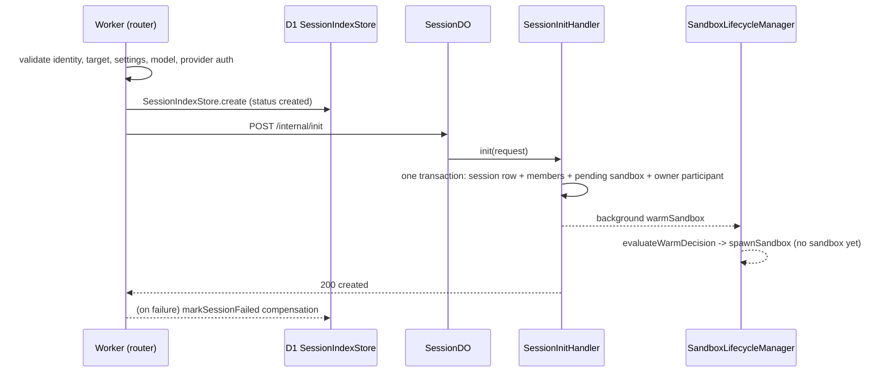
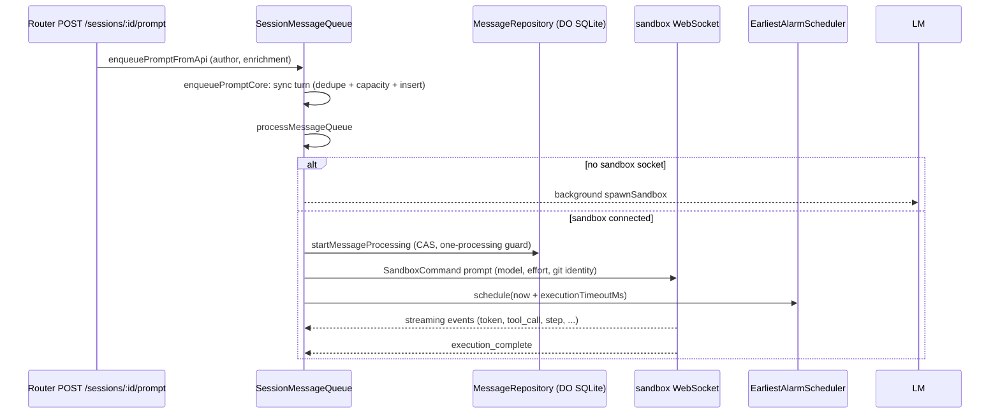
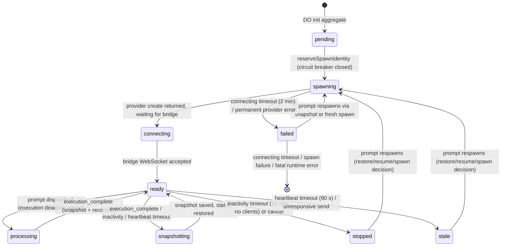

# Session Lifecycle (Create, Spawn, Prompt, Stream, Stop)

## Overview

Every session in Open-Inspect moves through a single end-to-end runtime flow:
a control-plane Worker request creates it (D1 index first, then the
`SessionDO` Durable Object), the DO's `SandboxLifecycleManager` makes a sandbox
available (fresh spawn, snapshot restore, or persistent resume) behind a
circuit breaker, the `SessionMessageQueue` admits prompts and dispatches them
over the sandbox WebSocket, streaming events fan back out to clients, and a
double-persisted alarm keeps every deadline — execution timeouts, stop
confirmations, inactivity, heartbeat — on one platform alarm slot. Finally, an
hourly cron sweep retires warm sessions that a user typed into but never
prompted.

The flow is orchestrated by the session composition root
(`session/components.ts`) inside the [Session Durable Object](/openwiki/architecture/session-do.md),
and its data-plane half is the [Sandbox Runtime](/openwiki/architecture/sandbox-runtime.md)
supervisor and bridge running in the provider sandbox. Provider capabilities are
described on the [Sandbox Providers](/openwiki/architecture/sandbox-providers.md) page;
the [Sessions](/openwiki/concepts/sessions.md) concept page defines the target modes,
session statuses, and the D1/DO store split this workflow drives.

## Phase 0 — Create: D1 first, then DO init

`handleCreateSession` (`routes/session-create.ts`) is the single creation entry
point for user sessions (`POST /sessions`). It validates the request body,
applies identity enforcement, resolves the repository target (scalar pair,
ordered member list, or environment id), resolves session-scoped settings
(code-server/VNC/sandbox settings), the model, an immutable provider-routing
snapshot, and the managed-skills manifest, then calls
`initializeSession` (`session/initialize.ts`). Child-session spawns reuse the
same `SessionInitInput` shape and the same initialization path.

The ordering invariant: **D1 is written before the DO is initialized, and any
failure is caught before a sandbox can spawn.**

1. `SessionIndexStore.create` persists the D1 index row with status `created`
   (repository membership, lineage, provider routing, skills manifest). This
   write must succeed first — it is the listing mirror the router and sweep
   rely on.
2. Only then does `initializeSession` fetch the session's DO
   (`env.SESSION.idFromName(sessionId)`) and `POST /internal/init` to it. The
   caller forwards `x-trace-id`/`x-request-id` for correlation.
3. If the DO init throws or returns non-OK, `markSessionFailed` best-effort
   flips the D1 row to `failed` so no phantom `created` session appears in
   listings — an explicit compensation for the D1-first order.

`initializeSession` also enforces the repository triple invariant (owner, name,
and id together or all absent), the no-branch-context rule for repo-less
sessions, and the row-0-mirrors-scalars invariant: `repositories[0]` must equal
the scalar mirror, so pre-list consumers never see a split-brain session.

Inside the DO, `SessionInitHandler.init` (`session/http/handlers/session-init.handler.ts`)
writes the entire initial aggregate in one `transactionSync` — the session row
(status `created`), the ordered member repository rows (synthesizing a
one-entry list for scalar producers), a pending sandbox row, and the owner
participant with encrypted SCM credentials — then kicks the **warm spawn** as a
background task (`backgroundTasks.submit(() => lifecycleManager.warmSandbox())`).
The web client warms on the first keystroke specifically so the sandbox is
already booting before the first prompt lands.

*Figure: create is D1-first; DO init writes the aggregate atomically and warms the sandbox in the background.*

## Phase 0.5 — Provider and SCM factories fail eagerly

`createSessionRuntime` (`session/components.ts`) constructs the entire
collaborator graph eagerly, including both provider factories.
`createSandboxProviderFromEnv` throws on missing provider credentials and
`createSourceControlProviderFromEnv` throws on an invalid `SCM_PROVIDER`,
GitLab without a token, or Bitbucket. `SessionDO.ensureInitialized` publishes
`_runtime` only after the graph is fully built, so a misconfigured deployment
fails **every session request at initialization** — before any session state is
written — instead of running degraded and surfacing the error at the first
spawn or PR operation. A throw leaves the activation uninitialized, so the next
event retries initialization.

## Phase 1 — Sandbox availability: pure decisions, injected side effects

`SandboxLifecycleManager` (`sandbox/lifecycle/manager.ts`) is the single
orchestrator for sandbox lifecycle operations. It splits policy from effect:
all decisions live in pure functions in `sandbox/lifecycle/decisions.ts`
(circuit breaker, spawn/restore/resume/skip, inactivity, heartbeat health,
connecting timeout, warm decision, execution timeout) that take state and
config and return a decision; the manager executes the side effects through
injected dependencies (`SandboxStorage`, `SessionContextReader`,
`SandboxBroadcaster`, `WebSocketManager`, `AlarmScheduler`, `IdGenerator`, and
the `SandboxProvider`). The manager owns the in-memory `isSpawningSandbox` flag
(set synchronously when a spawn/restore starts) so concurrent prompts in the
same DO turn cannot launch duplicate sandboxes; the persisted sandbox status
(`spawning`/`connecting`) provides cross-request protection.

### Spawn decision

`spawnSandbox()` reads the sandbox row with circuit-breaker state and asks
`evaluateCircuitBreaker` first: after `threshold` (3) consecutive spawn failures
within `windowMs` (5 minutes) the circuit opens and the manager reports the
reason (`reportSandboxError`) without spawning. `evaluateSpawnDecision` then
returns exactly one action:

| Action | Condition |
| --- | --- |
| `skip` | in-memory spawning flag set, or persisted status is `spawning`/`connecting` within `spawningTimeoutMs` (2 minutes) |
| `resume` | provider declares `supportsPersistentResume` and status is `stopped`/`stale` with a provider object id |
| `restore` | a `snapshotImageId` exists, status is `stopped`/`stale`/`failed`, and `isSnapshotRuntimeCompatible` passes |
| `spawn` (fresh) | everything else — including a snapshot whose runtime is below the `MIN_COMPATIBLE_RUNTIME_VERSION` floor |

`isSnapshotRuntimeCompatible` fails closed: a snapshot whose runtime version was
never recorded or does not parse is treated as below the floor and booted fresh
(the cost is one spawn — uncommitted filesystem state — after which the next
snapshot records its version). This is what retires snapshots taken by a
runtime that is no longer trusted, the same way prebuilt images are retired.

A spawn that is interrupted before the sandbox connects (provider crash or
redeploy) can pin the persisted status at `spawning`/`connecting` forever — the
connecting-timeout alarm may never have been scheduled. The `spawningTimeoutMs`
floor (2 minutes, matching the connecting-timeout watchdog) treats such a
stale spawn as dead so a fresh spawn recovers the session instead of skipping
with "already spawning" indefinitely.

### The two-phase spawn write

`doSpawn()` persists a replacement sandbox identity with a two-phase write
(#1589) so a stale bridge can never match the old row mid-spawn:

1. **Phase 1** — `reserveSpawnIdentity` calls `updateSandboxForSpawn`: persist
   status `spawning`, a new `created_at`, the new logical sandbox id, and
   **invalidate credentials** (`auth_token_hash = ''`, access artifacts
   cleared). No token can authenticate against the row until the hash is
   published.
2. **Phase 2** — after hashing the new token, `updateSandboxAuthTokenHash`
   publishes the hash scoped to that `modal_sandbox_id`; a delayed publisher
   whose reservation was replaced gets `false` and the attempt abandons with
   `SpawnSupersededError` without writing failure state (the row and circuit
   breaker now describe the newer attempt).

A provider restore failure on a prebuilt image is "no image": the manager marks
the image restore-failed (so the rebuild cron sees no ready image), rotates to a
fresh spawn identity, and retries from the base image — a session never blocks
on a prebuild. At spawn success the circuit breaker resets; failures increment
it only for permanent `SandboxProviderError`s (transient errors are logged, not
counted). `reportSandboxError` broadcasts `sandbox_error` to live clients and
persists `last_spawn_error` as one step, so the reason survives a reload as
`spawnError`.

### Connect and the ready handshake

The sandbox bridge connects to `/sessions/:id/ws?type=sandbox` and is admitted
by `SessionConnectionAuthenticator`: sandbox id mismatch → 403, token mismatch →
401, terminal session → 410, reconnect-blocked status (`stopped`/`stale`) → 410.
`failed` is intentionally reconnectable — a slow boot can outlive the
connecting watchdog and self-heal. The session-status gate is re-read *after*
the non-storage token-hash await so a concurrent archive/cancel cannot race the
admission. On accept, the manager's `onSandboxConnected()` clears the in-memory
spawning flag and the last spawn error, the sandbox row becomes `ready`,
`last_activity`/`last_heartbeat` are stamped, the inactivity alarm is
scheduled, and `processMessageQueue` is kicked in the background so pending
prompts dispatch immediately. The bridge then sends a `ready` event; the
runtime event handler pins diff baselines, records the reported runtime version
only when the column is empty (a restore already seeded the snapshot's
authoritative version), and persists the event to the timeline.

## Phase 2 — Prompt enqueue, the queue, and dispatch

Prompts enter through two doors that converge on `SessionMessageQueue`
(`session/message-queue.ts`): the WebSocket path
(`handlePromptMessage`, from the client command facade) and the HTTP path
(`enqueuePromptFromApi`, from `POST /internal/prompt`, wired by the router's
`POST /sessions/:id/prompt` through `routes/session-prompt.ts`). Both funnel
into `enqueuePromptCore`:

- The idempotency lookup, capacity check, and insert run in **one synchronous
  turn** so concurrent WebSocket requests cannot race between them. With a
  `clientRequestId`, the author and `request_fingerprint` (hash of participant +
  content + model + reasoning effort + attachment ids) must both match for
  deduplication; a stale id with different content throws
  `PromptRequestConflictError`.
- `MAX_UNFINISHED_PROMPTS` caps pending + processing
  (`PromptQueueFullError`); a session in a non-promptable status throws
  `SessionNotPromptableError`.
- The message is persisted as `pending` with attachments claimed in the same
  transaction, the session transitions to `active`, and the prompt queue is
  broadcast.

`processMessageQueue()` enforces the **one-processing invariant**:

1. Reject when the session is not promptable; recover or re-arm an expired
   stop-confirmation deadline; bail if a message is already `processing`.
2. Take the next `pending` message (FIFO by `created_at`, then `rowid`).
3. If the model's provider is unauthenticated, fail that message and
   reconcile.
4. **No sandbox socket** → the message stays `pending` and the sandbox spawns
   in the background (`backgroundTasks.submit`, so a snapshot restore that
   takes tens of seconds never holds the prompt HTTP response past bot callers'
   timeouts). Dispatch happens when the sandbox connects.
5. **Live socket** → `startMessageProcessing` claims the message with a
   compare-and-set inside a transaction
   (`UPDATE ... WHERE status = 'pending' AND NOT EXISTS (SELECT 1 WHERE status = 'processing') RETURNING id`),
   inserts the canonical `user_message` timeline event, sends the
   `SandboxCommand` (resolved model, reasoning effort, author git identity,
   attachments), broadcasts `processing_status: true`,
   `sandboxLifecycle.updateLastActivity(now)`, and arms the execution-timeout
   deadline through the alarm scheduler.
6. A send failure reverts the claim (`updateMessageToPending`), terminates the
   unresponsive sandbox (`terminateUnresponsiveSandbox("prompt_dispatch_send_failed")`),
   and resumes the queue.

*Figure: prompt admission, the single-processing claim, dispatch, and the execution deadline.*

## Phase 3 — Streaming, execution completion, and status reconciliation

Sandbox events arrive on the sandbox WebSocket, are validated by the message
router, and are dispatched by `SessionSandboxEventProcessor` to family handlers
(`session/sandbox-events/`). The streaming family
(`streaming.handler.ts`) broadcasts tokens, tool calls, steps, and compaction
to clients, upserts `token`/`tool_call` events (deterministic ids) into the
timeline, renews `last_activity` on steps/tool calls, and accumulates cost from
`step_finish`. The execution handler (`execution.handler.ts`) is the
convergence point for `execution_complete`: it records the message completion
(`recordMessageCompletion` with expected status `processing`), projects the
terminal message into the D1 index, broadcasts the event and `processing_status`,
notifies callbacks, snapshots the sandbox (`triggerSnapshot("execution_complete")`),
renews activity, schedules the next inactivity check, and calls
`processMessageQueue` again so the next queued prompt dispatches immediately.
`SessionStatusService.reconcileAfterExecution` settles the session status:
`active` when more prompts are queued, otherwise `completed`/`failed` by the
last outcome. Every status transition fans out to three places — the connected
clients, the D1 index (with a monotonic `updated_at + 1` guard and terminal
metrics), and the parent session's DO when the session is a child.

The runtime event handler (`runtime.handler.ts`) keeps the sandbox row honest:
heartbeats update `last_heartbeat` (and renew activity while a message is
processing — a quiet tool call may otherwise outlive the inactivity timeout),
`git_sync` updates `git_sync_status` and `current_sha`, and `session_title`
applies a title only if unset.

## Phase 4 — Stop, cancel, and the unresponsive-sandbox ladder

- **Stop** (`stopExecution`) marks the processing message failed with
  "Execution was stopped", upserts a synthetic `execution_complete` so every
  client flushes buffered tokens, sets
  `stop_confirmation_deadline = now + STOP_CONFIRMATION_TIMEOUT_MS (15 s)` and
  arms it, and forwards `{"type": "stop"}` to the sandbox. A sandbox that does
  not confirm within the deadline is terminated
  (`terminateUnresponsiveSandbox("stop_confirmation_timeout")`).
- **Cancel** (`cancelExecution`, invoked under the session-lifecycle cancel
  status transition) fails every unfinished message synchronously, sends
  `{"type":"stop"}` if a socket exists, and the lifecycle handler marks the
  sandbox `stopped`.
- When the stop or prompt send fails outright, the queue escalates through
  `terminateUnresponsiveSandbox` (send-failed variants) which marks the sandbox
  `stale`, clears access artifacts, detaches the socket with code 1011, and
  stops the provider sandbox when it supports explicit stop.
- `handleFatalSandboxFailure` (the `sandbox-error` endpoint) terminates the
  failed sandbox and fails the stuck processing message.

## Phase 5 — Alarms: one slot, persisted deadlines, ordered handlers

Every deadline — execution timeout, stop confirmation, inactivity check,
disconnect check — shares the Durable Object's single alarm slot. The
`EarliestAlarmScheduler` (`session/alarm/scheduler.ts`) coordinates callers over
two stores: `PersistedAlarmDeadlineStore` (a singleton `session_alarm_state`
row that survives hibernation) is authoritative and written **before** the
platform alarm, and the earliest deadline always wins. `handleAlarmDelivery`
marks the in-flight deadline so a retried delivery cannot acknowledge a
replacement deadline, then re-arms after the handler.

`createAlarmHandler` (`session/alarm/handler.ts`) runs the three responsibilities
in a fixed order:

1. **Recover an expired stop confirmation** (`recoverStopConfirmationTimeout`):
   a sandbox that never confirmed the stop is terminated and the queue resumed.
2. **Execution-timeout defense-in-depth**: if a message has been `processing`
   longer than `getExecutionTimeoutMs()` (per-use resolved from
   `sandbox_settings.sandboxTimeoutMs`, else `EXECUTION_TIMEOUT_MS`, default
   90 minutes), `failStuckProcessingMessage` fails it. The check is idempotent —
   `getProcessingMessageWithStartedAt()` returns null once the message was
   already failed. When the message has **not** timed out yet, the handler
   reasserts the message's own deadline before lifecycle handling schedules its
   next check, so an earlier lifecycle alarm can never delay stuck-message
   recovery.
3. **Lifecycle alarm** (`lifecycleManager.handleAlarm`), which itself checks,
   in order: connecting timeout (status `spawning`/`connecting` past 2 minutes →
   fail the sandbox), heartbeat health (no heartbeat for 90 s → `stale` +
   snapshot (where supported) or provider stop + detach), and inactivity
   timeout (10 minutes idle → `stopped` + snapshot + shutdown; extended by
   5 minutes with a warning while clients are connected). Any non-`no_action`
   lifecycle outcome also fails a stuck processing message as defense-in-depth;
   a `sandbox_terminated` outcome resumes the message queue.

*Figure: the sandbox status machine driven by lifecycle alarms and prompt-triggered respawn decisions.*

## Phase 6 — Retirement: archive, cancel, and the abandoned-draft sweep

`SessionLifecycleHandler` (`session/http/handlers/session-lifecycle.handler.ts`)
owns the terminal transitions: archive (rejected for `cancelled` sessions or
sessions with queued work), unarchive (restores to whatever the messages imply,
never asserts `active`), and cancel (atomically closes the aggregate under the
status transition, then stops the sandbox). `expireDraft` is the session-side
half of the abandoned-draft sweep: with a `created` session and no messages, it
transitions to `archived`; a session the index still reads as `created` but
that has moved on is repaired (`repairIndexStatus`) so it stops being selected
forever; a `created` session that nevertheless holds messages — a broken
aggregate predating the enqueue-inserts-and-transitions guarantee — is settled
from message state rather than archived, because archiving would discard a real
request.

The sweep itself (`session/abandoned-draft-sweep.ts`) runs on its own cron
(`23 * * * *`, offset from the image-build scheduler) rather than the
per-minute tick, because retention is measured in hours and riding the tick
would cost ~1,440 queries a day. It selects up to 50 `created` rows older than
`ABANDONED_DRAFT_TTL_MS` (8 hours) from the D1 index and asks each session's DO
to retire itself via `expireDraft` (each with a 10 s abort). The DO re-checks
the invariant single-threaded, so a session that started work in the meantime
is left alone. Outcomes are `archived`, `not_draft` (index repaired),
`has_work`, or `missing` (404 — the index row is retired here because there is
no DO to do it); a full batch where every candidate errored logs a loud
`stalled` error, since a failure leaves the same 50 rows to be re-read forever.
The TTL is deliberately hours, not the sandbox's minutes: the composer holds no
socket to the warm session, so the sandbox's own inactivity timeout can fire
while an author is still typing, and the next prompt merely respawns — whereas
an archived session would reject it. An author returning to an overnight-stale
draft gets a rejected prompt.

## Invariants and failure semantics

- **D1 before DO**: the D1 index write precedes DO init; a DO-init failure is
  compensated by `markSessionFailed`, and nothing can spawn before this sequence
  completes.
- **Fail at init, never degraded**: eager provider/SCM factory construction
  throws on misconfiguration before any session state is written.
- **One processing message**: the CAS claim inside `startMessageProcessing` and
  the `idx_messages_one_processing` index make the invariant structural; the
  alarm handler's execution-timeout check is idempotent defense-in-depth.
- **No concurrent spawns**: the in-memory `isSpawningSandbox` flag (plus
  persisted `spawning`/`connecting` status) prevents duplicate sandboxes from
  concurrent prompts; the two-phase spawn write closes the stale-bridge window.
- **Dead sandbox states are a deny-list, not an allow-list**: only
  `stopped`/`stale`/`failed` count as dead, so an unknown future status falls
  through to token comparison instead of locking out every sandbox; `failed`
  intentionally remains reconnectable.
- **Snapshot/compat gating fails closed**: a snapshot without a recorded,
  parseable, at-or-above-floor runtime version boots fresh rather than
  resurrecting an untrusted runtime.
- **Secrets at rest**: sandbox access secrets (code-server/VNC passwords, ttyd
  tokens) are encrypted by `SandboxRepository` on every write path; both
  encryption keys are validated at graph construction.
- **Idempotent retries**: `execution_complete` and `token` events upsert on
  deterministic ids; the alarm's in-flight deadline tracking prevents a retried
  delivery from acknowledging a replacement deadline; de-dup'd prompts return
  the existing message with its queue position.

## Configuration and operations

| Setting | Default | Effect |
| --- | --- | --- |
| Circuit breaker | `threshold: 3`, `windowMs: 5 min` | Spawns blocked after repeated permanent provider failures, with a user-visible wait message |
| Spawn cooldown / ready wait / spawning timeout | 30 s / 60 s / 120 s | Governs `evaluateSpawnDecision`'s `wait`/`skip` actions and stale-spawn recovery |
| Connecting timeout | 120 s | Fails a sandbox stuck in `spawning`/`connecting`; matches the spawn-timeout floor |
| Inactivity timeout / extension / min check | 10 min / 5 min / 30 s | Snapshots and stops idle sandboxes; extension with warning while clients are connected |
| Heartbeat timeout | 90 s (3 × 30 s interval) | Marks a sandbox `stale`, snapshots (where supported), stops, detaches |
| Execution timeout | `sandbox_settings.sandboxTimeoutMs`, else `EXECUTION_TIMEOUT_MS` (90 min) | Fails a message stuck in `processing`; armed at dispatch, reasserted by the alarm handler |
| Stop confirmation | 15 s | Sandbox must ack a stop or be terminated |
| Abandoned draft | TTL 8 h, batch 50, cron `23 * * * *` | Archives warm `created` sessions nobody prompted |
| Access artifacts | — | Broadcast `sandbox_access_changed`; URLs+secrets encrypted; URLs-only cleared on provider-managed stops so persistent resumes keep passwords |

## Focused tests

- `sandbox/lifecycle/decisions.test.ts` — exhaustive pure-function coverage:
  circuit breaker open/reset, spawn action matrix (skip/wait/restore/resume/
  spawn), inactivity extend-vs-timeout, heartbeat staleness, connecting timeout,
  warm decision, snapshot runtime compatibility.
- `session/alarm/handler.test.ts` — execution-timeout ordering: no processing
  message, not-yet-timed-out (deadline reasserted), timed-out (failed), and
  lifecycle-result coupling to `failStuckProcessingMessage` /
  `resumeAfterSandboxTermination`.
- `session/message-queue.test.ts` (58 KB) — the queue contract end to end:
  idempotency conflicts, capacity, dispatch with and without a sandbox socket,
  stop confirmation, autofix admission, stuck processing.
- `session/abandoned-draft-sweep.test.ts` — candidate cutoff, archived /
  not_draft / has_work / missing outcomes, orphan retirement, stall detection.
- `session/initialize.test.ts` — D1-first ordering and the compensation path
  before `/internal/init` reaches the DO.
- `session/sandbox-events/processor.test.ts` — family dispatch and
  ack-before-next-event ordering for critical events.
- `session/schema.test.ts` — `idx_messages_one_processing` enforcement.
