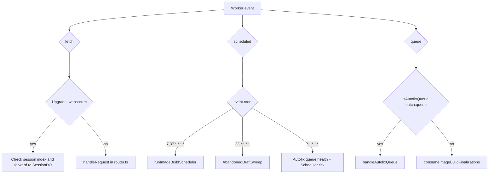
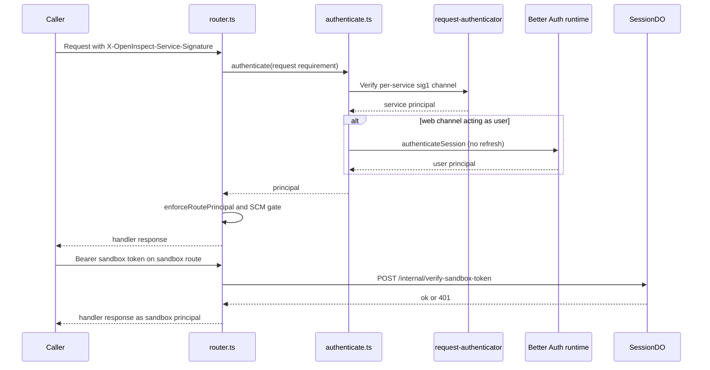
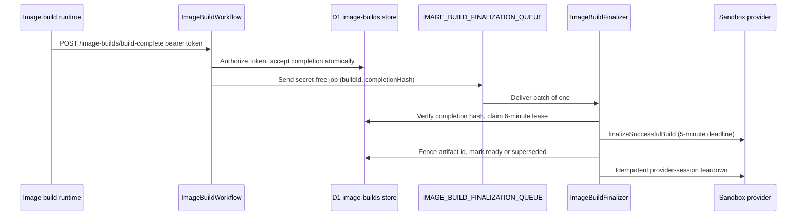

# Control Plane Worker

The control-plane package (`packages/control-plane`) is deployed as a single Cloudflare Worker. The "worker shell" is everything that lives at the platform boundary and routes work into the domain code: the entrypoints in `src/index.ts`, the HTTP router in `src/router.ts`, the shared route framework in `src/routes/shared.ts`, the authentication edges under `src/auth/`, the D1 store layer in `src/db/`, the `BackgroundTasks` seam in `src/platform-ports.ts`, and the cron/queue handlers. Per-session state itself lives inside the `SessionDO` Durable Object (see [Session Durable Object](/openwiki/architecture/session-durable-object.md)); this page covers the shell around it.

## Entrypoints

`src/index.ts` exports the `SessionDO` class for Cloudflare to discover and implements three platform handlers:

Request and queue routing across the control plane's background schedulers and consumers.

- **`fetch`** — WebSocket upgrades to `/sessions/:id/ws` are handled by `handleWebSocket`; every other request goes to `handleRequest` in `router.ts`.
- **`scheduled`** — dispatches on `event.cron`: the image-build scheduler cron (`IMAGE_BUILD_SCHEDULER_CRON`, `7,37 * * * *`), the abandoned-draft sweep cron (`ABANDONED_DRAFT_SWEEP_CRON`, `23 * * * *`), and the every-minute automation tick (`* * * * *`). Unknown crons log a warning and do nothing.
- **`queue`** — `isAutofixQueue(batch.queue)` (prefix `open-inspect-github-autofix-`) sends the batch to the Autofix consumer; any other queue (i.e. image-build finalization) goes to the finalization consumer. The prefix check is deliberate: an image-build finalization queue whose *deployment name* contains "github-autofix" must not be mistaken for the Autofix queue.

The WebSocket upgrade path validates the session against the D1 index (404 for an unknown session) and forwards the upgrade to the session Durable Object resolved by `env.SESSION.idFromName(sessionId)`, adding CORS headers on the 101 response. Connection authentication beyond the upgrade (sandbox tokens, client `subscribe` tokens) is re-checked inside the DO — see [Session Durable Object](/openwiki/architecture/session-durable-object.md).

## HTTP request pipeline

`handleRequest` (`src/router.ts`) is the single entry point for API requests:

1. **DB binding guard.** A missing `env.DB` is rejected once here with 503 — the "single honest boundary" — so every handler can rely on `ctx.db` being present, with no per-route degraded-mode guards.
2. **Request context.** Builds `RequestContext`: `trace_id` (from the `x-trace-id` header or a fresh UUID), an 8-character `request_id`, a `RequestMetrics` collector, the instrumented database handle, lazy Better Auth runtimes, and the `BackgroundTasks` execution context.
3. **CORS preflight.** `OPTIONS` requests are answered before route matching with the allow headers and correlation IDs.
4. **Route matching.** The route table is filtered by method and matched by the route's compiled regex.
5. **Authentication.** Non-public, non-handler-authenticated routes resolve a principal (see [Authentication edges](#authentication-edges)).
6. **SCM gating.** `enforceImplementedScmProvider` returns 501 when the route's `supportedScmProviders` excludes the deployment's `SCM_PROVIDER`, and 500 when that configuration itself is invalid.
7. **Handler execution.** A thrown `HttpError` becomes `error(message, status)`; any other error is logged with full context and returns a generic 500.
8. **Response shaping.** Every response is wrapped with `Access-Control-Allow-Origin: *`, `x-request-id`, and `x-trace-id`; a route-level `cacheControl` (`no-store` | `private, no-store`) is applied when declared; the `http.request` wide event is logged.

The wide event carries the request's D1 aggregates (`ctx.metrics.summarize()`) alongside method, path, status, duration, and outcome — the observability seam shared with [Observability](/openwiki/operations/observability.md).

## Routing framework

`src/routes/shared.ts` defines the primitives every route module uses:

- **`defineRoute` / `defineRoutes`** attach a `RoutePolicy` (an `authentication` kind plus `supportedScmProviders`) to a `RouteDefinition` and produce the final `Route`; the handler receives a `RouteContext` whose `principal` is narrowed by the auth kind.
- **`parsePattern`** converts `:name` path segments into named regex groups, so handlers read `match.groups?.id`.
- **Auth variants** (`RouteAuthentication`): `public`, `handler-authenticated` (webhook/callback routes verify credentials themselves), `web-service` (signed `service:web` channel), `user` (Better Auth browser session), `user-or-service`, `sandbox` (with a `getSessionId` binding pulled from the path), and `user-or-service-with-sandbox-fallback` (also path-bound).
- **Named policy constants** pin the combinations: `GITHUB_USER_OR_SERVICE_ROUTE` (github-only), `SCM_AGNOSTIC_*` variants, `SCM_CREDENTIALS_ROUTE` (sandbox-authed, github+gitlab), and the sandbox-fallback variants.
- **`json`, `error`, `HttpError`** — uniform response shapes; `HttpError` lets handlers raise typed failures that the router's dispatch catch maps centrally.
- **`RequestContext`** carries `db` (the instrumented handle), `executionCtx` (`BackgroundTasks`), `metrics`, the optional `principal`/`authentication`, and lazy auth runtimes. An ESLint rule forbids `.DB` access under `src/routes` and `src/webhooks` so all queries flow through `ctx.db`.

### Registered route groups

`routes` in `router.ts` composes the full API surface:

| Group | Module | Notes |
| --- | --- | --- |
| Health | inline | `GET /health` — the only `public` route |
| Browser auth | `routes/browser-auth.ts` | Better Auth allowlist behind the signed `service:web` channel |
| Sign-in providers | `routes/sign-in-providers.ts` | `service:web`-only provider discovery |
| Sessions | `routes/sessions.ts` | Create, index/inbox, runtime proxy, ws-token, prompt, PRs, media, attachments, diffs, skills, child spawn/children |
| Slack notify | inline | `POST /sessions/:id/slack-notify`, sandbox-authed fallback policy |
| Repos / secrets | `routes/repos.ts`, `routes/secrets.ts` | Repository catalog, repo-scoped secrets |
| Environments | `routes/environments.ts`, `routes/environment-secrets.ts` | Environment CRUD + env secrets |
| Image builds | `routes/image-builds.ts` | Scope-generic build routes incl. callbacks |
| Model preferences / provider accounts | `routes/model-preferences.ts`, `routes/model-provider-accounts.ts` | Preferences and the account broker |
| Integration settings / commit signing / SCM settings | respective modules | Deployment-wide settings |
| Automations | `routes/automations.ts` | CRUD, trigger, invocations, key rotation |
| MCP servers / analytics / autofix / skills / shortcuts | respective modules | Auxiliary surfaces |
| Webhooks | `webhooks/index.ts` | Sentry, automation, GitHub, Slack routes |

A policy-table test (`router.policy.test.ts`) pins the authentication kind of representative routes from each family, so an accidental policy change fails fast.

## Authentication edges

Every non-public request resolves to exactly one typed `Principal` before its handler runs: `{ kind: "user", userId }`, `{ kind: "service", service, actor }`, or `{ kind: "sandbox", sessionId }`. `web-service` additionally requires `service === "web"` (401 otherwise), and `user` routes reject service principals with 403 (`enforceRoutePrincipal`).

The two credential schemes the router dispatches, and the sandbox path it verifies itself.

### User authentication (browser)

The control plane is the browser authentication authority, running pinned Better Auth. A request carries a `sig1` service signature over the `service:web` channel; `authenticate` verifies that channel first, then — only when the route requires `webService: "user"` — validates the opaque Better Auth session cookie via `authenticateSession` (a non-refreshing session read, so resource requests never extend expiry). The result is a user principal whose id is the canonical `users.id` plus provider-independent `AuthenticationContext` evidence. A malformed or cross-user session raises `SessionIntegrityError` and maps to 500, not a fallback. The Next.js web app is a BFF that proxies a `/api/auth/*` allowlist with its own service credential; the browser can reach Better Auth only through `routes/browser-auth.ts` behind that channel.

The Better Auth runtime is built from a normalized config: `BROWSER_AUTH_SECRET` (≥32 chars), `WEB_APP_URL` (must be an exact HTTPS origin, HTTP loopback allowed for local dev), complete GitHub/Google OAuth credential pairs (a partial pair throws), at least one enabled provider, and the admission policy. The runtime is memoized per `env.DB` object with a configuration fingerprint, which is why the router's composition root passes the raw binding (not the per-request wrapper) as the cache key.

The **admission policy** gates sign-in: allowlists of GitHub usernames, emails, email domains, and GitHub organizations, or `UNSAFE_ALLOW_ALL_USERS`. GitHub-organization admission checks active membership through the GitHub API; API unavailability fails closed (`AdmissionUnavailableError`) rather than admitting. A provider is sign-in-enabled only if the configured allowlists can express admission for it — Google requires provider-neutral (email/domain) rules.

### Worker-to-worker service auth (sig1)

Service traffic (`web`, `slack-bot`, `github-bot`, `linear-bot`) signs requests with its own secret using the shared `sig1` format: an HMAC over a canonical request string binding method, path, canonicalized query, body SHA-256, asserted actor, timestamp, and nonce. The control plane holds one verification key per service (`SERVICE_AUTH_SECRET_*` — absent means that service cannot authenticate, a 500 misconfiguration). Verification parses and freshness-checks the signature header *before* buffering the body, caps bodies at 16 MiB, performs best-effort log-only nonce-reuse detection, and enforces `ASSERTION_RIGHTS`: each bot may assert actors only in its own namespace (`slack:U123` etc.; `web` asserts none), and the asserted actor is resolved to a canonical user via the user store. The consumed body is rebuilt before the handler sees the request.

### Sandbox auth tokens

Sandbox routes (e.g. `POST /sessions/:id/scm-credentials`, token refresh brokers, commit signing) authenticate with `Authorization: Bearer <token>`. The router never trusts the token locally: it asks the owning session Durable Object via `SessionInternalPaths.verifySandboxToken`, and on success sets the sandbox principal. A failed verification is a 401; an unreachable DO is a 503 (the request cannot be authenticated, not merely rejected). On `user-or-service-with-sandbox-fallback` routes, a sandbox token is tried only when the sig1 attempt failed with `failedScheme: "none"` — a recognized service credential that fails is terminal, so a captured bot signature can never be exchanged for sandbox access.

### WebSocket tokens

`POST /sessions/:id/ws-token` (user-or-service, github policy) derives the participant identity from the verified principal — caller-supplied identity and SCM token fields in the body are rejected — and forwards to the DO's `/internal/ws-token`. The DO's `WsTokenHandler` upserts the participant (coalescing client-sent SCM tokens against newer server-side refreshes) and rotates a fresh 32-byte WebSocket token, storing only its hash. At `subscribe` time the DO re-hashes the presented token, looks up the participant, and enforces a 24-hour token TTL, closing stale sockets with code 4001 so clients fetch a fresh token.

### Webhook and callback verification

Public webhook routes are `handler-authenticated` and verify their own credentials:

- **Automation webhooks** (`POST /webhooks/automation/:id`) require a `Bearer` API key, verified as a SHA-256 hash with a timing-safe compare; keys are 32 random bytes, base64url-encoded, shown once at creation and rotatable via `POST /automations/:id/regenerate-key`. Payloads are capped at 64 KB.
- **Sentry webhooks** verify the `sentry-hook-signature` HMAC against the automation's client secret, which is stored AES-256-GCM-encrypted under `REPO_SECRETS_ENCRYPTION_KEY`; 256 KB payload cap.
- **Image-build callbacks** (below) authenticate with single-use bearer tokens hashed under a dedicated pepper.

Internal bot-forwarded event endpoints (`/internal/github-event`, `/internal/slack-event`) accept only the matching bot's service principal (`requireEventPoster`), validate the normalized event envelope, and forward to the scheduler; the GitHub path additionally tracks PR lifecycle state in a `BackgroundTasks` submission whose failure never affects automation matching.

Finally, **identity enforcement** (`applyIdentityEnforcement`) closes the loop between authentication and authorization for identity-minting routes: the participant identity is derived from the verified principal, forbidden body identity/SCM fields are rejected with 400, and session-create, ws-token, and automation-create fail closed (403) when no user identity can be derived.

See [Security and tokens](/openwiki/concepts/security-and-tokens.md) for the token inventory and key domains.

## D1 store layer

All global state lives in D1, accessed through `src/db/`:

- **`SqlDatabase` port** (`db/sql-database.ts`) — the engine-neutral surface stores use: `prepare` and `batch`. `D1Database` satisfies it structurally (proven with a compile-time assertion), so there is no runtime wrapper. The contract that types cannot express: `batch` must execute statements atomically, in order, with positionally 1:1 results, and `meta.changes` must carry real affected-row counts because ~38 call sites gate correctness (CAS conflicts, guarded transitions) on it. This port is distinct from the session DO's synchronous `SqlStorage`, which is intentionally not covered.
- **One store file per aggregate** — `session-index.ts`, `automation-store.ts`, `image-builds.ts`, `environments.ts`, `repo-metadata.ts` / `repo-secrets.ts` / `global-secrets.ts`, `user-store.ts`, `mcp-servers.ts`, `skills.ts`, `model-provider-accounts.ts`, and so on. Stores take the `SqlDatabase` port in their constructor, keep snake_case rows internally, and expose camelCase API types.
- **Instrumented D1** (`db/instrumented-d1.ts`) — `instrumentD1(db, metrics)` wraps the port so every query's wall time plus engine-reported metadata (server duration, rows read/written) accumulates into the per-request `RequestMetrics`. `batch` unwraps the instrumented statements (via the `ORIGINAL_STMT` symbol) before delegating, because a real database can only execute its own statements. `summarize()` flattens the collector into `d1_query_count`, `d1_total_ms`, `d1_server_total_ms`, `d1_rows_read`/`d1_rows_written`, plus any named `time()` spans, all spread into the wide event. Stores receive the instrumented handle transparently — no store code changes.

### The `env.DB` read-once rule

`env.DB` is read exactly once per composition root: the router's request path, the `SessionDO` constructor, and the `scheduled`/`queue` handlers in `index.ts`. Everywhere else, code takes the injected `SqlDatabase` (`ctx.db`, `this.db`, or a constructor parameter). An ESLint `no-restricted-syntax` rule bans `.DB` member reads in control-plane source, with each composition root carrying an inline eslint-disable and justification. This keeps query instrumentation (and future adapter swaps) un-bypassable. In `SessionDO`, `this.db` (the D1 handle) is deliberately distinct from `this.sql` (the DO-embedded SQLite).

## Background tasks

`BackgroundTasks` (`src/platform-ports.ts`) is the port for deferring work past the current request. The Cloudflare adapter (`src/cloudflare/background-tasks.ts`) implements it over `ExecutionContext.waitUntil`:

- The task factory is invoked **synchronously inside `submit`**.
- A synchronous factory throw is absorbed and logged exactly like a later rejection — building a task can never fail the caller.
- Failures land in a `background_task.failed` log event; they never propagate.

Callers include the PR-lifecycle tracker on GitHub webhooks and the image-build save hooks (`scheduleImageBuildOnSave` submits a detached best-effort trigger). A contract-faithful test double (`background-tasks.test-support.ts`) mirrors the production boundary — synchronous invocation, absorbed throws/rejections, and a `settle()` drain — so collaborator tests exercise the same contract production has.

## Crons

| Cron | Constant | Work |
| --- | --- | --- |
| `* * * * *` | (automation tick) | Autofix queue health check (via `waitUntil`) + `Scheduler.tick()` |
| `7,37 * * * *` | `IMAGE_BUILD_SCHEDULER_CRON` | `runImageBuildScheduler` |
| `23 * * * *` | `ABANDONED_DRAFT_SWEEP_CRON` | `AbandonedDraftSweep.run` |

Terraform registers exactly these three triggers and its configuration comment requires the schedules to match the code constants.

### Automation scheduler tick

`Scheduler` (`src/scheduler/scheduler.ts`) is the request-driven automation engine, invoked by the tick, the automation routes, and SessionDO completion callbacks. The tick does two things:

1. **Recovery sweep.** Bulk-fails *orphaned* `starting` runs (no session claimed within 5 minutes) and *timed-out* `running` runs (`EXECUTION_TIMEOUT_MS`, default 90 minutes), then applies per-invocation failure accounting. A **finalization sweep** re-applies missed failure strikes and streak resets for invocations in the last 24 hours — covering the crash window between a child's terminal update and its callback — through the same CAS-guarded, idempotent helper as live callbacks.
2. **Overdue automations.** Fetches up to `MAX_PER_TICK` (25) overdue rows and fires each through the single firing pipeline `startInvocation`, bounded by a per-tick child-launch budget of 50 subrequest-costly launches (whole automations are deferred to the next tick when the budget would overflow) and a launch concurrency of 4 to smooth sandbox cold starts.

`startInvocation` is the one pipeline behind tick, manual trigger, and events: overlap scoping (automation-wide for schedule/manual firings; per `concurrency_key` for events, so PR #42 and #43 don't serialize), an atomic guarded batch insert of invocation + children with the schedule advance, and dedup semantics — a `UNIQUE` collision (cron double-fire, event replay) re-advances the schedule monotonically and stands down; manual overlap records nothing and surfaces as `AutomationTriggerBlockedError`, which the route maps to 409. Each firing records one **invocation**; a non-skipped invocation fans out into one child **run** per target (repository or environment; no targets → one repo-less child). A failing repository resolution pre-fails its child without blocking siblings. Provider auth and targets are snapshotted before admission, so editing the automation never rewrites in-flight history.

An invocation's status is **derived, never stored**: `DERIVED_INVOCATION_STATUS_SQL` in `automation-store.ts` is the single SQL definition (with a TS twin the integration tests keep in lockstep) mapping child-run aggregates to `skipped` / `starting` / `running` / `completed` / `failed` / `partial_failed`.

**Failure accounting and auto-pause.** The automation's consecutive-failure counter is incremented at most once per invocation — the `failure_counted_at` compare-and-set admits a single winner across concurrent callbacks, launch failures, and sweeps — and three consecutive failures auto-pause the automation (`scheduler.auto_pause`); a fully-completed invocation resets the streak.

`runComplete` (the SessionDO callback) transitions only an *active* run to terminal via a SQL guard, so a late callback after recovery-sweep failure or a racing duplicate is acknowledged as ignored; a terminal child never transitions twice. Slack-triggered runs additionally post completion to the triggering thread through the `SLACK_BOT` service binding, signed with the *destination* bot's own per-service secret (`callback-signing.ts`).

### Image-build scheduler

`runImageBuildScheduler` (twice hourly) assembles the provider-neutral `ImageBuildScheduler` and runs each phase independently so one failure cannot skip the rest, logging a per-tick stats line:

1. **Republish recoverable finalizations** — re-enqueues Queue commands for accepted-but-unfinalized builds (crash recovery for the consumer below).
2. **Mark stale builds failed** — `building` rows older than the maximum provider-session lifetime plus dispatch grace are presumed dead; a late callback from a misclassified build is rejected by the `status = 'building'` completion guards.
3. **Cleanup provider sessions** — bounded-concurrency teardown of terminal builds' dormant provider sessions.
4. **Reconcile scopes** — only when both an image provider (`SANDBOX_PROVIDER` ∈ modal/vercel/opencomputer/e2b) and a source-control provider are configured: scan every prebuild-enabled scope, evaluate the rebuild policy (no current image, fingerprint mismatch, failed build, runtime floor), and confirm branch drift with per-repository head lookups before triggering `triggerBuildWithTarget`.
5. **Reap artifacts** — delete artifacts of failed and superseded rows (degrades instead of throwing; the next pass retries) and delete old artifact-free failed rows.

### Abandoned draft sweep

The web client warms a session on the first keystroke, so navigating away leaves a `created` row that nothing else advances. The hourly sweep (`23 * * * *`, deliberately offset from the image-build cron) retires warm sessions older than 8 hours — measured in hours, not the sandbox's minutes, because a stopped sandbox respawns on the next prompt where an archived session would reject it. It lists up to 50 candidates oldest-first from the index and asks each session's DO (`/internal/expire-draft`, 10-second timeout) to re-check the invariant and transition: `archived`, `not_draft` (stale index repaired), `has_work` (a prompt that never dispatched), or `missing` (the DO answered 404; the index row is retired). Errors are counted, not thrown, so a stalled session cannot hold the sweep.

## Queues

### Image-build finalization

The queue decouples provider operations from the Worker's request-lifetime durability window:

Callback acceptance, queue handoff, and lease-fenced finalization for prebuilt images.

- **Trigger sources converge** on `ImageBuildWorkflow.triggerBuild` / `triggerBuildWithTarget` / `triggerBuildIfStale` (cron, save hooks, manual routes), which enforces the per-scope concurrency-1 rule in one place. Saving a scope's entity kicks a detached best-effort build; changing its secrets **synchronously** invalidates live images before the response so rotated values can't keep serving from a stale image.
- **Callback acceptance** — every callback authenticates with the single-use bearer token minted at trigger time; only its HMAC hash (under `IMAGE_CALLBACK_TOKEN_PEPPER`) is stored, and it is bound to the exact provider session id. The completion or failure is accepted atomically in D1 (a build not accepting the transition yields 409), and only then is a **secret-free, versioned Queue command** (`{ version: 1, buildId, completionHash }`) published. The completion hash canonicalizes the accepted payload so the Queue never carries tokens or credentials and stale replays are rejected.
- **Consumer** — `consumeImageBuildFinalizationBatch` applies Queue delivery semantics per message: schema-invalid commands are acked (discarded), processed work is acked, and busy or failed work is retried with a delay without aborting later messages in the batch. Terraform configures batch size 1, max concurrency 5, max retries 12, retry delay 15 s, with a DLQ.
- **Finalizer** — `ImageBuildFinalizer.process` is idempotent under at-least-once delivery: a completion-hash mismatch is dropped as stale; a 6-minute lease (longer than the provider deadline) serializes overlapping attempts; an expired attempt with no recorded artifact fails the build rather than creating twice; the provider snapshot/checkpoint runs under a 5-minute abort deadline; artifact persistence is *fenced* (an ambiguous D1 failure is re-read before compensating, and an unfenced artifact is deleted — or quarantined on the row if deletion also fails); `tryMarkImageBuildReady` supersedes prior images for the scope; and terminal cleanup removes the bound provider session idempotently.

See [Image builds workflow](/openwiki/workflows/image-builds.md) for the user-facing lifecycle.

### Autofix

The GitHub bot produces Autofix envelopes; the control-plane worker is the registered consumer. `handleAutofixQueue` builds the `AutofixService` (feedback store, PR store, settings resolver, GitHub provider, session runtime client) and an `AutofixQueueConsumer` per batch with `MAX_DELIVERY_ATTEMPTS = 5`. Disposition: a permanent provider error marks the feedback failed and acks; a transient error records the error and retries, marking the feedback failed once attempts are exhausted; even a schema-invalid envelope retries rather than acking.

On every automation tick, `checkAutofixQueueHealth` (submitted via `waitUntil`) inspects the primary queue and the DLQ bindings — used **read-only** for metrics; Autofix production remains owned by the GitHub bot — and logs `autofix.queue_health` errors when the DLQ holds any message, the primary backlog exceeds 25, or the oldest primary message exceeds 5 minutes.

## Environment bindings and deployment

`src/types.ts` declares the `Env` bindings the shell consumes:

| Binding | Type | Use |
| --- | --- | --- |
| `SESSION` | Durable Object namespace | Session runtime stubs (`idFromName(sessionId)`) |
| `DB` | D1 database | Global state; read once per composition root |
| `REPOS_CACHE` | KV namespace | `/repos` listing cache (5-min fresh window, 1-hour TTL, stale-while-revalidate) |
| `MEDIA_BUCKET` | R2 bucket | Media artifacts behind the `ObjectStorage` port |
| `IMAGE_BUILD_FINALIZATION_QUEUE` | Queue | Callback→finalizer handoff |
| `AUTOFIX_QUEUE`, `AUTOFIX_DLQ` | Queue bindings | Read-only health metrics |
| `SLACK_BOT`, `LINEAR_BOT` | Service bindings (optional) | Bot callbacks and event forwarding |
| `SERVICE_AUTH_SECRET_*` | Secrets | Per-service sig1 verification keys |
| `TOKEN_ENCRYPTION_KEY`, `REPO_SECRETS_ENCRYPTION_KEY`, `PROVIDER_ACCOUNTS_ENCRYPTION_KEY`, `BROWSER_AUTH_SECRET`, `IMAGE_CALLBACK_TOKEN_PEPPER` | Secrets | Credential encryption domains |
| GitHub/GitLab/Modal/Daytona/Vercel/OpenComputer/E2B credentials, admission allowlists, `WORKER_URL`, `WEB_APP_URL`, sandbox tuning | Vars/secrets | Provider and deployment configuration |

Production bindings are Terraform-managed (`terraform/environments/production/workers-control-plane.tf`): the `cloudflare-worker` module wires KV/D1/R2/queue/service/DO bindings, plain-text vars, and secrets, and registers the three cron triggers and the queue consumers. `wrangler.jsonc` is **test-only** — its IDs are placeholders for the Miniflare integration suite. Terraform generates the per-service sig1 secrets and the callback-token pepper in state, so operators never supply them.

`src/env-validation.ts` enforces the encryption-key contract eagerly: `requireRepoSecretsEncryptionKey` and `requireTokenEncryptionKey` require strict base64 decoding to exactly 32 bytes of AES-256 material, failing loudly at first touch instead of silently degrading (a malformed key would otherwise throw mid-spawn; a short key would downgrade to AES-128/192).

## Testing the shell

- **`router.policy.test.ts`** pins the authentication kind and sandbox session binding of representative routes across every family, and asserts cache-control on management/broker routes — the guard against policy drift.
- **`router.auth.test.ts` / `router.scm-credentials.test.ts`** cover the sandbox fallback (valid token, rejected token, no fallback after a failed service credential, no DO round-trip for non-sandbox routes) and the provider gates (bot services rejected before the SCM broker, sandbox tokens accepted, SCM-agnostic settings routes).
- **`db/instrumented-d1.test.ts`** verifies timing capture, metadata aggregation, and statement unwrapping against a fake D1.
- **`worker-build.test.ts`** builds the real bundle and pins the workerd `AsyncLocalStorage` implementation (`node:async_hooks` present, no polyfill) plus ESM-only semantic-convention imports.
- **Integration tests** (`test/integration/`) run in workerd via `@cloudflare/vitest-pool-workers` with real D1, applying the Terraform migrations from `terraform/d1/migrations/`; per-file D1 isolation plus explicit table cleanup keeps files parallel-safe.

## Related pages

- [Data model](/openwiki/architecture/data-model.md) — the D1 schema the stores own.
- [Session Durable Object](/openwiki/architecture/session-durable-object.md) — the per-session runtime this shell forwards to.
- [Security and tokens](/openwiki/concepts/security-and-tokens.md) — token and key domains across the edges.
- [Observability](/openwiki/operations/observability.md) — wide events, correlation IDs, and alerting.
- [Automations](/openwiki/workflows/automations.md) — invocation/run semantics the scheduler implements.
- [Image builds](/openwiki/workflows/image-builds.md) — the prebuild lifecycle the schedulers and finalizer drive.
