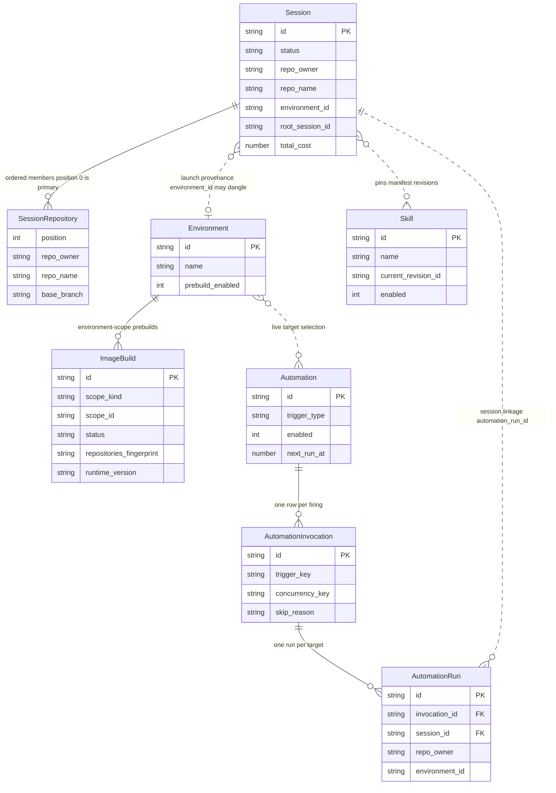

# Data Model & Storage

Open-Inspect splits durable state across two SQLite databases with deliberately different shapes:

1. **Shared D1** (`env.DB`) — the cross-session system of record: the sessions index, repository metadata, environments, image builds, automations, encrypted secrets, managed skills, users and identities, and model-provider accounts. Anything more than one session needs to query, list, or fan out over lives here.
2. **Per-session Durable Object SQLite** (`ctx.storage.sql`) — the hot session state: participants, the prompt queue, the agent event log, artifacts, sandbox credentials, and per-repository git state. Each `SessionDO` owns exactly one embedded database, giving high performance without cross-session contention.

The two are kept intentionally different in kind: D1 is accessed through the async `SqlDatabase` port (`src/db/sql-database.ts`), while the DO's `SqlStorage` is a synchronous, load-bearing engine that the port deliberately does not cover (`src/session/sql-storage.ts`). Readers wanting the runtime behavior built on top of these tables should see [Control Plane Worker](/openwiki/architecture/control-plane-worker.md) and [Session Durable Object](/openwiki/architecture/session-durable-object.md).

## The two storage layers

Core shared-state entities in D1 and their relationships. Per-session hot state (participants, messages, events, artifacts, sandbox) lives inside each Session Durable Object's embedded SQLite and is not shown.

All shared-state SQL flows through one engine-neutral port, `SqlDatabase` (`src/db/sql-database.ts`):

- `D1Database` satisfies the port structurally (compile-time-asserted in the same file); there is no runtime wrapper for the raw handle.
- `batch()` must execute its statements in order as a **single atomic transaction** — all effects or none, one consistent snapshot, positional results. Delete-then-insert replacement writes and multi-query analytics reads rely on this.
- `meta.changes` is a **required** result field: roughly 38 store call sites gate correctness on affected-row counts (CAS conflict detection, guarded lifecycle transitions, insert-vs-update detection). An engine that omits it would make successful writes report failure.

On top of the port sit per-aggregate stores in `src/db/` — `SessionIndexStore`, `EnvironmentStore`, `AutomationStore`, `ImageBuildStore`, `SkillStore`, `UserStore`, the secrets stores, and so on. Each takes a `SqlDatabase`, keeps snake_case rows in the database and camelCase types at the API boundary, and owns its table-specific SQL. The router injects `instrumentD1(env.DB, metrics)` (`src/db/instrumented-d1.ts`), a transparent wrapper that records per-query timing and rows read/written into the request's wide event; stores never know the difference.

## Migrations

### D1 migrations (shared schema)

Schema files live in `terraform/d1/migrations/`, named `NNNN_description.sql` with a numeric prefix that is the tracked version (currently 0001–0070). They are applied by `scripts/d1-migrate.sh <database-name>`:

1. The script validates filenames first — a file without a leading numeric prefix cannot be tracked, and two files sharing a prefix would mean one is silently skipped forever, so both fail fast before anything runs.
2. It ensures a `_schema_migrations (version, name, applied_at)` ledger table, then reads the applied `(version, name)` pairs. A version already recorded under a *different* filename is an error (downstream installations may have used the same number), so renames are caught before apply.
3. Each pending migration is copied to a temp file, the ledger `INSERT` is appended, and the combined file is submitted in one `wrangler d1 execute --remote --file`. D1 executes the file atomically: a failed migration rolls back, and a lost client response is safe to retry because a committed migration always has its ledger row.

Terraform drives the script: `terraform/environments/production/d1.tf` declares a `null_resource` whose trigger is the sha256 over the sorted migration file set, so `terraform apply` re-runs `d1-migrate.sh` whenever any migration file changes (and skips it otherwise). D1 read replication is explicitly disabled for this database.

Integration tests apply the same migrations automatically. `vitest.integration.config.ts` loads the directory with `readD1Migrations()` into a `TEST_MIGRATIONS` binding, and the setup file `test/integration/apply-migrations.ts` calls `applyD1Migrations(env.DB, env.TEST_MIGRATIONS)` before any test runs. Every integration test therefore exercises the real schema, which is why **a new table needs both a migration file and store updates** — adding only the store would pass typecheck and fail at runtime against the migrated D1. Migration-authored backfills are written guarded (`NOT EXISTS` / `IS NULL`) so they are the idempotent roll-forward repair path, while the schema-changing statements in the same file are applied exactly once (SQLite has no `ADD COLUMN IF NOT EXISTS`; see the header of migration 0030).

A worked example of the migration discipline: migrations 0039/0040 replaced the per-kind `repo_images`/`environment_images` tables with the unified `image_builds` registry, copying environment rows verbatim (they already carried fingerprints) and dropping the old tables. Because the control-plane scheduler naturally rebuilds every enabled scope, no legacy backfill job was required.

### Durable Object migrations (per-session schema)

`src/session/schema.ts` owns the DO schema with a two-path design:

- `SCHEMA_SQL` gives fresh DOs the complete current schema.
- `MIGRATIONS` is an ordered list of numbered migrations tracked in a DO-local `_schema_migrations (id, applied_at)` table, applied to existing DOs on first touch.
- `initSchema(sql)` = `SCHEMA_SQL`, then `applyMigrations`, then the index set; `SessionDO.ensureInitialized()` calls it on every activation (first touch after construction or eviction), so an evicted-and-rehydrated DO is always at the current schema before its runtime graph is built.

The two paths are kept from diverging by sharing SQL constants: e.g. `SESSION_REPOSITORIES_TABLE_SQL` is used both inside `SCHEMA_SQL` and as migration 31, and a unit test asserts both fresh and migrated DOs get the table. `runMigration` swallows *only* "duplicate column"/"already exists" errors and rethrows everything else; string migrations are ALTER statements, while function migrations execute directly and must be written idempotently because a crash between execution and recording can re-run them. Index creation runs after migrations so indexes can safely reference columns legacy tables lack.

## Shared D1 schema

### Sessions index

`sessions` (migration 0002, extended by many later migrations) is the queryable session index, migrated from KV. One row per session carries: `id`, `title`, the **scalar primary-repository mirror** (`repo_owner`, `repo_name`, `base_branch`), `model`/`reasoning_effort`, `status`, lineage (`parent_session_id`, `spawn_source`, `spawn_depth`, and `root_session_id` — added in 0063 with a cycle-safe recursive backfill that tolerates corrupt parent chains), automation linkage (`automation_id`, `automation_run_id`), launch provenance (`environment_id`, FK-less so a deleted environment leaves a benignly dangling id), analytics mirrors (`scm_login`, `user_id`, `total_cost`, `active_duration_ms`, `message_count`, `pr_count`), and the all-or-none `latest_terminal_message_*` triple (0055, enforced by a `CHECK`). Partial indexes serve the hot lookups: status+updated, per-repo, per-user (with a non-automation variant, 0054), and root-lineage scans.

`session_repositories` (0032) holds the full ordered member set: one row per member with a `position` column — **position 0 is the primary**, which list-created sessions also mirror into the scalar columns. The table is `ON DELETE CASCADE` from `sessions`. Pre-feature sessions have no rows here; readers synthesize a one-entry list from the scalar columns.

`SessionIndexStore` (`src/db/session-index.ts`) is the store over these tables and enforces the schema's core invariants at the boundary:

- `create()` validates that `repoOwner`/`repoName` are present together (both lowercased and trimmed, blank pairs nulled), requires that a supplied `providerAuth` snapshot is complete across every subscription provider, and then writes the session row, the `session_repositories` rows, the pinned skill manifest, and the provider-auth rows in **one atomic `db.batch`**. A skipped insert (0 changes) throws rather than silently half-creating a session, because `initialize.ts` relies on D1 failures being caught before any sandbox spawns.
- The **row-0-mirrors-scalars** invariant is enforced at creation: `initializeSession` throws when `repositories[0]` does not match the scalar repository fields.
- `updateStatus` only applies monotonic `updated_at` values (`AND updated_at <= ?`), protecting the index from out-of-order async writes; `repairStatus` and `archiveOrphanedDraft` are the deliberately unguarded repair paths used by the abandoned-draft sweep.
- `acquireChildAdmissionLease` claims parent concurrency capacity in `child_admission_leases` (0058) with a 5-minute TTL, counting live children plus unexpired leases against `maxConcurrentChildren` in a single guarded statement.

The index is also the routing authority: the WebSocket upgrade path answers 404 for a session id absent from `sessions` before any Durable Object is resolved.

Two adjacent tables extend the index:

- `session_pull_requests` (0041) — D1 is the **queryable authority record** for PRs created by sessions; the DO's `pr` artifact is a live-view mirror. One row per PR keyed by the DO artifact id, with a `lifecycle_state IN ('open','closed','merged')` CHECK, a draft-only-while-open invariant, and a monotonic `provider_updated_at` guard on every upsert. Canonical identity is `(repository_external_id, pr_number)` with a legacy `(repo_owner, repo_name, pr_number)` fallback for rows that predate external-id capture.
- `session_read_states` (0055) — per-user last-read message per session, cascading from both `users` and `sessions`.

`repo_metadata` (0002) is the repository catalog: description, aliases, Slack channel associations, plus `image_build_enabled` (0010, the per-repo prebuild toggle) and `default_environment_id` (0036, the GitHub-bot workspace redirect).

### Environments and secrets

`environments` (0033) is a named, prebuildable repository set: `environment_repositories` stores the ordered members (1–10) with per-repository `base_branch`, and the environment name is unique case-insensitively (the stable `env_<id>` is what Slack/Linear targets reference). The cascade model is deliberate:

- `environment_repositories` and `environment_secrets` are owned children with `ON DELETE CASCADE` — deleting an environment reclaims them.
- `image_builds` rows for the scope are **superseded, not cascaded** (FK-less on purpose), so the cleanup reaper can still find and delete provider-side artifacts after the entity is gone. `EnvironmentStore.delete` composes the whole cascade — repository rows, secret rows, superseding `building`/`ready` builds, then the environment row — into one `db.batch`.
- `sessions.environment_id` is FK-less; sessions created from an environment keep their snapshot members and a dangling provenance id after the environment is deleted.

Secrets have three scopes with one shared store plumbing: `global_secrets` (0004), `repo_secrets` (0001, keyed by `(repo_id, key)`), and `environment_secrets` (0033, mirroring `repo_secrets` with the same caps). All three encrypt with the same `REPO_SECRETS_ENCRYPTION_KEY` and go through `src/db/scoped-secrets.ts` (see [Encryption at rest](#encryption-at-rest)); only the encryption bookkeeping and row codecs are shared — each store keeps its own SQL and API.

### Image builds

`image_builds` (0039, extended by 0052) is the **unified prebuilt-image registry** for both scope kinds: `scope_kind` is `repo` (`scope_id` = lowercase `owner/name`) or `environment` (`scope_id` = environment id). Rows carry the provider artifact id, the per-repository SHAs (`repository_shas`, a JSON `[{repoOwner, repoName, baseSha}]` document), the `repositories_fingerprint` used for spawn matching, the `runtime_version` (the `SANDBOX_VERSION` at build time, checked against the compatibility floor), the status machine `building | ready | failed | superseded`, callback-token state (hash only, expiry, `used_at`), Queue-finalization lease state (`completion_hash`, `finalization_lease_token`, `finalization_lease_expires_at`), and `provider_session_cleanup_pending` for provider-session reclamation. The table is FK-less so deletes supersede rather than cascade.

`ImageBuildStore` + `ImageBuildFinalizationStore` implement the state machine with conditional SQL:

- `registerBuild` is the authoritative concurrency-1 gate: a single `INSERT … SELECT … WHERE NOT EXISTS (a building row for the same scope+provider)` — atomic within one statement, so concurrent triggers cannot both insert. The provider session is then bound with `bindProviderSession`, which also sets `provider_session_cleanup_pending = 1`.
- Callback acceptance is a conditional `UPDATE` requiring the exact bound `provider_session_id`, a matching (hash-compared, unexpired, single-use) callback token, and `status = 'building'`. An exact duplicate is reported as a replay (safe republish after a lost HTTP response); any conflicting or stale callback is rejected without touching the row.
- Finalization happens off the request path: the accepted row is finalized by a Queue consumer that claims an exclusive lease (expired leases may be replaced), then transitions the row to `ready`/`superseded`/`failed` and performs idempotent provider-session cleanup. Sweep queries (constants like `MARK_STALE_IMAGE_BUILDS_SQL`, `PROVIDER_SESSION_CLEANUP_SQL`, `SUPERSEDED_IMAGES_SQL`) reap stale builds, timed-out `building` rows, superseded artifacts, and failed artifacts; migration 0053 adds the matching partial indexes.

At spawn time a session boots from its scope's ready image only if the image's fingerprint equals the fingerprint of **the session's own repository snapshot** (not the scope's current repositories) and its `runtime_version` passes `MIN_COMPATIBLE_RUNTIME_VERSION` — the floor fails closed on an unparseable version. Any miss falls back to the base image; sessions are never blocked on builds.

### Automations

The automation model separates configuration, firing, and per-target work (see [Automations](/openwiki/workflows/automations.md) for the workflow behavior):

- `automations` (0013, reshaped by 0029/0031) holds the trigger configuration — `trigger_type`, `schedule_cron`/`schedule_tz`, `event_type`, JSON `trigger_config` and encrypted `trigger_auth_data` — plus model/instructions, `enabled`, `next_run_at`, `consecutive_failures`, and soft delete (`deleted_at`). The scalar repository columns were dropped in 0031; the live selection lives only in the normalized tables.
- `automation_repositories` (0030) and `automation_environments` (0037) are the live target selection — 0–10 combined rows, unique per `(automation_id, repo_owner, repo_name)` and per `(automation_id, environment_id)`. Zero rows is a repo-less automation; behavior derives from the data.
- `automation_invocations` (0030) is one **thin row per firing**: `source` (`schedule` | `manual` | `event`, distinct from the configured trigger type), `scheduled_at` (the cron slot, required for schedule sources by CHECK), the firing-scoped `trigger_key` (event dedup — `UNIQUE (automation_id, trigger_key) WHERE trigger_key IS NOT NULL`), `concurrency_key` (the per-key overlap scope), `trigger_metadata`, `skip_reason` (present ⇔ a skipped, childless firing), and `failure_counted_at` — the compare-and-set anchor that makes auto-pause accounting exactly-once no matter how many callbacks race. A partial unique index on `(automation_id, scheduled_at)` for schedule sources dedups cron double-fires. **Status is never stored** on the invocation.
- `automation_runs` is the per-target, session-linked unit: one row per repository or environment per invocation, required by 0059 to have a `NOT NULL invocation_id` (table-rebuild migration that aborts on malformed rows rather than inventing data). Each run snapshots its target at firing time (`repo_owner/repo_name/repo_id/base_branch`, or `environment_id`), so history is self-contained: editing the selection can never rewrite the past, which is why there is no edit-while-active guard. Unique indexes enforce at most one run per repository and per environment per invocation.

Two mechanisms make firings safe:

- **Derived status.** `DERIVED_INVOCATION_STATUS_SQL` in `automation-store.ts` is the single SQL definition of invocation status, aggregated over child runs: no children → `skipped`; any active child → `starting` until one leaves `starting`, then `running`; all terminal → `completed` (no failures), `failed` (no completions), `partial_failed` (a mix), or `skipped` (all skipped). A TypeScript twin (`deriveInvocationStatus`) mirrors it and integration tests assert the two agree. Deriving rather than storing removes the whole "crash between last child completing and parent updating" wedge class.
- **Guarded batch insertion.** `insertInvocationGuarded` creates the invocation, its children, and the schedule advance in **one D1 batch** where every statement is self-guarded: the invocation insert is suppressed when an overlap predicate matches (automation-wide for schedule/manual, per `concurrency_key` for events); child inserts are no-ops when the invocation was suppressed; the schedule advance is a compare-and-set on the claimed cron slot (`WHERE next_run_at = ?` — deliberately not "any later value wins", which would let a loser skip a slot). A `UNIQUE` violation (cron double-fire, event dedup) rolls back the whole batch including the advance, and callers classify it via `isDuplicateKeyError`.

`automation_slack_channels` (0026) is the watched-channel join table that lets Slack event selection find candidate automations by channel instead of scanning and JSON-parsing every trigger config.

### Managed skills

Migration 0061 introduced the skills subsystem (operations in `src/db/skills.ts`):

- `skills` is the mutable catalog row (`enabled`, soft delete, `current_revision_id`); content is **immutable** in `skill_revisions` (`UNIQUE (skill_id, revision_number)`, content sha256, body, metadata) with files in `skill_revision_files`. Triggers abort any `current_revision_id` that does not belong to the skill.
- `skill_assignments` grants applicability with exactly one of `global` / `repository` / `environment` scope shapes (CHECK-enforced). Assignment writes — and environment renames that affect provenance — advance the `skills_catalog_state` singleton `generation`, which session skill resolution uses to retry consistent snapshots.
- `skill_import_sources` (0069) records per-revision import provenance (provider, repo, resolved ref, commit sha, source digest).
- `skill_profiles` / `skill_profile_items` are per-user named filters over the catalog. Profiles do **not** grant applicability — resolution intersects their ids with enabled skills assigned to the session target — and profile writes also bump the shared generation.
- `session_skill_manifests` + `session_skill_revisions` pin the immutable resolved set per session (selection mode, resolver version, manifest sha256, per-revision provenance). The manifest is written **atomically inside the session-creation batch** (`SessionIndexStore.create`) or copied verbatim from a parent session for agent-spawned children, so a session can never exist without a consistent pinned manifest.

### Integration settings

Integration settings resolve through three layers, lowest precedence first: `integration_settings` (0007, global defaults keyed by `integration_id`), `integration_repo_settings` (0007, per-repo overrides keyed by `(integration_id, repo)`), and `integration_environment_settings` (0038, the top layer keyed by `(integration_id, environment_id)`, `ON DELETE CASCADE` from environments). Only the session-scoped integrations (`sandbox`, `code-server`) accept the environment level; the store's `supportsEnvironmentSettings` enforces that allowlist. Settings are JSON, validated against per-integration zod schemas on both write and read.

### Users, identities, and auth tokens

- `users` + `user_identities` (0019, `src/db/user-store.ts`) is the canonical user model: one canonical record per person, with free-form `provider` identity links unique per `(provider, provider_user_id)` — no CHECK, so new auth/SCM providers need no migration. `sessions`, `automations`, and `user_scm_tokens` all gained a nullable `user_id` for attribution.
- `verified_email_claims` and `browser_auth_sessions` (0047) hold mailbox-ownership proofs and browser session tokens (hash-at-rest) with absolute-expiry and revocation CHECKs.
- `auth_users` / `auth_sessions` / `auth_accounts` / `auth_verifications` (0048) are generated from the exact-pinned Better Auth configuration. Since the #1290 consolidation (0057) Better Auth's account model **is** `user_identities` — the OAuth credential columns (`access_token`, `refresh_token`, `id_token`) live there, written as ciphertext because the runtime enables `encryptOAuthTokens` (Better Auth encrypts with its own secret, `BROWSER_AUTH_SECRET`); `auth_sessions` keeps browser sessions.
- `api_tokens` (0044) are control-plane-issued opaque credentials (web session + refresh kinds) — hash-at-rest, with a rotation `family_id`, `rotated_to` successor pointer, family expiry cap, and a plain `expires_at` index for the retention sweep.

### Model provider accounts

Migration 0064/0065 define subscription-provider account storage:

- `model_provider_accounts` — one row per linked account, `status IN ('active','disabled','reconnect_required')`, a unique external identity per provider among non-archived rows, and a `lifecycle_version` (0065) for optimistic concurrency.
- `model_provider_account_credentials` — the `encrypted_payload` plus a versioned credential schema and a strict `exchange_state` machine (`idle` ⇔ `in_flight` with owner and started-at, CHECK-enforced) so token exchanges are fenced.
- `model_provider_account_defaults` — one default account per provider, with a trigger that refuses to disable/archive an account while it is the default.
- `session_model_provider_auth` — the per-session immutable auth snapshot (`provider_account` | `api_key` | `legacy_scoped_oauth` modes, CHECK-constrained on whether an account id is present). Sessions remain pinned to their stored mode.
- `model_provider_account_authorizations` — the device-flow authorization state machine, heavily CHECK-constrained (operation shape, polling interval, state-to-column dependencies, terminal-state cleanup).

`src/db/model-provider-account-atomic-writer.ts` composes these stores so account + credential + default are written in **one `db.batch`**, and reconnects verify both the expected credential version and account state in the same batch — a failed exchange can never leave a half-connected account.

### Other shared tables

- `mcp_servers` (0018, `revision` added in 0062) — managed MCP server configs; env/header values are encrypted with `REPO_SECRETS_ENCRYPTION_KEY`.
- `commit_signing_configuration` (0043) — singleton commit-signing config with the encrypted private key.
- `model_preferences` (0006), `keyboard_shortcut_preferences` (0067) — deployment-wide and per-user preferences.
- `pr_autofix_feedback` (0070) — durable receipt/decision ledger for PR feedback Autofix (execution admission stays authoritative in the owning DO).
- `api_tokens`-adjacent sweeps, `repo_secrets`/`global_secrets` covered above.

## Per-session Durable Object SQLite schema

`SCHEMA_SQL` (`src/session/schema.ts`) defines the hot-state tables created inside every session DO:

| Table | Contents |
| --- | --- |
| `session` | Core state: external name, title, scalar primary repo mirror, per-session model/reasoning default, `status` (`created`, `active`, `completed`, `failed`, `archived`, `cancelled`), lineage (`parent_session_id`, `spawn_source`, `spawn_depth`), `code_server_enabled`/`vnc_enabled`, `total_cost`, resolved `sandbox_settings` JSON, `environment_id` provenance, `opencode_session_id`. A CHECK requires `repo_owner`/`repo_name` to be null together and no-repo sessions to lack branch context. |
| `participants` | Session members with SCM identity for git attribution, **AES-GCM-encrypted** `scm_access_token_encrypted` / `scm_refresh_token_encrypted`, and `ws_auth_token` stored as a SHA-256 hash. |
| `messages` | Prompt queue and history: `status` (`pending`/`processing`/`completed`/`failed`), per-message model/reasoning overrides, Slack callback context, web idempotency (`client_request_id` unique partial index), Autofix dedup keys, `stop_confirmation_deadline`. A unique partial index enforces **at most one `processing` message per session**. |
| `events` | Append-only agent event log (tool calls, tokens, errors) with a `UNIQUE timeline_sequence` for stable ordering and cursoring. |
| `artifacts` | PRs, screenshots, videos, preview URLs; `updated_at` tracks PR lifecycle content changes. |
| `attachments` | Chat composer attachments in the media bucket; `message_id` links once referenced, unreferenced rows are TTL-pruned together with their R2 objects. |
| `sandbox` | The selected backend sandbox: provider ids, snapshot ids, `runtime_version` and `snapshot_runtime_version` (the restore compatibility floor), sandbox auth token (hash preferred), the status machine (`pending` → `spawning` → `connecting` → `warming` → `ready`, plus `stale`/`snapshotting`/`stopped`/`failed`), `git_sync_status`, heartbeats, and a spawn-failure circuit breaker (`spawn_failure_count`). Code-server/VNC tunnel URLs and passwords rotate on wake/restore. |
| `session_repositories` | Multi-repo members **including per-repo git state** (`branch_name`, `base_sha`, `current_sha`) — the identity subset is mirrored to D1; git state is DO-only. The same SQL constant feeds both this table and migration 31. |
| `session_diff` | Singleton holding the latest durable checkout diff bundle (the only home of source patches). |
| `session_alarm_state` | Singleton persisting alarm scheduling state so a DO that can be adopted by another host can recover its alarms. |
| `ws_client_mapping` | WebSocket id → participant mapping, letting hibernation-recovered connections be re-authenticated. |

The DO schema is a superset of what D1 stores for a session: D1's `session_repositories` deliberately carries no git state ("D1 doesn't store it"), and the event log, prompt queue, and sandbox credentials never leave the DO.

### Keeping D1 and the DO consistent

The DO is the live authority; D1 is a projection of selected facts. `SessionStatusService` is the single place every status transition fans out — connected clients, the D1 index (status plus terminal metrics), and the parent DO (child rollup) — and the D1 writes are monotonicity-guarded as described above. The abandoned-draft sweep repairs drafts whose index row drifted (D1 says `created`, the DO disagrees or does not exist). Session creation writes D1 **first** so a failed index write is caught before any sandbox is spawned, then initializes the DO.

## Encryption at rest

Stored credentials are protected by independent key domains; rotation guidance differs per key and they must never be treated as interchangeable during an incident.

- **`TOKEN_ENCRYPTION_KEY`** — AES-256-GCM via `encryptToken`/`decryptToken` in `src/auth/crypto.ts` (256-bit key, 96-bit random IV, base64 `IV || ciphertext`). It protects the SCM enrichment tokens: participant tokens in the DO `participants` table and the `user_scm_tokens` refresh-token store in D1. Rotating it invalidates stored SCM tokens; affected users re-link.
- **`REPO_SECRETS_ENCRYPTION_KEY`** — the single key for all three secret scopes (`global_secrets`, `repo_secrets`, `environment_secrets`), and also for other stored control-plane secrets: automation `trigger_auth_data` (e.g. encrypted Sentry client secrets), MCP server env/header values, and the commit-signing private key. `src/db/scoped-secrets.ts` owns the scope-independent plumbing: `prepareSecretsForWrite` (normalize, validate, enforce the per-scope total-value cap, reject two raw keys that normalize to one), `assertScopeKeyCapacity` (the 50-keys-per-scope cap), `encryptSecretEntries`, and `decryptSecretRows` (parallel decrypt; `SecretDecryptionError` carries the failing key, never plaintext or ciphertext).
- **`BROWSER_AUTH_SECRET`** — Better Auth's secret; signs browser session cookies **and** encrypts the OAuth credential columns on `user_identities` (via `encryptOAuthTokens: true` in the Better Auth configuration). Rotating it signs every browser session out and orphans those stored credentials (they re-populate at next sign-in); it does not affect `user_scm_tokens`.
- **`PROVIDER_ACCOUNTS_ENCRYPTION_KEY`** — dedicated AES-256-GCM key for subscription-provider credentials, implemented in `src/auth/provider-account-crypto.ts` with a versioned envelope (`v1.<iv>.<ciphertext>`) and **additional authenticated data binding** the provider account id, provider, and credential schema version — ciphertexts cannot be replayed under a different account context. Rotation requires an explicit migration that re-encrypts every credential while both keys are available; reconnecting accounts does not migrate already-encrypted rows.

`src/db/secrets-validation.ts` enforces the key rules that gate every secret write: keys must match `[A-Za-z_][A-Za-z0-9_]*`, max 256 characters, from a reserved-key blocklist (system env vars like `SANDBOX_AUTH_TOKEN`, `PATH`, `GITHUB_APP_TOKEN`); values max 16 KB; max 50 keys and 64 KB total per scope. `mergeSecretSources` folds the ordered per-session sources (global, then repositories/environments) lowest-precedence-first — the primary repository is passed last so it wins collisions — with per-source byte attribution, and rejects a merged payload over the 128 KiB session cap.

Key validation is fail-closed: `src/env-validation.ts` requires each encryption key to be present, strict base64, and exactly 32 bytes (so a malformed key fails at startup rather than mid-spawn, and a short key cannot silently downgrade to AES-128/192).

## Operating the schema

- **New D1 table/column:** add a `NNNN_description.sql` file to `terraform/d1/migrations/`, add or extend the store in `src/db/`, and rely on the integration tests to exercise the real migrated schema. Backfills must be guarded to stay idempotent; the deploy path re-runs automatically via Terraform's content-hash trigger.
- **New DO column/table:** add it to `SCHEMA_SQL` (fresh DOs) *and* append a numbered entry to `MIGRATIONS` (existing DOs), sharing a SQL constant when the shape must match exactly.
- **Manual apply / inspection:** `scripts/d1-migrate.sh <database-name>` applies pending migrations and prints per-file skip/apply status; the `_schema_migrations` ledger in each database is the source of truth for what has run.
