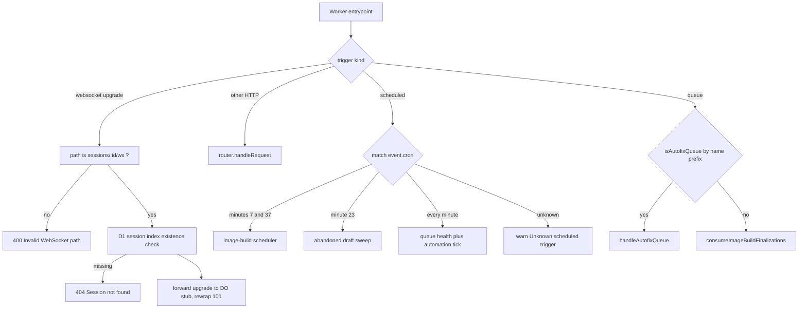
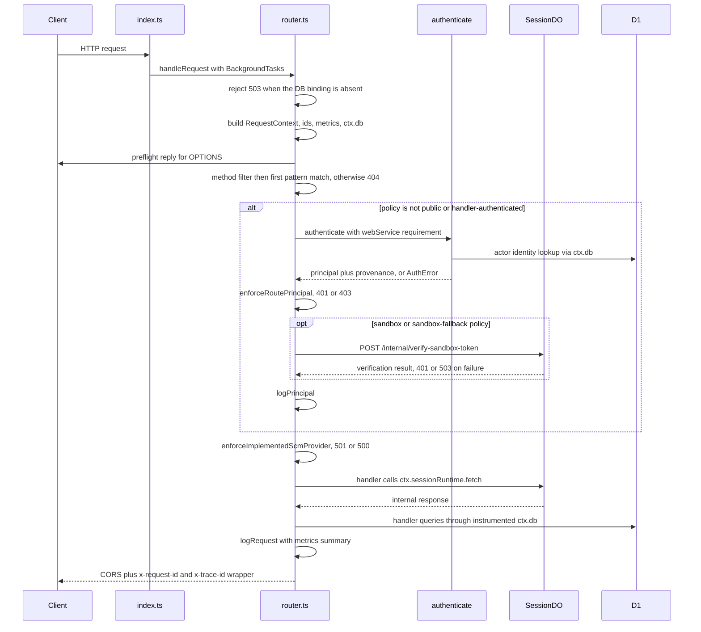

# Control Plane Worker: Entrypoint, Router, and Route Policies

The control plane is a single Cloudflare Worker script (`packages/control-plane/src/index.ts`, bundled by
esbuild) exposing three runtime entrypoints — `fetch`, `scheduled`, and `queue` — plus one Durable Object
class (`SessionDO`) re-exported for the runtime to discover. Everything HTTP is delegated to a declarative
router (`src/router.ts`) whose route table carries two pieces of policy per endpoint: which authentication
class admits the request, and which source-control providers the deployment implements for it.

## Entrypoints

### `fetch`: WebSocket branch vs. API branch

`fetch` splits on the `Upgrade: websocket` header before the router is ever reached:

- **API branch** — `handleRequest(request, env, createCloudflareBackgroundTasks(ctx))`. The router owns
  logging, authentication, policy, and the response header wrapper.
- **WebSocket branch** — `handleWebSocket()`. Only `/sessions/:id/ws` (exact regex
  `^/sessions/([^/]+)/ws$`) is accepted; any other upgrade path is a plain `400`. The branch builds its own
  `RequestMetrics` and instrumented D1 handle, checks the D1 session index (`SessionIndexStore.exists`) and
  returns `404` for an unknown session, then forwards the original request to the session Durable Object
  stub (`env.SESSION.get(env.SESSION.idFromName(sessionId)).fetch(request)`). If the DO answers with a
  `webSocket`, the worker rewraps it as a `101` carrying only
  `Access-Control-Allow-Origin: *`.

Because the WebSocket branch bypasses `handleRequest`, it gets **no** route policy, no CORS preflight
handling, no `x-request-id` / `x-trace-id` response headers, and no `http.request` log line. Admission for a
browser client is decided inside the DO (`type=sandbox` upgrades are checked against the stored sandbox id +
token hash; client sockets must later authenticate with a ws-token before the auth-timeout closes them).
The DO-side upgrade handler is reached through `SessionHttpDispatcher.dispatch`, which special-cases
`Upgrade: websocket` before its internal route table.

### `scheduled`: the cron dispatch table

`scheduled()` is a string-comparison dispatch on `event.cron`. The schedules are declared outside the source,
so Terraform must keep them in lock step with the exported constants —
`terraform/environments/production/workers-control-plane.tf` sets
`cron_triggers = ["* * * * *", "7,37 * * * *", "23 * * * *"]` with a comment naming the two constants it has
to mirror.

| Cron | Handler | Responsibility |
| --- | --- | --- |
| `7,37 * * * *` (`IMAGE_BUILD_SCHEDULER_CRON`) | `runImageBuildScheduler(env, env.DB, {request_id, trace_id})` | Image-build maintenance: republish recoverable finalizations to the queue, mark stale builds failed, clean provider sessions, reconcile scopes/branch drift, reap artifacts. Each phase is individually try/caught so one failure cannot abort the tick; the tick ends with an `image_build.scheduler_tick` stats line. |
| `23 * * * *` (`ABANDONED_DRAFT_SWEEP_CRON`) | `new AbandonedDraftSweep(new SessionIndexStore(env.DB), new SessionDraftExpiryClient(env.SESSION), logger).run(Date.now())` | Archives warm sessions left in `created` for 8 h with no prompt, capped at 50 candidates per run. Its own cron is deliberate: retention is measured in hours, and the schedule is offset from the image-build cron so the two never fire together. |
| `* * * * *` | `ctx.waitUntil(checkAutofixQueueHealth(env, logger))` then `new Scheduler(env.DB, env, createCloudflareBackgroundTasks(ctx)).tick()` | The automation tick: recovery sweep of orphaned/timed-out runs first, then overdue automations bounded by `MAX_PER_TICK` and a `TICK_CHILD_LAUNCH_BUDGET`. Queue health is fire-and-forget so it cannot delay launches. |
| anything else | `logger.warn("Unknown scheduled trigger", { cron })` and return | Misconfiguration surfaces in logs instead of silently running the wrong handler. |

`checkAutofixQueueHealth` reads only queue *metrics* from the `AUTOFIX_QUEUE` / `AUTOFIX_DLQ` bindings and
emits `autofix.queue_health` errors for a non-empty DLQ, a primary backlog over 25, or an oldest message
older than 5 minutes.

Integration tests drive the entrypoint directly to prove the dispatch table rather than the handlers
(`test/integration/abandoned-draft-sweep.test.ts`, `test/integration/image-build-scheduler.test.ts`).

### `queue`: two consumers, one entrypoint

Both the GitHub Autofix queue and the image-build finalization queue name the control-plane worker as their
consumer, so `queue()` must route by `batch.queue`:

```ts
if (!isAutofixQueue(batch.queue)) { await consumeImageBuildFinalizations(batch, env); return; }
await handleAutofixQueue(batch as MessageBatch<GitHubAutofixEnvelope>, env, env.DB);
```

`isAutofixQueue` matches the *prefix* `open-inspect-github-autofix-` rather than a substring, precisely so a
deployment named `...-github-autofix-test` does not send its
`open-inspect-image-build-finalization-github-autofix-test` batch to the Autofix consumer. The finalization
consumer applies Cloudflare delivery semantics per message: schema-invalid jobs are acknowledged and
discarded, `retry` results are retried with a delay, thrown errors retry with a fixed delay, and one bad
message never aborts the rest of the batch.



*Caption: The three Worker entrypoints and their dispatch branches, including the cron string comparisons.*

## `RequestContext`

`handleRequest` builds one `RequestContext` per request and passes it to authentication, policy checks, and
the handler. It is the correlation, observability, and dependency-injection seam of the whole HTTP surface:

- `trace_id` — end-to-end UUID, **honoured from the incoming `x-trace-id` header** so a request that
  originated in the web app or a bot stays joinable across services; otherwise newly generated.
- `request_id` — a short (8-char) per-hop id, always freshly generated.
- `metrics: RequestMetrics` — a per-request accumulator. Named spans recorded with `metrics.time(name, fn)`
  (e.g. `do_fetch`, `kv_read`, `scm_api`) plus D1 totals are spread into the single `http.request` wide event
  at the end of dispatch.
- `db: SqlDatabase` — `instrumentD1(env.DB, metrics)`, the only database handle handlers may use. Every
  `run`/`all`/`first`/`batch` is timed and its `meta` (server duration, rows read/written) recorded.
- `executionCtx: BackgroundTasks` — the platform-neutral `submit(task, {name, context})` capability, created
  in `index.ts` from `ctx.waitUntil`. The factory is invoked synchronously; a synchronous throw or a
  rejection is absorbed and logged as `background_task.failed`, so deferred work can never fail the caller.
  Handlers use it for post-response writes such as `session_index.touch_updated_at` and PR lifecycle
  tracking.
- `getUserAuth` / `getUserAuthRuntime` — lazy Better Auth accessors. Both are keyed on the **raw** `env.DB`
  object rather than the instrumented wrapper, because the runtime is memoized in a `WeakMap` on the
  database instance and a per-request wrapper would rebuild it on every request.
- `principal?: Principal` and `authentication?: AuthenticationContext` — kept deliberately separate. The
  *principal* is the verified identity being authorized (`user` / `service` + asserted `actor` / `sandbox`);
  *authentication* is the provenance of a browser request (mechanism, credential id, `sig1` channel via the
  `web` service). Handlers that derive identity must go through `applyIdentityEnforcement`, which rejects
  caller-asserted identity body fields.

The principal is only ever assigned by the router — `verifySandboxAuth` is the single place a `sandbox`
principal is assembled, and `authenticate()` is the single place user/service principals are assembled.

## Response wrapper, logging, and error mapping

Every router-produced response after context construction (404, 401, 403, 500, 501, 503) passes through
`withCorsAndTraceHeaders`, which sets `Access-Control-Allow-Origin: *` plus `x-request-id` and `x-trace-id`
so a client can quote the ids back when reporting a failure. The one exception is the early
`503 Database not configured` guard, which returns before the context exists and therefore carries no
correlation headers. `withRouteCachePolicy` separately applies the route's `cacheControl`
(`"no-store"` or `"private, no-store"`); it is applied even to authentication failures, which is why a `503`
from an unreachable DO still carries `no-store` on broker routes.

`OPTIONS` is answered before route matching with the preflight header set (methods
`GET, POST, PUT, PATCH, DELETE, OPTIONS`, headers `Content-Type, Authorization`, max age 86400) plus the
correlation ids.

Logging is split in two: `logPrincipal` emits one `auth.principal` line per authenticated request naming the
verified identity (`principal_kind`, `service`, `actor`, `user_id`, or `session_id`) and **never token
material**; `logRequest` emits one `http.request` line with method, path, status, `duration_ms`,
`outcome` (`error` when status >= 500), and `ctx.metrics.summarize()`.

Handler failures funnel through one place: a thrown `HttpError` from `routes/shared.ts` becomes
`error(message, status)`, and any other throw is logged with its error and answered `500 Internal server
error`. Handlers therefore return `Response` values or throw; they never build `| Response` unions for
helpers.

## The declarative route table

`routes: Route[]` in `router.ts` is a flat array built by spreading each feature module's exported route
list (`browserAuthRoutes`, `sessionRoutes`, `reposRoutes`, `secretsRoutes`, `environmentRoutes`,
`imageBuildRoutes`, `automationRoutes`, `analyticsRoutes`, `autofixRoutes`, `skillRoutes`,
`webhookRoutes`, …), preceded by the `GET /health` public route. A `Route` is
`RouteDefinition & RoutePolicy`:

```
RouteDefinition: { method, pattern: RegExp, cacheControl?, handler(request, env, match, ctx) }
RoutePolicy:     { authentication: RouteAuthentication, supportedScmProviders: "all" | SourceControlProviderName[] }
```

Matching is `routes.filter(method).map(pattern.match).find(...)` — **first match wins in declaration order**
within a method, and `parsePattern` turns `:name` segments into anchored named captures
(`(?<name>[^/]+)`), so `/sessions/:id` cannot swallow a longer path.

### `RouteAuthentication`

The union in `routes/shared.ts` defines exactly what the router does before a handler runs:

| Kind | Router behaviour | Typing consequence |
| --- | --- | --- |
| `public` | no authentication at all | `principal` may be undefined |
| `handler-authenticated` | router skips authentication; the handler owns credential checks | `principal` may be undefined |
| `web-service` | `authenticate(..., {webService: "service"})`, then `enforceRoutePrincipal` requires `service === "web"` | `principal` narrowed to a web service principal |
| `user` | authenticate with `{webService: "user"}` (a `service: web` signature must also carry a Better Auth session), then require a `user` principal | `principal` narrowed to `UserPrincipal` |
| `user-or-service` | authenticate; no additional principal check, and no sandbox token is ever attempted | `principal` narrowed to `UserOrServicePrincipal` |
| `sandbox` (carries `getSessionId(match)`) | **only** sandbox auth: extract the session id from the route match and verify the bearer token against the session runtime | `principal` narrowed to `SandboxPrincipal` |
| `user-or-service-with-sandbox-fallback` (carries `getSessionId(match)`) | user/service auth first; sandbox auth only as a fallback | `principal` is the full `Principal` union |

`getSessionId` is the binding that lets a path-based policy know which session a sandbox token belongs to.
The shared `SESSION_ID_BINDING` reads `match.groups.id`, which is why
`POST /sessions/:id/children/:childId/prompt` authenticates as the **parent** session — asserted by
`router.policy.test.ts`.

The sandbox check itself is a DO round-trip: `verifySandboxAuth` POSTs `{ token }` to the session runtime's
`/internal/verify-sandbox-token` internal path. A missing bearer header or a non-OK verification is `401`;
a thrown error (unreachable DO) is logged as `auth.sandbox_unavailable` and answered `503`, never `401`. On
success the router sets `ctx.principal = { kind: "sandbox", sessionId }`.

`user-or-service-with-sandbox-fallback` has one subtlety worth preserving: the fallback is attempted **only**
when the credential result reports `failedScheme === "none"`, i.e. nothing recognizable was presented. A
request that presented a malformed or mis-keyed service signature is terminal (`failedScheme: "per-service"`)
and gets `401` even on a sandbox-accepting route — otherwise a broken signature would silently downgrade to
"sandbox caller". `router.auth.test.ts` pins both directions.

Named policy constants (`GITHUB_USER_OR_SERVICE_ROUTE`, `SCM_AGNOSTIC_USER_OR_SERVICE_ROUTE`,
`SCM_AGNOSTIC_HUMAN_USER_ROUTE`, `SCM_AGNOSTIC_WEB_SERVICE_ROUTE`,
`SCM_AGNOSTIC_HANDLER_AUTHENTICATED_ROUTE`, `GITHUB_SANDBOX_FALLBACK_ROUTE`,
`SCM_AGNOSTIC_SANDBOX_FALLBACK_ROUTE`, `SCM_CREDENTIALS_ROUTE`, `SCM_AGNOSTIC_SANDBOX_ROUTE`) are the
extension point: a feature module declares handlers once and applies a policy to all of them.

### `defineRoute` / `defineRoutes`

```ts
export function defineRoute(policy, route) {
  const handler = (request, env, match, ctx) =>
    route.handler(request, env, match, ctx as RouteContext<Policy["authentication"]>);
  return { ...route, ...policy, handler };
}
```

`defineRoute` merges the policy into the route and performs the single unchecked cast that lets a handler be
written against `RouteContext<Authentication>` — so a `user` handler receives `ctx.principal.userId` without
a null test, and a `sandbox` handler receives `ctx.principal.sessionId`. `defineRoutes(policy, [...])` is the
bulk form. Because the policy is spread last, a route definition cannot override it. `router.policy.test.ts`
asserts that every entry in the exported table has non-empty `authentication` and
`supportedScmProviders` (`"all"` or a non-empty list), so adding a route without a policy fails the suite.

`sessionRoute` composes on top of this: it wraps a handler to inject `ctx.sessionRuntime`
(`createSessionRuntimeClient(env, ctx)`), which is how most `/sessions/:id/...` routes reach the DO with the
correlation ids propagated as `x-trace-id` / `x-request-id` headers.

### `supportedScmProviders` gating (501)

`enforceImplementedScmProvider` resolves the deployment's provider from `env.SCM_PROVIDER`
(`resolveScmProviderFromEnv`: blank ⇒ `github`; `github | bitbucket | gitlab`; anything else throws a
permanent `SourceControlProviderError`) and returns `501 SCM provider '<p>' is not implemented in this
deployment.` when the route's allow-list excludes it. The resolution is memoized per env value, including
the error object, so a misconfigured deployment does not re-parse per request. An invalid `SCM_PROVIDER`
yields `500` with the resolver's message — including on `public` routes such as `/health`, which is the
intended "fail loudly on a broken deployment" posture.

The gating is applied **after** authentication. The observable consequence, pinned by
`router.policy.test.ts`: an unauthenticated `GET /repos` against a `gitlab` deployment returns `401`, not
`501` — unsupported-provider information is never disclosed to an anonymous caller.

Most of the API surface carries the `GITHUB_*` policies; SCM-agnostic policies are the explicit escape hatch
for endpoints that do not touch a provider (`/sessions/:id` reads, read-state, tunnel-agnostic routes,
analytics, skills). `SCM_CREDENTIALS_ROUTE` (`["github", "gitlab"]`) is the only route that lists GitLab, and
the policy test asserts exactly that.

## Request flow



*Caption: One API request through context construction, authentication, route policy, SCM-provider gating, and the Durable Object stub fetch.*

## `env.DB` and the composition-root rule

Production code under `packages/control-plane/src` must not read the D1 binding. `eslint.config.js` installs
a `no-restricted-syntax` rule with selector `MemberExpression[property.name="DB"]` over
`packages/control-plane/src/**/*.ts` (excluding `*.test.ts`), whose message directs authors to the injected
`SqlDatabase` (`ctx.db`, a DO's `db` field, or a `db` parameter). The selector matches *any* `.DB` member
access, not just `env.DB`, and it exists so that reads cannot silently bypass dependency injection or, on
request paths, the query instrumentation.

The exemptions are composition roots, each carrying an inline `eslint-disable-next-line` with a stated
justification:

- `router.ts` — the one route-layer read: the presence check (503 when unbound), `instrumentD1(env.DB,
  metrics)` for `ctx.db`, and `env.DB` as the stable `WeakMap` key for the memoized auth runtimes.
- `index.ts` — the WebSocket branch's request-scoped adapter, the three `scheduled()` handlers, and the
  Autofix `queue()` call.
- `image-builds/finalization-consumer.ts` — the finalization queue's composition root.
- `session/durable-object.ts` — the constructor reads `env.DB ?? null` into `this.db`, distinct from the DO's
  own embedded `ctx.storage.sql`; nullability preserves the DO's defensive guards.

The missing-binding failure mode is deliberately concentrated: `handleRequest` rejects with `503 Database
not configured` once, which is what licenses every handler to assume `ctx.db` is present without
degraded-mode guards. Cron and queue roots have no equivalent guard and simply fail when the binding is
absent.

## Configuration validation that fails loudly

`src/env-validation.ts` is the eager guard for secrets-at-rest material, used at graph-construction time
(`session/components.ts` resolves both keys before building any consumer) and inside route handlers that
touch encrypted stores (`routes/mcp-servers.ts`, `session/identity.ts`). `requireEncryptionKey` validates
the *whole* contract rather than presence:

- absent ⇒ `"<NAME> is not configured; refusing to operate on <protects> without encryption at rest"`;
- not matching a strict base64 pattern (whitespace and stray characters rejected, which `atob` alone would
  tolerate) ⇒ `"not valid base64"`;
- decoded length ≠ 32 ⇒ `"must decode to 32 bytes for AES-256, got <n>"`.

The length check is the security-relevant one: a 24-byte key would otherwise have silently downgraded to
AES-192, and a 34-byte key would have thrown a `DataError` at the first secret write — mid-spawn. Both
fixtures predate the validator and are pinned in `env-validation.test.ts`. The module docstring records the
posture: misconfigured deployments fail loudly at first touch rather than running degraded, and there is no
plaintext fallback because Terraform requires the keys.

Bindings themselves are typed in `src/types.ts` (`DB`, `SESSION`, `REPOS_CACHE`, `MEDIA_BUCKET`, optional
`SLACK_BOT` / `LINEAR_BOT` service fetchers, `AUTOFIX_QUEUE` / `AUTOFIX_DLQ` /
`IMAGE_BUILD_FINALIZATION_QUEUE`, the `SERVICE_AUTH_SECRET_*` per-service keys, and the sandbox-provider and
admission variables). `packages/control-plane/wrangler.jsonc` is the test-only binding set; production
bindings, cron schedules, queue consumers, and DLQ wiring live in
`terraform/environments/production/workers-control-plane.tf`.

## Logging and correlation

`src/logger.ts` is a thin wrapper over the shared structured logger that pins `service: "control-plane"` and
defaults to `info`. It exports `CorrelationContext` — `trace_id`, `request_id`, and optional `session_id` /
`sandbox_id` — which `RequestContext` extends, and which is the type threaded into DO-facing clients
(`createSessionRuntimeClient`, `runImageBuildScheduler`) so the ids ride as headers rather than positional
arguments. On the receiving side, `SessionHttpDispatcher` reads `x-trace-id` / `x-request-id` and logs with a
request-scoped `child()` logger, so request correlation never mutates the long-lived session logger.

One operational caveat: the Worker- and router-level loggers are created at module scope with the default
level, so `LOG_LEVEL` does **not** raise verbosity on the request path; `env.LOG_LEVEL` is honoured only by
the loggers constructed inside `Scheduler`, the session runtime, and the PR-lifecycle background task.

## Related

- [[session-durable-object]] — the per-session runtime these routes proxy to, and the other `env.DB` reader.
- [[authentication-and-identity]] — `sig1` service signatures, Better Auth sessions, sandbox tokens, and actor assertions.
- [[automations-and-triggers]] — what the `* * * * *` tick dispatches.
- [[image-prebuild-pipeline]] — what the `7,37 * * * *` cron and the finalization queue maintain.
- [[observability-and-debugging]] — the `http.request` / `auth.principal` wide events and their query patterns.
