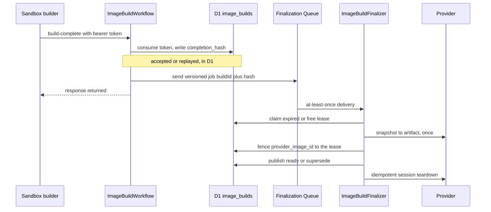
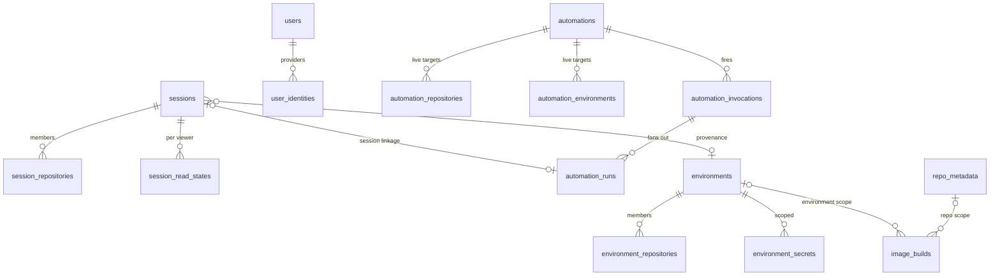

# Data Model and Persistence: D1, DO SQLite, R2, KV, Queues

The control plane splits state across four Cloudflare stores plus one queue, and the split is the
load-bearing design decision: **Durable Object SQLite is the authoritative per-session store**
(behavioural state read and written synchronously inside the DO's single-threaded transactions),
while **D1 is the shared index/registry** (things you must *query across*: session listings,
environments, secrets, automations, image builds, users, provider accounts). R2 holds opaque media
bytes, and KV holds caches that may be thrown away at any time.

## Ownership map

| Store | Binding | Contents | Consistency role |
| --- | --- | --- | --- |
| Durable Object SQLite | `ctx.storage.sql` (`SessionDO`, one DB per session) | `session`, `participants`, `messages`, `events`, `artifacts`, `attachments`, `sandbox`, `session_repositories` (with git state), `session_diff`, `session_alarm_state`, `ws_client_mapping` | Authoritative for a single session. Synchronous, transactional (`transactionSync`), survives eviction. |
| D1 | `env.DB` | `sessions` index, `session_repositories` (identity only), `session_read_states`, `session_pull_requests`, `session_skill_manifests`/`session_skill_revisions`, `session_model_provider_auth`, `repo_metadata`, `repo_secrets`/`global_secrets`/`environment_secrets`, `environments`/`environment_repositories`, `integration_settings`/`integration_repo_settings`/`integration_environment_settings`, `image_builds`, `automations`/`automation_repositories`/`automation_environments`/`automation_slack_channels`/`automation_invocations`/`automation_runs`, `users`/`user_identities`/`user_scm_tokens`/`api_tokens`/`auth_*`/`provider_credentials`, `model_provider_accounts` + credentials/defaults/authorizations, `child_admission_leases`, `mcp_servers`, `skills*`, `commit_signing_configuration`, `pr_autofix_feedback` | Shared queryable registry and index; cross-entity lists, dashboards, scheduler input, dedup constraints. |
| R2 | `env.MEDIA_BUCKET` | attachment and media object bytes under `sessions/<id>/attachments/<id>` and `sessions/<id>/media/<id>.<ext>` | Payload storage; the *record* of each object lives in DO SQLite (`attachments`) or the DO `artifacts` table, never in R2. |
| KV | `env.REPOS_CACHE` (namespace `open-inspect-session-index-*`) | `/repos` listing (stale-while-revalidate), GitHub App installation tokens, bot-local caches in sibling namespaces (`SLACK_KV`, `GITHUB_KV`, `LINEAR_KV`) | Cache only. Losing it costs latency, never correctness. |
| Queues | `IMAGE_BUILD_FINALIZATION_QUEUE` (+ DLQ), `AUTOFIX_QUEUE`/`AUTOFIX_DLQ` (metrics read-only here; produced by the GitHub bot) | Small, secret-free, versioned commands | Durable retry lane for provider work that outlives a request. |

The DO's SQLite schema is a *different engine with a load-bearing synchronous contract*; the
`SqlDatabase` port used by `src/db` stores is explicitly not that interface
(`src/db/sql-database.ts` documents the distinction). D1 rows do not carry git state: the D1
`SessionIndexStore` comment notes repository entries are "the identity subset … no git state; D1
doesn't store it", while the DO's `session_repositories` table owns `branch_name`, `base_sha`,
`current_sha`.

## The SQL port and how it is injected

Every D1 store takes the engine-neutral `SqlDatabase` port (`prepare` / `batch`) in its constructor
— `SessionIndexStore`, `AutomationStore`, `ImageBuildStore`, `EnvironmentStore`,
`RepoMetadataStore`, and the rest follow the same shape: snake_case rows in the database,
camelCase types at the API boundary. `D1Database` satisfies the port structurally, so there is no
runtime wrapper for the port itself; a compile-time assertion in `sql-database.ts` fails the build
if a `workers-types` upgrade breaks assignability.

Two port properties are correctness-critical, and stores depend on both:

- **`meta.changes` is required, not optional.** Roughly 38 call sites gate on it: CAS conflict
  detection, guarded lifecycle transitions, insert/upsert detection. `SqlResultMeta` documents that
  an engine omitting it would make successful writes report failure; `duration`, `rows_read`, and
  `rows_written` are observability-only and must never be gated on.
- **`batch()` is one atomic transaction.** Delete-then-insert replacements, positional result
  destructuring, and multi-query reads all assume all-or-nothing semantics; the port forbids
  emulating it with independent round-trips.

`env.DB` may be read at exactly a handful of composition roots, and ESLint enforces it: a
`no-restricted-syntax` rule bans any `MemberExpression` whose property is `DB` under
`packages/control-plane/src/**/*.ts` (tests ignored), with the message "Use the injected
SqlDatabase (ctx.db / this.db / a db param) instead of env.DB; the binding is read only at
composition roots." The legitimate readers each carry an inline disable naming their role —
`router.ts` (the request handle), `index.ts` (WebSocket branch, cron handlers, queue dispatch), the
Queue finalization consumer, and the `SessionDO` constructor (the DO's one global-database handle,
kept nullable and distinct from the DO's own embedded `ctx.storage.sql`).

### `instrumented-d1`: the request-scoped DB wrapper

`createRequestMetrics()` builds a per-request accumulator; `instrumentD1(db, metrics)` wraps a
`SqlDatabase` by object composition so every `first`/`run`/`all` records wall-clock time and the
engine-reported `duration`/`rows_read`/`rows_written`. Stores are unaware of it: handing them the
instrumented handle times all of their queries without touching store code.

`router.ts` builds the handle once per request and puts it on `RequestContext.db`; handlers use
`ctx.db` and never `env.DB`. The summary lands in the `http.request` wide event via
`ctx.metrics.summarize()`, which flattens `d1_query_count`, `d1_total_ms`, `d1_server_total_ms`,
`d1_rows_read`, `d1_rows_written` plus every named span as `<name>_ms`. Two subtleties:

- `batch()` cannot time individual statements, so it times the *whole* batch as a single record and
  sums the per-result meta.
- Wrapped statements must be unwrapped before reaching the real database. `ORIGINAL_STMT` (a
  module-local `Symbol("originalSqlStatement")`) stores the underlying statement on each wrapper,
  and `unwrapStatement()` peels it inside `batch()` — the same-origin contract in
  `sql-database.ts` exists precisely because a wrapped statement is not a `D1PreparedStatement`.

The WebSocket branch in `index.ts` builds its own metrics + instrumented handle because it bypasses
`handleRequest`; cron and queue entrypoints read `env.DB` directly with a documented disable, since
no `RequestContext` exists there.

### The background-task port

`BackgroundTasks` (`src/platform-ports.ts`) is a single-method capability: `submit(task, {name,
context})` starts a promise past the current request. `createCloudflareBackgroundTasks(ctx,
logger)` implements it over `ExecutionContext.waitUntil` and guarantees the task factory can never
fail its caller: a synchronous throw from `task()` is logged as `background_task.failed` and
swallowed (nothing started, so there is no lifetime to extend), and a rejection is logged the same
way. The DO composition root builds one over its own `ctx`
(`createCloudflareBackgroundTasks(ctx, log)` in `session/components.ts`), so Durable-Object
projections get the same event-lifetime extension as HTTP handlers.

Index projection is the main consumer. `SessionStatusService.syncSessionMetrics()` reads the DO's
own aggregates synchronously (`session.total_cost`, message count, active duration, PR artifact
count) and then submits `sessionIndex.updateMetrics(...)` as a background task — cost/rollup
columns in D1 are derived caches over DO truth, never the source.

## Session lifecycle: index-first creation, monotonic projection

Creating a session is ordered deliberately. In `src/session/initialize.ts`:

1. **D1 first.** `SessionIndexStore.create(...)` inserts the `sessions` row, the ordered
   `session_repositories` rows, the resolved skill manifest (or a copy of the parent's), and the
   complete model-provider auth snapshot in **one `batch()`**, so a session, its repository
   snapshot, and its pinned skills commit atomically. `create()` throws if the session insert
   reported zero changes — session ids are always freshly generated, so a skipped insert is a bug,
   and `initialize.ts` relies on D1 failures surfacing *before* a sandbox is spawned.
2. **DO init second.** `env.SESSION.get(env.SESSION.idFromName(sessionId)).fetch(init)` posts the
   full profile to the Durable Object.
3. **Compensate on failure.** A transport error or a non-OK init response calls
   `markSessionFailed()` → `sessionStore.updateStatus(sessionId, "failed")`, so a half-created
   session does not linger as a phantom `created` row in listings. The compensation is itself
   best-effort and logs if D1 is down.

`updateStatus` is guarded against out-of-order async writes: `UPDATE sessions SET status = ?,
updated_at = ? WHERE id = ? AND updated_at <= ?`. A stale projector loses silently and returns
`false`. When the DO learns that the mirror drifted (`SessionStatusService.repairIndexStatus()`),
`repairStatus()` deliberately *does not* carry `updated_at` — the guard would match no rows and
report a successful repair as `false`, because the DO's timestamp is behind D1's whenever
`touchUpdatedAt` has run. It asserts only the stale shape the sweep selected (`status = 'created'
AND status != ?`) and leaves `updated_at` meaning "last real activity".

`child_admission_leases` is the other half of the same story: spawning a child reserves capacity in
D1 *before* the child exists, using an `INSERT … WHERE (count of active children + live leases) <
max` guard with `ON CONFLICT(child_session_id) DO UPDATE … WHERE expires_at <= ?`. The lease is
finalized only after the child's own `active` projection succeeds
(`finalizeChildAdmission` in `syncSessionIndexStatusAndAdmission`), so capacity is never consumed
by a session that failed to initialize.

### The abandoned-draft sweep closes the loop

`created` is the status a session holds until its first prompt is enqueued, so a warm session that
was never prompted can sit there forever — the sandbox idles out, but that path writes only sandbox
state. `AbandonedDraftSweep` (own cron `23 * * * *`, deliberately offset from the image-build cron
and off the per-minute automation tick) lists `status = 'created' AND updated_at < ?` oldest-first
(capped at 50), and for each asks the DO to retire itself over `/internal/expire-draft`. The four
outcomes are distinct and each handled differently: `archived`, `not_draft` (the index was stale →
`repairStatus`), `has_work`, and `missing` — a `404` is treated as *definitive* rather than
transient (there is no DO state to diverge from), so `archiveOrphanedDraft()` retires the index row
on its own, still guarded on `status = 'created'`. A stalled DO cannot hold up the batch:
`AbortSignal.timeout(10_000)` per expiry, counted as errored and retried by a later sweep.

## Environments, secrets, and integration settings

`environments` is the named, prebuildable repository set — the launch unit.
`environment_repositories` and `environment_secrets` are declared `ON DELETE CASCADE` owned
children, matching `session_repositories`. Two deliberate FK absences encode real requirements:

- Image-build rows are FK-less because **`DELETE` supersedes rather than cascades**, so the reaper
  can still find and delete provider-side artifacts after the owning entity is gone.
- `sessions.environment_id` and `automations`' environment links are FK-less so a session keeps a
  benignly dangling provenance id after its source environment is deleted.

Environment names are unique *case-insensitively* (`CREATE UNIQUE INDEX … ON
environments(lower(name))`) because they are user-editable display labels, while the stable
`env_<id>` is what Slack/Linear targets reference.

Secrets come in three scopes — `global_secrets`, `repo_secrets` (keyed by `repo_id`),
`environment_secrets` — and **all three encrypt with `REPO_SECRETS_ENCRYPTION_KEY`**.
`db/scoped-secrets.ts` owns the shared pieces (key normalization to uppercase, reserved-key
rejection, per-value 16 KiB / per-scope-total 64 KiB / 50-key caps, the 128 KiB combined-session
ceiling, row codecs); each store keeps its own table SQL. Encryption at rest is not optional in
the DO: `createSessionRuntime` calls `requireRepoSecretsEncryptionKey(env)` and
`requireTokenEncryptionKey(env)` before building consumers, so no fallback path can persist a
secret in plaintext. `UserEnvResolver` folds global + per-member repo + environment secrets at
spawn time and **fails hard** on secret loading — a sandbox must not silently launch without its
secrets.

Integration settings resolve through a three-layer chain, one table per layer:
`integration_settings` (global defaults) → `integration_repo_settings` (per-repo override) →
`integration_environment_settings` (environment override, the top layer). Only session-scoped
integrations (`sandbox`, `code-server`) accept the environment level and the store enforces that
allowlist; sessions resolve settings **once at create time**, so deleting an environment reclaims
its settings row without affecting sessions already launched.

## `image_builds`: one registry, two scope kinds, Queue finalization

`image_builds` (migration 0039) generalizes the earlier `repo_images` and `environment_images`
tables into one registry keyed by `scope_kind` (`'repo' | 'environment'`) + `scope_id` (a lowercase
`owner/name` for repo scopes, an environment id otherwise). The two predecessors were retired
asymmetrically, and the asymmetry is deliberate: 0039 copies `environment_images` rows **verbatim**
because they already carry fingerprints, so environment prebuild continuity survives the migration,
while 0040 drops `repo_images` **without migrating a row** — those rows are cache entries keyed by a
SHA-256 that cannot be computed in SQL, so the rebuild cron regenerates each enabled repo's image
within about a tick and repo sessions boot from the base image meanwhile (slower boots, no
failures).

The columns cluster into three responsibilities:

- **Identity/matching**: `repositories_fingerprint` (a SHA-256 over the *ordered*
  lowercased-owner/name + case-sensitive-branch triples — order matters because setup hooks run in
  position order), `repository_shas` (JSON provenance), `runtime_version` (the `SANDBOX_VERSION` at
  build, the restore compatibility floor). The fingerprint is computed control-plane-side only, so
  the algorithm has exactly one home.
- **Callback authority**: `provider_session_id`, `callback_token_hash`,
  `callback_token_expires_at`, `callback_token_used_at`. Only the HMAC hash of a single-use bearer
  token is stored (under `IMAGE_CALLBACK_TOKEN_PEPPER`, with a frozen
  `repo-image-callback:` domain-separation prefix baked into every stored hash), and every callback
  must present the exact bound provider session id.
- **Finalization state** (migration 0052): `completion_hash`, `finalization_lease_token`,
  `finalization_lease_expires_at`, `provider_session_cleanup_pending`.

Status is `building | ready | failed | superseded`. Per `(scope, provider)` the state machine caps
live rows at one `ready` (marking ready supersedes older readies) plus one `building` (the
`registerBuild` guard is an `INSERT … SELECT … WHERE NOT EXISTS` on exactly that predicate).

### Why finalization is Queue-backed

A callback needs the provider to snapshot/checkpoint a session — minutes of work that cannot fit
the Worker's request-lifetime durability window. The pattern is:



*Figure: the callback accepts in D1 and defers provider work to the Queue consumer.*

Each step is a guarded single-statement update, and `meta.changes` is the whole concurrency
protocol:

- `acceptSuccessfulCompletion` requires `id + provider + provider_session_id + status = 'building'
  + callback_token_hash + unexpired + callback_token_used_at IS NULL`; zero changes means "read the
  row and classify it as a replay or a rejection" rather than writing.
- `claimLease` succeeds only when the row still matches the completion hash *and* the lease is free:
  `finalization_lease_token IS NULL OR finalization_lease_expires_at IS NULL OR
  finalization_lease_expires_at <= now`. Failing to claim is not an error: the consumer re-reads and
  retries after `max(15s, lease remaining) + 5s headroom`, so a redelivery never races a live
  holder.
- `recordArtifact` fences the provider image id to `(build, provider, provider_session,
  completion_hash, lease_token)` and only while `provider_image_id IS NULL`.
- `markFailed` and `clearLease` both require the caller to still own `finalization_lease_token` — a
  slow, deadlined-out attempt (`IMAGE_BUILD_PROVIDER_ATTEMPT_MS = 5 min`, lease 6 min) can never
  terminalize or release a row that a newer consumer has claimed.
- `quarantineArtifact` preserves an artifact whose compensating deletion failed: it writes the
  id back and terminalizes to `failed` **only if the status is still `building`**, so an
  out-of-band supersede stays superseded and the normal reaper owns the delete.

The Queue consumer applies at-least-once semantics per message: an unparseable job is `ack()`ed
(discarded, logged), a `retry` result is retried with the returned delay, and an unexpected throw
retries at 15 s without aborting later messages in the batch. Terraform configures the consumer
with `batch_size = 1`, `max_concurrency = 5`, `max_retries = 12`, `retry_delay = 15` and a dead-letter
queue — which is what makes the lease protocol necessary: the same accepted row can be delivered
several times, possibly concurrently.

Recovery is driven by D1 state, not by queue state. `republishRecoverableFinalizations()` in the
image-build scheduler selects accepted-but-unfinalized rows whose lease is *not* live —
`status = 'building' AND callback_token_used_at IS NOT NULL AND completion_hash IS NOT NULL AND
(lease null or expired)` (`RECOVERABLE_IMAGE_FINALIZATIONS_SQL`, ordered by `callback_token_used_at`
to match the partial `idx_image_builds_finalization_recovery` index from migration 0053) — and
re-sends a job for each. Skipping live-lease rows is what makes republishing a tick's routine work
instead of a race generator. A row whose send fails is logged per row and retried on the next tick;
the queue binding is optional, so a deployment without it simply republishes nothing.
The integration test `image-build-finalization-queue.test.ts` proves the two recovery halves: a
build whose provider artifact was already created is resumed *without snapshotting again*, and a
delivery racing a live lease holder retries rather than duplicating work.

Maintenance invariants worth knowing before changing this table: `supersedeActiveImages()` flips
`building` *and* `ready` rows to `superseded` on a secret change, because an in-flight build is
baking outdated values; `markRestoreFailed()` flips a `ready` row to `failed` from the spawn path so
the rebuild cron sees no matching ready image (scoped to `status = 'ready'` — building rows belong
to the workflow's failure paths, superseded rows to the reaper); and stale-build detection is
measured from `created_at`, whose blast radius is a redundant rebuild because the misclassified
build's late callback is rejected by the `status = 'building'` guards.

## Automations: derived invocation status

The highest-value invariant in the schema: **an invocation's status is never stored.** Migrations
0030/0031 dropped the columns that used to hold it, and every read derives it from child runs with
one shared SQL definition — `DERIVED_INVOCATION_STATUS_SQL` in `src/db/automation-store.ts`,
interpolated verbatim into both of the queries that surface an invocation status: the paginated
`listInvocations()` history read and the `listRecentExecutionsForAutomationIds()` rollup that backs
the automation list:

```sql
CASE
  WHEN COUNT(r.id) = 0 THEN 'skipped'
  WHEN SUM(CASE WHEN r.status IN ('starting', 'running') THEN 1 ELSE 0 END) > 0 THEN
    CASE
      WHEN SUM(CASE WHEN r.status <> 'starting' THEN 1 ELSE 0 END) = 0 THEN 'starting'
      ELSE 'running'
    END
  WHEN SUM(CASE WHEN r.status = 'skipped' THEN 1 ELSE 0 END) = COUNT(r.id) THEN 'skipped'
  WHEN SUM(CASE WHEN r.status = 'failed' THEN 1 ELSE 0 END) = 0 THEN 'completed'
  WHEN SUM(CASE WHEN r.status = 'completed' THEN 1 ELSE 0 END) = 0 THEN 'failed'
  ELSE 'partial_failed'
END
```

There is a TypeScript twin, `deriveInvocationStatus()`, over a sibling aggregate; the two must stay
in lockstep and `test/integration/automation-invocations.test.ts` asserts agreement on every test
case. The twin's `starting` field is required and cannot be derived from `active` — the aggregate
folds `starting` and `running` together, which is exactly the distinction between `starting` and
`running`. `completedAt` is derived too (`DERIVED_INVOCATION_COMPLETED_AT_SQL` → `MAX(r.completed_at)`
once all children are terminal), with one app-level special case: a childless skip is settled at
creation, so `toAutomationInvocation` uses `created_at` when `skip_reason` is set and there are no
children.

The data model around that invariant:

- `automations` holds trigger, schedule (`next_run_at`), model, instructions, and the auto-pause
  `consecutive_failures` counter. Target selection lives in child tables, not on the row.
- `automation_repositories` (0–10 rows, unique per `(automation_id, repo_owner, repo_name)`) and
  `automation_environments` are the **live** selection.
- `automation_invocations` is one thin row per firing: `source` (`schedule`|`manual`|`event`),
  `scheduled_at`, `trigger_key`, `concurrency_key`, `trigger_metadata`, `skip_reason`,
  `failure_counted_at`. Two partial unique indexes do the dedup: `(automation_id, scheduled_at)
  WHERE source = 'schedule'` (cron double-fire) and `(automation_id, trigger_key) WHERE trigger_key
  IS NOT NULL` (event dedup).
- `automation_runs` is one row **per target per invocation** (`invocation_id NOT NULL` since
  migration 0059), carrying a firing-time snapshot of the repository/environment plus the session
  linkage. Firing keys live on the invocation, not the run — the matching run columns were frozen
  and dropped in 0031. Uniqueness per target is enforced by partial indexes
  `idx_runs_invocation_repo` and `idx_runs_invocation_environment`.

Because history and launch never read the live selection, editing an automation's repositories
cannot rewrite past runs.

### Guarded writes and exactly-once bookkeeping

`insertInvocationGuarded()` creates an invocation, its child runs, and (optionally) the schedule
advance in one `batch()`. The comment states the trap precisely: **every statement must be
self-guarded, because `batch()` rolls back only on statement *error* — a 0-row `INSERT … SELECT`
is a success and later statements still run.** So the invocation insert is suppressed by the
overlap predicate, each child insert is conditioned on `EXISTS (SELECT 1 FROM
automation_invocations WHERE id = ?)`, and the schedule advance still runs for a blocked firing (so
a tick does not re-collide forever) but is a compare-and-set on the exact slot it claimed.
Monotonicity alone is insufficient: two ticks straddling a cron boundary both read slot S, and a
"later timestamp wins" rule lets the loser advance a second time from the winner's successor,
skipping a slot outright. A UNIQUE violation from either dedup index rolls back the whole batch
*including* the advance, and callers classify it with `isDuplicateKeyError()`.

`isDuplicateKeyError` deliberately narrows what counts as a duplicate: it requires the literal
`UNIQUE constraint failed` **and** a `trigger_key` or `automation_invocations` substring, matching
column/table fragments rather than D1's full `table.col, table.col` text. Unrelated unique
violations keep surfacing as real errors instead of being swallowed. (`db/errors.ts`'s
`isUniqueConstraintError()` is the engine-neutral version of the same idea, documented as the
extension point for a future Postgres SQLSTATE 23505 adapter.)

Run transitions are guarded the same way, and for the same reason:

- `updateRun()` appends `WHERE id = ? AND status IN ('starting', 'running')`. A JS pre-check alone
  is a lost-update race under concurrent callbacks and sweeps; a sweep flipping a completed child to
  `failed` would retroactively corrupt its invocation's derived status. It returns `false` when the
  guard suppressed the write, and only a whitelist of five columns can be set.
- `claimRunSession()` is the launch step: `SET status = 'running', session_id = ?, started_at = ?
  WHERE id = ? AND status = 'starting'` — exactly one caller can bind a session to a starting run.
- `bulkFailStartingRuns` / `bulkFailRunningRuns` each carry `AND status = ?` so a batch failure
  sweep can only affect runs still in the state it *observed*.
- `tryMarkInvocationFailureCounted()` (`SET failure_counted_at = ? WHERE id = ? AND
  failure_counted_at IS NULL`) is the CAS that makes auto-pause accounting exactly-once no matter
  how many callbacks race.
- `insertSkippedInvocation()` uses `INSERT OR IGNORE` *because* a skipped firing is an idempotency
  target: tolerating the index race keeps the paired schedule advance from being rolled back, and a
  skip recorded without the advance would re-collide on `(automation_id, scheduled_at)` every tick
  thereafter.

## A focused data model



*Figure: the highest-value D1 entities and how a session, an environment, an image build, and an
automation firing relate. Several edges here are deliberately not declared foreign keys —
`image_builds` scope and `sessions.environment_id` — and only the declared child edges cascade.*

Note the shape of the automation side: `automations` → `automation_invocations` →
`automation_runs`. The run reaches its session only through the nullable
`automation_runs.session_id` column (`idx_runs_session`, partial on non-null), mirrored in the
opposite direction by `sessions.automation_id` / `sessions.automation_run_id` (migration 0013); the
mirror exists for the listing join, while the recovery sweep deliberately queries `automation_runs`
by status alone (`getOrphanedStartingRuns`, `getTimedOutRunningRuns`) rather than joining to
`sessions`. Neither link is a declared foreign key, so a deleted session does not retro-fail its
run — the sweep does that on the timeout clock.

`image_builds` does **not** link to a session row at all. The spawn path reads the matching ready
build and carries `image_build_id` in DO-side sandbox state and logs, so the registry is matched by
scope + fingerprint, never joined per session. That is why deleting a scope's entity can supersede
rows without orphaning anything that a query would notice.

## Media: two-phase R2 + DO registration

`src/storage/object-storage.ts` is a four-method port (`put`/`delete`/`head`/`get`, with ranged
`get`) implemented by `R2ObjectStorage` over `env.MEDIA_BUCKET` via `createMediaObjectStorage(env)`.
Both R2 media surfaces follow the same rule — the Durable Object owns the record, R2 owns the
bytes:

- **Agent media** (screenshots/videos): `session-media-upload.ts` builds an object key, writes to
  R2, then `persistMediaArtifact()` records a DO `artifacts` row; if that persistence fails, the
  uploaded object is deleted (compensating cleanup, logged separately if the delete itself fails).
  Reads (`session-media-stream.ts`) first ask the DO for the artifact — validating that the
  requested `artifactId` belongs to that session — and only then stream from R2, honoring `Range`
  requests. An orphaned R2 key is unreachable, and an unvalidated read would leak another session's
  media.
- **User attachments**: the order is inverted and that is the point.
  `SessionAttachmentStorageService.store()` registers in the DO *first*, then puts to R2, so every
  failed or ambiguous storage outcome remains discoverable through the stale-attachment cleanup
  protocol. Registration is itself a two-phase conversation over the DO's internal attachments
  route: the handler claims stale unreferenced rows and returns `cleanup_required` with their object
  keys; the caller deletes those R2 objects and posts `complete_cleanup` with
  acknowledged/released ids; a release (delete failure) fails the upload with `cleanup_failed`
  rather than silently exceeding the quota. Per-session file-count and total-bytes caps are enforced
  inside the DO (`attachments` totals), because the DO is single-threaded and concurrent
  registrations cannot race past them. `attachments.message_id` is set when a message claims the
  attachment (`claimForMessage` verifies `rowsWritten === attachmentIds.length` and throws
  `AttachmentClaimConflictError` otherwise), and unreferenced rows are swept after their TTL.

## What KV holds, and what happens when it is empty

`REPOS_CACHE` is one KV namespace wearing three hats, all cache-shaped:

1. **The `/repos` listing** under key `repos:list:v2` with a *stale-while-revalidate* policy: fresh
   under 5 minutes (serve as-is), stale under an hour (serve immediately and refresh via
   `ctx.executionCtx.submit`), absent (fetch synchronously). The refresh is *also* registered with
   `waitUntil` on the cold path even though the response awaits the same promise: a caller that
   gives up first (the web proxy aborts on its own timeout) would otherwise cancel the Worker
   before the KV write, leaving the cache empty forever — the stale-while-revalidate branch needs
   an entry to exist, so the miss could never self-heal. Enrichment is a D1
   `RepoMetadataStore.getBatch()` join layered onto the provider list, and every KV read/write
   failure is logged and degraded, never fatal.
2. **GitHub App installation tokens** under `github:installation-token:v1:<appId>:<installationId>`.
   The stored TTL is `min(remaining token lifetime, 50 min)` clamped to at least 1 s, and a cached
   token is only usable if it is younger than 50 minutes *and* has 5+ minutes left — the value can
   outlive no useful purpose. All KV errors are swallowed as non-fatal, in both directions.
3. **Sibling namespaces** per bot worker (`SLACK_KV`, `GITHUB_KV`, `LINEAR_KV`): thread→session
   mappings, pending requests, user/branch preferences, watched-channel and repo caches for the
   classifier.

The historical namespace name `open-inspect-session-index-*` is a fossil: the session index and
`repo_metadata` were migrated **from KV to D1** for queryability (migration 0002's own header says
so), and the KV namespace survives bound as `REPOS_CACHE`. Do not read `REPOS_CACHE` expecting
session state.

## Bindings, configuration, and migrations

The typed surface is `src/types.ts`: `SESSION: DurableObjectNamespace`, `DB: D1Database`,
`REPOS_CACHE: KVNamespace`, `MEDIA_BUCKET: R2Bucket`, optional `IMAGE_BUILD_FINALIZATION_QUEUE:
Queue<ImageBuildFinalizationJob>`, and optional `AUTOFIX_QUEUE` / `AUTOFIX_DLQ` used **only** for
read-only metrics. Terraform wires them (`terraform/environments/production/`):
`d1.tf` creates the database with `read_replication = { mode = "disabled" }`, `kv.tf` the
namespaces, `r2.tf` the media bucket, and `workers-control-plane.tf` the bindings plus the
`cloudflare_queue_consumer` for finalization. The generic worker module translates each into a
version binding (`d1`, `kv_namespace`, `r2_bucket`, `queue`, `durable_object_namespace` with
`enable_durable_object_bindings` as the kill switch for class creation order).

`packages/control-plane/wrangler.jsonc` is explicitly a **test-only** config — production is
Terraform-managed — but it is the source of truth for the local/Miniflare binding names and the DO
migration (`"tag": "v1", "new_sqlite_classes": ["SessionDO"]`). The integration pool
(`vitest.integration.config.ts`) loads it, pins `compatibilityDate: "2024-09-23"` to match
production, reads the same migration directory, and injects `TEST_MIGRATIONS`.

Two separate migration ledgers exist and must not be confused:

**D1 (schema in `terraform/d1/migrations`, applied by `scripts/d1-migrate.sh <db> [dir]`).** The
script maintains its own `_schema_migrations (version, name, applied_at)` table rather than using
`wrangler d1 migrations apply`, and the reasons are operational:

- Filenames are validated *before* anything touches the database: a missing leading numeric prefix
  means the migration can never be tracked, and duplicate prefixes mean one file is silently
  skipped forever (the classic two-PRs-grab-the-same-number case). Both abort with a message.
- Tracking is by version **and exact filename**. A version prefix is only unique within this repo;
  a downstream installation that used `0042` for a different migration is detected and the script
  refuses rather than skipping it.
- Each migration and its ledger row are concatenated into one temporary SQL file and submitted as a
  single `wrangler d1 execute --file`. D1 executes the file atomically, so a failed migration rolls
  back and a lost client response is safe to retry — a committed migration always has its ledger
  row. This is what makes re-running an interrupted apply correct.
- Terraform triggers it from `null_resource.d1_migrations` whose `migrations_sha` is a SHA-256 over
  every migration file's contents, so editing an applied migration re-runs the script; the ledger
  then skips it (name recorded) or errors (name mismatch). The Worker resource `depends_on` it.

SQLite has no `ALTER TABLE … ADD CONSTRAINT`, so "tightening a contract" (e.g. 0059 making
`automation_runs.invocation_id NOT NULL`) is a create-new-table / copy / drop / rename sequence —
and 0059 copies **unfiltered** on purpose: a malformed row makes the NOT NULL constraint abort the
transaction before the old table is dropped, preserving the data for explicit repair instead of
silently deleting it.

**DO SQLite (schema + `MIGRATIONS` in `src/session/schema.ts`).** Per-session databases migrate
themselves on activation: `initSchema()` runs `SCHEMA_SQL`, then `applyMigrations()` (own
`_schema_migrations (id, applied_at)` ledger, skipping recorded ids), then `INDEXES_SQL`. Indexes
run last *only* so they can reference columns that legacy tables lack. A `string` migration goes
through `runMigration()`, which swallows "duplicate column"/"already exists" and rethrows anything
else; a `function` migration must be written idempotently because it may re-run if the process
crashes between execution and recording — and column-aware ones validate `PRAGMA table_info` rows
and throw rather than recording a bogus success (asserted in `schema.test.ts`). Adding a column
therefore means editing `SCHEMA_SQL` *and* appending a numbered entry; new and old DOs share the
definition, and `session_repositories` / `attachments` table text is deliberately a shared
`const` used by both `SCHEMA_SQL` and a migration so the two paths cannot diverge.

## Operational consequences

- **D1 has a 100-bound-parameter ceiling and stores must respect it.** `MAX_D1_QUERY_PARAMETERS` is
  the documented floor across engines; `bulkInsertStatements()` packs
  `floor(100 / columnCount)` rows per multi-row `INSERT` to divide the statement count (a smaller
  constant, not count-independence — the per-invocation query budget remains the caller's problem),
  and image-build scope reads chunk `IN (...)` lists at 50. `bulkInsertStatements` interpolates the
  table and column names, so it accepts literals, never request-derived values.
- **Index shape is load-bearing in D1.** Migration 0024 records the lesson: the recovery sweeps'
  `status = 'starting'` / `status = 'running'` predicates never matched the composite
  `idx_runs_active_status` `status IN (…)` index, so they full-scanned an append-only table and
  timed out as history grew. Partial indexes with bare-equality predicates, and bare-column indexes
  for range scans (`api_tokens.expires_at`), are the pattern; D1 skips partial indexes for "fancy"
  predicates.
- **A swallowed projection failure leaves D1 behind**, and the stale row keeps being picked up by
  anything scanning on status. `SessionStatusService` logs `session_index.update_status.background_error`
  rather than failing the transition, and relies on the draft sweep's `not_draft`/`repairStatus`
  path (or `updateMetrics` on the next settled turn) to converge.
- **Query instrumentation is a security-relevant invariant, not just telemetry.** Reading `env.DB`
  off-path bypasses the per-request accumulator *and* the injection boundary the ESLint rule
  protects; the rule exists so that the only way to reach D1 is through a handle someone chose to
  time.

## Related pages

- [Control Plane Worker: Entrypoint, Router, and Route Policies](control-plane-worker.md)
- [Session Durable Object](session-durable-object.md)
- [Automations and Triggers](../concepts/automations-and-triggers.md)
- [Secrets and Credential Encryption](../concepts/secrets-and-credential-encryption.md)
- [Terraform Deployment](../operations/terraform-deployment.md)
- [Image Prebuild Pipeline](../workflows/image-prebuild-pipeline.md)
