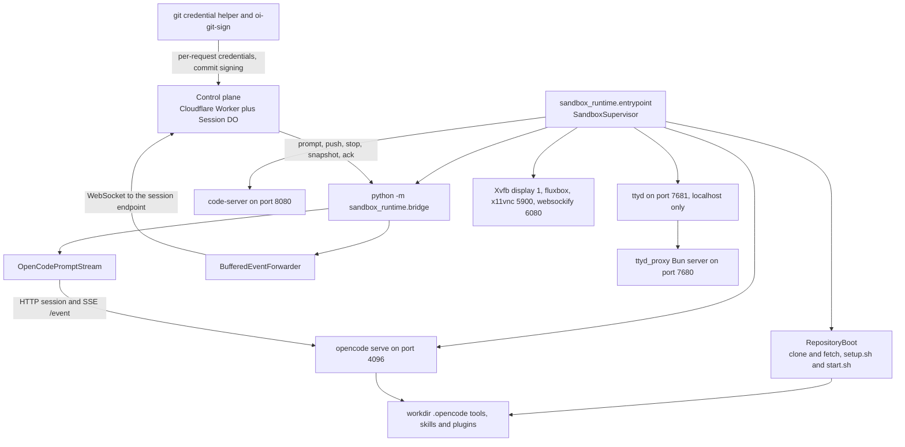
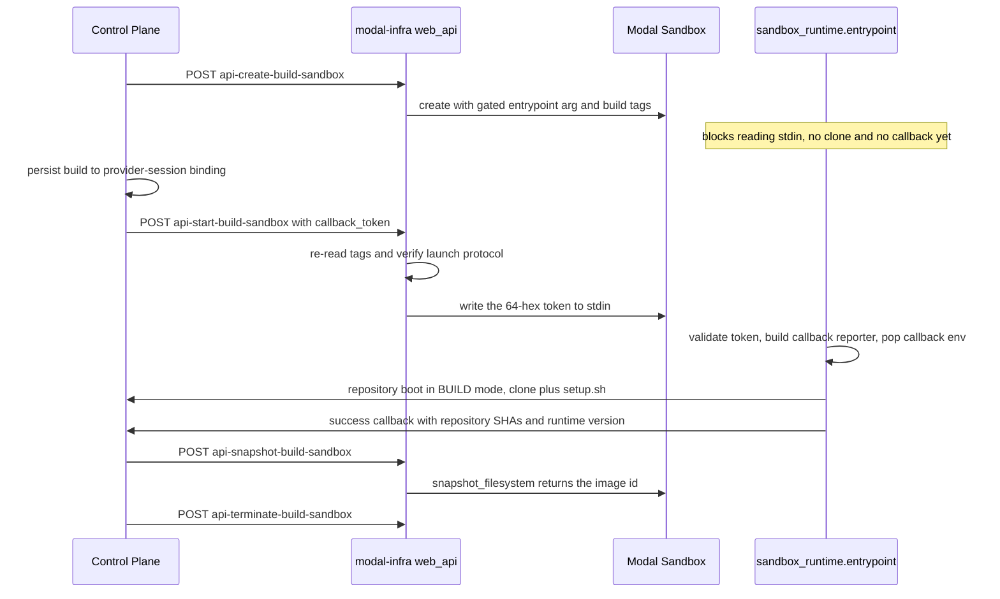

# Sandbox Data Plane: Provider Infra and In-Sandbox Runtime

The data plane splits into two kinds of package with a hard boundary between them:

- **`packages/sandbox-runtime`** — the Python package `sandbox_runtime` that runs *inside* every
  sandbox regardless of provider. It owns the process tree, the boot sequence, the control-plane
  WebSocket protocol, the OpenCode integration, and the agent-facing JS tools/plugins.
- **Per-vendor infra packages** — `modal-infra`, `e2b-infra`, `daytona-infra`,
  `opencomputer-infra`. These never implement agent behaviour. They *package* `sandbox_runtime`
  into a vendor image/template and, for Modal only, expose the HTTP surface the control plane calls
  to create/restore/snapshot sandboxes.

The one contract that binds them: every infra package copies
`packages/sandbox-runtime/src/sandbox_runtime` into the image at **`/app/sandbox_runtime`** and puts
**`/app`** on `PYTHONPATH`, so the sandbox's main process is always
`python -m sandbox_runtime.entrypoint` (OpenComputer writes the tree under the non-root user's
`~/app` and symlinks `/app` to it, preserving the same visible path). `OpenCodeServer` hardcodes those
absolute paths (`/app/sandbox_runtime/tools`, `/app/sandbox_runtime/plugins`,
`/app/sandbox_runtime/bin`, `/app/sandbox_runtime/skills`, `/app/opencode-deps`), so an image that
stages the package elsewhere boots a supervisor that silently installs no tools.

## In-sandbox process tree

`entrypoint.py` is both the CLI and the composition root: `build_supervisor()` reads process secrets
into a frozen `RuntimeConfig` and constructs every concrete service, injecting the interfaces the
supervisor treats as opaque. `main()` installs SIGTERM/SIGINT handlers that only set a shared
`asyncio.Event`, then either runs the normal supervisor or hands control to Modal's token-gated
image-build protocol when `--await-modal-image-build-token-stdin-v1` is passed.

*Caption: The supervisor owns and monitors every in-sandbox process; only the bridge subprocess talks to the control plane, and OpenCode is reachable only over localhost.*

`AgentBridgeProcess` deliberately runs the bridge as a **child process** (`python -m
sandbox_runtime.bridge --sandbox-id … --session-id … --control-plane … --token …
--opencode-port 4096`), forwarding its merged stdout/stderr to the supervisor's log stream. A crash
is therefore a process exit the supervisor can observe and restart, and a clean bridge exit is
distinct from a crash.

### Supervisor ordering and restart policy

`SandboxSupervisor.run()` fixes the boot order for a normal session: browser desktop (best-effort) →
`RepositoryBoot.boot()` → managed-skills materialization → code-server (best-effort) → web terminal
(best-effort) → **OpenCode server** → **agent bridge** → `monitor_processes()`. Optional-service
failures are logged and stopped, never fatal; OpenCode and bridge failures propagate to the
fatal-error path.

`monitor_processes()` polls each process owner on a 1 s tick with an *explicit per-component* policy
against `MAX_RESTARTS = 5`, `BACKOFF_BASE = 2.0`, `BACKOFF_MAX = 60.0` (exponential,
`min(BASE**n, MAX)`):

| Component | On unexpected exit | On exhaustion |
| --- | --- | --- |
| OpenCode server | Restart with the **same** repository list and workdir captured from boot | Fatal: report and set `shutdown_event` |
| Agent bridge | Restart | Fatal: report and set `shutdown_event` |
| code-server | Restart | Stop and give up (sandbox stays usable) |
| ttyd / ttyd-proxy | Restart the pair | Stop and give up |
| Xvfb/fluxbox/x11vnc/websockify | Restart in a separate background retry task (one at a time) | Give up |

Two behaviours are load-bearing: a bridge exit code `0` sets `shutdown_event` rather than restarting
(the bridge exits 0 when the control plane terminates the session or sends `shutdown`), and OpenCode
restarts must **not** re-run managed-skills materialization — that is sandbox-boot work, so a restart
reuses the materialized tree and does not depend on control-plane availability.

`_report_fatal_error()` POSTs `{error, fatal: true}` to
`{CONTROL_PLANE_URL}/sessions/{id}/sandbox-error` with the sandbox bearer token and
`X-Sandbox-ID`, truncating the message to the last 1000 characters and retrying 3 times with
2^n-second backoff. Missing `session_id`/`control_plane_url` skips reporting entirely — a
repository-less sandbox still boots. Shutdown runs in `finally` and stops services in reverse
dependency order (bridge, terminal, code-server, desktop, OpenCode).

## Boot modes, repository boot, and tunnels

`BootMode.from_env()` derives `FRESH` / `SNAPSHOT_RESTORE` / `REPO_IMAGE` / `BUILD` from
`IMAGE_BUILD_MODE`, `RESTORED_FROM_SNAPSHOT`, `FROM_REPO_IMAGE`, and re-exports the result as
`OPENINSPECT_BOOT_MODE` for repository hooks. Boot mode decides what is fatal:

- **git sync**: a clone/fetch failure or timeout is fatal in `FRESH` and `BUILD` (the build/clone has
  nothing to work with), but only a recorded **boot warning** in `SNAPSHOT_RESTORE`/`REPO_IMAGE`,
  where the checkout is already present and merely stale.
- **`.openinspect/setup.sh`**: failure aborts `BUILD` but degrades to a warning in `FRESH`.
- **`.openinspect/start.sh`**: failure of the *primary* (first) repository aborts every interactive
  mode; secondary members degrade to warnings. It is never run in `BUILD`.
- `setup.sh` has a 300 s default budget, `start.sh` 120 s (`SETUP_TIMEOUT_SECONDS` /
  `START_TIMEOUT_SECONDS` override); each runs in a new session so a timeout can kill the whole
  process group.

`REPO_IMAGE` boots from a filesystem that already contains the clone and its dependencies, so it pays
only a fetch. `BUILD` is the mode that produces those images: it runs clone + `setup.sh` under
`OI_IMAGE_BUILD_EXECUTION_TIMEOUT_SECONDS` and then blocks on the shutdown event, leaving the
provider free to snapshot the finished filesystem into a prebuilt repo image.

**Tunnel ordering** is the reason `prepare_tunnel_environment()` runs before anything else. Modal's
manager resolves `encrypted_ports` tunnels *outside* the sandbox and writes
`/workspace/.tunnels.env` (`TUNNEL_SANDBOX_ID=<id>` then `TUNNEL_<port>=<url>` lines). Because that
write can land before the entrypoint starts, the supervisor keeps a file whose `TUNNEL_SANDBOX_ID`
matches its own `SANDBOX_ID` and deletes everything else — snapshot and repo-image leftovers carry
dead URLs. `RepositoryBoot` then waits for every `EXPECTED_TUNNEL_PORTS` entry to appear
(`TUNNEL_WAIT_TIMEOUT_SECONDS`, default 30 s, 200 ms polling) *before* `start.sh`, so a start hook
can reference its public URL.

`RepositoryBoot` also writes the two artifacts that make the workspace layout single-sourced:
`/tmp/oi-repo-manifest.json` (canonical ordered `[{owner,name,branch,path}]`) and, for multi-repo
sessions, a generated `/workspace/AGENTS.md` describing the side-by-side checkouts. Names are
validated as safe path segments (`repo_config.is_safe_repo_segment`) so no `SESSION_CONFIG` string
becomes an arbitrary filesystem path.

## The bridge: commands, streaming, and delivery guarantees

`AgentBridge` connects to `wss://…/sessions/{id}/ws?type=sandbox` with
`Authorization: Bearer <SANDBOX_AUTH_TOKEN>` and `X-Sandbox-ID`, sends a `ready` event (carrying
`runtimeVersion` from the image-baked `SANDBOX_VERSION` and each repository's `baseSha`), drains
queued boot warnings into `warning` events exactly once, and then runs a 30 s heartbeat loop.

Commands are dispatched without blocking the reader: long-running `prompt` handlers become background
tasks so `push`, `stop`, `ack`, `refresh_diff`, `git_sync_complete`, `snapshot` and `shutdown` stay
responsive. `stop` cancels the active prompt task *and* asks OpenCode to abort (saving model cost);
`shutdown` sets the shutdown event; `snapshot` answers with the critical `snapshot_ready` event.

`prompt` handling delegates translation to `OpenCodePromptStream`, which supplies its own ascending
OpenCode user-message ID so assistant messages can be correlated by `parentID`, streams OpenCode's
`/event` SSE, and emits control-plane events keyed by the **control plane's** `messageId`. Transport
concerns (session creation, `/event` frame parsing, async prompt kickoff, abort, message state) live
in `OpenCodeClient`; lifecycle policy (SSE inactivity timeout — default 120 s,
`BRIDGE_SSE_INACTIVITY_TIMEOUT` overridable — max prompt duration, cleanup budget) stays in the
prompt stream. Max prompt duration is derived from `SANDBOX_TIMEOUT_SECONDS` (default 7200 s) minus a
snapshot reserve of `min(900 s, 25%)`, so a turn always ends before the provider kills the sandbox.

`push` executes a **provider-generated push spec** (`targetBranch`, `refspec`, `remoteUrl`, optional
`repoOwner`/`repoName`, `force`). Repository selection resolves the named repo against the supervisor
manifest and uses the matched entry's path verbatim; a spec naming a non-session repository is
rejected before any git command runs. Git stderr is credential-redacted, and every outcome funnels
through a single `push_complete` / `push_error` emitter.

**`BufferedEventForwarder`** owns reconnect-safe delivery. Non-critical events are at-most-once;
`execution_complete`, `error`, `snapshot_ready`, `push_complete`, `push_error` are *critical*: they
carry a deterministic `ackId` (`type:messageId`, else random hex), stay pending until the Durable
Object sends an `ack` command, and are re-sent on reconnect. With no bound socket (or a failed send)
events go into a 1000-entry buffer that evicts the oldest **non-critical** event first. `bind()` is
the single recovery operation — snapshot pending ackIds, flush the buffer, re-send only still-pending
snapshotted ackIds — all under one lock, so an event is never sent twice.

Reconnection uses exponential backoff capped at 60 s, but the bridge **exits** instead of retrying on
terminal conditions: HTTP 401/403/404/410 from the WebSocket handshake raises
`SessionTerminatedError`, and a non-retryable `GitSigningError` is likewise fatal. Those exits are
clean (code 0), which is what makes the supervisor shut the sandbox down rather than restart-loop
against a control plane that has already forgotten the session.

## Credential surfaces inside the sandbox

Three independent mechanisms, all brokered by the control plane per request rather than captured at
spawn time:

- **Git credentials** — `/usr/local/bin/oi-git-credentials` (baked system-wide by every image, and
  re-written as a fallback by `RepositorySynchronizer.ensure_credentials_configured()`) execs
  `python -m sandbox_runtime.credentials.git_credential_helper`. It implements git's credential
  protocol, mints fresh short-lived credentials from the control plane, and caches them in
  `/run/oi/scm-creds.json` (0600, advisory lock) refreshing inside a 5-minute expiry buffer. The
  cache is **never** a fallback for a failed refresh — stale tokens silently authenticating are worse
  than a visible failure. With no control-plane context (image-build sandboxes) it falls back to the
  one-shot injected `VCS_CLONE_TOKEN`.
- **Commit signing** — `GitSigningRuntime` fetches per-session SSH signing config and writes
  `gpg.format=ssh`, `gpg.ssh.program=<bin dir>/oi-git-sign`, `user.signingkey=key::<public>` into each
  repository checkout. `oi-git-sign` (installed by `_install_bin_scripts()` into
  `OPENINSPECT_BIN_INSTALL_DIR`, default `/usr/local/bin`) POSTs the bounded payload to
  `/sessions/{id}/commit-signing` and returns a signature. Per-prompt authorship comes from the
  command's `author.gitIdentity` (`agent-only` → no user attribution; `attributed-user` → strict
  name/email parsing, no inference).
- **Model provider auth** — `OPENAI_OAUTH_MANAGED` / `XAI_OAUTH_MANAGED` markers make the supervisor
  write a `refresh: "managed-by-control-plane"` sentinel into `~/.local/share/opencode/auth.json`
  (atomically, 0600 from creation) and deploy the corresponding auth-proxy plugin.

`RuntimeConfig._validate_control_plane_url` rejects any non-HTTPS `CONTROL_PLANE_URL` except loopback
development hosts — the sandbox refuses to carry its bearer token over plaintext.

## Agent-facing JS surfaces (separate from the Python modules)

These files ship as data inside `sandbox_runtime`, are staged onto disk at boot, and are executed by
**OpenCode's Node/Bun runtime**, not by the Python supervisor. They are a distinct surface with a
distinct failure mode (a broken tool degrades the agent's capabilities, not the sandbox).

**OpenCode custom tools** — `src/sandbox_runtime/tools/*.js`, copied by `_install_tools()` into
`<workdir>/.opencode/tool/`. Each exports `tool()` from `@opencode-ai/plugin` with a Zod arg shape;
files without a default `tool` export are skipped, which is why `_bridge-client.js` is a shared
helper rather than a tool. It reads `CONTROL_PLANE_URL` + `SANDBOX_AUTH_TOKEN` + the session id from
`SESSION_CONFIG` and calls `/sessions/{id}/…` directly — agent tools talk to the control plane's HTTP
API, **not** to the bridge process.

- `spawn-child.js` → `POST /children`. Explicitly gated on an affirmative user request for a child
  session in a separate sandbox (not sub-agents/subtasks); the child inherits the repository, not the
  conversation.
- `send-child-prompt.js` → `POST /children/{id}/prompt`; queues a follow-up behind current child work
  (`_send-child-prompt.js` holds the shared executor so the OpenCode tool and the Python test surface
  share one implementation).
- `get-child-status.js` → `GET /children` or `/children/{id}`, dual-mode list/detail with optional
  `includeResponse` and paginated `includeTrajectory`; formatting split into
  `get-child-status-format.js` so it is unit-testable under `node --test`.
- `cancel-child.js` → `POST /children/{id}/cancel` with `cancelNested` defaulting to true.
- `slack-notify.js` → `POST /sessions/{id}/slack-notify`; maps unknown HTTP statuses to a reason via
  `STATUS_FALLBACK_REASON` and returns a
  structured `{ok, reason, agentMessage}` envelope whose `REASON_GUIDANCE` keys are kept
  hand-symmetric with `SLACK_DENIAL_REASONS` in `@open-inspect/shared/slack/types`. This tool is
  installed **only** when `AGENT_SLACK_NOTIFY_ENABLED=true` (see
  `AGENT_TOOLS_GATED_ON_ENV`), which the Modal manager sets from the control plane's
  `agent_slack_notify_enabled` flag.
- `plugins/inspect-plugin.js` is installed as `.opencode/tool/create-pull-request.js` when the
  session has a repository: it resolves the target repo from `/tmp/oi-repo-manifest.json` (required
  `repo:` argument for multi-repo sessions), reads the current branch with `git`, and POSTs
  `/sessions/{id}/pr`.

**OpenCode plugins** — copied into `<workdir>/.opencode/plugins/` and auto-discovered; OpenCode
deduplicates by provider ID with last-wins, so these replace built-ins:

- `provider-token-broker.js` — provider-neutral, single-flight client for
  `POST /sessions/{id}/provider-auth/{provider}/access-token`, with a 5-minute pre-expiry refresh
  buffer and response validation. Each auth plugin owns its own instance so cached credentials never
  cross providers.
- `codex-auth-plugin.js` — overrides Codex auth so rotating refresh tokens are persisted in D1
  instead of dying with the sandbox; rewrites requests to the Codex endpoint, injects
  `ChatGPT-Account-Id`, filters the model allow-list, and zeroes costs.
- `xai-auth-plugin.js` — same pattern for xAI SuperGrok, plus injecting the `grok-build-0.1` model.

**Standalone CLIs** — `src/sandbox_runtime/bin/*` are installed by `_install_bin_scripts()` into the
configured bin dir and must **not** land in `.opencode/tool/`: OpenCode `import()`s every file there
during tool discovery, which would execute module-level code with the parent's argv. `upload-media.js`
uploads `.png/.jpg/.jpeg/.webp/.mp4` to the session's media endpoint (`.mp4` requires
`--artifact-type video`); `oi-git-sign` is the signer above.

Bundled **skills** (`skills/agent-browser`, `record-video`, `upload-screenshot`,
`visual-verification`) are copied into `.opencode/skills/`; control-plane-managed skills are
materialized separately by `ManagedSkillsMaterializer` into the **global** OpenCode config dir's
`skills/` (resolved by `resolve_opencode_global_config_dir()` from `OPENCODE_CONFIG_DIR` /
`XDG_CONFIG_HOME` / `$HOME/.config`) through a journal-recoverable staging/backup swap, under strict
size, path-depth, name, and sha256 ceilings. Everything the runtime installs into a git checkout is
registered in `.git/info/exclude` by `install_runtime_git_excludes()` so agent diffs stay clean.

## modal-infra: the only provider with an in-Python control surface

`modal-infra` is structurally different from the other three infra packages: the control plane calls
*it* over HTTP, and it calls Modal's SDK. It has five surfaces.

**`src/app.py` — app, images, secrets, and the SSRF guard.** Defines `modal.App("open-inspect")`,
three secrets (`llm-api-keys` requiring `ANTHROPIC_API_KEY`, injected into sandboxes but never into
snapshots; `github-app` requiring `GITHUB_APP_ID`/`GITHUB_APP_PRIVATE_KEY`/`GITHUB_APP_INSTALLATION_ID`,
used server-side to mint installation tokens and **not** injected into sandboxes; `internal-api`
requiring `MODAL_API_SECRET`), and two images. `function_image` (the control-plane-facing functions)
pip-installs httpx/fastapi/modal/PyJWT and bundles the `sandbox_runtime` source tree at
`/root/sandbox_runtime` so those modules can import it at runtime.

`validate_control_plane_url()` is the anti-SSRF boundary. The `control_plane_url` (and image-build
callback URLs) arrive from the request body, and the sandbox is launched with that URL plus a bearer
token — so an unvalidated value would exfiltrate the token to an attacker host. Validation parses
`netloc` (host **including port**) and requires an exact match against the comma-separated,
lowercased `ALLOWED_CONTROL_PLANE_HOSTS` env var, and it **fails closed**: if that variable is unset
or empty, *every* URL is rejected with a `security.hosts_not_configured` warning. Empty/absent URLs
pass (optional field); the caller is `web_api.require_valid_control_plane_url`, which converts a
failure into HTTP 400.

**`src/images/base.py` — the sandbox image.** `debian_slim(python_version="3.12")` plus the pinned
toolchain: git/gh CLI, Node 22, pnpm, Bun, uv, `opencode-ai@1.18.18` + `@opencode-ai/plugin` (never
pin below 1.18.15 — OpenCode's 48-bit message-ID counter wraps and older releases order the turn loop
by comparing IDs as strings, which makes sessions carrying pre-wraparound history exit without
calling the model), code-server, checksum-verified `ttyd`, `agent-browser` + Chromium, and the
X11/VNC/noVNC stack. `CACHE_BUSTER = RUNTIME_VERSION`, i.e. the Modal layer cache is busted by the
runtime manifest rather than a hand-maintained number. It pre-builds `/app/opencode-deps` (and bakes
the same tree into `/root/.config/opencode`) so the boot-time staging makes OpenCode's `Npm.install()`
find an in-sync lockfile and skip a 2–22 s arborist reify that would otherwise block the first prompt
past the bridge's HTTP timeout, and it configures the git credential helper at `--system` level so it
applies before the entrypoint runs.

**`src/sandbox/manager.py` — sandbox lifecycle.** One private `_launch_sandbox(spec)` serves both
create and restore, parameterized by a three-variant image source:
`_BaseImageSource`, `_RepositoryImageSource` (a prebuilt repo image, setting `FROM_REPO_IMAGE` +
`REPO_IMAGE_SHA`), `_SnapshotImageSource` (a filesystem snapshot, setting `RESTORED_FROM_SNAPSHOT`).
It assembles the whole env contract (`SANDBOX_ID`, `CONTROL_PLANE_URL`, `SANDBOX_AUTH_TOKEN`,
`SANDBOX_TIMEOUT_SECONDS`, `REPO_OWNER`/`REPO_NAME`, `SESSION_CONFIG`, per-session service-port
overrides, `TERMINAL_ENABLED`, `AGENT_SLACK_NOTIFY_ENABLED`, generated `CODE_SERVER_PASSWORD` and an
≤8-byte `VNC_PASSWORD`), filtering user env vars through `_RESERVED_LAUNCH_ENV_VARS` so a repository
secret can never impersonate a manager-owned variable, then creates the sandbox with
`encrypted_ports` for the exposed set and `_resource_kwargs` mapping `cpuCores`/`memoryMib` to Modal's
`cpu`/`memory`.

Tunnel resolution is a manager responsibility: `_collect_exposed_ports` unions the feature ports with
validated `settings.tunnelPorts` (int, 1–65535, capped at 10) while never exposing raw VNC `5900`, and
`_resolve_and_setup_tunnels` pops each service URL **only** if that service owns the port — otherwise
a user's own `8080` with code-server disabled would be misreported as `code_server_url`. Remaining
extra URLs are written into `/workspace/.tunnels.env` and also returned on the `SandboxHandle`, and a
write failure is logged, not raised. `take_snapshot()` uses `snapshot_filesystem` with a 300 s
timeout and returns the Modal Image id; `get_sandbox_by_id()` assumes `READY` if the lookup succeeds.

**`src/sandbox/build_session.py` — tagged image-build sandboxes.** `ModalBuildSessionService` owns a
four-method identity-bound lifecycle (`create` → dormant sandbox, `start` → release, `snapshot`,
`terminate`). Sandboxes carry tags (`openinspect_kind=image-build`, `openinspect_build_id`,
`openinspect_scope_kind`, `openinspect_scope_id`, `openinspect_launch_protocol`), and every later
operation re-reads the tags through `_resolve()`, raising `BuildSessionNotFoundError` unless *both*
kind and build id match — so a stale or forged provider session id can never snapshot or terminate
someone else's sandbox. `create` scrubs `RESERVED_USER_ENV_KEYS` out of user env vars before launch.

The token-gated launch protocol (`sandbox_runtime.modal_image_build_start`) is the security-critical
piece: the sandbox starts with `--await-modal-image-build-token-stdin-v1` and blocks reading stdin, so
no repository is cloned and no callback is possible until the control plane has persisted the
provider-session binding and calls `api-start-build-sandbox`. Only then is a 64-hex `callback_token`
written to stdin; it is length-bounded, pattern-validated, and consumed into a
`RepoImageBuildCallback` whose env vars are then popped so the build process cannot re-read them.
`start` refuses delivery when the tag's launch protocol differs.

**`src/web_api.py` — the HTTP surface.** Endpoints are `@app.function(image=function_image,
secrets=[...])` + `@fastapi_endpoint`, and the control plane reaches them at
`https://{workspace}--open-inspect-{endpoint-name-with-dashes}.modal.run` (built in
`packages/control-plane/src/sandbox/client.ts`). `api-create-sandbox`, `api-snapshot-sandbox`,
`api-restore-sandbox`, `api-create-build-sandbox`, `api-start-build-sandbox`,
`api-snapshot-build-sandbox`, `api-terminate-build-sandbox` all run inside the
`_execute_endpoint` context manager, which calls `require_auth` first and emits one
`modal.http_request` line with status, duration and correlation ids; `api-health` is the single
unauthenticated endpoint and binds no secret.

Auth is `sandbox_runtime.auth.verify_internal_token` — `Bearer <unix-ms>.<HMAC-SHA256 hex>` against
`MODAL_API_SECRET` with a 5-minute validity window; a *missing secret* is a server misconfiguration
and yields 503, while a bad token yields 401. Request bodies are parsed by Pydantic models with
`strict=True` and `extra="ignore"` so a newer control plane can add fields without breaking an older
Modal deployment; restore paths use `extra="allow"` to preserve unknown nested `SESSION_CONFIG` keys.
The create path reconstitutes a typed `SessionConfig` and re-serializes it into `SESSION_CONFIG`,
which means **new wire fields must be added to `SessionConfig` or they never reach the sandbox**.
`IMAGE_BUILD_FINALIZATION_GRACE_SECONDS` (10 min) is added on top of the build-execution budget for
the provider session timeout, because the snapshot happens *after* the build sandbox finishes.

**`deploy.py`** — `python deploy.py --build-sandbox-image` eagerly builds `base_image` against the
looked-up deployed app, so the first session does not pay the build. Never deploy `src/app.py`
directly; `src/__init__.py` (or `deploy.py`) is what registers the function modules.

## The template-building packages

`e2b-infra`, `daytona-infra`, and `opencomputer-infra` are *build-time only*: the control plane talks
to those vendors' REST APIs at runtime (from `packages/control-plane/src/sandbox/providers/*` and the
rest clients), and these packages exist to produce the image/snapshot those sandboxes boot from.
None of them starts the supervisor itself — the control plane execs
`python -m sandbox_runtime.entrypoint` with per-sandbox env after creating the sandbox.

**`e2b-infra`** — `e2b.Dockerfile` defines only the base layers (it is never built standalone): the
same pinned toolchain, a `.pth` file putting `/app` on `site.getsitepackages()` so
`python3 -m sandbox_runtime` resolves even when git spawns the credential helper without the
supervisor's `PYTHONPATH`, the system-level credential-helper shim (E2B's non-root `user` cannot
create it at runtime), and `chmod 1777 /workspace /tmp/opencode`. It deliberately sets **no**
`SANDBOX_VERSION`: E2B does not propagate Docker `ENV`, so a literal would only rot.
`build-template.py` stages `sandbox_runtime` into the build context (excluding `__pycache__`/`.pyc`,
removed via `atexit`), applies `.copy()` / `.set_workdir("/workspace")` /
`.set_start_cmd(START_CMD, READY_CMD)` through the E2B Template SDK, and validates CPU/memory the same
way the Terraform module does so mistakes fail locally and fast. The start command is an inert
`sleep infinity`, kept only because E2B evaluates `READY_CMD` during template finalization — the one
moment a broken toolchain layer can fail the build instead of every later session; the ready check
asserts python/node/bun/opencode/code-server exist, that `gh` resolves to `/usr/local/bin/gh` (the
auth wrapper, not `/usr/bin/gh`), and that `import sandbox_runtime` works. After a successful build it
pre-warms by creating and immediately deleting one sandbox, working around a vendor-confirmed slow
first spawn.

**`daytona-infra`** — `src/toolchain.py::build_base_image` mirrors the Modal image over
`python:3.12-slim-bookworm` with the same `OPENCODE_VERSION` / `CODE_SERVER_VERSION` /
`AGENT_BROWSER_VERSION` pins, `PYTHONPATH=/app`, `/app/sandbox_runtime`, and the credential shim.
`create_base_snapshot` registers a *named* Daytona snapshot whose entrypoint is
`["python", "-m", "sandbox_runtime.entrypoint"]`. `src/bootstrap.py` is the CLI: it requires
`DAYTONA_API_KEY` and `DAYTONA_BASE_SNAPSHOT`, and `--force` deletes the existing snapshot then polls
until the deletion is visible (up to 300 s) because Daytona's `delete()` returns before the backend
has removed it — recreating inside that window fails with "Snapshot already exists".

**`opencomputer-infra`** — `src/build-template.ts` (esbuild-bundled, run via
`npm run build:opencomputer-template`) is the only infra package whose source is TypeScript; it imports
`sandbox-runtime/src/sandbox_runtime/runtime_manifest.json` directly and stamps
`SANDBOX_VERSION = runtimeManifest.runtimeVersion`. Because OpenComputer runs as a non-root `sandbox`
user it installs everything under `$HOME` (`~/.npm-global`, `~/.venv`, `~/.bun`), symlinks `/app` to
`/home/sandbox/app`, re-owns `HOME` last, and sets
`OPENINSPECT_BIN_INSTALL_DIR=~/.local/bin` — the reason that constant exists rather than a hardcoded
`/usr/local/bin`. Two failure modes are pinned at build time: npm 12 does not run lifecycle scripts by
default, so `--allow-scripts=opencode-ai` is **required** (without it the shipped `opencode.exe` stub
survives and every session dies with "Exec format error"), and the build then runs
`opencode --version` to fail loudly if it is still a stub. `addRuntimeDir` walks the package and
`addLocalFile`s each file individually (skipping caches), so it has no tar-context dependency.

All four are driven by Terraform `null_resource`/`local-exec` modules keyed on a `source_hash` over
the infra directory **plus** `packages/sandbox-runtime/src`, so a runtime change rebuilds the
template. The hash policies are not identical, and the difference matters: Modal, E2B and OpenComputer
hash *every* file the image bakes (skill Markdown and assets included), while
`terraform/environments/production/daytona.tf` filters to `*.py`/`*.js`/`*.ts` — a skill-only change
does not rebuild the Daytona snapshot. OpenComputer derives its snapshot name from that hash
(`openinspect-runtime-<16 hex>`) because the vendor addresses snapshots by exact name, making each
build immutable rather than in-place.

## Cross-package versioning and contracts

`packages/sandbox-runtime/src/sandbox_runtime/runtime_manifest.json` is the single source of the
runtime generation: `runtimeVersion` (`v61-sandbox-sbin-path`), `generation`,
`minimumCompatibleGeneration`, `minimumRebuildGeneration`. Importing `runtime_manifest.py` raises at
load time if the `v<N>` prefix and `generation` disagree. That manifest is consumed by value from
three directions — `RUNTIME_VERSION` busts the Modal image layer cache,
`packages/control-plane/src/sandbox/runtime-manifest.ts` exports the floors used by
`evaluateImageBuildRebuildPolicy` (`reason: "runtime_incompatible"` rebuilds prebuilt images older
than `MIN_REBUILD_RUNTIME_VERSION` without invalidating images still safe to boot during a rollout),
and `build-template.ts` stamps `SANDBOX_VERSION`. The numeric generation is **one shared sequence**
across every image-build provider, so bumping it means bumping every provider's label together.

The version the control plane actually trusts is the one the *runtime reports*: the bridge copies the
image's baked `SANDBOX_VERSION` into its `ready` event, which is why E2B/OpenComputer/Vercel re-export
it in create/exec env rather than relying on Docker `ENV`.

`src/sandbox_runtime/image_build_callback_env.json` is the single source for the image-build env-key
contract (`OI_REPO_IMAGE_BUILD_ID`, `OI_REPO_IMAGE_CALLBACK_URL`,
`OI_REPO_IMAGE_FAILURE_CALLBACK_URL`, `OI_REPO_IMAGE_CALLBACK_TOKEN`,
`OI_REPO_IMAGE_PROVIDER_SESSION_ID`, `MODAL_SANDBOX_ID`, and the intentionally-diverging reserved
sets). Production code on both sides keeps its own constants; **only tests read this file**, and
`packages/modal-infra/tests/test_build_sandbox_lifecycle.py` pins Modal's Python constants against it
and against the TypeScript declarations in `packages/shared/src/types/integrations.ts` and
`packages/control-plane/src/image-builds/timeouts.ts`. The same file documents the build-mode
divergence in `RepoImageBuildCallback.from_env`: configuration is detected by env-var *presence*, so
a partially-configured build raises `RepoImageCallbackMisconfigured` and aborts rather than running
with completion reporting silently disabled (which would wedge the control-plane row in `building`
until the timeout reaper fired).

## Lint and test scoping

`packages/sandbox-runtime` is an npm workspace directory but is **excluded from ESLint**
(`eslint.config.js` ignores `packages/sandbox-runtime/**` because those JS files run under Node inside
sandboxes, not as part of the TypeScript project). Its Python side is governed by the root `ruff.toml`
(`target-version = "py312"`, line-length 100, isort `known-first-party = ["sandbox_runtime"]`), which
each Python package re-extends via `extend = "../../ruff.toml"`. The root `lint-staged` entry
`packages/{daytona-infra,e2b-infra,modal-infra,sandbox-runtime}/**/*.py` runs `ruff check --fix` and
`ruff format`, i.e. exactly the four Python infra packages — a new provider package must be added to
that glob.

`ci-python.yml` mirrors this: one lint job for `sandbox-runtime` (`ruff check` +
`ruff format --check` on `src/ tests/`), one for provider infra (`ruff` over
`packages/modal-infra/ packages/e2b-infra/ packages/daytona-infra/`), a modal-infra test job, and a
sandbox-runtime job that runs `pytest tests/` **and** `node --test tests/*.test.mjs` — the `.mjs`
suite exists because the JS tool/plugin surface ships inside the Python package and has no npm
workspace to run in. Both mypy jobs are `continue-on-error`, so typing is aspirational, not gating.

Representative tests worth knowing about before changing this plane:

| File | What it pins |
| --- | --- |
| `sandbox-runtime/tests/test_supervisor_lifecycle.py` | Boot phase order, repository workdir propagation, build mode excluding runtime services, fatal vs non-fatal restart exhaustion, skills not re-materialized on OpenCode restart |
| `sandbox-runtime/tests/test_supervisor_monitor.py` | Backoff base/cap, restart-on-signal, bridge exit 0 ⇒ shutdown, fatal-error reporting to the session-scoped endpoint |
| `sandbox-runtime/tests/test_entrypoint_build_mode.py` | Full BUILD/REPO_IMAGE/SNAPSHOT_RESTORE policy matrix |
| `sandbox-runtime/tests/test_entrypoint_tunnel_urls.py` | `.tunnels.env` stale-file rules and partial-port timeouts |
| `sandbox-runtime/tests/test_event_forwarder.py`, `test_bridge_ack.py` | Buffer eviction order, ack dedup, no double send across reconnect |
| `sandbox-runtime/tests/test_tool_installation.py` | Which tools/plugins/skills/bin scripts get installed under which env gates |
| `modal-infra/tests/test_build_sandbox_lifecycle.py` | Cross-plane callback/env-key contract, gated entrypoint launch, tag-mismatch refusal, scrub semantics |
| `modal-infra/tests/test_tunnel_ports.py` | Port validation, reserved-port dedup, service-URL splitting, `.tunnels.env` write |
| `modal-infra/tests/test_runtime_manifest.py` | `CACHE_BUSTER == RUNTIME_VERSION` and manifest self-consistency |
| `modal-infra/tests/test_deploy.py` | Eager image build plus the Terraform `deploy.sh` call sequence |

See also: [sandbox boot modes and snapshots](../concepts/sandbox-boot-modes-and-snapshots.md),
[sandbox providers](../integrations/sandbox-providers.md),
[sandbox runtime protocol](../sandbox-runtime-protocol.md),
[adding a sandbox provider](../workflows/adding-a-sandbox-provider.md), and
[sandbox boot and spawn](../workflows/sandbox-boot-and-spawn.md).

*Caption: The token gate ensures an image-build sandbox cannot report progress until the control plane has durably bound its provider session id.*
