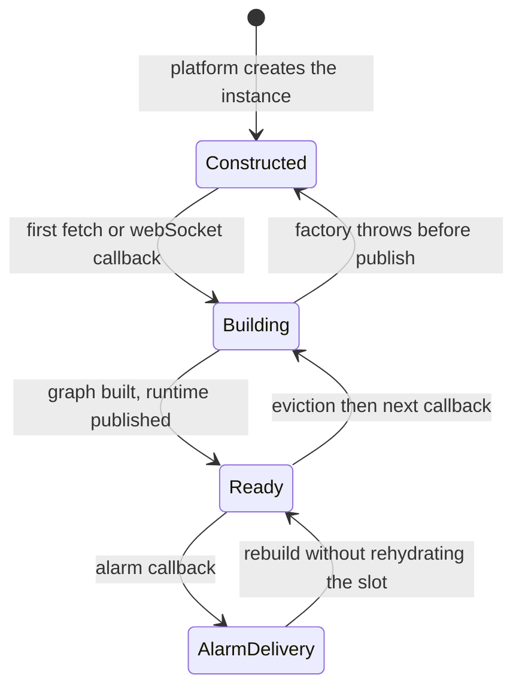
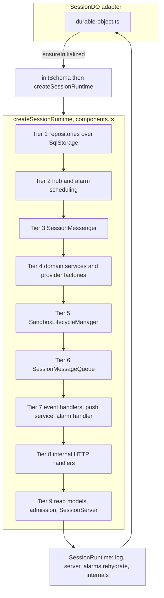
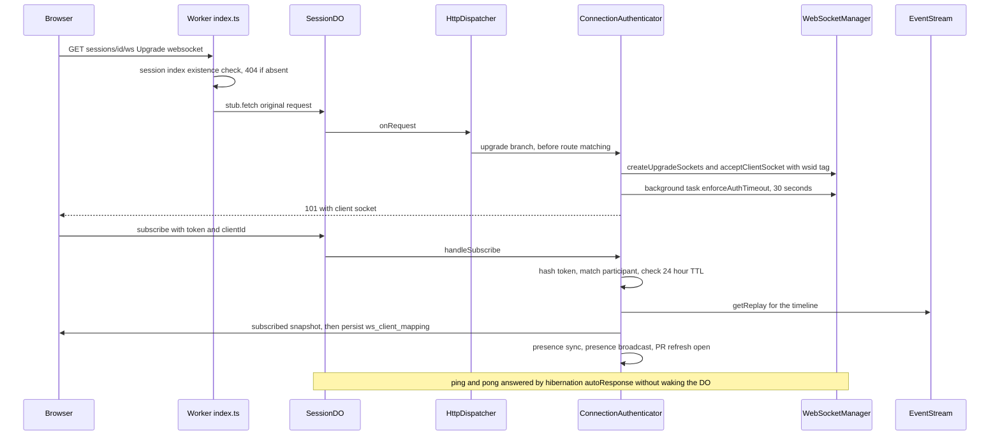
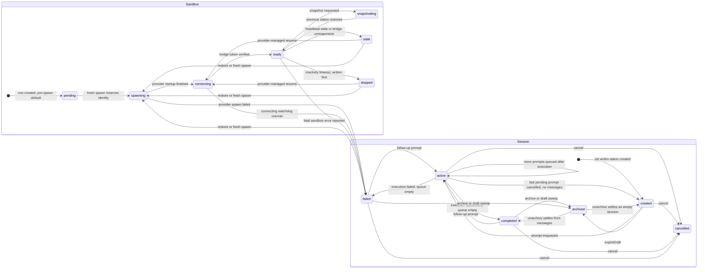

# The Session Durable Object and Its Composition Root

A session is a Durable Object. `env.SESSION` is the namespace; `SessionDO` is its only class, registered as a
**SQLite-backed** DO (`new_sqlite_classes` in `wrangler.jsonc` and in the Terraform worker module, whose
`durable_objects` list contains exactly `{ binding_name = "SESSION", class_name = "SessionDO" }`). The
namespace is addressed by the public session id — `env.SESSION.idFromName(sessionId)` — so *the DO id and the
session are the same thing*, and every session-scoped state read/write is a synchronous query against that
instance's embedded `ctx.storage.sql`. See [[data-model-and-persistence]] for where this store sits relative
to D1, R2, and KV.

The object is deliberately small. Everything that makes a session work — repositories, domain services, the
sandbox lifecycle manager, the prompt queue, the HTTP route table, the WebSocket hub, the alarm scheduler — is
built by one function, `createSessionRuntime` in `session/components.ts`. `SessionDO` holds no business logic:
it applies the schema, builds the graph, and forwards the five platform callbacks. This split is enforced
mechanically, not by convention (see [Boundaries](#boundaries-eslint-enforced)).

## `SessionDO` is an adapter, nothing more

The class has three fields and five entry points.

| Member | Role |
| --- | --- |
| `sql` = `ctx.storage.sql` | The DO's own embedded SQLite — authoritative session state. |
| `db` = `env.DB ?? null` | The DO's **one** global-database (D1) handle, read in the constructor behind a documented `eslint-disable`. Nullable to preserve the graph's defensive guards. Distinct from `sql`. |
| `_runtime` | The per-activation `SessionRuntime`; `null` until first touch. |
| `fetch` | → `runtime.server.onRequest(request)` |
| `webSocketMessage` / `webSocketClose` / `webSocketError` | → `runtime.server.onMessage` / `onClose` / `onError` |
| `alarm` | → `ensureInitialized(false)` then `runtime.server.onScheduledDeadline()` |

The `runtime` getter calls `ensureInitialized()` on every touch, which is what makes hibernation and eviction
recovery invisible to the rest of the system: after the platform throws an instance away, the next
WebSocket message, HTTP request, or alarm rebuilds the entire graph from persisted SQLite state before any
application code runs. `SessionServer` itself is platform-neutral and documents exactly this expectation —
adapters must initialize the runtime before any of its entry points are reachable.

**`_runtime` is published only after the graph is fully constructed.** `ensureInitialized` runs
`initSchema(this.sql)` → `createSessionRuntime(...)` → *then* `this._runtime = runtime`. A throw anywhere
inside the factory therefore leaves the activation *uninitialized* rather than half-initialized, so the next
event retries initialization instead of dereferencing an undefined runtime. The same guard means schema
application is idempotent-per-activation, not once-per-lifetime.

`alarm()` is the one entry point that passes `rehydrateAlarm = false`. The alarm *delivery* is the rehydration
event; re-arming during it would fight the delivery's own rescheduling. Every other first-touch path
(`fetch`, `webSocket*`) rehydrates, because the DO's single alarm slot may have been lost with the previous
instance. Rehydration is deferred through `backgroundTasks.submit`, so it never delays the response.



*Caption: Per-activation lifecycle of a SessionDO instance. A failed graph build is not a terminal state; the next event retries it.*

## The composition root and its fail-fast posture

`createSessionRuntime(platform, env)` takes `{ ctx, sql, db }` plus `Env` and returns the *narrow* surface
`SessionDO` is allowed to touch:

```ts
interface SessionRuntime {
  readonly log: Logger;                       // session-scoped logger
  readonly server: SessionServer<WebSocket, ClientInfo>; // the 5 entry points
  readonly alarms: { rehydrate(): void };
  readonly internals: SessionComponents;      // integration tests only
}
```

`internals` is the sole introspection seam and **production code must not read it**. Its fields
(`sandboxRepository`, `sourceControlProvider`, `userEnvResolver`, `lifecycleManager`, `messageQueue`,
`presenceService`, `sandboxEventProcessor`, `pushService`, `sessionLifecycleHandler`) exist because an
integration test spies on or substitutes that live collaborator; `test/integration/session-do-access.ts`
is the one place that reaches through it, and `sourceControlProvider` is exposed as an accessor pair over a
local `let` cell so a test can swap the provider *after* the init request built the graph. Substitution swaps
operations only: the provider **name** was captured at construction and passed by value to consumers, so a
stub must model the configured provider family.

Construction is **eager and topologically ordered**, in nine tiers: repositories and alarm persistence over
raw `SqlStorage`; the WebSocket hub and alarm scheduler; the `SessionMessenger` delivery seam; domain services
(env resolution, participants, status, title, diffs, event stream); the `SandboxLifecycleManager`; the
`SessionMessageQueue`; event handlers and services over the queue; the internal HTTP handlers; and finally the
read models, connection admission, and the `SessionServer` stack. There is no lazy getter and no
dependency-injection container: a missing wiring is a compile error, and the graph is complete before the
first request is served.

The first two things built are load-bearing:

1. **Secrets-at-rest keys are validated unconditionally** — `requireRepoSecretsEncryptionKey(env)` and
   `requireTokenEncryptionKey(env)` run before any consumer exists, so no code path can persist a secret in
   plaintext. Each validates the whole contract (present, strict base64, decodes to exactly 32 bytes), because
   a 24-byte key would silently downgrade AES-256 to AES-192 and a wrong-length key would otherwise throw at
   the *first secret write*, mid-spawn.
2. **Exactly one session-scoped logger is created** before anything can capture a logger at all, over
   `createLatchedPublicSessionIdResolver`. Its `session_id` is injected *per emit*, not snapshotted: before
   `/internal/init` writes the session row it is the Durable Object id, and it upgrades to the public
   (`session_name`-derived) id the moment a row exists — for every component in the graph, however early it
   captured the logger. After the row exists the resolver latches, so hot paths (the manager derives log
   context on every line) stop re-reading.

**Both provider factories are constructed eagerly and their throw is deliberate.**
`createSandboxProviderFromEnv` fails on an unknown `SANDBOX_PROVIDER` or missing provider credentials;
`createSourceControlProviderFromEnv` fails on an invalid `SCM_PROVIDER`, GitLab without a token, or Bitbucket.
A misconfigured deployment therefore fails *every session request at initialization*, before any session state
is written, instead of running degraded and surfacing the error at the first spawn or PR operation.
Deployment-time validation is the gate for configuration — the runtime is not.
`test/integration/session-components.test.ts` pins this directly: it calls `createSessionRuntime` inside a
live DO with doctored env values and asserts a clean build for a correct deployment and a graph-build throw for
`SANDBOX_PROVIDER: "not-a-real-sandbox-provider"`, missing `MODAL_API_SECRET`, and
`SCM_PROVIDER: "not-a-real-provider"`.

Collaborators that genuinely need D1 are built conditionally on `db` being present
(`SessionIndexStore`, `SessionPullRequestStore`, `UserScmTokenStore`, `Scheduler`, the MCP-server /
image-build / Slack-notify lookups), and D1-backed *projections* degrade to no-ops rather than failing — the
nullable-`db` guards the constructor preserves. Provider construction and encryption keys do not.



*Caption: The composition root builds the graph in nine eager tiers and hands the adapter only log, server, and alarm rehydration.*

## Boundaries: ESLint-enforced

`eslint.config.js` carries two `no-restricted-imports` patterns over `packages/control-plane/src/**/*.ts`
(tests exempted):

- Only `session/durable-object.ts` may import `components.ts` — "Take dependencies as constructor inputs
  instead." Services never reach into the root.
- Only `src/index.ts` may import `durable-object.ts` — "Depend on the session collaborators, not the Durable
  Object." Nothing the factory builds can hold a reference back to the DO.

The config comments record a flat-config hazard worth knowing before editing: a later config object for the
same rule **replaces** the earlier one for files both match, so the general block declares both bans and each
exempted file re-declares the ban that still applies to it (`src/index.ts` may import the adapter but not the
root). Only `src/index.ts` re-exports `SessionDO`, which is what keeps the adapter a leaf: it can be deleted or
swapped for another host without touching application code. `Env.SESSION` is correspondingly declared as a plain
`DurableObjectNamespace` with no class type argument, so everything below the adapter compiles without importing
it. The same block family carries the repo-wide `env.DB` ban, whose only legitimate reads are `router.ts` and the
two Durable Object constructors, each with an inline `eslint-disable` and justification.

## The internal HTTP surface and the path contract

The DO is reached over HTTP, not over DO method calls. `session/contracts.ts` is the shared vocabulary:

- **`SessionInternalPaths`** — an `as const` map of 39 paths (`/internal/init`, `/internal/prompt`,
  `/internal/sandbox-event`, `/internal/verify-sandbox-token`, `/internal/snapshot`, `/internal/events`,
  `/internal/diff-*`, `/internal/child-summary`, …). The router side (`routes/session-runtime-proxy.ts`,
  `routes/session-prompt.ts`, `routes/session-children.ts`, `routes/session-diffs.ts`, `autofix/service.ts`,
  `webhooks/github.ts`) and the DO side (`http/routes.ts`) **both import the same object**, so a renamed path
  cannot silently break one side — the drift the file header names as its reason to exist.
- **`buildSessionInternalUrl(path, search)`** — prefixes `http://internal`. `initializeSession`, the cron
  abandoned-draft sweep, and `SessionStatusService` all build DO requests this way.
- **`sessionScmDisplayFieldsSchema`** — the SCM display fields an authenticated route may forward to the
  runtime (`scmLogin`, `scmName`, `scmEmail`), shared between the ws-token route and the DO handler that
  parses it.
- `SessionInternalPath` is the union of values, and `SessionRuntimeClient.fetch` types its `path` parameter as
  exactly that — a route cannot send a path the runtime does not declare.

Inside the DO, `SessionHttpDispatcher.dispatch` short-circuits `Upgrade: websocket` to
`connectionAuthenticator.handleWebSocketUpgrade` **before** route matching, then finds the first route whose
`path` and `method` match — paths are matched as exact strings, which is why
`/internal/pull-request-artifact-snapshot` carries its artifact id as a **query parameter**. No match is a plain
404. Every matched route emits one `do.request` event with method, path, status, `duration_ms`,
`handler_ms`, and `outcome` (`error` at status ≥ 500); upgrades and unmatched routes are excluded from route
metrics. Correlation comes from `x-trace-id` / `x-request-id` headers set by `createSessionRuntimeClient`: the
dispatcher logs through a `sessionLog.child(...)` rather than mutating the long-lived session logger, so
concurrent requests cannot restore each other's correlation. `http/routes.ts` is transport wiring only — the
handler table maps each `SessionInternalPath` to a method on a business handler in `http/handlers/`.

`test/integration/do-internal-routes.test.ts` and `src/session/server.test.ts` cover the routes and the
dispatcher; `http/routes.test.ts` pins the full method↔path mapping, so adding a route without wiring it, or
wiring one without declaring it, fails.

## Events, messages, and the replay path

`schema.ts` defines the per-session SQLite database and exports `SCHEMA_SQL`, the ordered `MIGRATIONS` table,
and `initSchema(sql) = exec(SCHEMA_SQL) → applyMigrations(sql) → exec(INDEXES_SQL)`. Migrations are tracked in
`_schema_migrations`; string runs swallow only `duplicate column` / `already exists` and **rethrow anything
else**, while function runs must be idempotent because a crash between execution and recording re-runs them.
Indexes run *after* migrations so they may reference columns that legacy tables lack. The
`session_repositories`, `attachments`, `session_diff` and `session_alarm_state` tables are built from the same
`*_TABLE_SQL` constants their migrations use, so a fresh DO and an upgraded one cannot diverge.

| Table | Owned by | Load-bearing shape |
| --- | --- | --- |
| `session` | `SessionCoreRepository` | One row per DO (`id` = DO id). `session_name` is the public id. CHECK ties `repo_owner`/`repo_name` together and forbids `repo_id`/`base_branch` on repo-less sessions. `sandbox_settings` is a JSON blob; `total_cost` accumulates from `step_finish`. |
| `participants` | `ParticipantRepository` | Identity, SCM OAuth tokens **AES-GCM encrypted at rest**, and `ws_auth_token` (SHA-256 hash of the WebSocket token) + `ws_token_created_at`. |
| `messages` | `MessageRepository` | `pending`/`processing`/`completed`/`failed`, `client_request_id` idempotency, `autofix_feedback_key` / `autofix_pr_key`, and `stop_confirmation_deadline`. |
| `events` | `EventRepository` | Append-only agent timeline with a **UNIQUE `timeline_sequence`**; `token`, `tool_call`, and `execution_complete` rows use deterministic ids so repeats upsert in place instead of duplicating. |
| `artifacts` | `ArtifactRepository` | PRs, screenshots, video, previews, branches; `updated_at` advances only on content change. |
| `sandbox` | `SandboxRepository` | The current incarnation: provider ids, snapshot image + runtime version, auth token/hash, heartbeat, last activity, spawn-failure circuit-breaker columns, tunnel URLs, and access secrets. |
| `ws_client_mapping` | `WsClientMappingRepository` | `ws_id → participant_id (+ client_id)` for hibernation recovery. |

Two repository behaviours are worth knowing before writing against them.
`MessageRepository` never trusts a read-modify-write: it claims work with `startMessageProcessing` /
`recordMessageCompletion(expectedStatus)` and returns falsy when the row already moved, so a lost race is a
no-op rather than a double terminal event; migration 42 backs the queue invariant with a partial unique index, so
*a session can hold at most one `processing` message* at the storage level. `SandboxRepository.getSandbox()` runs
the raw TEXT `status` column through `coerceSandboxStatus` **at the read boundary**, deliberately rather than per
consumer — spawn, snapshot, access, alarm, WebSocket, and lifecycle paths all read that status, and coercing at one
of them would give the same row different semantics depending on which accessor a caller happened to use. It also owns
encrypt-at-rest for code-server/VNC passwords and the ttyd token: callers hand it plaintext and every write
path encrypts.

`SessionEventStream` is the single replay read model over `EventRepository`, and `event-cursor.ts` is its
wire-format codec. Cursors are `createdAt:sequence:id` (or the legacy `createdAt:id`, or a bare
`createdAt` timestamp for pre-timeline clients), URL-encoded and parsed defensively into a tagged
`EventListCursor`. `getReplay()` (default 500 events, heartbeats excluded) fills the `timeline` field of the
`subscribed` snapshot; `getHistoryPage()` backs `fetch_history`, clamped to 1–500 with a 200 default and
descending-keyset paging whose tie-breaker follows whichever cursor the client sent. A malformed persisted
event row is skipped rather than failing the whole page.

## The WebSocket hub and hibernation

`SessionWebSocketManagerImpl` is the only module that touches the Cloudflare WebSocket API. It is a
**registry for `ClientInfo`, not a factory**: the DO builds identity, the manager stores and classifies it.

Classification comes entirely from accept-time tags, which is what survives hibernation:
`acceptClientSocket` tags `wsid:<generated id>`; `acceptAndSetSandboxSocket` tags `sandbox` plus
`sid:<sandboxId>` and closes any previous sandbox socket, reporting `{ replaced }`. `classify()` reads tags
back, so an identity decision after eviction costs no memory.

Because hibernation throws away in-process state, the hub keeps **two layers of identity**: the
`Map<WebSocket, ClientInfo>` that is fast while an instance is live, and the `ws_client_mapping` table that is
authoritative across an eviction. `isAuthenticated()` accepts either form of evidence, which is why a broadcast
still reaches a client whose socket was restored from tags alone. `SessionConnectionAuthenticator` owns the
three transitions between those layers:

- **Upgrade admission.** A `?type=sandbox` upgrade (the shape the in-sandbox bridge uses:
  `/sessions/{id}/ws?type=sandbox`) must present a matching `X-Sandbox-ID` *and* a bearer token verified
  against `auth_token_hash` (timing-safe; plaintext `auth_token` only as a legacy fallback). Every guard after
  the token hash is a **fresh synchronous re-read**, because hashing is a non-storage await during which a
  cancel or archive can land: the session must still be promptable (`410` otherwise — note that
  `completed`/`failed` *are* promptable, since warm-on-typing legitimately spawns a sandbox for them), the
  sandbox must not be in a reconnect-blocked state (`stopped`/`stale`; `failed` is deliberately reconnectable
  so a slow boot can self-heal), and the id + hash must be unchanged. Success flips the row to `ready`,
  broadcasts `sandbox_status` (and `sandbox_access_changed` unless provider startup is still pending), records
  activity + heartbeat, awaits `scheduleInactivityCheck()`, and then kicks the prompt queue.
  Client upgrades get a `wsid`, a `101` carrying the client half of a `WebSocketPair`, and a deferred
  `enforceAuthTimeout`.
- **Subscribe.** `subscribe` is validated against the participant's stored token hash; a missing/invalid/expired
  token closes `4001`, a second subscribe on an already-authenticated socket closes `4003`, and tokens older
  than **24 h** are rejected so a client must re-mint via `/internal/ws-token`. The final read → send →
  register → persist sequence lives in `completeClientSubscription`, a **non-async** method: the
  snapshot-to-stream handoff must have no await inside it, and making the method non-async makes that invariant
  structural instead of a convention. Failure closes `4009`.
- **Post-hibernation recovery.** `getClientInfo(ws)` tries the memory map, then joins `ws_client_mapping` to
  `participants` in one indexed query (that read is on the recovery hot path), rebuilds `ClientInfo`, and
  re-caches it. No mapping means close `4002`.

The auth deadline is a race, not a callback: `enforceAuthTimeout` awaits 30 s (`WS_AUTH_TIMEOUT_MS`) inside a
background task and closes `4008` unless the socket has since gone, authenticated in memory, entered
synchronization, or gained a persisted mapping. Keepalives are answered *without waking the DO* —
`ctx.setWebSocketAutoResponse(new WebSocketRequestResponsePair({"type":"ping"}, {"type":"pong", …}))` is wired
in the composition root because it is platform-global.

**Sandbox socket adoption is guarded against zombies.** `getSandboxSocket()` refuses to re-adopt anything while
the row reads `stopped`/`failed`/`stale` — closing lingering sandbox sockets instead — because the close
handshake may not complete before hibernation and a dead sandbox's socket still reports `OPEN` on wake. When it
does scan, a socket whose `sid:` tag disagrees with the stored `modal_sandbox_id` is closed as "identity
changed" rather than adopted. `clearSandboxSocketIfMatch` returns `true` when the reference is already `null`:
post-hibernation there is no way to distinguish "this was the active socket", and the only definitive
*replaced* signal is a pointer to a *different* socket.

`SessionMessenger` is the outbound seam over that registry — `broadcast()` to authenticated clients, and
`sendToSandbox()` which **rejects** with `SandboxDeliveryUnavailableError` when no socket is available.
Consumers needing connection-addressed operations (reply to *this* socket, check a captured socket's identity
before a claim) stay on `SessionWebSocketManager` deliberately; `ports.ts` keeps `SocketRegistry` generic over
the connection type so `server.test.ts` drives the whole stack off-platform with string connections.
`PresenceService` is stateless by design: it projects one participant per identity from the hub's client list
(so two tabs of one participant appear once, active if any socket is active), and its typing handler warms a
sandbox only when no socket is connected and no spawn is in flight.

On the inbound side `SessionMessageRouter` validates against `sandboxEventSchema` or `clientMessageSchema`,
silently ignores binary frames, answers invalid client JSON with `INVALID_MESSAGE` / `INVALID_PROMPT` —
recovering the `clientRequestId` from the *rejected* payload so the web client can correlate its own failure —
and dispatches to `SessionClientCommandFacade`. `ping` and `subscribe` are the only messages legal before
authentication; everything else requires a `ClientInfo` and a `default: data satisfies never` arm makes adding
a client message type a compile error until it is handled. `fetch_history` is rate-limited per connection to one
request per 200 ms (`RATE_LIMITED`). `SessionDisconnectHandler` decides what a close *means*: for a sandbox
socket, it must be the active one before scheduling a reconnect check; for a client socket, presence is
participant-scoped, so another tab keeps the participant present; the peer close is always reciprocated in a
`finally`, even when scheduling fails.



*Caption: Client WebSocket admission, the auth timeout, and the no-await snapshot-to-mapping handoff.*

## Alarms: one slot, persisted deadlines

A Durable Object has exactly **one** alarm, but four independent kinds of work want one: the execution-timeout
watchdog, stop-confirmation recovery, inactivity/heartbeat/connecting lifecycle checks, and disconnect checks.
`alarm/scheduler.ts` resolves that with a single earliest-deadline-wins coordinator over two stores:
`AlarmScheduleStore` (`ctx.storage` — `getAlarm`/`setAlarm`/`deleteAlarm`) and `AlarmDeadlineStore`
(`PersistedAlarmDeadlineStore`, a single-row `session_alarm_state` table with `pending_deadline`,
`in_flight_deadline`, and a `cancelled` tombstone).

Invariants, each pinned by `alarm/scheduler.test.ts`:

- **The persisted deadline is authoritative; the runtime is mutated only after persistence.** If `setAlarm`
  fails, the persisted row keeps the deadline and `rehydrate()` retries it on the next activation; if
  persistence fails, the runtime is never touched.
- **All operations are serialized** through one internal promise chain, so two callers cannot interleave a
  read-modify-write of the slot.
- `schedule(t)` never moves an *earlier* deadline later, and reconciles a lost runtime alarm from persisted
  state. Cancelling writes the tombstone **before** deleting the runtime alarm, and a later `schedule` from
  behind a tombstone does delete-then-set-then-`activate()`.
- **Delivery is tracked separately** from pending work, so a retry cannot acknowledge a deadline that a
  concurrent `schedule` replaced: `handleAlarmDelivery` moves pending → in-flight via `beginDelivery()`
  (which returns `"cancelled"` for a tombstone and does nothing), runs the handler, then `rearmPending()` and
  `completeDelivery()`.

`createAlarmHandler` composes the semantics on delivery: recover an expired stop confirmation, then check the
processing message against `evaluateExecutionTimeout` — failing it as *stuck processing* if it overran, or
**re-asserting its deadline** if not, because a lifecycle alarm may have consumed the slot. Then it delegates
to `lifecycleManager.handleAlarm()`, which drives sandbox state from the persisted row: a `connecting`/
`spawning` watchdog overruns to `failed` (provider stop, access cleared, `sandbox_status` broadcast); a stale
heartbeat marks `stale`, snapshots, tells the bridge to shut down, and detaches its socket; the inactivity
timeout marks `stopped` **first, to block reconnects**, then snapshots and stops; an active client can have the
timeout *extended*, with a warning five minutes out. Any lifecycle result other than `no_action` fails the
stuck message, and `sandbox_terminated` additionally resumes the queue.

`resolveExecutionTimeoutMs` is resolved **per use**, not captured at construction, so a deadline armed after
`init` honors that row's `sandbox_settings` override; the alarm handler and the queue both take the thunk.



*Caption: Session status transitions owned by `SessionStatusService` and the sandbox-incarnation transitions the alarm scheduler drives. The two levels never share vocabulary.*

Which transition happens next is decided by pure functions in `sandbox/lifecycle/decisions.ts`, so the policy is
unit-testable without a provider: `evaluateCircuitBreaker` blocks spawning for a window after repeated failures,
`evaluateSpawnDecision` checks the in-memory spawn flag *first* (a second evaluation inside that window must not
launch a duplicate sandbox), then prefers a provider-managed `resume`, then a snapshot `restore` — falling through
to a fresh spawn when the snapshot's `sandbox_runtime_version` is below `MIN_COMPATIBLE_RUNTIME_VERSION` rather
than booting a retired runtime. `coerceSandboxStatus` closes the loop on read: an unclassifiable stored value
becomes `failed`, the only status that both refuses to reuse the sandbox and still permits a clean spawn.

`warming` is the one member of the enum that appears nowhere above: the control plane broadcasts the
`sandbox_warming` *message* (on `warmSandbox()` and on typing) but never persists the *status* — the web client
sets it optimistically. It survives in the schema comment as a reminder to change the SQL default and
`DEFAULT_SANDBOX_STATUS` together, since the column cannot reference the constant.

## Session status is one noun with three projections

`SessionStatusService` is the only writer of `session.status`, and every transition fans out to the same three
places: connected clients (`session_status` broadcast), the D1 session index (status, plus terminal metrics
when `isTurnSettled`), and — for a child session — the **parent's** DO, over
`POST /internal/child-session-update` on the parent stub. Projections are fire-and-forget through
`backgroundTasks`, and their failures are logged and swallowed; `transition` returns `false` for a missing row
or an already-current status but *still refreshes the projections* in the same-status case, which is how a
mirror repair happens without claiming new activity.

`updated_at` is written as `Math.max(Date.now(), session.updated_at + 1)`, so a transition is monotonic even
when the clock and a previous write collide. `cancel(terminalizeUnfinishedMessages)` is deliberately the one
transition whose callback must be synchronous: no request may observe `cancelled` with unfinished messages, or
accept work between the two mutations.

The settle functions read the queue rather than a caller's intent:
`reconcileAfterExecution(success)` → `active` if anything is pending/processing, else
`completed`/`failed`; `reconcileAfterQueueRemoval` only acts when the queue emptied;
`getIdleStatusFromTerminalMessages` falls back to `created` for a message-less session. **That fallback is not
a bug** — cancelling the only pending prompt deletes its row, and returning an empty session to draft is what
lets the 8-hour abandoned-draft sweep reclaim it. `repairIndexStatus()` exists for the opposite problem: a
swallowed projection failure leaves D1 behind, and a stale row keeps being *selected* by anything that scans on
status, so the sweep re-checks `created` against the DO and repairs the mirror instead of retrying forever.

## Configuration and operations

| Input | Effect |
| --- | --- |
| `SESSION` binding | Durable Object namespace, addressed by public session id. Absent ⇒ no session routes. |
| `DB` (nullable in-graph) | Turns on index projection, PR store, user SCM tokens, automation completion, MCP/image/Slack lookups. Provider + key validation do not depend on it. |
| `SANDBOX_PROVIDER`, `SCM_PROVIDER`, provider credentials | Constructed eagerly; a bad value fails every session request at init. |
| `REPO_SECRETS_ENCRYPTION_KEY`, `TOKEN_ENCRYPTION_KEY` | Validated to decode to 32 bytes before any consumer exists. |
| `EXECUTION_TIMEOUT_MS`, `sandbox_settings.sandboxTimeoutMs` | Watchdog deadline, session override wins. |
| `SANDBOX_INACTIVITY_TIMEOUT_MS` | Default 600000, passed into the lifecycle config. |
| `LOG_LEVEL` | Honoured by the session logger (`parseLogLevel(env.LOG_LEVEL)` at graph build), unlike the module-scope worker/router loggers. |
| `WORKER_URL` / `WEB_APP_URL` / `CF_ACCOUNT_ID` | Control-plane callback base, session links in PR bodies, workers.dev fallback. |
| `SECRETS_CAP_ENFORCEMENT` | Forwarded to `UserEnvResolver`; `enforce` fails a spawn on an oversized secret payload. |
| Deployment | Terraform owns the production `SESSION` binding, the DO migration (`new_sqlite_classes`), and the cron triggers (`"23 * * * *"` must match `ABANDONED_DRAFT_SWEEP_CRON`); `wrangler.jsonc` is test-only. |

Failure semantics worth internalizing: an uninitialized session answers **404 "Session not found"** on
`/internal/state`, `/internal/snapshot`, and friends — that is the difference between an empty DO and a dead
one, and `AbandonedDraftSweep` maps a 404 to `missing` rather than an outcome. `SessionHttpDispatcher` lets a
handler throw (status recorded as 500, `outcome: "error"`) rather than translating it, so a DO-side bug
surfaces as a Worker error with the `do.request` line already written. The DO's `db` being null never throws at
construction.

## Extension points

- **A new internal endpoint**: add the path to `SessionInternalPaths`, the key to
  `SessionInternalRouteHandlers`, the entry to `createSessionInternalRoutes`, a route in `routes.test.ts`, and
  the router-side call through `ctx.sessionRuntime.fetch`. Paths are exact-match, so anything per-resource
  must ride a query parameter.
- **A new collaborator**: construct it in the right tier of `createSessionRuntime` and take its dependencies as
  constructor arguments. Add it to `SessionComponents` *only* together with the test that consumes it —
  `SessionRuntime.internals` is a test seam, not an API.
- **A new deferred deadline**: call the shared `alarmScheduler.schedule(t)`; do not touch
  `ctx.storage.setAlarm` directly, or you will silently displace another subsystem's deadline.
- **A new `SandboxEvent` variant**: `SessionSandboxEventProcessor.dispatch` has a `satisfies never` default, so
  the compiler forces a family assignment (streaming / artifact / execution / runtime / push) plus the ack
  policy if the event is critical.
- **A new client WebSocket message**: `SessionMessageRouter`'s exhaustive switch fails compilation, and
  `SessionClientCommands` is the port a non-socket transport would implement instead of the hub.

## Related

- [[control-plane-worker]] — the router and `env.DB` composition-root rules this DO is the other side of.
- [[data-model-and-persistence]] — how DO SQLite, D1, R2, and KV divide state.
- [[session-lifecycle]] — the user-visible lifecycle these transitions implement.
- [[prompt-round-trip]] — the queue, dispatch, and event path through this runtime.
- [[websocket-streaming-and-reconnect]] — the client protocol and reconnect behaviour end to end.
