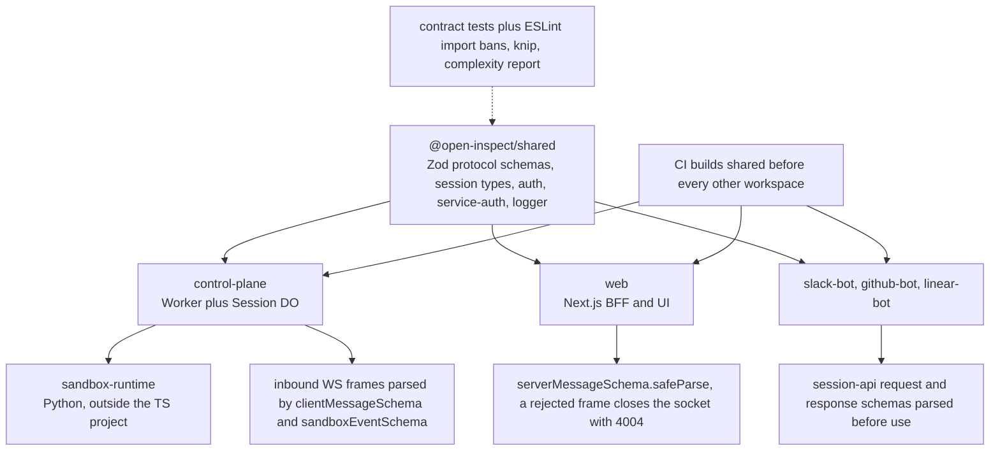

# Shared Contracts and Module Boundaries

`@open-inspect/shared` is the only package that owns protocol shape. Everything else —
`control-plane`, `web`, and the three bots — is a *consumer* that imports shared declarations and
validates live data against the shared Zod schemas at its own edge. Four mechanisms keep that
relationship honest rather than aspirational: ADR 0002 as the written rule, a set of executable
contract tests inside `packages/shared`, `no-restricted-imports` / `no-restricted-syntax` blocks in
`eslint.config.js`, and report-only hygiene gates (`knip`, `scripts/lint-complexity.mjs`).

*Caption: shared feeds every TypeScript consumer; protocol drift surfaces where each consumer parses live data with shared's own schemas, and the contract tests and lint gates run before merge.*

## ADR 0002 — what it decides

`docs/adr/0002-shared-session-contracts-and-correlation-boundary.md` was written after websocket and
sandbox-event contracts were duplicated across `shared`, `control-plane`, and `web`, producing drift
in discriminated unions, message variants, and status fields, and after correlation names drifted
between `traceId`/`requestId` and `trace_id`/`request_id`. Its four decisions:

1. **`@open-inspect/shared` is the protocol source of truth.** `ClientMessage`, `ServerMessage`,
   `SandboxEvent`, and `SessionState` are defined there. In current code consumers import those
   declarations from the per-submodule paths (for example
   `@open-inspect/shared/types/server-messages`) rather than through a control-plane re-export layer.
2. **Boundary normalization is explicit.** `web` may keep UI-local types, but must normalize shared
   protocol payloads at the websocket boundary before they enter UI state, preferring adapter helpers
   over inline casts. `packages/web/src/types/session.ts` aliases `SandboxEvent` straight to the
   shared type, and `lib/session-socket/event-log.ts` supplies the normalization helpers
   (`toUiSandboxEvent`, `collapseReplayTokenEvents`) the reducer consumes.
3. **Correlation naming is canonical at transport boundaries** (see below).
4. **Provider/client layering.** Provider implementations delegate outbound HTTP and auth mechanics
   to the transport client (`ModalClient`), keeping lifecycle semantics and error classification for
   themselves — `sandbox/providers/modal-provider.ts` wraps `ModalClient` and never does its own
   fetch or token signing.

Follow-up rules: new websocket or sandbox-event variants are added in `packages/shared` **first**;
parallel protocol definitions in feature packages are not reintroduced; correlation keys stay
canonical at every external boundary. The consequence the ADR accepts is that a shared protocol
change can require coordinated consumer updates — which is exactly what the contract tests are for.

## Canonical correlation contract

The canonical wire/log keys are `trace_id`, `request_id`, `session_id`, `sandbox_id`, and the
canonical headers are `x-trace-id`, `x-request-id`, `x-session-id`, `x-sandbox-id`. camelCase forms
exist only *inside* a transport's request/response body (`traceId` in web's
`RequestCorrelation`), and the last step before anything crosses a boundary converts back to
snake_case.

| Boundary | Behavior |
| --- | --- |
| web edge | `middleware.ts` (matcher `/api/:path*`) resolves `x-trace-id` (validated against a pattern, else a fresh UUID), mints a per-hop `request_id`, and writes both onto the forwarded request and the response, plus `x-open-inspect-request-id` for internal propagation. |
| web → control plane | `request-correlation.ts` `applyCorrelationHeaders` sets `x-trace-id`/`x-request-id`; `getCorrelationLogFields` emits the snake_case pair for log lines. |
| control plane router | `trace_id` is taken from the inbound `x-trace-id` header or generated; `request_id` is always a fresh 8-char UUID slice; both are echoed on every response in `withCorsAndTraceHeaders`. |
| control plane → DO / sandbox runtime | `session/runtime-client.ts` and `session/initialize.ts` set `x-trace-id` from `ctx.trace_id`; the DO's `http/dispatcher.ts` rebuilds a child logger from the inbound `x-trace-id`/`x-request-id`. |
| control plane → providers | `sandbox/client.ts` and `sandbox/providers/vercel/client.ts` map `CorrelationContext` onto all four canonical headers. |
| service-to-service | `shared/service-auth.ts` `buildServiceAuthHeaders` adds `x-trace-id` alongside the `sig1` headers, so the trace survives bot → control-plane calls for free. |

`CorrelationContext` (`control-plane/src/logger.ts`) is the typed carrier: required `trace_id` and
`request_id`, optional `session_id` and `sandbox_id`. Because it is snake_case, the same object can be
spread into a log line — shared's `completion/extractor.ts` builds `base = { trace_id, session_id,
message_id }` once and reuses it for every `control_plane.*` log field.

## Shared's export surface

`packages/shared/src/index.ts` is a pure re-export barrel over `types`, `git`, `regex`, `auth`,
`service-auth`, `http-body`, `models`, `cron`, `triggers`, `completion/extractor`, `logger`,
`cache-store`, `app-name`, `user-id`, `browser-auth-routes`, `sign-in-provider`, `slack`, and
`pull-request-tool`. The package's `exports` map then publishes each module as its own subpath —
`./auth`, `./service-auth`, `./models`, `./cron`, `./triggers`, `./completion/extractor`, `./logger`,
`./cache-store`, `./git`, `./sign-in-provider`, `./slack`, `./pull-request-tool`, plus
`./classification`, `./http-body`, `./regex`, `./user-id`, `./app-name`, `./browser-auth-routes`,
`./session-list-query`, and one subpath per `./types/<file>`. There is deliberately **no** `./types`
subpath: the types barrel is internal to the package and only reachable through the root.

Two ownership rules follow from that layout:

- **auth and service-auth names must not come from the root specifier.** `eslint.config.js` configures
  `@typescript-eslint/no-restricted-imports` to reject `TOKEN_VALIDITY_MS`, `timingSafeEqual`,
  `bytesToHex`, `computeHmacHex`, `generateInternalToken`, `verifyCallbackSignature`, and
  `verifyCallbackFromControlPlane` when imported from `@open-inspect/shared`, and separately rejects
  the whole service-auth set (`SERVICE_HEADER`, `SERVICE_NAMES`, `ControlPlaneFetcher`,
  `buildServiceAuthHeaders`, `signedControlPlaneFetch`, `verifyServiceSignature`, …) from the root.
  The message tells you the required path: `@open-inspect/shared/auth` and
  `@open-inspect/shared/service-auth`. The same names stay re-exported from the root for
  back-compatibility, so this is a *path* rule, not a surface rule.
- **Consumers reach `types/*` per file.** `web` and `control-plane` import
  `@open-inspect/shared/types/server-messages`, `.../sandbox-events`, `.../session-api`, etc. Only a
  handful of root-barrel imports remain (GitHub Autofix envelopes, automation list responses,
  environment schemas).

Shared is a compiled workspace: consumers depend on it as `file:../shared` and resolve
`dist/*.js` + `*.d.ts`, so **`npm run build -w @open-inspect/shared` must run before anything that
type-checks or tests against it**. CI builds shared as an explicit first step in the typecheck,
build-web, control-plane unit, control-plane integration, web, and bots jobs (the lint job does not
need it, since ESLint lints sources), and the root `build` and `typecheck` scripts prefix the same
shared build themselves.

## Executable enforcement

| Test | What it forbids or guarantees |
| --- | --- |
| `packages/shared/src/module-boundaries.test.ts` | Parses every non-test `.ts` in `src/` with the TypeScript compiler API and asserts three invariants: implementation modules never import the package-root or types barrel (nor `@open-inspect/shared` / `@open-inspect/shared/*` self-specifiers); no runtime dependency cycles; no compile-time cycles (including `import("./x").T` type references, tracked as non-runtime edges). |
| `packages/shared/src/public-api.test.ts` | Runtime assertions on the root barrel: repository schema aliases stay identical objects (`automationRepositoryInputSchema === repositoryInputSchema`, `MAX_SESSION_REPOSITORIES === MAX_TARGET_REPOSITORIES`), `RepositoryPairValidationError` is the public constructor, and provider-account / GitHub Autofix contracts are reachable from the root. |
| `packages/shared/src/types/type-contracts.test.ts` | `expectTypeOf` assertions that each exported public type still equals `z.input`/`z.output` of its paired schema, that the repository transform boundary keeps normalized `baseBranch` non-null in output, and that trigger types match their schemas. These are compile-time checks: `vitest.config.ts` runs `src/**/*.test.ts` with no typecheck mode, and `tsconfig.test.json` includes exactly `module-boundaries.test.ts`, `public-api.test.ts`, and `type-contracts.test.ts` under `npm run typecheck` (`tsc --noEmit -p tsconfig.test.json`). |
| `packages/shared/src/types/boundary-schemas.test.ts` | ~40k of parse-level acceptance/rejection cases for the schemas other packages validate with: `createSessionRequestSchema`, `sandboxEventSchema` required envelope fields, `clientMessageSchema` correlation requirements (`clientRequestId` mandatory on `prompt`, capped length), attachment limits. `server-messages.test.ts` adds snapshot-shape cases, including that `sessionSnapshotSchema` **strips** `codeServerPassword`/`vncPassword`/`ttydToken` and that a legacy `vnc_info` message is rejected. |
| `packages/web/src/lib/{client,server}-auth-boundary-eslint.test.ts` | Load the real repo ESLint config and assert the boundary rules fire: `next-auth/react` and `next-auth` rejected from components and from the auth seam itself; raw `fetch` rejected from hooks and ordinary libs but allowed in `browser-api-fetch.ts` and `control-plane-transport.ts`; `@/lib/auth` rejected in favor of `@/lib/server-auth-session`. |

Together these turn "add it in shared first" from convention into something a PR either passes or
fails: a new shared union member that no consumer handles is caught by the `data satisfies never`
exhaustiveness guard in `control-plane/src/session/message-router.ts`, and a message that arrives
with a shape shared does not describe is rejected by `clientMessageSchema`/`sandboxEventSchema`
before it can reach state: an invalid client frame answers with an `error` server message carrying
`INVALID_PROMPT` or `INVALID_MESSAGE` (echoing `clientRequestId` when one was parseable), and an
invalid sandbox POST answers `400 "Invalid sandbox event"` in
`session/http/handlers/sandbox.handler.ts`. On the web side an unparseable server frame closes the socket with code `4004`, which
the transport treats as unclean and reconnects through — forcing convergence on the authoritative
`subscribed` snapshot rather than partial application of an unknown variant.

## Composition and import bans in `eslint.config.js`

- **`env.DB` only at composition roots.** For `packages/control-plane/src/**/*.ts` (tests exempt),
  `no-restricted-syntax` forbids any `MemberExpression` whose property is `DB`, with the message to
  use the injected `SqlDatabase` (`ctx.db` / `this.db` / a `db` param). The legitimate reads are
  exactly the composition roots — `router.ts` (which rejects the whole request with 503 if the
  binding is absent), the worker entrypoint `index.ts` (fetch, scheduled, queue), the image-build
  finalization queue consumer, and the `SessionDO` constructor — each carrying a documented
  `eslint-disable-next-line` with a justification comment. The invariant being protected is that
  request-path queries always go through the instrumented wrapper.
- **Session composition direction.** Two `no-restricted-imports` patterns: `session/components.ts`
  (the composition root) is importable only by `session/durable-object.ts`, and
  `session/durable-object.ts` (the Cloudflare adapter) is importable only by `src/index.ts`. Services
  therefore take dependencies as constructor inputs and nothing the factory builds can hold a
  reference back to the DO. The config comments record a flat-config trap: a later block matching the
  same files *replaces* the earlier block's config for that rule, so the general block declares both
  bans and `src/index.ts` re-declares the `components.ts` ban it must keep while being exempt from
  the `durable-object.ts` ban.
- **Web owns its auth and transport seams.** `next-auth` and `next-auth/*` are banned in favor of
  app-owned browser authentication seams; `lib/auth` is banned in favor of `getServerAuthSession`
  from `@/lib/server-auth-session`; and global `fetch` is banned in `packages/web/src` except for
  `lib/browser-api-fetch.ts` and `lib/control-plane-transport.ts` (plus tests). OAuth and session
  protocol code belongs to the control plane.
- **Scope notes.** `packages/sandbox-runtime/**` and `*.d.ts` are ignored globally — the in-sandbox
  runtime is Python under Node and not part of the TS project, so its contract with the control plane
  is enforced by shared's schemas on the receiving side, not by shared imports. `no-explicit-any` is
  a warning, `consistent-type-imports` is an error with separate-type-imports style, and unused vars
  prefixed `_` are allowed.

## Hygiene gates

`knip.json` declares a workspace entry for the root scripts plus each TypeScript package with
explicit `entry` and `project` globs, so test files, worker entrypoints, Next.js config, and the
sandbox-runtime JS tools count as roots rather than orphans; `packages/shared` is scoped to
`src/**/*.ts` with a single narrow `ignoreIssues` exception for duplicate exports in
`src/types/repositories.ts` (the deliberate `MAX_SESSION_REPOSITORIES` alias of
`MAX_TARGET_REPOSITORIES`). CI runs `npm run knip -- --no-exit-code`, so unused-export
findings are reported but never break a build.

`npm run lint:complexity` (`scripts/lint-complexity.mjs`) runs ESLint with only the classic
`complexity` rule at `max: 0` over `packages/**/*.{ts,tsx}`, then reports the total function count, a
distribution over 10/15/20/30/50, and the top production hotspots above the threshold of 20. Test
files are tallied separately and excluded from the production hotspot table, and the script's
documented contract is that **findings are report-only and do not affect the exit code**. CI does not
invoke the analyzer itself; it runs `npm run test:lint-complexity`, which unit-tests
`parseComplexityMessage` against a real ESLint diagnostic and pins the failure mode of an
unrecognized message shape — so the reporter cannot silently stop counting.

The practical consequence: ESLint import bans and the shared contract tests are hard gates, while
knip and complexity are trend instruments. Dead code and hot functions are visible in CI output;
protocol drift is not allowed through.
